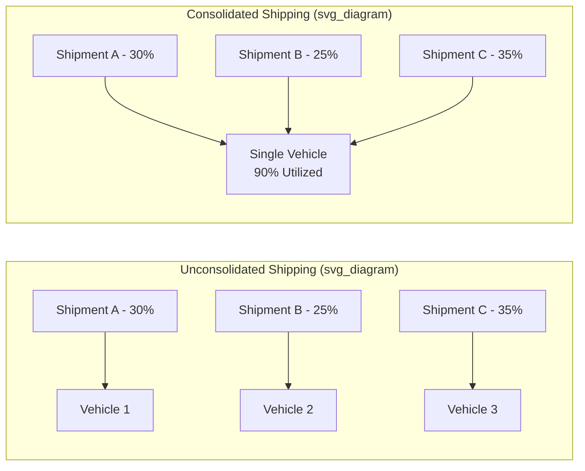
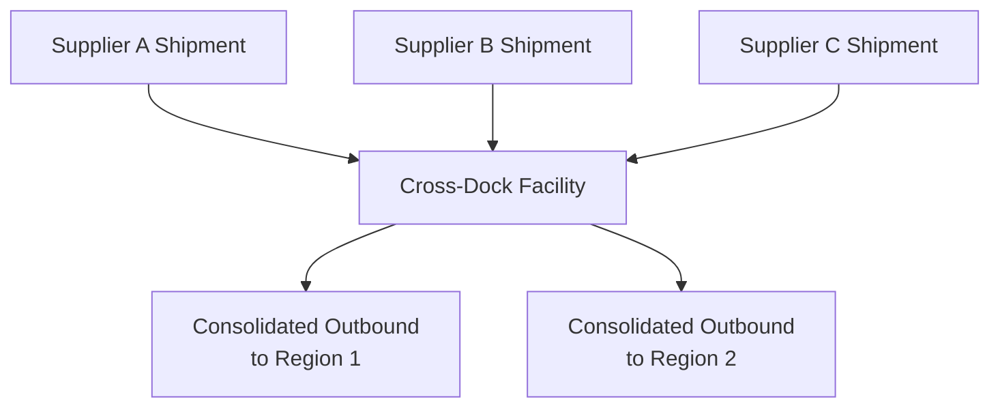
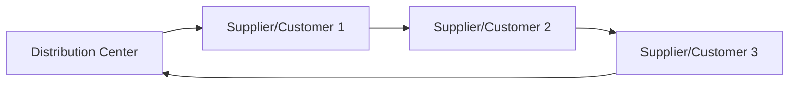
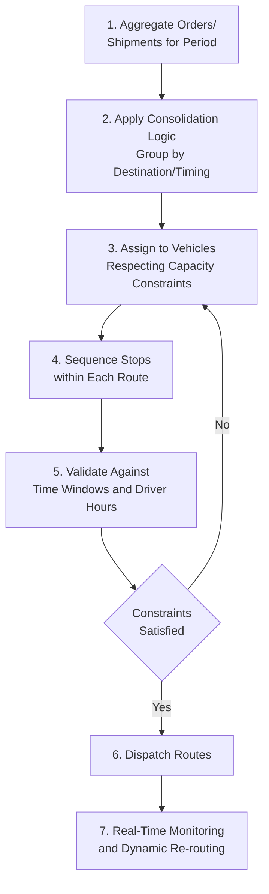
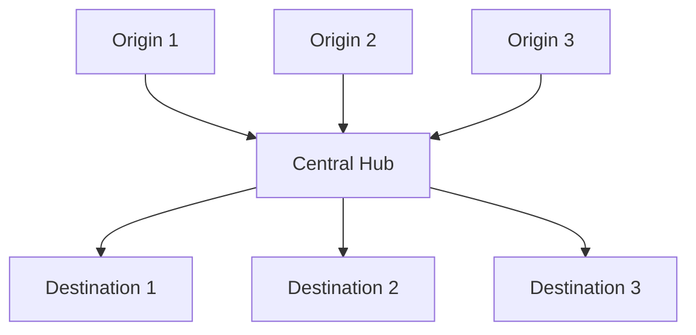

## Freight Consolidation and Routing

### Definition and Scope

Freight consolidation is the practice of combining multiple smaller shipments into a single, larger load to improve transportation efficiency and reduce per-unit shipping cost. Routing is the complementary discipline of determining the optimal sequence and path for vehicles to travel between origins and destinations, minimizing distance, time, or cost subject to operational constraints. Together, they represent core levers for reducing total transportation cost while managing service commitments.

**Key Points**

- Consolidation exploits transportation economies of scale — cost per unit shipped generally decreases as shipment size approaches full vehicle/container capacity
- Consolidation and routing decisions are interdependent — how shipments are grouped directly affects what routing options and efficiencies are achievable
- Both disciplines involve an inherent trade-off between cost efficiency (larger, less frequent, more consolidated moves) and service speed (smaller, more frequent, less consolidated moves)

---

### The Economics of Consolidation

$$\text{Cost per Unit} = \frac{C_{fixed} + C_{variable} \cdot Q}{Q}$$

As shipment quantity $Q$ approaches full vehicle capacity, the fixed cost component (driver time, fuel baseline, terminal handling) is spread across more units, driving down average cost per unit shipped. This creates strong economic incentive to consolidate multiple less-than-truckload (LTL) shipments into full truckload (FTL) equivalents wherever feasible.

---

### Consolidation Strategies

#### 1. Freight/LTL Consolidation

Combining multiple smaller Less-Than-Truckload (LTL) shipments from different shippers or orders into a single, larger load, often managed by a freight consolidator or 3PL.

- **Pool distribution** — freight from multiple origins is consolidated at a break-bulk point, then redistributed via more efficient linehaul transport to a destination region before final local delivery
- **Multi-stop truckload** — a single truck makes multiple pickup or delivery stops rather than dedicating a full vehicle to a single origin-destination pair

#### 2. Time-Based Consolidation (Batching)

Delaying shipment dispatch to accumulate sufficient order volume for a more efficient load, trading some delivery speed for cost efficiency.

$$\text{Optimal Batch Window} = f(\text{holding cost of delay}, \text{consolidation savings})$$

The optimal delay window balances the cost of holding orders (delayed customer service, potential inventory carrying cost) against the transportation savings achieved through better load consolidation — a direct parallel to the classic Economic Order Quantity trade-off applied to shipment timing rather than order quantity.

#### 3. Geographic/Zone Consolidation

Grouping shipments destined for the same geographic region or delivery zone into shared transportation, regardless of originating order timing, to improve route density.

#### 4. Cross-Docking

Consolidating inbound shipments from multiple suppliers directly onto outbound vehicles at a transfer facility, with minimal or no intermediate storage — capturing consolidation benefits while minimizing inventory holding, as introduced in distribution network design.

#### 5. Milk-Run Consolidation

A single vehicle follows a fixed route collecting small quantities from multiple suppliers (inbound) or delivering to multiple customers (outbound) on a scheduled, recurring basis, replacing multiple separate point-to-point trips with one consolidated circuit.

---

### The Vehicle Routing Problem (VRP)

Routing optimization is formally modeled as the **Vehicle Routing Problem**, a generalization of the classic Traveling Salesman Problem that determines optimal routes for a fleet of vehicles serving a set of customers from one or more depots, subject to constraints.

$$\min \sum_{routes} \text{Total Distance/Time/Cost}$$

subject to:

- Vehicle capacity constraints (weight, volume)
- Customer time-window constraints
- Maximum route duration/driver hours-of-service regulations
- Single-visit constraints (each customer served exactly once, unless split deliveries are permitted)

#### VRP Variants

| Variant | Additional Constraint/Feature |
| --- | --- |
| **CVRP** (Capacitated VRP) | Vehicle capacity limits |
| **VRPTW** (VRP with Time Windows) | Customer-specific delivery time windows |
| **MDVRP** (Multi-Depot VRP) | Multiple originating depots rather than a single source |
| **PDVRP** (Pickup and Delivery VRP) | Combined pickup and delivery requirements within routes |
| **Dynamic VRP** | Real-time order arrivals requiring route re-optimization during execution |

Because VRP is **NP-hard** (computationally intractable to solve exactly at realistic scale), practical solutions rely on heuristic and metaheuristic algorithms:

- **Nearest-neighbor heuristic** — sequentially selecting the closest unvisited stop; simple but often suboptimal
- **Savings algorithm (Clarke-Wright)** — iteratively merges routes that yield the greatest combined distance savings versus serving stops independently
- **Genetic algorithms and simulated annealing** — metaheuristic search techniques exploring the solution space more thoroughly than simple greedy heuristics, typically used in commercial routing software for complex, large-scale problems
- **Machine learning-augmented routing** — increasingly used to incorporate historical traffic patterns, delivery success probability, and dynamic conditions into route generation

---

### Routing Optimization Workflow

---

### Freight Mode and Consolidation Interaction

Consolidation strategy interacts directly with transportation mode selection decisions:

- **LTL to FTL conversion** — consolidating enough LTL freight to justify full truckload shipment, capturing lower per-unit rates and reduced handling/transfer risk
- **Intermodal consolidation** — combining truck drayage with rail or ocean linehaul for long-distance moves, consolidating freight at rail/port terminals to fill high-capacity long-haul equipment
- **Hub-and-spoke networks** — consolidating freight at central hub facilities before redistributing to final destinations, common in parcel carrier and airline freight network design

---

### Key Performance Metrics

| Metric | Purpose |
| --- | --- |
| Vehicle/load utilization rate | % of vehicle capacity (weight or volume) effectively used per trip |
| Cost per unit shipped/ton-mile | Core efficiency benchmark reflecting consolidation effectiveness |
| Empty miles/deadhead percentage | Miles driven without revenue-generating freight, a direct inefficiency indicator |
| On-time delivery rate | Service reliability maintained despite consolidation/routing decisions |
| Stops per route | Route density, directly affecting per-stop cost efficiency |
| Route planning cycle time | Speed of generating optimized routes, particularly relevant for dynamic/same-day scenarios |

---

### Trade-offs and Constraints

**Common Pitfall**: Pursuing maximum consolidation without regard to resulting delivery time impact can violate customer service commitments — the batching/consolidation window must be bounded by acceptable delivery time promises, not optimized purely for transportation cost minimization.

**Example**

A regional distributor consolidates outbound shipments into twice-weekly full-truckload routes per customer region rather than shipping as individual orders arrive, achieving meaningfully lower per-unit freight cost. However, for a subset of high-priority customers requiring next-day fulfillment commitments, the distributor maintains a separate, less-consolidated expedited routing lane at higher per-unit cost — illustrating a **segmented consolidation strategy** that applies aggressive consolidation where service tolerance allows, while preserving speed where contractually or competitively required.

---

### Common Pitfalls

- Treating consolidation purely as a transportation cost optimization without accounting for the resulting delay's impact on customer service levels and downstream inventory requirements
- Applying uniform routing/consolidation policy across all customer segments rather than differentiating by service commitment and value (segmented consolidation)
- Underinvesting in routing optimization technology, leaving manually-planned or simplistically-sequenced routes with substantial unrealized efficiency
- Ignoring real-world routing constraints (driver hours-of-service regulations, vehicle-specific restrictions, delivery time windows) in optimization models, producing theoretically optimal but operationally infeasible routes
- Failing to account for dynamic conditions (traffic, order cancellations, new order arrivals) through static, non-adaptive routing rather than dynamic re-optimization capability
- Overlooking empty-mile/deadhead reduction opportunities (e.g., backhaul matching) that could further improve overall network transportation efficiency

[Inference — the specific efficiency gains achievable through consolidation and routing optimization are well-documented directionally in transportation and operations research literature, but exact magnitude depends heavily on baseline practice maturity, geographic density, and network structure; treat any specific improvement percentage as illustrative rather than a guaranteed, universally applicable outcome]

---

**Related Topics**

- Transportation mode selection and management
- Distribution network design and cross-docking
- Last-mile delivery strategies
- Vehicle Routing Problem (VRP) algorithms and heuristics
- Economic Order Quantity (EOQ) and the batching trade-off parallel
- Transportation Management Systems (TMS) architecture
- Third-party and fourth-party logistics
- Hub-and-spoke network design