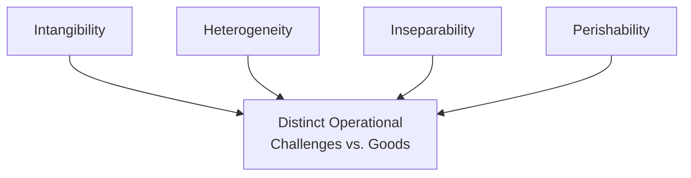
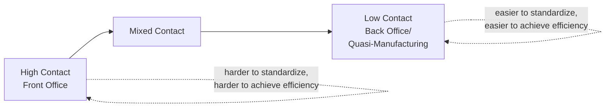
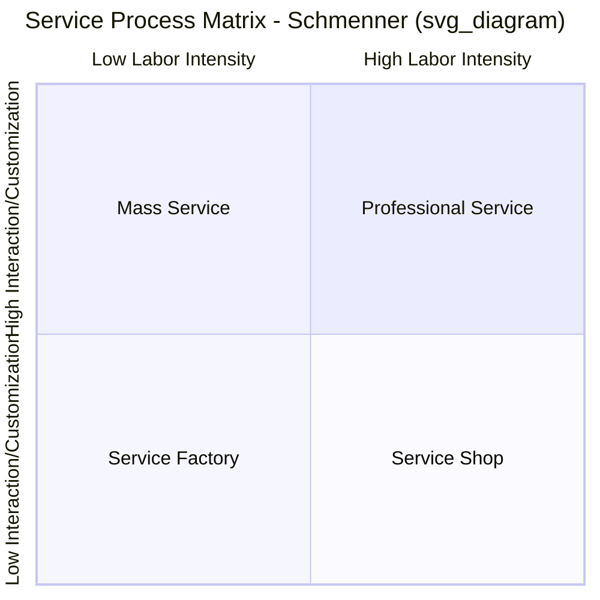
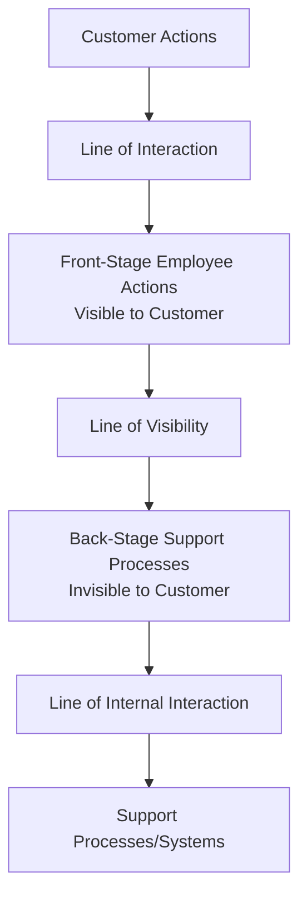

## Service Classification and Characteristics

### Definition and Scope

Service operations management studies the design, delivery, and control of intangible offerings, distinguishing them structurally from physical goods production. Service classification frameworks organize the vast diversity of service businesses (healthcare, retail banking, consulting, hospitality, telecommunications) into meaningful categories based on shared operational characteristics, enabling operations managers to apply appropriate design and management principles rather than treating "services" as an undifferentiated category.

**Key Points**

- Services differ fundamentally from goods along several dimensions that directly shape how operations must be designed and managed
- Classification frameworks help identify which operational challenges (capacity management, quality control, customer contact) are most acute for a given service type
- Most real offerings combine goods and service elements in varying proportions — pure goods and pure services are conceptual endpoints on a continuum rather than common real-world cases

---

### The Four Fundamental Service Characteristics (IHIP)

Services are traditionally distinguished from goods by four characteristics, often summarized by the acronym **IHIP**:

#### 1. Intangibility

Services cannot be seen, touched, or physically possessed before purchase — a customer buys an experience or outcome rather than a physical object.

**Operational Implications**

- Quality is harder to evaluate before consumption, increasing customer perceived risk at the point of purchase
- Marketing and communication must convey value through indirect cues (physical evidence, staff professionalism, facility design) rather than direct product demonstration
- Intangible outputs are difficult to inventory, patent, or display, complicating both operations and competitive differentiation

#### 2. Heterogeneity (Variability)

Service quality and delivery can vary from one instance to the next, even for the same service type from the same provider, due to the human element in delivery and the unique nature of each customer interaction.

**Operational Implications**

- Standardization efforts (scripts, protocols, training programs) aim to reduce variability but can never eliminate it entirely given the human-to-human nature of most service encounters
- Quality control is fundamentally harder than in manufacturing, where statistical process control can inspect physical output against fixed specifications
- Employee training, empowerment, and culture become primary quality-management levers rather than post-production inspection

#### 3. Inseparability (Simultaneity)

Services are typically produced and consumed simultaneously — unlike goods, which can be manufactured, inventoried, and later consumed at a different time and place.

**Operational Implications**

- The customer is often physically present during service production, meaning operational failures are visible and experienced in real time rather than caught and corrected before reaching the customer
- The service provider (often front-line staff) directly represents the "product" — service quality is inseparable from employee performance
- Quality control must occur *during* delivery rather than through post-production inspection, since there is no finished-goods buffer to catch defects before customer exposure

#### 4. Perishability

Service capacity that goes unused cannot be stored or inventoried for later use — an empty hotel room tonight, an unfilled airline seat, or an idle consultant's hour represents permanently lost capacity/revenue potential.

**Operational Implications**

- Demand-supply mismatches cannot be buffered with inventory the way manufacturing can use finished-goods stock
- Capacity management and demand management become primary operational levers (yield/revenue management, appointment scheduling, off-peak pricing)
- Excess demand during peak periods cannot be met by drawing down stored inventory, often resulting in either customer waiting/queuing or lost sales

---

### Goods-Services Continuum

Rather than a strict binary, most offerings occupy a position along a continuum combining tangible and intangible elements:

**Example**

A restaurant meal combines tangible elements (food, physical ingredients, table setting) with intangible service elements (order-taking, food preparation timing, ambiance, server interaction) — illustrating why "restaurant operations" draws on both manufacturing-style process management (kitchen production) and service-specific management (front-of-house customer experience), rather than fitting purely into either category.

---

### Service Classification Frameworks

#### 1. Degree of Customer Contact

Classifies services by how much direct interaction occurs between the customer and the service delivery system, and correspondingly how much of the "back office" can be insulated from customer-facing variability.

| Classification | Characteristics | Examples |
| --- | --- | --- |
| **High-contact (pure service)** | Customer present throughout delivery, high customization, difficult to standardize | Healthcare consultation, legal counsel, hair salon |
| **Mixed-contact** | Some customer-facing elements, some back-office/decoupled processing | Bank branch (teller interaction + back-office check processing) |
| **Low-contact (quasi-manufacturing)** | Minimal direct customer interaction during core production; more standardizable | Mail-order fulfillment, back-office data processing, automated car wash |

#### 2. Service Process Matrix (Schmenner)

Classifies services along two dimensions: **degree of labor intensity** (capital vs. labor investment) and **degree of customization/interaction** (standardized vs. customized delivery).

| Quadrant | Characteristics | Examples |
| --- | --- | --- |
| **Service Factory** (low labor, low customization) | Capital-intensive, standardized, high volume | Airlines, hotels, trucking |
| **Service Shop** (low labor, high customization) | Capital-intensive but customized delivery | Hospitals, auto repair, other equipment-intensive customized services |
| **Mass Service** (high labor, low customization) | Labor-intensive, standardized | Retail, wholesale, schools |
| **Professional Service** (high labor, high customization) | Labor-intensive, highly customized, expert-driven | Consulting, legal services, medical specialists, architecture |

Each quadrant implies different managerial priorities: service factories emphasize capital utilization and standardized process efficiency, while professional services emphasize talent management, customization capability, and individual judgment quality.

#### 3. Classification by Recipient (Who/What Is Processed)

Services can also be classified by what is being acted upon during the service process:

| Category | What Is Processed | Examples |
| --- | --- | --- |
| **People-processing** | The customer's physical body | Healthcare, hair salons, passenger transportation |
| **Possession-processing** | The customer's physical belongings | Auto repair, dry cleaning, freight transport |
| **Mental stimulus-processing** | The customer's mind/attention | Education, entertainment, broadcasting |
| **Information-processing** | Data/information related to the customer | Banking, insurance, consulting, legal services |

---

### Service Blueprint Concept

A related tool used to visualize and analyze service delivery, distinguishing between **front-stage** activities (visible to and experienced by the customer) and **back-stage** activities (invisible support processes), separated conceptually by a "line of visibility."

This framework directly connects to service classification: high-contact services have proportionally more front-stage activity requiring careful design, while low-contact services can push more of the process behind the line of visibility, enabling manufacturing-style efficiency techniques.

---

### Strategic Implications of Classification

**Example**

A healthcare clinic recognized as a high-contact "Service Shop" (per Schmenner's matrix — capital-intensive equipment, but highly customized patient interaction) faces different operational priorities than a low-contact "Service Factory" like a standardized fast-casual restaurant chain. The clinic must prioritize clinician judgment quality, patient-specific customization, and managing the inherent unpredictability of each patient encounter, whereas the restaurant chain can pursue process standardization, capacity/demand forecasting precision, and labor efficiency metrics more characteristic of manufacturing-style operations management — despite both being classified as "services."

---

### Common Pitfalls

- Applying manufacturing-derived operational techniques (rigid standardization, pure statistical quality control) uniformly to high-contact, high-customization services where they are poorly suited
- Treating all "services" as operationally homogeneous, missing the substantial variation in appropriate management approach across the classification frameworks above
- Underestimating the perishability constraint — attempting to manage service capacity with inventory-based thinking borrowed from goods production, when demand/capacity matching tools (yield management, appointment systems) are the appropriate lever instead
- Ignoring the inseparability characteristic's implication that front-line employee performance *is* the product from the customer's perspective, underinvesting in employee training/empowerment relative to process documentation alone
- Failing to separate front-stage from back-stage processes in service design, missing opportunities to standardize/optimize back-office elements without compromising the customer-facing experience

---

**Related Topics**

- Service blueprinting and process design
- Service quality management and the SERVQUAL model
- Yield/revenue management and capacity-demand matching
- Queuing theory and waiting line management
- Service recovery and complaint handling strategies
- Front-office/back-office operational design
- Customer contact theory and service system design
- Demand management for perishable capacity