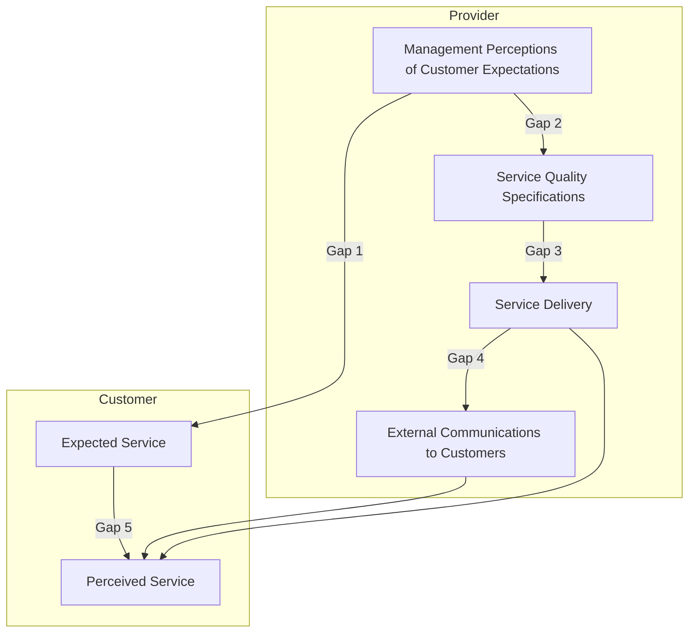

## Service Quality Measurement with SERVQUAL

### Overview

SERVQUAL is a multi-item diagnostic instrument developed by Parasuraman, Zeithaml, and Berry (1985, refined 1988) for measuring service quality as the gap between customer expectations and customer perceptions of actual service delivery. It operationalizes service quality as a multidimensional construct rather than a single score, allowing organizations to pinpoint specific areas of underperformance.

The core logic rests on the **Gap Model of Service Quality**, where SERVQUAL specifically targets Gap 5 — the discrepancy between what customers expect and what they perceive they received.

### The Gap Model Foundation

**Key Points**

- **Gap 1**: Management's perception of customer expectations vs. actual customer expectations
- **Gap 2**: Management's perception vs. service quality specifications set
- **Gap 3**: Service quality specifications vs. actual service delivery
- **Gap 4**: Actual service delivery vs. what is communicated to customers (external communications)
- **Gap 5**: Expected service vs. perceived service (the customer-facing gap SERVQUAL measures)



Gap 5 is theorized as a function of the four provider-side gaps: closing Gaps 1–4 is the operational mechanism by which Gap 5 narrows.

### The Five Dimensions (RATER)

The original 1985 instrument used ten overlapping dimensions, later condensed through factor analysis (1988) into five dimensions, commonly remembered by the acronym **RATER**:

1. **Reliability** — Ability to perform the promised service dependably and accurately (e.g., billing accuracy, keeping promises on time).
2. **Assurance** — Employees' knowledge, courtesy, and ability to inspire trust and confidence (competence, credibility, security).
3. **Tangibles** — Physical facilities, equipment, personnel appearance, and communication materials.
4. **Empathy** — Caring, individualized attention provided to customers.
5. **Responsiveness** — Willingness to help customers and provide prompt service.

**[Inference]** Reliability is consistently found to carry the highest relative importance weight across most service industry studies, though the exact ranking is industry-dependent and should be empirically re-weighted per context rather than assumed universal.

### Instrument Structure

SERVQUAL uses a **dual-scale, 22-item questionnaire** (22 items × 2 administrations):

- **Expectations section (E)**: 22 statements about what an excellent firm in this industry *should* provide.
- **Perceptions section (P)**: 22 parallel statements about the specific firm's *actual* performance.

Each item is typically rated on a 7-point Likert scale (1 = Strongly Disagree, 7 = Strongly Agree).

**Example** (Reliability dimension, paired items):

| Expectation Statement (E) | Perception Statement (P) |
| --- | --- |
| "Excellent companies will perform the service right the first time." | "XYZ Company performs the service right the first time." |
| "Excellent companies will provide their services at the time they promise to do so." | "XYZ Company provides its services at the time it promises to do so." |

### Scoring Methodology

**Gap Score Formula**

For each item $i$:

$$SQ_i = P_i - E_i$$

Where $SQ_i$ is the service quality score for item $i$, $P_i$ is the perception rating, and $E_i$ is the expectation rating.

**Dimension-Level Score**

$$SQ_{dim} = \frac{1}{n}\sum_{i=1}^{n} (P_i - E_i)$$

where $n$ is the number of items in that dimension.

**Overall (Unweighted) SERVQUAL Score**

$$SQ_{overall} = \frac{1}{5}\sum_{d=1}^{5} SQ_{dim,d}$$

**Weighted SERVQUAL Score**

Since not all dimensions matter equally to customers, a supplementary points-allocation exercise (customers distribute 100 points across the 5 dimensions by importance) produces weights $w_d$:

$$SQ_{weighted} = \sum_{d=1}^{5} w_d \cdot SQ_{dim,d}$$

**Interpretation**

- $SQ_i > 0$: Perceptions exceed expectations (quality surplus)
- $SQ_i = 0$: Perceptions meet expectations exactly
- $SQ_i < 0$: Perceptions fall short of expectations (quality deficit) — this is the typical, actionable finding in most service audits

### Worked Numerical Example

Assume a bank's Reliability dimension has 4 items, averaged across a sample of respondents:

| Item | Mean E | Mean P | Gap (P−E) |
| --- | --- | --- | --- |
| Performs service right the first time | 6.2 | 5.1 | −1.1 |
| Provides service at promised time | 6.5 | 5.8 | −0.7 |
| Maintains error-free records | 6.0 | 5.5 | −0.5 |
| Insists on error-free transactions | 6.3 | 5.0 | −1.3 |

$$SQ_{Reliability} = \frac{(-1.1) + (-0.7) + (-0.5) + (-1.3)}{4} = \frac{-3.6}{4} = -0.9$$

A −0.9 gap indicates a moderate reliability shortfall requiring process-level investigation (e.g., root-cause analysis on transaction error rates, staff training review).

### Administration Formats

**Key Points**

- **Two-column format**: Respondents complete E and P sections separately, usually E first (before service encounter or as a general industry belief) and P after experiencing the specific service.
- **Single-column "perceived-only" variant (SERVPERF)**: Cronin and Taylor (1992) proposed measuring only perceptions, arguing expectations add measurement noise and respondent fatigue without proportional explanatory gain. SERVPERF often shows higher explained variance in regression against overall satisfaction, but sacrifices the diagnostic "gap" framing that operations managers use for improvement targeting.
- **Difference-score critique**: Difference scores (P−E) can suffer from reliability and variance problems compared to direct perception measures — a well-documented psychometric critique **[Unverified as universally applicable]**; the severity depends on sample and context.

### Comparison: SERVQUAL vs. SERVPERF vs. Other Instruments

| Instrument | Basis | Items | Strength | Weakness |
| --- | --- | --- | --- | --- |
| SERVQUAL | P − E gap | 44 (22×2) | Diagnostic; identifies specific expectation-perception gaps | Longer survey; respondent fatigue; expectation measurement ambiguity |
| SERVPERF | P only | 22 | Shorter; often better statistical fit to satisfaction/loyalty outcomes | Loses gap diagnostic value |
| Normed Quality (NQ) | (P−E) weighted by importance | 44 + weights | Incorporates customer priority | Added complexity in weight elicitation |
| Kano Model | Feature-satisfaction nonlinearity | Varies | Captures delighters vs. must-haves | Not a continuous quality score; different use case |

### Application to Operations Management

**Key Points**

- **Process diagnostics**: Negative gaps on Reliability or Responsiveness point directly to process capacity, scheduling, or workforce management issues rather than mere "attitude" problems — actionable for operations managers via capacity planning, queuing analysis, and standard operating procedure (SOP) redesign.
- **Blueprint linkage**: SERVQUAL results are commonly overlaid on a **service blueprint** to localize failure points along the customer journey (line of interaction, line of visibility, line of internal interaction).
- **Benchmarking and tracking**: Because it is standardized, SERVQUAL enables longitudinal tracking (same instrument, repeated waves) and cross-branch/cross-location benchmarking within a multi-site service operation.
- **Resource allocation**: Weighted scores support prioritization — dimensions with the largest negative gap *and* highest customer-assigned importance weight should receive first-priority operational investment (a gap-importance matrix, analogous to an Importance-Performance Analysis (IPA) grid).

### Importance-Performance Analysis (IPA) Grid

```mermaid
quadrantChart
    title Importance-Performance Analysis (svg_diagram)
    x-axis Low Performance --> High Performance
    y-axis Low Importance --> High Importance
    quadrant-1 Maintain/Leverage
    quadrant-2 Concentrate Here (Priority)
    quadrant-3 Low Priority
    quadrant-4 Possible Overkill
    Reliability: [0.3, 0.9]
    Responsiveness: [0.4, 0.8]
    Assurance: [0.7, 0.6]
    Empathy: [0.6, 0.4]
    Tangibles: [0.75, 0.3]
```

Dimensions falling in "Concentrate Here" (low performance, high importance) — often Reliability and Responsiveness in empirical studies — represent the highest-leverage operations improvement targets.

### Statistical Validation Requirements

For rigorous deployment, practitioners should verify:

- **Reliability**: Cronbach's alpha ($\alpha \geq 0.70$ conventionally acceptable) per dimension to confirm internal consistency of items.
- **Validity**: Confirmatory factor analysis (CFA) to test whether the 5-factor RATER structure holds in the specific industry context — **[Unverified as universally applicable]**, since numerous replications across banking, healthcare, hospitality, and retail have found the five-factor structure does not always replicate cleanly, sometimes collapsing to 3–4 factors or requiring industry-specific item modification.
- **Sample size**: Sufficient per-segment sample size (commonly $n \geq 30$–50 per branch/unit minimum for stable dimension means; larger for CFA, often $n \geq 200$ recommended for stable factor structure estimation).

### Adaptations by Industry

**Key Points**

- **SERVQUAL for healthcare**: Modified items addressing clinical competence, wait-time perception, and privacy.
- **E-S-QUAL**: Adaptation for e-commerce/online service quality (efficiency, fulfillment, system availability, privacy).
- **LibQUAL+**: Adaptation for library and academic service settings.
- **HEdPERF**: Adaptation for higher-education service quality.

**[Inference]** Industry-specific adaptations generally retain the gap-score logic and Likert-scale structure of the original instrument while substituting or adding items relevant to that service context; this is a design pattern rather than a universally documented standard.

### Limitations and Critiques

**Key Points**

- Expectation measurement is ambiguous: "should" expectations (ideal/normative) vs. "will" expectations (predictive) yield different results depending on question wording.
- Cross-cultural applicability of the five-dimension structure is debated; dimension weighting and even factor structure can vary by cultural context.
- Static snapshot: standard administration does not capture within-encounter variability (a single bad interaction vs. a systemic problem).
- Respondent fatigue from the 44-item dual format can reduce data quality, motivating single-administration alternatives (SERVPERF).
- Behavior of the instrument in longitudinal or high-frequency tracking programs may vary depending on survey fatigue effects and sample composition drift over time.

### Implementation Workflow

```mermaid
flowchart LR
    A[Define Service Encounter Scope] --> B[Adapt 22 Items to Industry Context]
    B --> C[Pilot Test for Face Validity]
    C --> D[Administer E and P Surveys]
    D --> E[Compute Gap Scores per Item and Dimension]
    E --> F[Run Importance Weighting Exercise]
    F --> G[Build IPA Grid / Priority Matrix]
    G --> H[Link Gaps to Service Blueprint Failure Points]
    H --> I[Design Process Interventions]
    I --> J[Re-Measure for Longitudinal Tracking]
```



### Related Topics

- Gap Model of Service Quality (Gaps 1–4, provider-side)
- Service Blueprinting and failure-point analysis
- SERVPERF and the expectations-disconfirmation debate
- Kano Model of customer satisfaction
- Importance-Performance Analysis (IPA)
- Net Promoter Score (NPS) as a complementary loyalty metric
- Six Sigma DMAIC applied to service process gap closure
- Total Quality Management (TQM) in service contexts
- Customer Satisfaction Index (CSI) construction