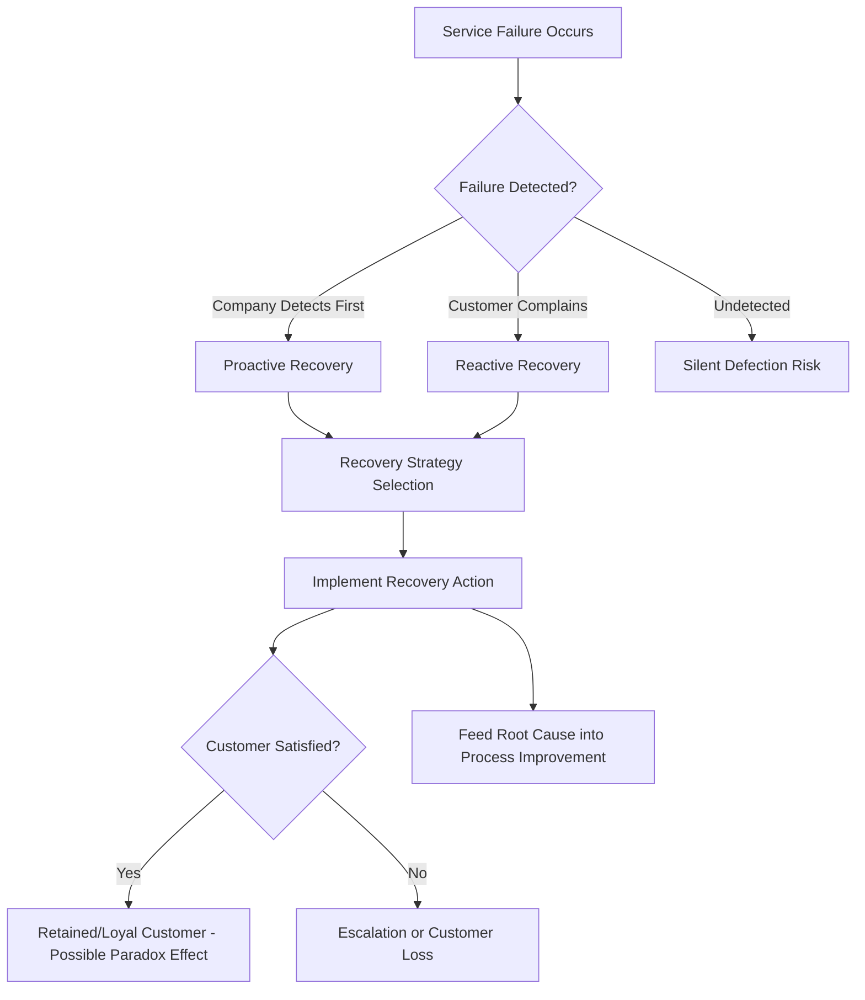
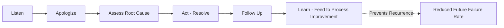
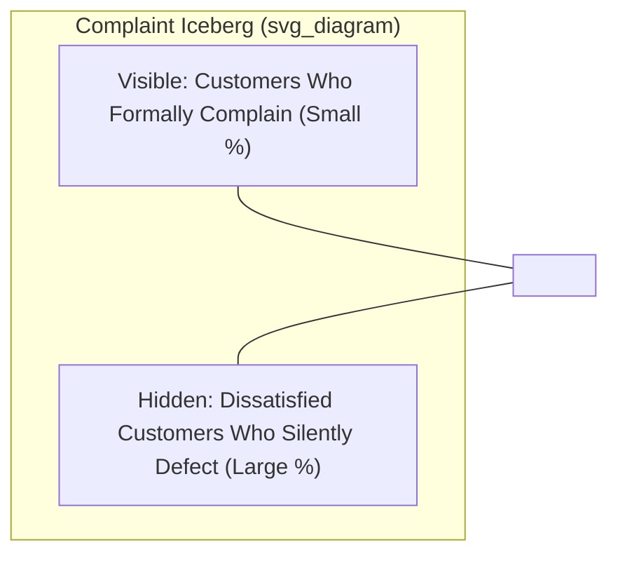
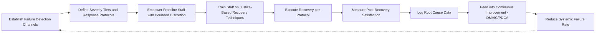

## Service Recovery Strategies

### Overview

Service recovery refers to the deliberate actions an organization takes to resolve a service failure and restore customer satisfaction after a problem occurs during service delivery. Since services are produced and consumed simultaneously (inseparability) and involve human variability (heterogeneity), zero-defect service delivery is not achievable; recovery capability is therefore treated as a core operational competency rather than an exception-handling afterthought.

### The Service Recovery Paradox

**Key Points**

- The **service recovery paradox** describes a documented phenomenon where a customer who experiences a failure that is then resolved exceptionally well can report *higher* satisfaction than a customer who experienced no failure at all.
- **[Unverified as universally applicable]** — this paradox does not replicate consistently across all studies; effect size depends on failure severity, recovery speed, and prior relationship history. Severe failures or repeated failures typically do not produce a paradox effect regardless of recovery quality.
- Operationally, this means recovery should be viewed as an opportunity for differentiation, not merely damage control — but should never be treated as a justification for tolerating avoidable failures.

### Classification of Service Failures

**Key Points**

1. **Outcome failures** — the core service itself was not delivered (e.g., flight cancelled, meal never arrives, product delivered damaged).
2. **Process failures** — the service was delivered but the manner of delivery was deficient (e.g., rude staff, long wait, unclear communication).
3. **System failures** — breakdowns in supporting infrastructure (e.g., booking system down, payment processing error).

Failures can also be categorized by **locus of causality**:

- Company-caused (controllable)
- Customer-caused (e.g., customer error)
- Third-party-caused (e.g., supplier, weather)

Recovery strategy should be tailored to failure type and causality, since customer attribution of blame strongly affects the recovery response required.

### Gap Model Linkage

Service recovery operationally addresses **Gap 3** (delivery gap) and **Gap 5** (perceived vs. expected service) from the Gap Model, functioning as a real-time compensating mechanism when upstream gaps have already produced a failure.

### The Service Recovery Paradox Threshold

$$SR_{effect} = f(\text{severity}, \text{speed}, \text{fairness}, \text{prior relationship})$$

**[Inference]** This is a conceptual, not a formally standardized, equation — it summarizes the qualitative finding across recovery literature that the net satisfaction effect of a recovery is a function of these interacting factors rather than any single one; there is no universally agreed numerical model.

### Justice Theory Framework

Recovery satisfaction is most commonly explained via **three dimensions of perceived justice**, adapted from organizational justice theory:

1. **Distributive Justice** — perceived fairness of the tangible outcome (refund, replacement, discount, compensation) relative to the loss incurred.
2. **Procedural Justice** — perceived fairness of the process used to resolve the complaint (speed, accessibility of complaint channels, flexibility of policies).
3. **Interactional Justice** — perceived fairness of interpersonal treatment during the recovery encounter (courtesy, empathy, honesty, effort shown by staff).

**Example**

| Justice Dimension | Poor Recovery | Strong Recovery |
| --- | --- | --- |
| Distributive | No compensation offered for a ruined meal | Meal comped plus discount on next visit |
| Procedural | Customer must call 3 times and wait 20 minutes each time | Single-contact resolution within minutes |
| Interactional | Staff blames customer or shows annoyance | Staff apologizes sincerely, acknowledges the inconvenience |

**[Inference]** Interactional justice frequently emerges as the strongest predictor of post-recovery satisfaction in empirical studies, suggesting that *how* an apology and resolution are delivered often matters as much as *what* is given — though relative weighting varies by industry and failure severity.

### Core Recovery Strategy Framework: LEARN / HEARD Models

A widely used practitioner framework (various acronym variants exist across organizations) follows this general structure:

1. **Acknowledge/Listen** — Let the customer fully explain the problem without interruption.
2. **Apologize** — Sincere, specific acknowledgment of the failure (not generic or defensive).
3. **Assess/Diagnose** — Determine root cause and severity.
4. **Act/Resolve** — Take concrete corrective action (fix, replace, refund, compensate as appropriate).
5. **Follow-up** — Confirm the customer is satisfied with the resolution after implementation.
6. **Learn** — Feed the failure and resolution data into root-cause analysis for systemic process improvement.

### Recovery Strategy Options by Severity

**Key Points**

- **Minor failures** (e.g., slightly delayed service): Sincere apology, expedited resolution, symbolic gesture (free item, small discount) often sufficient.
- **Moderate failures** (e.g., wrong order, billing error): Apology, corrective action, and appropriate compensation proportional to inconvenience (partial refund, replacement, service credit).
- **Severe failures** (e.g., safety issue, major financial loss, repeated failure): Apology, full remediation, significant compensation, potential escalation to senior management, and documented follow-up to rebuild trust; may require policy or process-level changes visible to the customer.

### Service Guarantees as Proactive Recovery

**Key Points**

- A **service guarantee** is a pre-committed, unconditional promise of compensation if service fails to meet a defined standard, published in advance.
- Functions as both a marketing signal and an internal quality-forcing mechanism: because payout is guaranteed, management is incentivized to invest in failure prevention (reduces total systemic failure rate).
- Effective guarantees are: **unconditional**, **easy to invoke** (low customer effort to claim), **meaningful** (compensation large enough to matter), and **easy to understand**.

**Example**: A parcel courier guarantees delivery by 10:30 AM or the shipping fee is automatically refunded, without requiring the customer to file a complaint.

### Empowerment and Frontline Design

**Key Points**

- **Employee empowerment**: Frontline staff given discretionary authority (e.g., a fixed dollar limit to resolve issues on the spot) to avoid delay from managerial escalation, which directly improves procedural justice perception.
- Trade-off: empowerment increases recovery speed but introduces inconsistency risk and potential cost overrun if discretion is unbounded — requiring clear boundaries (e.g., "up to $50 without approval") and training.
- **Service recovery training** should include role-playing failure scenarios, de-escalation techniques, and organizational policy boundaries.

### Complaint Handling and the Iceberg Effect

**Key Points**

- Research consistently shows that only a minority of dissatisfied customers actually file a formal complaint; most dissatisfied customers engage in **silent defection** — they simply stop patronizing the business and engage in negative word-of-mouth instead.
- This is often referred to as the "complaint iceberg" — visible complaints represent a small fraction of total dissatisfaction.
- Operational implication: passive complaint channels (only responding when a complaint arrives) systematically understate the true failure rate; proactive failure detection (service monitoring, post-encounter surveys, sentiment analysis) is needed to surface the larger hidden problem.

### Service Recovery and Root Cause Feedback Loop

**Key Points**

- Recovery data (failure type, frequency, location, cause) should feed into continuous improvement systems (e.g., **Six Sigma DMAIC**, **PDCA cycles**, **fishbone/Ishikawa analysis**) to reduce the underlying failure rate over time.
- Without this feedback loop, an organization may become efficient at *recovering* from failures while never reducing the *rate* of failures — a symptom of treating recovery as purely reactive rather than diagnostic.
- **Failure Mode and Effects Analysis (FMEA)** can be applied proactively to service process design to anticipate and mitigate high-risk failure points before they occur.

### Metrics for Recovery Performance

| Metric | Description |
| --- | --- |
| First-Contact Resolution Rate | % of complaints resolved without escalation or repeat contact |
| Recovery Time | Average time from failure report to resolution |
| Post-Recovery Satisfaction (CSAT) | Satisfaction score measured specifically after recovery, not general service satisfaction |
| Net Promoter Score (NPS) shift | Change in likelihood-to-recommend before vs. after a recovery encounter |
| Repeat Failure Rate | % of failures that are recurrences of a previously identified root cause (indicates whether learning loop is functioning) |
| Customer Retention Post-Failure | % of customers who continue patronage after experiencing and having a failure recovered |

### Implementation Workflow

### Related Topics

- Gap Model of Service Quality (Gaps 3 and 5 linkage)
- SERVQUAL and service quality measurement
- Service blueprinting and fail-point identification
- Six Sigma DMAIC for service process improvement
- Failure Mode and Effects Analysis (FMEA) in service design
- Customer lifetime value (CLV) and retention economics
- Employee empowerment models in service operations
- Complaint management systems and CRM integration
- Net Promoter Score (NPS) and post-service surveys