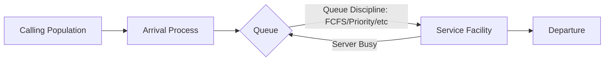
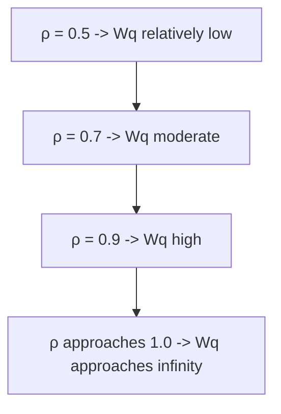
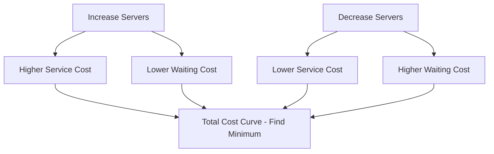
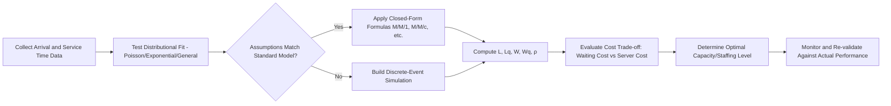

## Queuing Theory and Waiting Line Models

### Overview

Queuing theory is the mathematical study of waiting lines, modeling the behavior of arrivals, service processes, and queue formation to analyze and optimize system performance in service operations. It provides the quantitative foundation for capacity planning decisions where demand is variable and service capacity is costly, allowing operations managers to balance the cost of providing service capacity against the cost of customer waiting.

### Why Queues Form

**Key Points**

- Queues form because of **variability** in arrival times and/or service times, not merely because average demand exceeds average capacity.
- Even when average arrival rate is less than average service rate ($\lambda < \mu$), randomness in both processes causes queues to form and dissipate stochastically.
- This is the central insight distinguishing queuing analysis from simple deterministic capacity planning: a system can be "under capacity" on average and still experience significant waiting due to variability alone.

### Core Components of a Queuing System

1. **Calling population (source)** — finite or infinite population generating arrivals.
2. **Arrival process** — pattern and distribution of customer arrivals (often modeled as Poisson).
3. **Queue configuration** — single line, multiple lines, or hybrid structures.
4. **Queue discipline** — rule for selecting the next customer to serve (FCFS, priority, LCFS, SIRO).
5. **Service mechanism** — number of servers and the service time distribution (often exponential).
6. **Departure** — customer exits the system after service completion.

### Kendall Notation

Queuing systems are classified using **Kendall's notation**: $A/S/c/K/N/D$

| Symbol | Meaning |
| --- | --- |
| $A$ | Arrival process distribution (e.g., M = Markovian/Poisson, D = Deterministic, G = General) |
| $S$ | Service time distribution (M, D, G) |
| $c$ | Number of servers |
| $K$ | System capacity (optional; default = infinite) |
| $N$ | Calling population size (optional; default = infinite) |
| $D$ | Queue discipline (optional; default = FCFS) |

**Example**: $M/M/1$ denotes Poisson arrivals, exponential service times, single server, infinite capacity, infinite population, FCFS discipline — the most fundamental queuing model.

### The M/M/1 Model (Single Server)

**Assumptions**

- Arrivals follow a Poisson process with rate $\lambda$ (mean arrival rate).
- Service times are exponentially distributed with rate $\mu$ (mean service rate).
- Single server, infinite queue capacity, infinite calling population, FCFS discipline.
- System is stable only when $\rho = \lambda/\mu < 1$ (utilization must be less than 1).

**Key Formulas**

Utilization (traffic intensity):

$$\rho = \frac{\lambda}{\mu}$$

Probability system is empty:

$$P_0 = 1 - \rho$$

Average number of customers in the system:

$$L = \frac{\rho}{1 - \rho} = \frac{\lambda}{\mu - \lambda}$$

Average number of customers in the queue (excluding one being served):

$$L_q = \frac{\rho^2}{1 - \rho} = \frac{\lambda^2}{\mu(\mu - \lambda)}$$

Average time in the system (Little's Law application):

$$W = \frac{L}{\lambda} = \frac{1}{\mu - \lambda}$$

Average time in the queue:

$$W_q = \frac{L_q}{\lambda} = \frac{\lambda}{\mu(\mu - \lambda)}$$

Probability of $n$ customers in the system:

$$P_n = (1-\rho)\rho^n$$

### Little's Law

Little's Law is a foundational, distribution-free relationship applicable to any stable queuing system:

$$L = \lambda W$$

Where $L$ is the average number of items in the system, $\lambda$ is the average arrival rate, and $W$ is the average time an item spends in the system. This relationship holds regardless of the arrival distribution, service distribution, number of servers, or queue discipline, making it one of the most broadly applicable results in queuing theory.

**Example**: A coffee shop serves an average of 30 customers/hour ($\lambda = 30$), and each customer spends an average of 10 minutes (1/6 hour) in the shop. Then:

$$L = 30 \times \frac{1}{6} = 5 \text{ customers (average number in shop at any time)}$$

### Worked M/M/1 Example

A help desk receives calls at $\lambda = 8$ calls/hour (Poisson), and a single agent handles calls at $\mu = 10$ calls/hour (exponential service time).

\rho = \frac{8}{10} = 0.8 \text{ (80% utilization)}

$$L = \frac{8}{10 - 8} = \frac{8}{2} = 4 \text{ calls in system on average}$$

$$L_q = \frac{8^2}{10(10-8)} = \frac{64}{20} = 3.2 \text{ calls waiting on average}$$

$$W = \frac{1}{10-8} = 0.5 \text{ hours} = 30 \text{ minutes in system}$$

$$W_q = \frac{8}{10(10-8)} = \frac{8}{20} = 0.4 \text{ hours} = 24 \text{ minutes waiting}$$

**[Inference]** The steep sensitivity of $L_q$ and $W_q$ to $\rho$ as $\rho \to 1$ is a key managerial takeaway: pushing utilization toward 100% causes waiting times to grow non-linearly (asymptotically toward infinity), which is why most service operations deliberately target utilization well below 100% (commonly cited practical targets are in the 70–85% range depending on variability and cost of waiting, though the optimal target is context-specific and not a fixed rule).

### Utilization vs. Waiting Time Relationship

### The M/M/c Model (Multiple Servers)

Extends M/M/1 to $c$ identical parallel servers, each with service rate $\mu$, sharing a single queue.

Utilization per server:

$$\rho = \frac{\lambda}{c\mu}, \quad \text{stable when } \rho < 1$$

Probability system is empty:

$$P_0 = \left[ \sum_{n=0}^{c-1} \frac{(\lambda/\mu)^n}{n!} + \frac{(\lambda/\mu)^c}{c!(1-\rho)} \right]^{-1}$$

Average number waiting in queue:

$$L_q = \frac{P_0 (\lambda/\mu)^c \rho}{c!(1-\rho)^2}$$

Average waiting time in queue:

$$W_q = \frac{L_q}{\lambda}$$

Then $L = L_q + \lambda/\mu$ and $W = W_q + 1/\mu$ follow from Little's Law.

**[Inference]** M/M/c systems with a shared single queue generally achieve lower average waiting time than $c$ separate M/M/1 queues with the same total capacity, because pooling reduces the impact of variability (a single idle-but-available server can absorb any arriving customer rather than being tied to one specific line) — this is the standard justification for single-line/multiple-server configurations (e.g., banks, airport check-in) over multiple parallel single lines.

### Other Common Models

| Model | Description | Use Case |
| --- | --- | --- |
| M/M/1/K | Single server, finite system capacity $K$ | Call centers with limited hold queue slots |
| M/M/c/K | Multi-server, finite capacity | Parking lots, limited-seating waiting rooms |
| M/G/1 | Single server, general (non-exponential) service distribution | More realistic service time modeling |
| M/D/1 | Single server, deterministic (constant) service time | Automated/machine-paced service |
| M/M/∞ | Infinite servers (no waiting) | Self-service systems, ample capacity scenarios |

**M/G/1 Formula (Pollaczek–Khinchine)**

For general service time distribution with mean $1/\mu$ and variance $\sigma^2$:

$$L_q = \frac{\lambda^2 \sigma^2 + \rho^2}{2(1-\rho)}$$

This shows that **variability in service time** ($\sigma^2$), not just its mean, directly increases queue length — a critical insight for process standardization efforts (reducing service time variability reduces waiting even if average service time is unchanged).

### Priority Queue Disciplines

**Key Points**

- **FCFS (First-Come-First-Served)**: Standard default, perceived as fair.
- **Priority (preemptive or non-preemptive)**: Higher-priority customers served first (e.g., emergency triage in healthcare, express lanes).
- **SIRO (Service In Random Order)**: Random selection.
- **LCFS (Last-Come-First-Served)**: Common in inventory/stack-based systems, less common for human queues.

**[Inference]** Priority disciplines reduce average wait for high-priority classes at the cost of increased wait (and potentially increased variance) for low-priority classes; total system-wide average wait time is often approximately unchanged under non-preemptive priority relative to FCFS, since priority reallocates waiting rather than eliminating it.

### Psychology of Waiting (Behavioral Queuing)

**Key Points**

Beyond the mathematics, perceived wait time is influenced by well-documented behavioral factors (commonly attributed to Maister's "psychology of waiting lines" propositions):

- **Occupied time feels shorter** than unoccupied time.
- **Uncertain waits feel longer** than known, finite waits.
- **Unexplained waits feel longer** than explained waits.
- **Unfair waits feel longer** than equitable waits (e.g., single-line systems are generally perceived as fairer than multiple parallel lines, since strict arrival order is preserved).
- **Anxiety makes waits feel longer**; solo waits feel longer than group waits.

Operational tactics include: visible progress indicators, estimated wait time displays, distraction (queue entertainment, mirrors near elevators), and single-line ("snake") queue configurations to improve fairness perception.

### Capacity Planning Trade-off

The central operations decision is balancing two cost categories:

$$Total\ Cost = C_w \cdot L_q + C_s \cdot c$$

Where $C_w$ is the cost of customer waiting (per unit time per customer, often difficult to estimate directly and may include lost future business), $C_s$ is the cost per server per unit time, and $c$ is the number of servers. The optimal number of servers minimizes this total cost function.

### Simulation as a Complementary Tool

**Key Points**

- Closed-form formulas (M/M/1, M/M/c) require restrictive assumptions (Poisson arrivals, exponential/specific service distributions, steady-state).
- **Discrete-event simulation** (e.g., using tools like Arena, Simio, SimPy, or spreadsheet-based Monte Carlo) is used when real systems violate these assumptions — time-varying arrival rates, non-exponential service times, complex routing, or transient (non-steady-state) analysis is needed.
- Simulation behavior and output accuracy depend heavily on input distribution fitting and validation against historical data; results should be treated as estimates requiring sensitivity analysis rather than exact predictions.

### Application Areas in Operations Management

- **Call centers**: Staffing level determination (Erlang C model, a variant of M/M/c specifically for telephony).
- **Healthcare**: Emergency department triage and bed allocation.
- **Retail/banking**: Checkout counter and teller staffing.
- **Manufacturing**: Machine breakdown and repair queue modeling, work-in-process (WIP) buffer sizing.
- **Transportation**: Airport security lines, toll booths, ride-hailing dispatch.
- **IT/Networks**: Server request queuing, network packet buffering.

### Implementation Workflow

### Related Topics

- Little's Law and flow-time analysis
- Erlang C and Erlang A models for call center staffing
- Capacity planning and demand management in services
- Discrete-event simulation methods (SimPy, Arena, Simio)
- Yield management and demand smoothing
- Service blueprinting and bottleneck identification
- Statistical process control (SPC) for service time variability
- Behavioral operations: psychology of waiting (Maister's propositions)
- Bank/call-center staffing optimization case studies