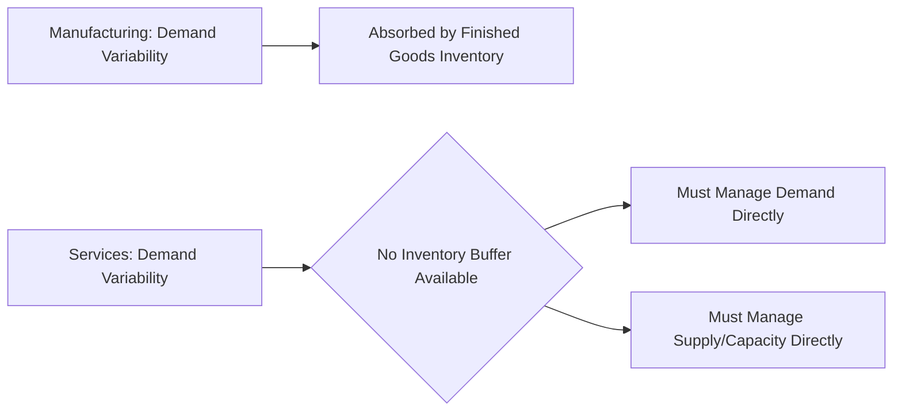
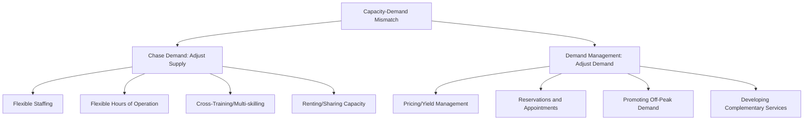
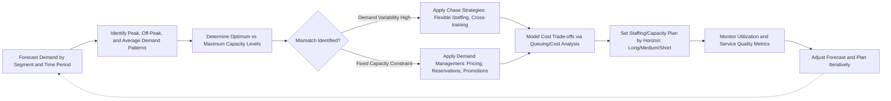

## Capacity Management in Services

### Overview

Capacity management in services is the strategic and operational process of aligning available service capacity with fluctuating customer demand, given that services cannot be inventoried. Unlike manufacturing, where excess output can be stored as inventory to buffer demand variability, services are perishable — unused capacity (an empty hotel room, an idle hairdresser, an empty airline seat) is lost forever the moment it goes unused. This perishability makes capacity management one of the most consequential operational challenges in service industries.

### Why Services Cannot Buffer with Inventory

**Key Points**

- **Perishability**: Service capacity that goes unused in a given time period cannot be stored for later use.
- **Simultaneity**: Production and consumption occur at the same time, so capacity must be present at the moment of demand, not before.
- **Intangibility**: There is no physical output to warehouse.
- Consequence: capacity decisions must directly manage the *timing* of both supply and demand, rather than relying on stock to decouple them (as is common in manufacturing).

### The Capacity-Demand Mismatch Problem

Four fundamental states describe the relationship between capacity and demand at any point in time:

| State | Description | Consequence |
| --- | --- | --- |
| Excess demand | Demand exceeds maximum capacity | Business is turned away; lost revenue and customer dissatisfaction |
| Demand exceeds optimum capacity | No one is turned away, but service quality deteriorates due to overcrowding | Perceived quality decline even though all customers are served |
| Demand and supply balanced at optimum capacity | Ideal state | Staff and facilities are busy without deterioration in service |
| Excess capacity | Demand is below optimum capacity | Wasted/perishable resources; underutilized staff and facilities |

**[Inference]** The gap between "maximum capacity" (physical/legal limit) and "optimum capacity" (the level at which service quality is maintained) is a critical distinction: many services can technically serve more customers than the level at which quality remains acceptable, meaning capacity planning targets should generally reference optimum, not maximum, capacity.

### Strategic Approaches to Capacity-Demand Mismatch

Two broad strategic levers exist, often used in combination:

1. **Chase Demand Strategy** — adjust capacity (supply) to match demand fluctuations.
2. **Demand Management Strategy** — adjust and smooth demand to better match a relatively fixed capacity level.

### Chase Demand (Supply-Side) Strategies

**Key Points**

- **Flexible workforce scheduling**: Part-time staff, split shifts, on-call staff, and variable shift lengths matched to forecasted demand patterns (e.g., restaurant staffing peaks for lunch and dinner).
- **Cross-training/multi-skilling**: Employees trained across multiple roles so labor can be reallocated to bottleneck functions as demand shifts within a shift or day.
- **Customer participation/self-service**: Shifting some service tasks to the customer (self-checkout, online booking, self-service kiosks) effectively expands capacity without adding staff.
- **Renting or sharing capacity**: Leasing additional equipment or space temporarily, or sharing facilities/staff with a complementary business with an offsetting demand pattern (e.g., a business hosting conferences on weekdays and events on weekends).
- **Overtime and temporary staffing**: Short-term capacity expansion for predictable peak periods (e.g., seasonal retail).
- **Facility and equipment design**: Modular or flexible layouts that can be reconfigured for different capacity needs (e.g., movable partitions in banquet halls).

### Demand Management (Demand-Side) Strategies

**Key Points**

- **Reservation and appointment systems**: Spread demand across available capacity by allocating specific time slots in advance, reducing walk-in variability (e.g., restaurants, clinics, salons).
- **Differential/dynamic pricing (yield management)**: Lower prices during off-peak periods to shift demand away from peak periods; higher prices during peak periods to both capture value and discourage marginal demand (e.g., matinee movie pricing, off-peak transit fares, airline dynamic pricing).
- **Promoting off-peak demand**: Marketing campaigns, loyalty incentives, or new use-case development specifically targeting low-demand periods (e.g., hotel weekday business-traveler packages vs. weekend leisure packages).
- **Developing complementary services**: Offering a secondary service with an inverse demand pattern to smooth aggregate facility/staff utilization (e.g., a ski resort offering summer mountain biking).
- **Communication of wait information**: Managing customer expectations about congestion (e.g., real-time wait estimates) to influence when customers choose to arrive.

### Yield Management (Revenue Management)

**Key Points**

- A specialized, quantitatively intensive demand management technique most associated with capacity-constrained, perishable-inventory services (airlines, hotels, car rental, cruise lines).
- Core objective: maximize revenue per available capacity unit by segmenting customers based on price sensitivity and willingness to pay, allocating capacity across booking classes accordingly.
- Relies on forecasting demand-by-segment and dynamically adjusting price and availability as the booking horizon progresses.

**Revenue per Available Unit (a common yield management KPI, e.g., RevPAR in hotels)**

$$RevPAR = \text{Occupancy Rate} \times \text{Average Daily Rate (ADR)}$$

**Example**: A 200-room hotel achieves 75% occupancy at an average daily rate of $150.

$$RevPAR = 0.75 \times \$150 = \$112.50 \text{ per available room}$$

**Overbooking as a Yield Management Tactic**

Because no-shows are common in reservation-based services, providers often intentionally overbook capacity to compensate for expected no-shows, accepting a calculated risk of occasional over-capacity (denied service) situations in exchange for reduced revenue loss from no-show-driven empty capacity.

**[Inference]** The optimal overbooking level is typically derived from a cost-trade-off model balancing the expected cost of denying service to a confirmed customer (compensation, goodwill loss) against the expected cost of an empty, unsellable unit due to a no-show — conceptually similar to the "newsvendor problem" from inventory theory, though applied to a perishable service capacity context rather than physical stock.

### Capacity Planning Time Horizons

| Horizon | Timeframe | Typical Decisions |
| --- | --- | --- |
| Long-range | 1+ years | Facility location, size, major equipment investment, service line expansion |
| Medium-range | Months to ~1 year | Staffing levels, subcontracting, seasonal workforce planning, equipment leasing |
| Short-range | Days to weeks | Daily/weekly shift scheduling, overtime authorization, temporary reassignment |

### Measuring Capacity Utilization

$$Utilization\ Rate = \frac{Actual\ Output\ or\ Demand\ Served}{Design/Maximum\ Capacity} \times 100\%$$

**Example**: A call center is designed to handle 1,000 calls/day (design capacity) and actually handles 780 calls/day.

$$Utilization = \frac{780}{1000} \times 100\% = 78\%$$

**Key Points**

- High utilization is not automatically desirable in services: pushing utilization too close to 100% (as shown in queuing theory) causes waiting times to increase disproportionately and service quality to degrade, since services generally cannot batch or queue their capacity the way manufacturing can queue inventory.
- Target utilization levels are context-dependent: services with high variability in demand or severe consequences of waiting (e.g., emergency rooms) typically target lower average utilization to maintain buffer capacity for surges, while services with more predictable, less time-sensitive demand can sustain higher target utilization.

### Linkage to Queuing Theory

Capacity management decisions (number of servers, staffing levels) are frequently derived using the queuing models covered under waiting line analysis: the choice of $c$ (number of servers) in an $M/M/c$ system is fundamentally a capacity management decision, balancing the cost of additional capacity against the cost of customer waiting.

$$Total\ Cost = C_w \cdot L_q(c) + C_s \cdot c$$

This cost-minimization framework directly connects capacity management to the mathematical waiting-line models, since $L_q$ (expected queue length) is a function of the chosen capacity level $c$.

### Demand Forecasting as a Prerequisite

**Key Points**

- Effective capacity management depends on accurate demand forecasting across multiple time scales: long-term trend, seasonal patterns, day-of-week patterns, and intraday patterns.
- Common forecasting techniques include moving averages, exponential smoothing, and regression-based methods incorporating known demand drivers (e.g., weather, local events, promotions).
- **[Inference]** Forecast accuracy directly determines capacity plan effectiveness — a well-designed chase or demand-management strategy built on a poor forecast will still produce mismatches; forecasting quality is therefore often the binding constraint on overall capacity management performance rather than the strategy design itself.

### Capacity Cushion Concept

$$Capacity\ Cushion = 1 - \frac{Average\ Demand}{Design\ Capacity}$$

A larger capacity cushion provides more buffer against demand variability and unexpected surges but at the cost of higher fixed costs and lower average utilization. Industries with high variability, high stakes for stockout (e.g., healthcare emergency services), or unpredictable demand patterns generally maintain larger capacity cushions than industries with stable, predictable demand.

### Implementation Workflow

### Related Topics

- Queuing theory and waiting line models
- Yield/revenue management and dynamic pricing
- Demand forecasting techniques for services
- Service blueprinting and capacity bottleneck identification
- Workforce scheduling and shift optimization
- The service-profit chain
- Overbooking models and the newsvendor problem analogy
- Service quality measurement (SERVQUAL) and the capacity-quality trade-off