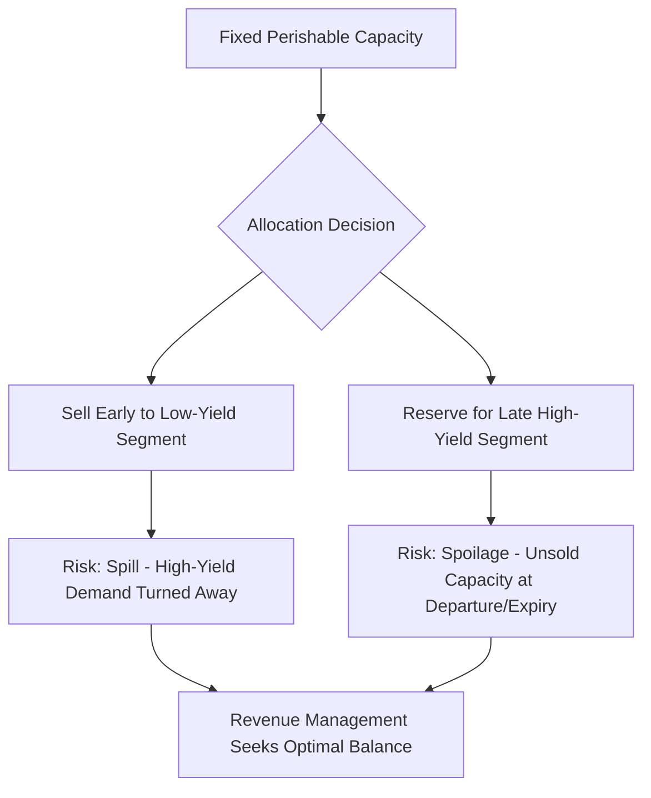
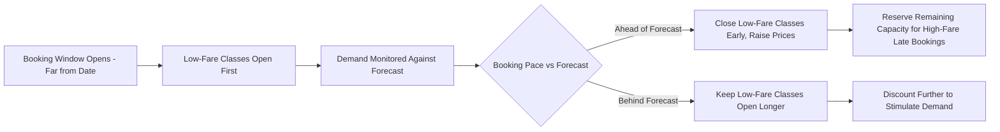
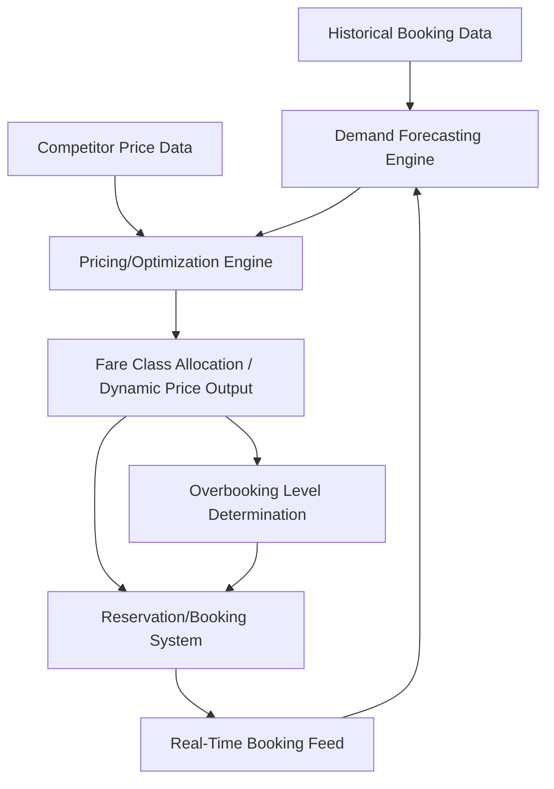
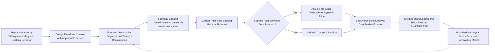

## Yield and Revenue Management

### Overview

Yield management (also called revenue management) is a set of analytical techniques for optimizing revenue from a fixed, perishable capacity by segmenting customers and dynamically allocating price and availability across demand segments. It originated in the airline industry following U.S. deregulation in 1978 (most notably associated with American Airlines' development of dynamic inventory control systems) and has since spread to hotels, car rental, cruise lines, and other capacity-constrained service industries.

### Conditions Favoring Yield Management

**Key Points**

A service industry is a strong candidate for yield management when it exhibits most or all of the following characteristics:

1. **Relatively fixed capacity** — capacity cannot be quickly or cheaply expanded (e.g., number of hotel rooms, airline seats).
2. **Perishable inventory** — unsold capacity for a given time period is lost permanently (an empty seat on a departed flight has zero future value).
3. **Segmentable market** — distinct customer segments exist with different price sensitivities, booking behaviors, and willingness to pay (e.g., business travelers vs. leisure travelers).
4. **Advance sales/reservations** — customers book ahead of consumption, allowing a booking curve to be tracked and managed over time.
5. **Fluctuating, uncertain demand** — demand varies by season, day of week, and time of day, with imperfect forecast certainty.
6. **Low marginal cost of an additional sale, high cost of capacity** — the cost of selling one more unit (one more seat, one more room) is low relative to the fixed cost of providing the capacity, making even heavily discounted sales often profitable versus an empty unit.

### Core Objective and Trade-off

The central objective is to maximize revenue per available capacity unit — not simply to maximize occupancy/load factor, and not simply to maximize price. Yield management explicitly addresses the tension between two failure modes:

- **Selling too cheaply too early**: Filling capacity with low-yield customers who booked early, then having no capacity left for late-arriving high-yield customers (spill).
- **Holding out for high-yield customers too aggressively**: Ending up with unsold, perished capacity because high-yield demand did not materialize (spoilage).

### Key Metrics

**Revenue per Available Unit**

For hotels, the standard metric is **RevPAR (Revenue Per Available Room)**:

$$RevPAR = \text{Occupancy Rate} \times \text{Average Daily Rate (ADR)}$$

equivalently:

$$RevPAR = \frac{Total\ Room\ Revenue}{Total\ Available\ Room\ Nights}$$

For airlines, the analogous metric is **RASM/RASK (Revenue per Available Seat Mile/Kilometer)**:

$$RASM = \frac{Total\ Passenger\ Revenue}{Available\ Seat\ Miles}$$

**Load Factor**

$$Load\ Factor = \frac{Seats\ Sold}{Seats\ Available} \times 100\%$$

**Worked Example (Hotel)**

A 250-room hotel sells 200 rooms tonight at an average rate of $180.

$$Occupancy = \frac{200}{250} = 80\%$$

$$ADR = \$180$$

$$RevPAR = 0.80 \times \$180 = \$144$$

**[Inference]** RevPAR is generally considered a more informative single metric than occupancy or ADR alone, because a hotel can achieve high occupancy with deeply discounted rates (low RevPAR) or high ADR with poor occupancy (also low RevPAR) — RevPAR captures the combined effect and is therefore the standard benchmark across the hotel industry.

### Booking Curve and Fare/Rate Classes

**Key Points**

- Demand for a future service date typically arrives over an extended **booking window** (weeks or months before consumption), forming a **booking curve**.
- Capacity is divided into multiple **fare/rate classes** (also called buckets or nested classes), each with different price points and often different restrictions (advance purchase requirements, cancellation flexibility, minimum stay).
- Lower-fare classes are typically opened first and progressively closed as the departure/stay date approaches and as higher-yield demand materializes, based on forecasted demand-to-come.

### Nested Fare Class Allocation (Littlewood's Rule)

A foundational two-class allocation rule, developed by Littlewood (1972), determines when to stop selling to a lower-fare class in favor of protecting capacity for a higher-fare class. The rule states that a booking request for the lower fare class should be accepted only if:

$$p_L \geq p_H \times P(D_H > x)$$

Where $p_L$ is the low fare price, $p_H$ is the high fare price, $D_H$ is the (random) demand for the high-fare class, and $x$ is the remaining capacity if this low-fare request is accepted. In words: continue accepting low-fare bookings only as long as the guaranteed low-fare revenue exceeds the expected revenue from protecting that seat for a potential high-fare sale.

**[Inference]** This is the foundational two-class model; real-world systems generalize it to multiple nested fare classes (via extensions such as the EMSR — Expected Marginal Seat Revenue — heuristics, EMSR-a and EMSR-b), which are standard in commercial airline and hotel revenue management systems, though the exact proprietary algorithms used by specific vendors are typically not publicly disclosed in full detail.

### Overbooking

**Key Points**

- Because a portion of confirmed reservations typically result in no-shows or cancellations, providers deliberately sell more reservations than physical capacity to compensate for expected attrition, maximizing realized capacity utilization.
- The overbooking decision involves a cost trade-off: the cost of denying service to an oversold, confirmed customer (compensation, rebooking costs, reputational/goodwill damage) versus the cost of an empty, unsellable unit caused by an unanticipated no-show.
- This is structurally analogous to the **newsvendor problem** in inventory theory, where the optimal overbooking level balances the marginal cost of overage (denied boarding/room) against the marginal cost of underage (empty seat/room).

**Simplified Overbooking Cost-Balance Condition**

$$P(\text{Demand} \leq \text{Booking Limit}) = \frac{C_u}{C_u + C_o}$$

Where $C_u$ is the cost of underage (an empty unit, i.e., understocked/under-booked situation) and $C_o$ is the cost of overage (denying a confirmed customer). This critical ratio (the newsvendor critical fractile) determines the optimal number of reservations to accept relative to physical capacity.

### Dynamic Pricing

**Key Points**

- Modern revenue management systems continuously adjust prices in near-real-time based on remaining inventory, time until the service date, competitor pricing, and updated demand forecasts, rather than relying solely on static, pre-defined fare classes.
- **Dynamic pricing** differs from traditional fare-class-based yield management in granularity: prices can change unit-by-unit or booking-by-booking rather than only class-by-class.
- Common in airlines, ride-hailing (surge pricing), and increasingly in hotels and event ticketing.
- **[Inference]** The shift toward algorithmic, machine-learning-based dynamic pricing (as opposed to rule-based fare-class management) reflects the growing availability of large historical booking datasets and computational capacity, but the specific proprietary models used by individual companies are generally not publicly documented in technical detail.

### Segmentation Mechanisms (Fencing)

To prevent high-willingness-to-pay customers from simply purchasing the lowest fare, revenue management systems use **fences** — rules that restrict access to lower fares to customers less likely to pay full price:

| Fence Type | Example |
| --- | --- |
| Advance purchase requirement | Must book 14+ days in advance for discount fare |
| Minimum stay requirement | Must include a Saturday night stay (targets leisure vs. business travelers) |
| Non-refundability | Discount fare is non-changeable/non-refundable |
| Group size restrictions | Certain rates only available for group bookings above a threshold |
| Loyalty tier restrictions | Certain rates reserved for or excluded from loyalty program members |

**[Inference]** Fences work because they exploit systematic behavioral differences between customer segments (e.g., business travelers typically book later and need flexibility; leisure travelers typically book earlier and can commit to fixed dates), allowing price discrimination without requiring direct identification of willingness to pay.

### Revenue Management System Architecture (Conceptual)

### Application Beyond Travel/Hospitality

**Key Points**

- **Restaurants**: Managing table turnover, reservation timing, and promotional pricing during off-peak hours (early-bird specials).
- **Event/entertainment venues**: Tiered ticket pricing based on seat location and time-to-event dynamic pricing.
- **Healthcare**: Operating room and appointment slot allocation across elective and urgent procedures.
- **Car rental**: Fleet allocation and pricing across locations and rental durations.
- **Ride-hailing**: Surge pricing as a real-time demand-supply balancing mechanism functionally similar to dynamic yield management.

**[Inference]** The broader applicability of yield management principles to non-travel service industries is a natural extension of the same underlying conditions (fixed capacity, perishability, segmentable demand) rather than a distinct theoretical framework — the core mathematics (nested allocation, overbooking trade-offs, dynamic pricing) transfers directly.

### Risks and Criticisms

**Key Points**

- **Customer perception of unfairness**: Highly visible price variation for an identical service/product (e.g., two adjacent airline passengers paying very different fares) can generate perceived inequity, potentially damaging customer trust and loyalty if not managed carefully.
- **Overbooking backlash**: Denied boarding/service incidents can generate significant negative publicity, requiring careful compensation policy design (linking back to service recovery strategies).
- **Forecast dependency**: Yield management performance is fundamentally constrained by forecast accuracy; poor demand forecasts lead to suboptimal fare class allocation regardless of the sophistication of the optimization algorithm.
- **Complexity and implementation cost**: Building and maintaining forecasting and optimization systems requires significant data infrastructure and specialized expertise, which can be a barrier for smaller operators.

### Implementation Workflow

### Related Topics

- Capacity management in services
- Queuing theory and waiting line models
- Demand forecasting techniques for services
- Newsvendor problem and inventory theory analogies
- Dynamic and surge pricing algorithms
- Service recovery strategies (overbooking/denied service scenarios)
- Price discrimination and market segmentation theory
- Booking curve analysis and demand-to-come forecasting