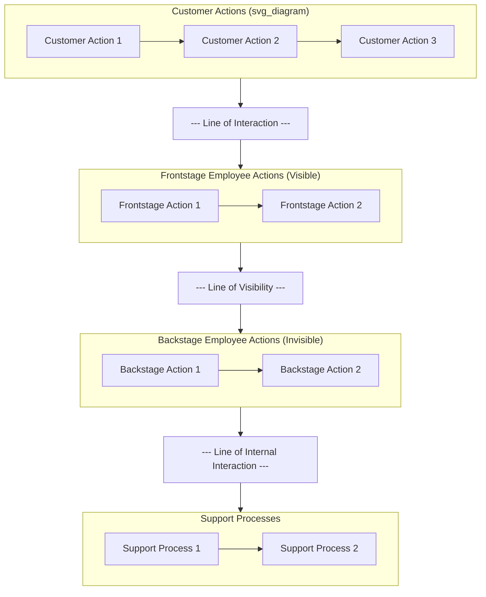
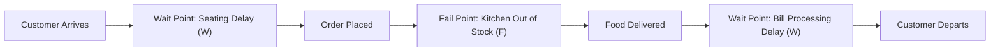
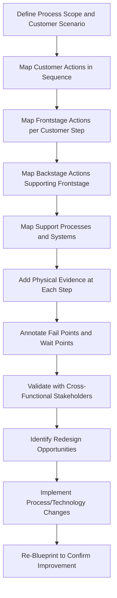

## Service Blueprinting and Customer Journey Mapping

### Overview

Service blueprinting and customer journey mapping are complementary visual design and diagnostic tools used to document, analyze, and redesign service delivery processes. Both techniques make the intangible structure of a service visible, but they differ in scope and perspective: journey mapping centers on the customer's end-to-end emotional and behavioral experience, while service blueprinting adds the operational, backstage architecture that produces that experience. Service blueprinting was originally developed by Lynn Shostack (1984) as a technique for designing and specifying service processes with the same rigor used in manufacturing process design.

### Customer Journey Mapping

**Key Points**

- A **customer journey map** documents the sequence of touchpoints, actions, thoughts, and emotions a customer experiences from initial awareness through post-purchase/post-service stages.
- Typically organized around **phases** (e.g., Awareness → Consideration → Purchase → Onboarding → Usage → Support → Loyalty/Advocacy).
- For each phase, journey maps commonly capture: customer actions, customer goals/needs, touchpoints (channels of interaction), emotional state (often visualized as a satisfaction/frustration curve), and pain points.
- Primary purpose: build empathy and identify moments of friction or delight from the customer's subjective point of view, often used in service design, marketing, and UX contexts.

**Example: Simplified Journey Map (Airline Passenger)**

| Phase | Customer Action | Emotion | Pain Point |
| --- | --- | --- | --- |
| Booking | Searches and compares flights online | Neutral to hopeful | Confusing fare rules |
| Check-in | Uses mobile app to check in | Confident | App crashes during peak hours |
| Airport | Waits in security line | Anxious | Long, unpredictable wait time |
| In-flight | Boards and settles in | Relieved | Limited legroom |
| Post-flight | Retrieves baggage | Frustrated | Delayed baggage delivery |

### Service Blueprinting: Core Structure

A service blueprint extends the journey map by adding **operational layers** organized by three critical horizontal lines that separate what the customer sees from what happens behind the scenes:

1. **Line of Interaction** — separates customer actions from all provider (frontstage) activities; every point where the customer directly interacts with the service system crosses this line.
2. **Line of Visibility** — separates what the customer *can see* (frontstage employee actions, visible physical evidence) from what happens *out of customer view* (backstage employee actions).
3. **Line of Internal Interaction** — separates backstage employee actions/support processes from internal support processes and systems (IT systems, inventory, third-party suppliers) that enable service delivery but involve no direct customer or employee-facing action at that stage.

### Complete Blueprint Components

**Key Points**

1. **Physical evidence** — tangible cues customers encounter at each step (receipts, facility appearance, uniforms, signage, app interface) — typically listed above the customer action row.
2. **Customer actions** — the steps the customer performs.
3. **Frontstage (onstage) employee actions** — visible employee/system interactions with the customer.
4. **Backstage (invisible) employee actions** — employee activities that support frontstage delivery but are not visible to the customer.
5. **Support processes** — internal systems, IT infrastructure, and third-party/supplier activities enabling backstage and frontstage actions.

### Worked Example: Restaurant Service Blueprint (Simplified)

| Layer | Step 1: Arrival | Step 2: Ordering | Step 3: Food Preparation | Step 4: Payment |
| --- | --- | --- | --- | --- |
| **Physical Evidence** | Signage, host stand | Menu, table setting | (not visible) | Receipt, POS terminal |
| **Customer Actions** | Enters, waits to be seated | Reviews menu, places order | Waits, converses | Requests bill, pays |
| **Line of Interaction** | — | — | — | — |
| **Frontstage Actions** | Host greets and seats | Server takes order | Server delivers food | Server processes payment |
| **Line of Visibility** | — | — | — | — |
| **Backstage Actions** | Table cleaned/prepared | Order entered into POS | Kitchen prepares dish | — |
| **Line of Internal Interaction** | — | — | — | — |
| **Support Processes** | Reservation system | Inventory/ingredient system | Supplier/ingredient delivery | Payment processing system |

### Failure Points and Waiting Points

**Key Points**

- **Fail points**: Steps in the process identified as high-risk for service failure (e.g., kitchen running out of an ingredient, POS system downtime), typically marked explicitly on the blueprint (often with a symbol such as ⚠ or "F") to prioritize quality control and error-proofing (poka-yoke) efforts.
- **Wait points**: Steps where customer waiting is likely to occur (e.g., waiting to be seated, waiting for food), marked to highlight opportunities for queuing analysis or perceived-wait management.
- Explicitly marking these points on the blueprint directly links this technique to **queuing theory** (for wait points) and **service recovery planning** (for fail points).

### Journey Mapping vs. Service Blueprinting Comparison

| Dimension | Customer Journey Map | Service Blueprint |
| --- | --- | --- |
| Primary lens | Customer experience and emotion | Operational process and system design |
| Scope | Customer-facing only | End-to-end, including backstage/support |
| Typical users | Marketing, UX/CX teams | Operations, process engineering teams |
| Key output | Empathy, pain point identification | Process redesign, fail-point/wait-point control, capacity planning input |
| Level of technical detail | Low to moderate | High (specific systems, handoffs, timing) |

**[Inference]** In mature service design practice, the two tools are often used sequentially: journey mapping identifies *where* customer pain exists, and service blueprinting is then used to diagnose the underlying *operational cause* of that pain by tracing the frontstage moment back through backstage and support processes.

### Building a Service Blueprint: Methodology

1. **Define the scope** — select the specific service process and customer segment/scenario to be blueprinted (e.g., "first-time customer online order" vs. "returning customer in-store order" may require separate blueprints).
2. **Identify customer actions** — map every step the customer takes, in sequence.
3. **Map frontstage employee/system actions** — for each customer action, identify the corresponding employee or self-service system interaction.
4. **Map backstage actions** — identify what employees do behind the scenes to enable each frontstage action.
5. **Map support processes** — identify the internal systems, technology, and suppliers each backstage action depends on.
6. **Add physical evidence** — document tangible cues at each customer-facing step.
7. **Identify fail points and wait points** — annotate high-risk failure and delay locations.
8. **Estimate time/duration** at each step, where relevant, to support capacity and process-time analysis.
9. **Validate with cross-functional stakeholders** (frontline staff, operations managers, IT) to confirm accuracy, since blueprint accuracy depends on capturing actual (not idealized) current-state process behavior.

### Applications in Operations Management

**Key Points**

- **Process redesign**: Identifying redundant handoffs, unnecessary backstage steps, or opportunities to convert backstage steps to self-service (reducing labor cost and cycle time).
- **Capacity planning input**: Time estimates per step feed directly into queuing models and staffing decisions.
- **Root-cause analysis for service recovery**: When a customer-facing failure occurs, tracing it back through the blueprint layers helps identify whether the cause is a frontstage (employee/training), backstage (process), or support-process (systems/supplier) issue.
- **New service design**: Blueprinting a proposed new service before launch (a "should-be" blueprint) surfaces operational feasibility issues, resource requirements, and potential fail points before resources are committed.
- **Technology/automation planning**: Clarifies exactly which steps are candidates for automation (backstage and support-process steps are often stronger automation candidates than frontstage steps requiring human judgment or empathy).
- **Training and onboarding**: Provides new employees with an end-to-end view of how their specific role connects to the overall customer experience.

### As-Is vs. To-Be Blueprints

**Key Points**

- **As-is blueprint**: Documents the current, actual state of the service process (including inefficiencies and undocumented workarounds) — used for diagnosis.
- **To-be blueprint**: Documents the proposed, redesigned future-state process — used for design and implementation planning.
- **[Inference]** Comparing as-is and to-be blueprints side by side is a standard technique for communicating the scope and impact of a proposed process change to stakeholders, since it visually isolates exactly which steps, handoffs, or systems are being added, removed, or modified.

### Limitations

**Key Points**

- Blueprints represent a static snapshot of a typically linear process; they can struggle to represent highly dynamic, non-linear, or highly personalized service paths without becoming visually complex.
- Accuracy depends heavily on the quality of stakeholder input; blueprints built without direct frontline employee involvement risk reflecting idealized rather than actual process behavior.
- Detailed blueprints for complex, multi-channel services (omnichannel retail, complex healthcare pathways) can become large and difficult to maintain, requiring careful scoping decisions about the level of granularity to include.

### Related Topics

- SERVQUAL and service quality measurement
- Service recovery strategies
- Queuing theory and waiting line models
- Failure Mode and Effects Analysis (FMEA) in service design
- Poka-yoke (error-proofing) in service processes
- Capacity management in services
- Process mapping and value stream mapping (Lean methodology)
- New service development and design thinking