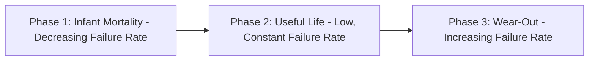
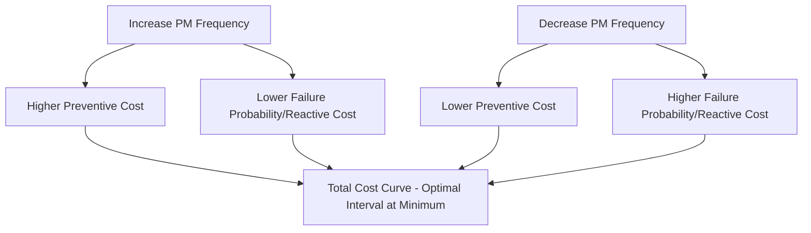
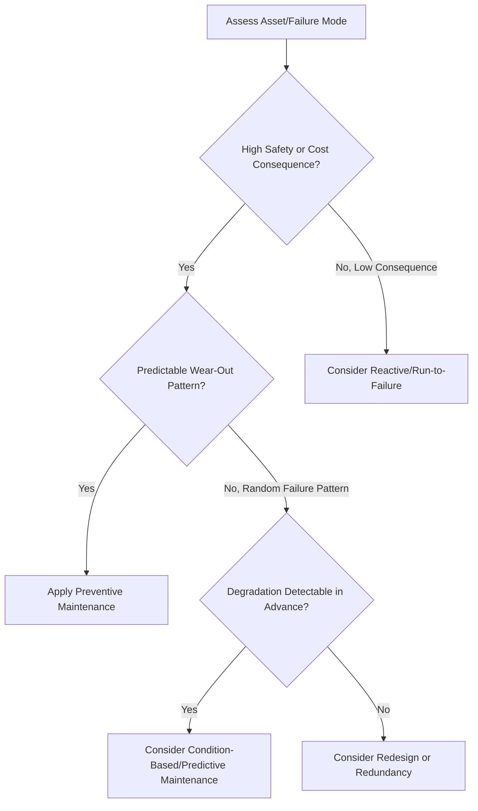

## Reactive Versus Preventive Maintenance

### Overview

Maintenance strategy selection is a foundational decision in operations management that determines how organizations manage equipment degradation and failure over the asset lifecycle. Reactive and preventive maintenance represent two fundamentally different philosophies for managing the trade-off between maintenance cost, equipment availability, and failure risk. Most real-world maintenance programs use a blended approach, applying different strategies to different assets based on criticality and failure characteristics.

### Reactive Maintenance (Run-to-Failure)

**Key Points**

- Also known as **corrective maintenance** or **breakdown maintenance**.
- Repair or replacement action is taken only *after* equipment has already failed or malfunctioned.
- No scheduled inspection or servicing occurs prior to failure; maintenance is entirely failure-triggered.
- Simplest maintenance philosophy to administer, requiring no predictive infrastructure, scheduling system, or condition-monitoring investment.

**Advantages**

- Lower upfront administrative and monitoring cost — no need for inspection schedules, condition-monitoring equipment, or dedicated planning staff.
- Full utilization of an asset's useful life — components are not replaced or serviced until they actually fail, avoiding the "waste" of discarding parts with remaining useful life.
- Appropriate for low-criticality, low-cost, easily replaceable components where failure has minimal operational or safety consequence.

**Disadvantages**

- Unplanned downtime, which is typically more costly and disruptive than planned downtime (production stoppage, missed service commitments, potential cascading failures).
- Higher risk of secondary damage — a failed component can damage adjacent systems before the failure is detected and addressed.
- Emergency repairs often cost more than planned repairs (rush parts ordering, overtime labor, expedited shipping).
- Unpredictable maintenance labor demand, complicating workforce scheduling and spare parts inventory management.
- Higher safety risk for equipment where failure mode can endanger personnel.

### Preventive Maintenance (Time- or Usage-Based)

**Key Points**

- Maintenance actions (inspection, servicing, component replacement) are performed on a predetermined **schedule** — based on elapsed time, calendar interval, or usage metric (operating hours, cycles, mileage) — regardless of the equipment's actual condition at that moment.
- Objective: prevent failure from occurring by servicing or replacing components before they are expected to fail, based on known or statistically estimated failure patterns.
- Requires an established maintenance schedule, often derived from manufacturer recommendations, historical failure data, or reliability engineering analysis (e.g., mean time between failures).

**Advantages**

- Reduces unplanned downtime by addressing wear-related failure modes proactively.
- Enables planned scheduling of maintenance labor, spare parts procurement, and production downtime windows, improving overall operational predictability.
- Generally reduces the frequency and severity of catastrophic failures for components with well-understood, time-based wear patterns.
- Supports more stable maintenance budgeting and staffing.

**Disadvantages**

- Can result in unnecessary maintenance — components are sometimes replaced or serviced while still functioning adequately, "wasting" remaining useful life.
- Fixed-interval servicing does not account for actual equipment condition, meaning a component operating under lighter-than-average stress may be serviced too early, while one under heavier-than-average stress could still fail before the next scheduled interval.
- Introduces its own failure risk: **maintenance-induced failures**, where the act of servicing (disassembly/reassembly, improper reinstallation) introduces a new fault that would not have occurred under run-to-failure conditions.
- Requires ongoing investment in scheduling systems, maintenance planning staff, and spare parts inventory to support the fixed schedule.

### Comparative Decision Framework

| Dimension | Reactive Maintenance | Preventive Maintenance |
| --- | --- | --- |
| Trigger for action | Equipment failure | Predetermined schedule (time/usage) |
| Downtime character | Unplanned, disruptive | Planned, scheduled |
| Component utilization | Full useful life used | Potentially early replacement |
| Administrative overhead | Low | Moderate to high |
| Best suited for | Low-criticality, low-cost, non-safety-critical assets with random (non-wear-related) failure patterns | Assets with predictable wear-based failure patterns and high downtime/safety cost |
| Failure predictability required | None | Requires known or estimable failure distribution |
| Risk introduced | Secondary/cascading damage, unplanned costs | Maintenance-induced failure, unnecessary part replacement |

### The Bathtub Curve and Failure Pattern Analysis

**Key Points**

- Equipment failure rate over time is often conceptually modeled using the **bathtub curve**, comprising three phases: (1) early "infant mortality" failures (often due to manufacturing defects), (2) a low, relatively constant "useful life" failure rate (often modeled as random failures, e.g., via the exponential distribution), and (3) an increasing "wear-out" failure rate as components age.
- **[Unverified as universally applicable]** — the classic bathtub curve is a simplified conceptual model; large-scale reliability studies (most notably widely cited work originating from aviation maintenance analysis in the 1960s–70s) found that a substantial proportion of failure modes in complex equipment do not follow this pattern at all, instead showing random or infant-mortality-dominated failure characteristics with no clear wear-out phase. This finding is one of the historical drivers behind the development of **Reliability-Centered Maintenance (RCM)**, which explicitly avoids assuming a universal wear-out pattern and instead requires failure-mode-specific analysis.
- Preventive maintenance is most effective (and most justified economically) specifically for failure modes that exhibit a genuine, identifiable wear-out pattern; applying fixed-interval preventive maintenance to a component with a random (non-age-related) failure pattern provides little to no reliability benefit and simply adds unnecessary cost and maintenance-induced failure risk.

### Cost Trade-off Model

The maintenance strategy decision can be framed as a total-cost minimization problem:

$$Total\ Maintenance\ Cost = C_{reactive} \cdot P(failure) + C_{preventive} \cdot f_{PM}$$

Where $C_{reactive}$ is the expected cost of a reactive/breakdown repair (including downtime cost), $P(failure)$ is the probability of failure under the current strategy, $C_{preventive}$ is the cost per preventive maintenance action, and $f_{PM}$ is the frequency of preventive actions performed.

**[Inference]** As preventive maintenance frequency $f_{PM}$ increases, the probability of unplanned failure $P(failure)$ generally decreases, but preventive cost increases — implying an optimal preventive maintenance interval exists where total cost (sum of both cost components) is minimized; this optimal point depends on the specific cost ratio and the underlying failure distribution of the component in question, and is not a fixed universal ratio applicable across all equipment types.

### Worked Example: Simplified Interval Cost Comparison

A machine component has a reactive (breakdown) repair cost of $5,000 (including downtime) and an average of 2 failures/year under a run-to-failure policy.

$$Annual\ Reactive\ Cost = 2 \times \$5,000 = \$10,000/\text{year}$$

Under a preventive maintenance policy, the same component is serviced quarterly (4 times/year) at $800 per service, reducing failures to an estimated 0.5/year (residual failures not preventable by the PM action):

$$Annual\ PM\ Cost = (4 \times \$800) + (0.5 \times \$5,000) = \$3,200 + \$2,500 = \$5,700/\text{year}$$

In this scenario, preventive maintenance reduces total annual cost from $10,000 to $5,700. **[Inference]** This example illustrates the general logic of the trade-off calculation; actual PM economic justification requires empirical failure-rate and cost data specific to the equipment and organization, since the relative cost advantage varies significantly by asset type, failure mode, and downtime cost structure.

### Criticality-Based Strategy Selection

**Key Points**

Maintenance strategy is typically assigned per asset (or per failure mode within an asset) based on a criticality assessment considering:

1. **Safety consequence** — could failure endanger personnel or the public?
2. **Operational consequence** — how severe is the production/service disruption?
3. **Cost consequence** — repair cost, secondary damage cost, and downtime cost.
4. **Failure predictability** — does the failure mode exhibit a clear wear-out pattern that preventive maintenance can address?
5. **Detectability** — can degradation be detected before functional failure (relevant to whether condition-based/predictive maintenance is a viable alternative to fixed-interval preventive maintenance)?

### Position Within the Broader Maintenance Strategy Spectrum

Reactive and preventive maintenance are the two foundational poles of a broader spectrum that also includes:

- **Predictive maintenance (PdM)**: Uses condition-monitoring data (vibration analysis, thermal imaging, oil analysis, sensor telemetry) to trigger maintenance based on actual observed equipment condition rather than a fixed schedule.
- **Reliability-Centered Maintenance (RCM)**: A structured analytical methodology for determining the most appropriate maintenance strategy (reactive, preventive, predictive, or redesign) on a failure-mode-by-failure-mode basis, rather than applying one strategy uniformly.
- **Total Productive Maintenance (TPM)**: A broader organizational philosophy incorporating operator involvement in routine maintenance alongside strategic maintenance planning.

**[Inference]** Most mature industrial maintenance programs do not select a single strategy organization-wide; instead, they apply a mixed strategy, using RCM-style analysis to assign reactive, preventive, or predictive approaches to different assets and failure modes based on the criticality framework above.

### Implementation Considerations

**Key Points**

- **Data requirements**: Preventive maintenance scheduling requires reliable failure-rate data (manufacturer specifications, historical maintenance records, or industry benchmarks) to set appropriate intervals; poor data leads to either excessive (wasteful) or insufficient (ineffective) maintenance frequency.
- **CMMS (Computerized Maintenance Management System)**: Organizations typically use CMMS software to schedule, track, and document preventive maintenance tasks, manage spare parts inventory, and generate maintenance history for reliability analysis.
- **Workforce implications**: Transitioning from reactive to preventive maintenance typically requires investment in maintenance planning staff and changes to technician work patterns (planned/scheduled work vs. emergency response work).

### Related Topics

- Predictive maintenance and condition monitoring
- Reliability-Centered Maintenance (RCM)
- Total Productive Maintenance (TPM)
- Mean Time Between Failures (MTBF) and Mean Time To Repair (MTTR)
- Overall Equipment Effectiveness (OEE)
- Failure Mode and Effects Analysis (FMEA)
- Spare parts inventory management
- Computerized Maintenance Management Systems (CMMS)