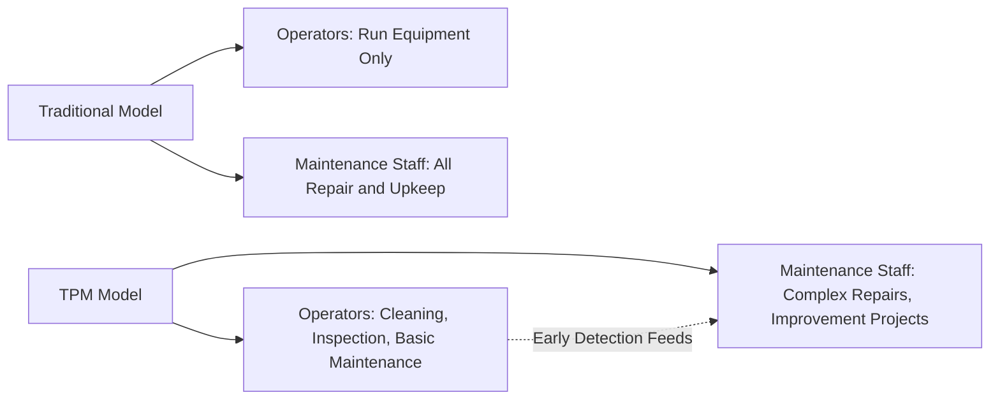
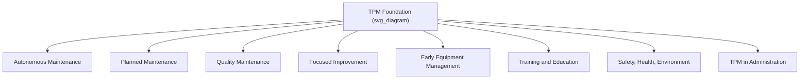
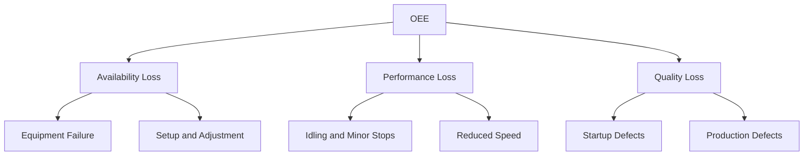
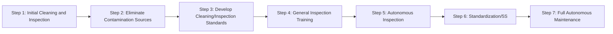

## Total Productive Maintenance

### Overview

Total Productive Maintenance (TPM) is a comprehensive, organization-wide maintenance philosophy that integrates equipment maintenance into the daily responsibilities of production operators rather than treating maintenance as a separate, specialist-only function. Originating in Japan in the late 1960s–1970s (most closely associated with Seiichi Nakajima and the Japan Institute of Plant Maintenance, with Nippondenso, a Toyota Group company, frequently cited as an early adopter), TPM aims to maximize equipment effectiveness through total employee involvement, proactive and preventive maintenance practices, and systematic elimination of the major losses that reduce productivity.

### Core Philosophy: Shift from Specialist to Shared Ownership

**Key Points**

- Traditional maintenance models separate "operators who run equipment" from "maintenance technicians who fix equipment," creating a functional silo where operators have limited incentive or capability to notice and address early signs of equipment degradation.
- TPM's foundational idea is **autonomous maintenance**: training operators to perform basic maintenance tasks (cleaning, lubrication, inspection, minor adjustment) themselves, freeing skilled maintenance technicians to focus on more complex, specialized repair and improvement work.
- The underlying logic is that operators, being closest to the equipment on a continuous basis, are best positioned to detect abnormal conditions (unusual noise, vibration, temperature, minor leaks) before they escalate into failures — but only if trained and empowered to act on those observations.

### The Eight Pillars of TPM

TPM is commonly structured around eight foundational pillars:

1. **Autonomous Maintenance (Jishu Hozen)** — operators perform routine cleaning, lubrication, inspection, and minor adjustments on their own equipment.
2. **Planned Maintenance** — scheduled maintenance activities performed by specialized maintenance staff, based on failure rates and equipment condition data (integrating with preventive and predictive maintenance practices).
3. **Quality Maintenance** — designing error detection and prevention directly into the equipment and process to achieve zero quality defects related to equipment condition (linking equipment health to product/service quality).
4. **Focused Improvement (Kobetsu Kaizen)** — small, cross-functional teams working on specific, targeted improvement projects to eliminate the major loss categories affecting equipment effectiveness.
5. **Early Equipment Management** — incorporating lessons learned from existing equipment operation into the design and specification of new equipment, aiming to minimize maintenance requirements and startup issues from the outset.
6. **Training and Education** — developing operator skills for autonomous maintenance and developing maintenance staff skills for more advanced diagnostic and repair techniques.
7. **Safety, Health, and Environment** — maintaining a zero-accident, zero-health-damage, zero-fire workplace, recognizing that well-maintained equipment is inherently safer equipment.
8. **TPM in Administration/Office** — extending TPM principles (waste elimination, process efficiency) to administrative and support functions beyond the shop floor.

**[Inference]** The "8 pillars" framing is the most widely cited structure in TPM literature, though some sources present a "5 pillars" or alternative groupings depending on the certifying body or consulting framework referenced; the underlying content across these variants is substantially consistent.

### Overall Equipment Effectiveness (OEE)

**Key Points**

- **OEE** is the central metric used to quantify TPM performance, capturing the combined impact of the three major categories of productivity loss: availability loss, performance loss, and quality loss.

$$OEE = Availability \times Performance \times Quality$$

**Availability**

$$Availability = \frac{Operating\ Time}{Planned\ Production\ Time}$$

Operating Time = Planned Production Time − Downtime (breakdowns, setup/changeover time)

**Performance**

$$Performance = \frac{(Ideal\ Cycle\ Time \times Total\ Count)}{Operating\ Time}$$

Captures speed losses — running slower than ideal/rated speed, minor stops, and idling.

**Quality**

$$Quality = \frac{Good\ Count}{Total\ Count}$$

Captures defect and rework losses.

**Worked Example**

A production line has:

- Planned Production Time: 480 minutes/shift
- Downtime (breakdowns + changeovers): 60 minutes
- Ideal Cycle Time: 1 minute/unit
- Total units produced: 350
- Good units (passing quality): 336

$$Operating\ Time = 480 - 60 = 420\ \text{minutes}$$

$$Availability = \frac{420}{480} = 0.875\ (87.5\%)$$

$$Performance = \frac{1 \times 350}{420} = 0.833\ (83.3\%)$$

$$Quality = \frac{336}{350} = 0.96\ (96\%)$$

$$OEE = 0.875 \times 0.833 \times 0.96 = 0.700\ (70.0\%)$$

**[Inference]** An OEE of 100% represents theoretical perfect production (no downtime, running at ideal speed, zero defects); a commonly cited benchmark in TPM literature considers approximately 85% OEE to represent "world-class" performance for discrete manufacturing, though this benchmark figure varies by industry, equipment type, and source, and should not be applied as a fixed universal target without context-specific validation.

### The Six Big Losses

OEE's three components are further decomposed into six specific loss categories that focused improvement (Kobetsu Kaizen) activities target:

| Loss Category | OEE Component Affected | Description |
| --- | --- | --- |
| Equipment Failure/Breakdown | Availability | Unplanned stops due to equipment malfunction |
| Setup and Adjustment | Availability | Planned stops for changeovers, tooling changes |
| Idling and Minor Stops | Performance | Brief stops (typically under 5 minutes) not requiring maintenance intervention |
| Reduced Speed | Performance | Running below the designed/ideal cycle rate |
| Process/Startup Defects | Quality | Defects occurring during process startup or stabilization |
| Production Defects | Quality | Defects occurring during steady-state production |

### Autonomous Maintenance Implementation Steps

A commonly referenced structured rollout sequence for the Autonomous Maintenance pillar:

1. **Initial cleaning** — operators clean equipment thoroughly, simultaneously inspecting for hidden defects (dust and dirt can mask leaks, loose bolts, wear).
2. **Eliminate contamination sources and inaccessible areas** — address root causes of dirt/contamination and improve access for cleaning and inspection.
3. **Develop cleaning and inspection standards** — establish standardized time-bound procedures for operator-performed cleaning, lubrication, and inspection.
4. **General inspection** — operators trained in broader equipment inspection skills (beyond basic cleaning) to detect subtler abnormalities.
5. **Autonomous inspection** — operators independently conduct scheduled inspections integrated into daily routine.
6. **Standardization** — visual management and standardized procedures extended across the workplace (5S integration).
7. **Full autonomous maintenance** — operators fully manage equipment condition monitoring within their scope, with maintenance staff focused on complex/specialized work and continuous improvement.

### TPM and 5S

**Key Points**

- TPM implementation is closely linked to **5S** (Sort, Set in order, Shine, Standardize, Sustain) as a foundational workplace organization discipline that supports the visibility and cleanliness required for effective autonomous maintenance.
- Visual management techniques (e.g., color-coded gauges showing normal operating ranges, labeled lubrication points) are commonly used to make abnormal equipment conditions immediately visible to operators without requiring specialized diagnostic training.

### Relationship to Other Maintenance and Quality Frameworks

| Framework | Relationship to TPM |
| --- | --- |
| Preventive Maintenance | A core input/component within TPM's "Planned Maintenance" pillar |
| Predictive Maintenance | Can be incorporated into Planned Maintenance activities as condition-monitoring data matures |
| Reliability-Centered Maintenance (RCM) | Complementary analytical approach for determining *which* maintenance strategy to apply to specific failure modes; can inform TPM's Planned Maintenance pillar |
| Lean Manufacturing / Toyota Production System | TPM is frequently implemented alongside Lean as a complementary pillar addressing equipment reliability as one of the foundational "stability" requirements for Lean flow |
| Total Quality Management (TQM) | Shares TPM's philosophy of total employee involvement, applied to quality rather than equipment maintenance specifically |

**[Inference]** TPM and TQM are often described as parallel philosophies — TQM focused on total employee involvement in quality, TPM focused on total employee involvement in equipment effectiveness — and many organizations implement them as complementary, overlapping initiatives rather than as competing frameworks.

### Benefits and Common Implementation Challenges

**Key Points**

**Benefits**

- Reduced unplanned downtime through earlier detection of equipment abnormalities.
- Extended equipment lifespan through consistent basic care (cleaning, lubrication).
- Improved product/service quality through better-maintained, more consistently performing equipment.
- Increased operator engagement and sense of ownership over equipment and outcomes.
- More effective use of skilled maintenance technician time on higher-value diagnostic and improvement work.

**Common Implementation Challenges**

- Requires significant cultural change and sustained management commitment; TPM implementations are frequently reported in practitioner literature to fail or stagnate due to insufficient leadership support or treating it as a short-term initiative rather than a long-term operating philosophy.
- Requires substantial upfront training investment for both operators (new maintenance skills) and maintenance staff (adapting to a changed role).
- Resistance from maintenance staff who may perceive autonomous maintenance as encroaching on their traditional role, requiring careful change management and role redefinition.
- Full implementation of all eight pillars is a multi-year undertaking; **[Inference]** organizations often see initial OEE and downtime improvements from the earliest stages (initial cleaning and inspection) before the full autonomous maintenance and cultural transformation is achieved, though the pace and magnitude of improvement is highly context-dependent and not guaranteed by the framework alone.

### Implementation Workflow

```mermaid
flowchart LR
    A[Secure Leadership Commitment] --> B[Establish Baseline OEE and Loss Categories]
    B --> C[Select Pilot Equipment/Line]
    C --> D[Deploy 5S and Initial Cleaning/Inspection]
    D --> E[Train Operators in Autonomous Maintenance Steps]
    E --> F[Launch Focused Improvement Kaizen Teams on Top Losses]
    F --> G[Integrate Planned Maintenance Scheduling]
    G --> H[Measure OEE Improvement and Loss Reduction]
    H --> I[Scale to Additional Lines/Equipment]
    I --> J[Extend to Early Equipment Management and Office TPM]
```

### Related Topics

- Overall Equipment Effectiveness (OEE) calculation and benchmarking
- Reactive versus preventive maintenance
- Reliability-Centered Maintenance (RCM)
- 5S workplace organization methodology
- Lean manufacturing and the Toyota Production System
- Kaizen and continuous improvement methodology
- Total Quality Management (TQM)
- Mean Time Between Failures (MTBF) and Mean Time To Repair (MTTR)