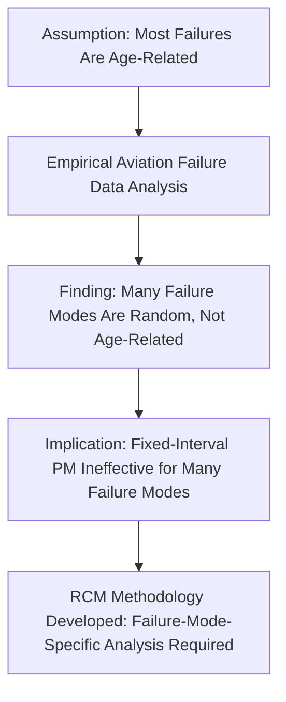
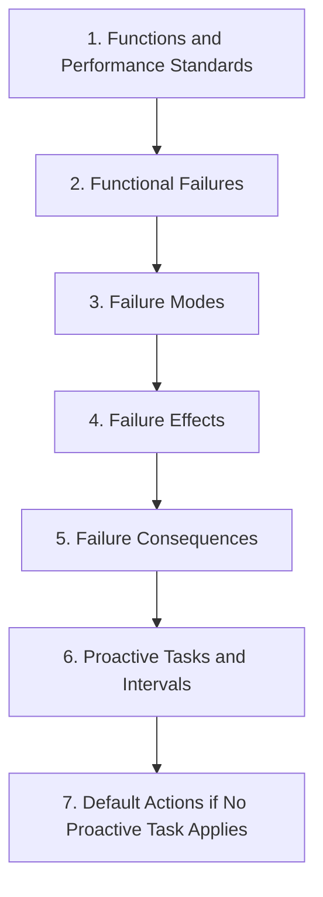
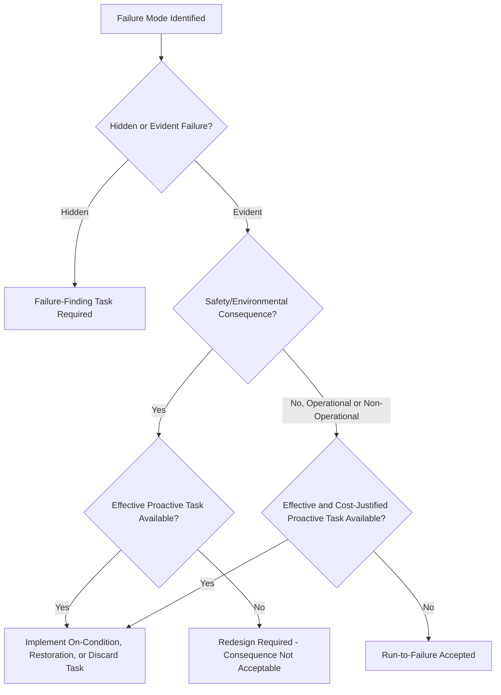
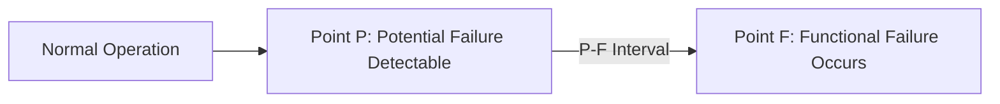
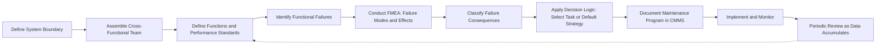

## Reliability-Centered Maintenance

### Overview

Reliability-Centered Maintenance (RCM) is a structured, systematic analytical methodology for determining the most appropriate maintenance strategy for each specific failure mode of an asset, rather than applying a single maintenance philosophy uniformly across all equipment. RCM's foundational premise is that maintenance strategy should be derived from a rigorous analysis of *how* an asset can fail, *what happens* when it fails, and *what consequences* that failure produces — not from generic rules of thumb or manufacturer defaults applied indiscriminately. The methodology originated in the commercial aviation industry, most notably formalized in the Nowlan and Heap report commissioned by the U.S. Department of Defense (1978), which grew out of earlier work at United Airlines examining the actual relationship between maintenance and reliability.

### Historical Origin and the Failure Pattern Discovery

**Key Points**

- Prior to RCM's development, conventional wisdom assumed most equipment followed a "bathtub curve" failure pattern, where failure probability increases with age (wear-out), justifying scheduled overhaul or replacement at fixed intervals.
- Large-scale empirical analysis of aircraft component failure data found that a substantial majority of failure modes did **not** exhibit an age-related wear-out pattern; instead, many failure modes showed random or infant-mortality-dominated failure characteristics with little to no correlation between age and failure probability.
- **[Unverified as universally applicable]** — this finding is specific to the population of components and systems studied in the original research; the precise proportional breakdown across failure pattern types is dataset-dependent and should not be treated as a universal fixed ratio applicable to all industries or equipment classes without independent verification.
- This discovery was foundational to RCM: if most failure modes are not age-related, then fixed-interval preventive maintenance based on age alone is often ineffective (and sometimes counterproductive) for a large proportion of components, justifying RCM's failure-mode-specific analytical approach over blanket preventive scheduling.

### The Seven Core Questions of RCM

RCM analysis is structured around answering seven sequential questions for each significant asset or system, as codified in the SAE JA1011 standard (the industry-recognized standard defining the criteria a process must meet to be called RCM):

1. **What are the functions and associated performance standards of the asset in its present operating context?**
2. **In what ways can it fail to fulfill its functions (functional failures)?**
3. **What causes each functional failure (failure modes)?**
4. **What happens when each failure occurs (failure effects)?**
5. **In what way does each failure matter (failure consequences)?**
6. **What can be done to predict or prevent each failure (proactive tasks and task intervals)?**
7. **What should be done if a suitable proactive task cannot be found (default actions)?**

### Failure Consequence Categories

RCM classifies failure consequences into four categories, and the category determines which maintenance strategies are even considered viable for that failure mode:

1. **Hidden failure consequences** — the failure itself is not evident to operators under normal circumstances (e.g., a backup safety device that has failed silently); these are addressed through **failure-finding tasks** (scheduled tests to reveal hidden failures) since the primary risk is an undetected failure combined with a subsequent demand for the protected function.
2. **Safety and environmental consequences** — failure could harm personnel or violate environmental standards; these receive the highest priority and require a proactive task that reduces risk to an acceptable level, or a redesign if no such task exists.
3. **Operational consequences** — failure affects production capacity, product quality, or operating costs beyond the direct repair cost.
4. **Non-operational consequences** — failure has no significant effect on safety or operations beyond the direct cost of repair.

**[Inference]** This consequence-first classification is what distinguishes RCM from simpler criticality ranking systems: rather than asking "how likely is this to fail," RCM asks "does this failure matter, and in what way," which determines both whether a maintenance task is justified at all and what type of task is appropriate.

### Decision Logic Tree for Task Selection

For each failure mode, RCM analysis proceeds through a decision logic that evaluates task applicability and effectiveness:

- **Is a scheduled on-condition (predictive) task applicable and effective?** — Is there a detectable warning sign (potential failure) that precedes the functional failure, with enough lead time to act?
- **Is a scheduled restoration (preventive overhaul) task applicable and effective?** — Does the failure mode show an identifiable age-related wear-out pattern where restoring the component at a defined interval measurably reduces failure probability?
- **Is a scheduled discard (preventive replacement) task applicable and effective?** — Similar to restoration, but the component is replaced rather than refurbished.
- **If no proactive task is applicable and effective**, RCM moves to default strategies: **failure-finding** (for hidden failures), **redesign** (if consequences are safety/environmental and no proactive task works), or **run-to-failure** (if consequences are acceptable and no cost-effective proactive task exists).

### Applicability and Effectiveness Criteria

**Key Points**

A proactive maintenance task is only considered valid in RCM if it meets both:

- **Applicability**: There must be a technical basis for the task to work (e.g., for an on-condition task, a detectable potential-failure condition must exist with sufficient warning interval; for a restoration/discard task, an identifiable age-reliability relationship must exist for that failure mode).
- **Effectiveness (worth doing)**: The task must be cost-justified relative to its consequence category — for safety/environmental consequences, effectiveness means reducing risk to an acceptable level regardless of cost; for operational/non-operational consequences, effectiveness means the cost of the task is justified by the reduction in failure consequence cost.

**[Inference]** This dual applicability-and-effectiveness test is what prevents RCM from simply recommending "more maintenance is always better" — a technically applicable task that is not cost-effective for a low-consequence failure mode is explicitly rejected in favor of run-to-failure, which is a deliberate and analytically justified outcome under RCM rather than a maintenance gap.

### P-F Curve (Potential Failure to Functional Failure)

**Key Points**

- The **P-F curve** is a central concept underlying on-condition (predictive) maintenance task justification within RCM.
- It describes the interval between the point at which a **potential failure** becomes detectable (P) — some measurable sign of impending failure, such as a temperature rise, vibration increase, or minor leak — and the point of actual **functional failure** (F), where the asset can no longer perform its required function.
- The time between P and F is called the **P-F interval**, and it must be longer than the inspection/monitoring interval for an on-condition task to be viable (the warning must be caught before functional failure occurs).

**[Inference]** The required inspection frequency for an on-condition task is typically set at some fraction of the P-F interval (commonly cited practitioner guidance suggests roughly half the P-F interval, to ensure at least one inspection opportunity falls within the detectable window even accounting for interval timing variance), though the exact appropriate fraction depends on the criticality of the failure and the consistency of the P-F interval for that specific failure mode.

### RCM Comparison to Related Frameworks

| Framework | Relationship to RCM |
| --- | --- |
| Preventive Maintenance (fixed-interval) | RCM treats this as one possible outcome (restoration/discard task), applied only when analytically justified for a specific failure mode, not as a default |
| Predictive Maintenance (condition-based) | RCM's on-condition task category directly corresponds to predictive maintenance, justified via P-F curve analysis |
| Total Productive Maintenance (TPM) | Complementary: RCM can inform which failure modes are assigned to TPM's "Planned Maintenance" pillar versus autonomous maintenance or run-to-failure |
| Failure Mode and Effects Analysis (FMEA) | RCM incorporates FMEA-style failure mode and effects identification (Questions 2–4) as a structural component within its broader seven-question framework |
| Reliability Engineering / MTBF analysis | RCM's task applicability decisions for restoration/discard tasks depend on underlying reliability data (age-reliability relationships), connecting it to broader reliability engineering statistical methods |

### RCM Implementation Process

1. **Select system/asset boundary** — define the scope of analysis (a specific piece of equipment or an entire functional system).
2. **Assemble a cross-functional analysis team** — typically including operators, maintenance technicians, engineers, and a trained RCM facilitator, since the analysis depends on combining operational and technical knowledge.
3. **Define functions and performance standards** (Question 1).
4. **Identify functional failures** (Question 2).
5. **Conduct Failure Modes and Effects Analysis (FMEA)** to identify failure modes and effects (Questions 3–4).
6. **Classify failure consequences** (Question 5).
7. **Apply decision logic to select proactive tasks or default strategies** (Questions 6–7).
8. **Document and implement the resulting maintenance program** — feeding results into a CMMS (Computerized Maintenance Management System) for scheduling and tracking.
9. **Periodically review and update** the analysis as failure data accumulates and operating context changes (RCM is intended to be a living analysis, not a one-time exercise).

### Benefits and Implementation Challenges

**Key Points**

**Benefits**

- Avoids unnecessary preventive maintenance on failure modes that do not benefit from it, reducing wasted maintenance cost and maintenance-induced failure risk.
- Prioritizes maintenance resources according to actual failure consequence severity, particularly strengthening focus on safety-critical hidden failures that generic maintenance programs often under-address.
- Produces a defensible, documented rationale for every maintenance task, useful for regulatory compliance (particularly relevant in aviation, nuclear, and other highly regulated industries where RCM-derived programs are often required or strongly encouraged).

**Challenges**

- Resource-intensive: full RCM analysis requires significant time investment from a skilled, cross-functional team, particularly for complex systems with many components and failure modes.
- Requires access to reliable failure data (or engineering judgment where data is sparse) to correctly assess age-reliability relationships and P-F intervals; poor input data undermines the quality of the resulting maintenance program.
- **[Inference]** Because of the resource intensity, many organizations apply full RCM analysis selectively to their most critical systems (informed by an initial criticality screening) rather than to their entire asset base, using simpler maintenance strategy defaults for lower-criticality equipment — this is a common practical adaptation rather than a deviation prescribed by the RCM standard itself.

### Related Topics

- Reactive versus preventive maintenance
- Total Productive Maintenance (TPM)
- Failure Mode and Effects Analysis (FMEA)
- Predictive maintenance and condition monitoring
- Mean Time Between Failures (MTBF) and the bathtub curve
- SAE JA1011 and JA1012 RCM standards
- Computerized Maintenance Management Systems (CMMS)
- Overall Equipment Effectiveness (OEE)