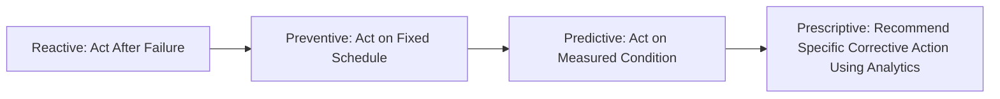
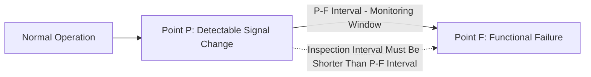
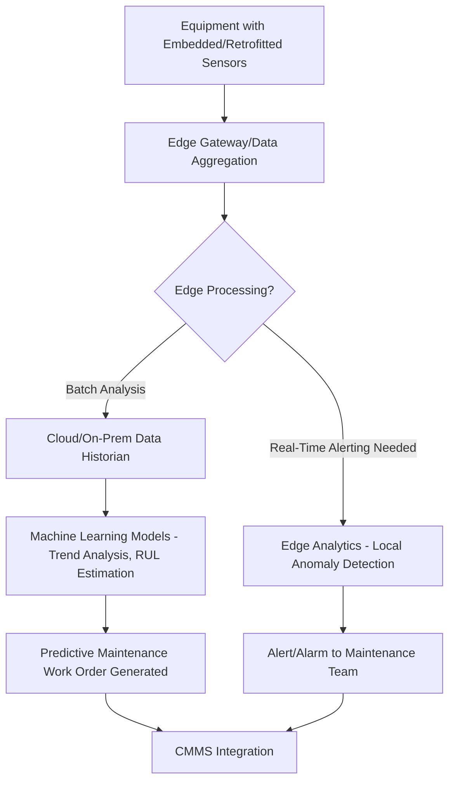
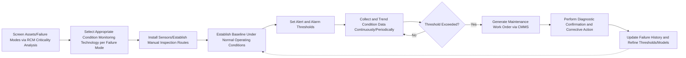

## Predictive Maintenance and Condition Monitoring

### Overview

Predictive maintenance (PdM) is a maintenance strategy that uses real-time or periodically collected condition data from operating equipment to detect early signs of degradation and predict impending failure, allowing maintenance intervention to be scheduled based on actual equipment condition rather than a fixed calendar/usage interval. Condition monitoring is the underlying data-collection discipline that makes predictive maintenance possible — continuously or periodically measuring physical parameters (vibration, temperature, oil quality, electrical signatures, acoustic emissions) that correlate with equipment health. Predictive maintenance represents the "on-condition task" category within the broader Reliability-Centered Maintenance decision framework, justified specifically when a detectable P-F interval exists for a given failure mode.

### Position in the Maintenance Strategy Spectrum

**Key Points**

- **Reactive maintenance**: act after failure occurs.
- **Preventive maintenance**: act on a fixed time/usage schedule regardless of actual condition.
- **Predictive maintenance**: act based on measured condition data indicating an impending failure, ideally timed just before functional failure but after the potential failure becomes detectable.
- **[Inference]** Predictive maintenance is generally positioned as capturing more of a component's genuine remaining useful life than fixed-interval preventive maintenance (since intervention timing responds to actual condition rather than a conservative average-case schedule), while still avoiding the unplanned downtime risk of pure reactive maintenance — though this advantage depends on having a reliable, sufficiently long P-F interval and accurate condition-monitoring technology for the specific failure mode in question.

### The P-F Curve Foundation

**Key Points**

- Predictive maintenance is only viable for failure modes with an identifiable **P-F interval** — the time between when a **potential failure (P)** becomes detectable via some measurable signal and when **functional failure (F)** actually occurs.
- The inspection or monitoring interval must be shorter than the P-F interval to reliably catch the warning sign before functional failure.
- Different failure modes and different monitoring technologies have vastly different typical P-F intervals — from months (e.g., certain bearing wear patterns detectable via vibration analysis) to hours or minutes (e.g., some thermal or electrical fault signatures) — meaning the appropriate monitoring frequency and technology selection is failure-mode-specific rather than universal.

### Core Condition Monitoring Technologies

**Key Points**

1. **Vibration Analysis**
   - Measures mechanical vibration signatures using accelerometers to detect bearing wear, misalignment, imbalance, looseness, and gear defects.
   - Analyzed in both time domain (overall vibration amplitude) and frequency domain (via Fast Fourier Transform, identifying specific fault frequencies associated with particular defect types).
   - Widely used on rotating equipment: motors, pumps, fans, compressors, turbines.
2. **Infrared Thermography**
   - Uses thermal imaging cameras to detect abnormal heat patterns indicating electrical connection problems, insulation breakdown, bearing friction, or fluid blockages.
   - Common in electrical switchgear inspection, motor condition assessment, and building/process heat-loss detection.
3. **Oil Analysis (Tribology)**
   - Analyzes lubricant samples for wear particle content (metal particulates indicating internal component wear), contamination (water, dirt), and degradation of lubricant chemical properties (viscosity change, additive depletion).
   - Common on gearboxes, engines, hydraulic systems, and large rotating machinery.
4. **Ultrasonic Analysis**
   - Detects high-frequency sound emissions associated with friction, leaks (compressed air, gas, vacuum systems), and early-stage bearing defects, often before vibration analysis would detect the same issue.
5. **Motor Current Signature Analysis (MCSA)**
   - Analyzes electrical current waveforms drawn by motors to detect rotor bar defects, bearing issues, and mechanical load anomalies without requiring physical access to the motor internals.
6. **Acoustic Emission Monitoring**
   - Detects transient stress waves generated by crack propagation, material fatigue, or structural defects, often used in structural health monitoring and pressure vessel inspection.
7. **Non-Destructive Testing (NDT) methods** (ultrasonic thickness testing, radiography, dye penetrant, magnetic particle inspection)
   - Used for periodic structural integrity assessment of pressure vessels, pipelines, and welded structures.

### Comparison of Condition Monitoring Technologies

| Technology | Primary Failure Modes Detected | Typical Equipment |
| --- | --- | --- |
| Vibration analysis | Bearing wear, misalignment, imbalance, gear defects | Rotating machinery (motors, pumps, turbines) |
| Infrared thermography | Electrical connection faults, insulation breakdown, friction heat | Switchgear, motors, process piping |
| Oil analysis | Internal wear, contamination, lubricant degradation | Gearboxes, engines, hydraulic systems |
| Ultrasonic analysis | Leaks, early bearing defects, electrical arcing | Compressed air/gas systems, bearings |
| Motor current signature analysis | Rotor bar defects, load/bearing anomalies | Electric motors |
| Acoustic emission | Crack propagation, structural fatigue | Pressure vessels, structural components |

### Data Architecture for Modern Predictive Maintenance (IIoT-Enabled)

**Key Points**

Modern predictive maintenance programs increasingly integrate **Industrial Internet of Things (IIoT)** sensor networks with cloud- or edge-based analytics platforms rather than relying solely on periodic manual inspection rounds.

**Key Architectural Components**

- **Sensors**: Vibration accelerometers, thermocouples/RTDs, oil particle counters, current transformers — generating continuous or periodic raw signal data.
- **Edge devices/gateways**: Aggregate and pre-process sensor data locally, sometimes performing initial anomaly detection to reduce data transmission volume and enable low-latency alerting.
- **Data historian/time-series database**: Stores high-frequency sensor data for trend analysis (e.g., specialized time-series databases are commonly used given the high-volume, timestamped nature of condition monitoring data).
- **Analytics layer**: Statistical process control charts, threshold-based alarming, and increasingly machine learning models (e.g., regression-based remaining useful life estimation, anomaly detection algorithms trained on historical failure patterns) to identify degradation trends and estimate time-to-failure.
- **CMMS/EAM integration**: Automatically generates maintenance work orders when condition thresholds are exceeded, closing the loop from data collection to maintenance action.

**[Inference]** The specific machine learning techniques and vendor platforms used for predictive analytics vary widely and evolve rapidly; organizations evaluating IIoT-based predictive maintenance platforms should verify current vendor documentation and case studies directly, since the competitive landscape and specific algorithmic approaches in this space are not stable enough to describe definitively without current sourcing.

### Remaining Useful Life (RUL) Estimation

**Key Points**

- A key output of advanced predictive maintenance analytics is an estimate of **Remaining Useful Life (RUL)** — the expected time or usage cycles remaining before a component is predicted to reach functional failure, based on its current condition trend.
- RUL estimation approaches range from simple trend extrapolation (linear or exponential fitting of a degradation parameter toward a failure threshold) to more sophisticated physics-based degradation models and machine learning approaches trained on historical run-to-failure data.
- **[Speculation]** The accuracy of RUL estimates is generally understood to improve as more historical run-to-failure data becomes available for a given failure mode and asset class, since data-driven models require sufficient examples of the full degradation-to-failure trajectory to calibrate reliably; however, specific accuracy figures are highly application-dependent and should not be generalized without reference to the specific system and dataset involved.

### Statistical Threshold Setting: Alarm Levels

Condition monitoring programs typically define multiple alarm thresholds against a baseline measurement:

$$Alert\ Threshold = Baseline + k_1 \sigma$$

$$Alarm\ Threshold = Baseline + k_2 \sigma$$

Where $\sigma$ represents the standard deviation of the monitored parameter under normal operating conditions, and $k_2 > k_1$ (alarm thresholds are set further from baseline than alert/watch thresholds), triggering escalating response protocols as the measured parameter deviates further from established normal operating ranges.

**Example**: A pump's baseline vibration velocity is 2.0 mm/s RMS with a normal operating standard deviation of 0.3 mm/s. An "alert" threshold might be set at baseline + $2\sigma$ = 2.6 mm/s (increased monitoring frequency), and an "alarm" threshold at baseline + $4\sigma$ = 3.2 mm/s (immediate maintenance action required).

### Cost-Benefit Considerations

**Key Points**

- Predictive maintenance requires upfront capital investment in sensors, monitoring equipment, and analytics infrastructure, plus ongoing costs for data management and specialized analyst/technician skills — costs that are not incurred under reactive or simple time-based preventive strategies.
- Justification typically depends on the criticality and cost consequence of the monitored failure mode: high-value, high-downtime-cost, safety-critical assets are the strongest candidates for predictive maintenance investment, since the cost of avoided unplanned failures must offset the monitoring infrastructure investment.
- **[Inference]** As IIoT sensor costs have declined and cloud analytics platforms have become more accessible, predictive maintenance has become economically viable for a broader range of equipment criticality levels than was historically the case when condition monitoring required expensive dedicated instrumentation and specialized on-site analysts — though the specific cost-effectiveness threshold for any given asset remains organization- and context-specific.

### Prescriptive Maintenance (Extension Beyond Predictive)

**Key Points**

- **Prescriptive maintenance** extends predictive maintenance by not only forecasting *when* a failure is likely to occur but also recommending the *specific corrective action* to take and its optimal timing, often incorporating operational constraints (production schedule, spare parts availability, labor availability) into the recommendation.
- **[Speculation]** This represents a further evolution of the maintenance analytics spectrum, moving from "what will happen" (predictive) to "what should be done about it" (prescriptive), typically requiring more sophisticated optimization and decision-support capabilities layered on top of the underlying predictive models; the maturity and adoption level of prescriptive maintenance capability varies considerably across industries and should be verified against current vendor/industry sources for any specific implementation context.

### Implementation Considerations

**Key Points**

- **Asset criticality screening** (often informed by RCM analysis) should precede predictive maintenance rollout, prioritizing failure modes with both a viable P-F interval and significant consequence severity.
- **Baseline establishment**: Condition monitoring requires an initial baseline period under known-good operating conditions to establish normal parameter ranges before deviation-based alerting becomes meaningful.
- **False alarm management**: Overly sensitive thresholds generate excessive false alarms, eroding maintenance team trust in the system ("alarm fatigue"); threshold calibration is an ongoing tuning process rather than a one-time setup.
- **Integration with CMMS/EAM systems**: Predictive maintenance delivers operational value only when condition alerts translate into actionable, tracked maintenance work orders, requiring integration between monitoring platforms and maintenance management systems.
- **Skills development**: Vibration analysis, oil analysis interpretation, and thermal imaging require specialized training/certification (e.g., vibration analyst certification levels are common in industry practice) for reliable diagnostic interpretation.

### Implementation Workflow

### Related Topics

- Reliability-Centered Maintenance (RCM) and the P-F curve
- Reactive versus preventive maintenance
- Total Productive Maintenance (TPM) and Overall Equipment Effectiveness (OEE)
- Industrial Internet of Things (IIoT) in operations
- Statistical Process Control (SPC)
- Remaining Useful Life (RUL) modeling approaches
- Computerized Maintenance Management Systems (CMMS) and Enterprise Asset Management (EAM)
- Machine learning applications in maintenance analytics