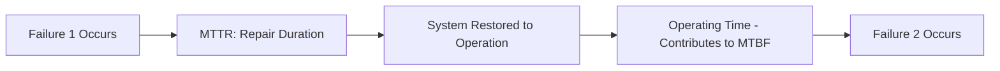
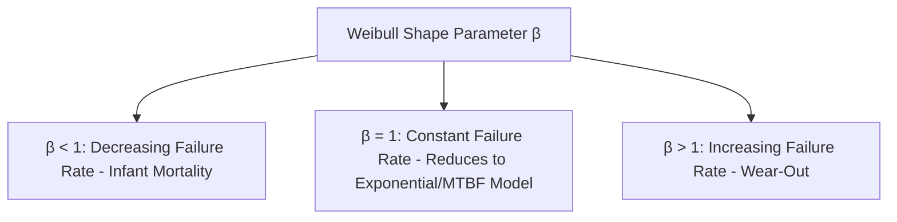
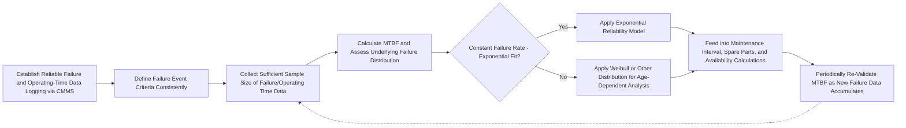

## Mean Time Between Failures Analysis

### Overview

Mean Time Between Failures (MTBF) is a fundamental reliability engineering metric that quantifies the average operating time between successive failures of a repairable system or component. It serves as a core input to maintenance strategy selection, spare parts planning, capacity/availability calculations, and reliability comparisons across equipment. MTBF is one of a family of related time-based reliability metrics, and correctly distinguishing between them (particularly MTBF versus MTTF, and MTBF versus MTTR) is essential to applying them appropriately in operations management analysis.

### Core Definition and Formula

**Key Points**

- MTBF applies specifically to **repairable** systems — assets that are restored to operation after a failure rather than discarded.
- MTBF is calculated as total operating time divided by the number of failures observed during that period.

$$MTBF = \frac{Total\ Operating\ Time}{Number\ of\ Failures}$$

**Worked Example**

A production machine operates for 5,000 hours over a review period and experiences 8 failures during that time.

$$MTBF = \frac{5000\ \text{hours}}{8\ \text{failures}} = 625\ \text{hours between failures}$$

**Key Points**

- MTBF is an **average**, not a guarantee — individual time-between-failure intervals for a specific unit will vary around this mean, sometimes considerably, depending on the underlying failure distribution.
- MTBF should be interpreted as a statistical property of a population of similar operating conditions and units, not a deterministic prediction for any single unit's next failure time.

### MTBF vs. MTTF vs. MTTR: Critical Distinctions

| Metric | Full Name | Applies To | Definition |
| --- | --- | --- | --- |
| MTBF | Mean Time Between Failures | Repairable systems | Average operating time between failures (includes only "up" time in the interval definition, depending on convention) |
| MTTF | Mean Time To Failure | Non-repairable items | Average time until failure for items that are discarded/replaced rather than repaired (e.g., light bulbs, single-use components) |
| MTTR | Mean Time To Repair | Repairable systems | Average time required to restore a failed system to operation (repair duration, not operating duration) |

**Key Points**

- **[Inference]** A common point of confusion in practice is conflating MTBF with MTTF; MTBF is technically appropriate only for repairable systems where "between failures" implies a repair-and-return-to-service cycle, while MTTF is the correct term for the average lifespan of items that are not repaired after failure — using these terms interchangeably can misrepresent the underlying reliability model being applied.
- Some technical conventions define MTBF as MTTF + MTTR (total cycle time from one failure to the next, including repair downtime), while others define it as operating time only, excluding repair downtime; **[Unverified as universally applicable]** — the specific convention used should always be confirmed against the source or standard being referenced, since inconsistent usage across industry and literature is common.

### Relationship to Availability

MTBF and MTTR combine to determine **inherent availability**, a standard reliability engineering metric:

$$Availability = \frac{MTBF}{MTBF + MTTR}$$

**Worked Example**

Using the earlier example (MTBF = 625 hours) with an average repair time (MTTR) of 5 hours:

$$Availability = \frac{625}{625 + 5} = \frac{625}{630} = 0.9921\ (99.21\%)$$

**[Inference]** This formula demonstrates that availability can be improved either by increasing MTBF (making the system fail less often, e.g., through improved reliability design or predictive maintenance) or by decreasing MTTR (repairing faster, e.g., through better spare parts availability, diagnostic tools, or technician training) — meaning maintenance strategy decisions can target either lever depending on which is more cost-effective in a given context.

### Failure Rate and Its Relationship to MTBF

The **failure rate** ($\lambda$) is the reciprocal of MTBF, most directly applicable when failures follow an exponential distribution (i.e., a constant failure rate over time, consistent with the "useful life" phase of the bathtub curve):

$$\lambda = \frac{1}{MTBF}$$

**Worked Example**

$$\lambda = \frac{1}{625\ \text{hours}} = 0.0016\ \text{failures per hour}$$

**Reliability Function (Exponential Distribution)**

Under the constant-failure-rate (exponential) assumption, the probability that a system survives without failure beyond time $t$ is:

$$R(t) = e^{-\lambda t} = e^{-t/MTBF}$$

**Worked Example**: Probability the machine (MTBF = 625 hours) survives at least 300 hours without failure:

$$R(300) = e^{-300/625} = e^{-0.48} \approx 0.619\ (61.9\%)$$

**[Inference]** This exponential reliability model assumes a constant failure rate, which corresponds to the "useful life" phase of the bathtub curve; it is not appropriate for components in the wear-out phase (increasing failure rate) or infant mortality phase (decreasing failure rate), where other distributions (commonly the Weibull distribution) are used instead to more accurately model failure probability over time.

### The Weibull Distribution for More Accurate Modeling

**Key Points**

- The exponential distribution's constant failure rate assumption is a simplification; many real components exhibit age-dependent failure behavior better modeled using the **Weibull distribution**, characterized by a shape parameter ($\beta$) and scale parameter ($\eta$).
- $\beta < 1$ indicates a decreasing failure rate (infant mortality phase); $\beta = 1$ reduces to the exponential distribution (constant failure rate); $\beta > 1$ indicates an increasing failure rate (wear-out phase).
- **[Inference]** Because MTBF as a single average number does not capture *how* failure rate changes over time, reliability engineers analyzing wear-out or infant-mortality failure modes typically supplement or replace simple MTBF calculations with Weibull analysis to more accurately characterize failure behavior and determine appropriate maintenance intervals — MTBF alone can be misleading when applied to non-constant-failure-rate components.

### Data Collection Requirements

**Key Points**

- Accurate MTBF calculation requires reliable failure event logging, typically captured through a **CMMS (Computerized Maintenance Management System)**, including precise timestamps of failure occurrence, repair completion, and total operating hours (not just calendar time, since equipment may not operate continuously).
- **Censored data** (units still operating without failure at the time of analysis) must be handled appropriately in reliability calculations — excluding or naively treating censored units as failures at the observation cutoff can bias MTBF estimates; formal survival analysis techniques exist to properly account for censored observations.
- Sample size matters: MTBF estimates based on a small number of observed failures carry substantial statistical uncertainty; confidence intervals around an MTBF estimate should be considered, particularly for high-reliability components where few failures are observed over the analysis period.

### Common Misapplications and Limitations

**Key Points**

- **Misinterpreting MTBF as a warranty or guaranteed lifespan**: an MTBF of 10,000 hours does not mean every unit will operate exactly 10,000 hours before failing; some units will fail much earlier, some much later, depending on the underlying failure distribution's variance.
- **Applying a single population-average MTBF to an individual unit's specific maintenance decision** without considering that unit's actual operating history, environment, or load profile — since MTBF is an aggregate statistic across a population/time period, not a unit-specific prediction.
- **Ignoring operating context differences**: MTBF figures reported by manufacturers are typically derived under specific test conditions (temperature, load, duty cycle) that may not match actual field operating conditions, potentially producing systematically different real-world MTBF than the specification sheet value.
- **Treating MTBF as sufficient on its own for maintenance strategy decisions**: as established in Reliability-Centered Maintenance methodology, the *consequence* of failure (safety, operational, cost) matters as much as the *frequency* of failure; a very reliable (high MTBF) component with catastrophic failure consequences may still warrant more intensive monitoring or redundancy than a less reliable component with negligible failure consequences.

### Application in Maintenance and Operations Decisions

**Key Points**

1. **Preventive maintenance interval setting**: MTBF (or more precisely, the underlying failure distribution) informs the selection of maintenance intervals intended to service components before they are statistically likely to fail.
2. **Spare parts inventory planning**: Expected failure frequency (derived from MTBF) drives spare parts stocking level and reorder point decisions, balancing holding cost against stockout/downtime risk.
3. **Reliability comparison across equipment/vendors**: MTBF is commonly used as a standardized metric for comparing the reliability of competing equipment options during procurement decisions.
4. **System-level reliability calculations**: For systems composed of multiple components, individual component MTBFs (or failure rates) combine according to system architecture (series vs. parallel/redundant configurations) to determine overall system reliability and availability.
5. **Input to OEE and availability calculations**: MTBF (alongside MTTR) directly feeds the availability component of Overall Equipment Effectiveness calculations used in Total Productive Maintenance programs.

### Series and Parallel System Reliability (Brief Extension)

**Key Points**

- For components in **series** (system fails if any one component fails), system failure rate is approximately the sum of individual component failure rates: $\lambda_{system} \approx \lambda_1 + \lambda_2 + ... + \lambda_n$, meaning system MTBF is generally lower than any individual component's MTBF.
- For components in **parallel/redundant configuration** (system fails only if all redundant components fail), system reliability is substantially higher than any individual component's reliability, since redundancy provides backup capacity if a primary component fails.
- **[Inference]** This is a key rationale for redundancy design in safety-critical or high-consequence systems: rather than solely relying on improving individual component MTBF, adding parallel redundancy can achieve a much higher effective system-level MTBF, though at the cost of additional capital investment and complexity.

### Implementation Workflow

### Related Topics

- Mean Time To Repair (MTTR) and availability calculations
- Reliability-Centered Maintenance (RCM) and the P-F curve
- Reactive versus preventive maintenance
- Weibull distribution and reliability engineering statistics
- Total Productive Maintenance (TPM) and Overall Equipment Effectiveness (OEE)
- Predictive maintenance and condition monitoring
- Spare parts inventory management
- System reliability: series and parallel configurations