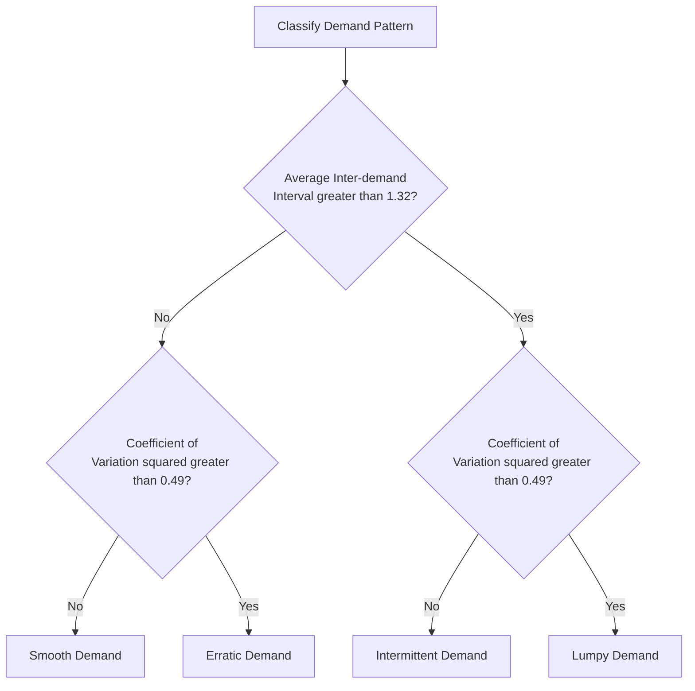
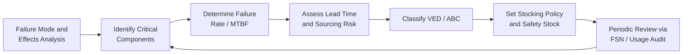

## Spare Parts Inventory Strategy

### Overview

Spare parts inventory strategy governs how organizations stock, classify, and manage replacement components to support maintenance activities while balancing capital tied up in inventory against the risk and cost of equipment downtime. Unlike raw materials or finished goods inventory, spare parts demand is typically intermittent, lumpy, and driven by failure patterns rather than sales forecasts, requiring specialized inventory models distinct from standard supply chain approaches.

### Why Spare Parts Inventory Is Different

**Key Points**

- Demand is often intermittent or "lumpy" — long periods of zero demand punctuated by sudden requirements, which breaks standard forecasting methods like moving averages or exponential smoothing that assume continuous demand
- Consequence of stockout is often asymmetric and severe: a $5 gasket stockout can halt a $2 million production line
- Many parts have long lead times, especially OEM-specific or custom-fabricated components
- Obsolescence risk exists on both ends: equipment may be retired before parts are consumed, or parts may become unavailable as older equipment ages
- Criticality does not correlate with cost — a low-cost part can be mission-critical, while an expensive part may be non-critical if redundancy exists

### Core Classification Frameworks

#### Criticality-Based Classification (Vital-Essential-Desirable / VED)

| Class | Description | Stocking Policy |
| --- | --- | --- |
| Vital | Failure causes immediate safety hazard, environmental incident, or total production stoppage with no alternative | Always stock; redundant sourcing where feasible |
| Essential | Failure causes significant but not total disruption; workarounds exist temporarily | Stock based on lead time and criticality scoring |
| Desirable | Failure causes minor inconvenience; substitutes or delay is tolerable | Stock minimally or order on demand |

#### ABC Analysis (Value-Based)

Classifies parts by annual consumption value (unit cost × annual usage), typically following a Pareto distribution:

- **A items**: ~10-20% of SKUs, ~70-80% of inventory value — tight control, frequent review
- **B items**: ~20-30% of SKUs, ~15-25% of value — moderate control
- **C items**: ~50-70% of SKUs, ~5-10% of value — loose control, bulk ordering acceptable

#### Combined VED-ABC Matrix

Organizations typically cross-reference VED and ABC to avoid the trap of deprioritizing a low-cost (C) but vital (V) part:

|  | A (high value) | B (medium value) | C (low value) |
| --- | --- | --- | --- |
| **V (vital)** | Tight control, safety stock mandatory | Tight control | Stock generously — cost is trivial relative to risk |
| **E (essential)** | Moderate control, review lead times | Standard reorder policy | Bulk stock |
| **D (desirable)** | Order on demand or JIT | Minimal stock | Minimal or no stock |

#### FSN Analysis (Fast/Slow/Non-Moving)

Classifies by consumption frequency to identify obsolete or dead stock:

- **Fast-moving**: Regular consumption, suitable for continuous review systems
- **Slow-moving**: Infrequent consumption, candidates for consignment or pooled inventory
- **Non-moving**: No consumption in a defined period (e.g., 12-24 months); candidates for disposal or return to supplier

### Demand Forecasting for Intermittent Demand

Standard forecasting models perform poorly on spare parts because most periods show zero demand. Specialized methods include:

**Croston's Method**

Separates the demand series into two components: the size of non-zero demand and the interval between non-zero demands, each smoothed separately using exponential smoothing.

$$\hat{Z}_t = \alpha Z_t + (1-\alpha)\hat{Z}_{t-1}$$

$$\hat{p}_t = \alpha p_t + (1-\alpha)\hat{p}_{t-1}$$

$$\hat{Y}_t = \frac{\hat{Z}_t}{\hat{p}_t}$$

Where $Z_t$ is the demand size when demand occurs, $p_t$ is the inter-demand interval, and $\hat{Y}_t$ is the forecasted demand rate per period.

**Syntetos-Boylan Approximation (SBA)**

A bias-corrected variant of Croston's method, since Croston's original formulation is known to be biased. SBA applies a correction factor:

$$\hat{Y}_t^{SBA} = \left(1 - \frac{\alpha}{2}\right)\frac{\hat{Z}_t}{\hat{p}_t}$$

[Inference] The choice between Croston, SBA, and other intermittent-demand methods (e.g., Teunter-Syntetos-Babai) typically depends on the specific demand pattern (intermittent, erratic, lumpy, or smooth) and should be validated against historical fill-rate performance rather than assumed universally superior.

**Demand Pattern Classification (Syntetos-Boylan-Croston Categorization)**

### Inventory Control Models

#### Reorder Point (ROP) with Safety Stock

$$ROP = (d \times LT) + SS$$

Where $d$ is average demand rate per period, $LT$ is lead time, and $SS$ is safety stock.

$$SS = Z \times \sigma_{LT}$$

Where $Z$ is the service level factor (from the standard normal distribution) and $\sigma_{LT}$ is the standard deviation of demand during lead time.

For variable lead time and variable demand:

$$\sigma_{LT} = \sqrt{LT \times \sigma_d^2 + d^2 \times \sigma_{LT}^2}$$

**Example**

A vital bearing has average monthly demand $d = 2$ units, demand standard deviation $\sigma_d = 1.5$, lead time $LT = 3$ months, and a target service level of 95% ($Z = 1.65$):

$$\sigma_{LT} = \sqrt{3 \times (1.5)^2} = \sqrt{6.75} \approx 2.6$$

$$SS = 1.65 \times 2.6 \approx 4.3 \rightarrow 5 \text{ units}$$

$$ROP = (2 \times 3) + 5 = 11 \text{ units}$$

#### Economic Order Quantity (EOQ) — Adapted for Spare Parts

$$EOQ = \sqrt{\frac{2DS}{H}}$$

Where $D$ is annual demand, $S$ is ordering cost per order, and $H$ is annual holding cost per unit.

[Unverified] Classic EOQ assumes continuous, deterministic demand, which is frequently violated for spare parts; practitioners commonly adapt EOQ outputs with judgment or use it only for fast-moving C-class consumables (e.g., filters, lubricants) rather than for critical, slow-moving spares.

#### (s, S) Periodic Review Policy

Used for parts reviewed on a fixed schedule rather than continuously. When inventory position drops to or below $s$ (reorder point) at a review interval, an order is placed to bring inventory up to $S$ (order-up-to level).

#### Poisson-Based Models for Low-Demand Critical Spares

For vital parts with very low, discrete demand rates (e.g., 1-3 units/year), demand is often modeled as a Poisson process rather than using normal-distribution safety stock formulas, since the normal approximation breaks down at low volumes.

$$P(X = k) = \frac{e^{-\lambda}\lambda^k}{k!}$$

Where $\lambda$ is the expected number of failures during the lead time period and $k$ is the number of units demanded. Stock level is then set to cover a target cumulative probability (e.g., 95th percentile of the Poisson distribution).

### Cost Structure and Total Cost Optimization

**Key Points**

- **Holding costs**: capital cost, storage, insurance, obsolescence risk, deterioration (typically 15-30% of item value annually)
- **Ordering/procurement costs**: administrative processing, expediting fees, transportation
- **Stockout costs**: production downtime, expedited emergency shipping, lost throughput, potential safety/compliance exposure — often the dominant cost for critical spares and difficult to quantify precisely
- **Obsolescence costs**: capital write-off when equipment is decommissioned or parts superseded

The total cost function balances these competing costs:

$$TC = \frac{D}{Q}S + \frac{Q}{2}H + P(\text{stockout}) \times C_{stockout}$$

For vital parts, the stockout cost term dominates the equation to the point that minimizing holding cost becomes secondary to maximizing availability — justifying stocking levels that would appear "uneconomical" under pure EOQ logic.

### Strategic Approaches by Part Type

#### Insurance Spares (Capital/Strategic Spares)

High-cost, long-lead-time, low-failure-probability parts (e.g., spare transformers, gearboxes, motors) held specifically to mitigate catastrophic downtime risk rather than routine consumption. Decision typically driven by a risk-cost tradeoff analysis rather than standard inventory formulas:

$$\text{Stock if: } C_{holding} < P(\text{failure}) \times C_{downtime}$$

#### Rotable/Repairable Spares

Components removed on failure, repaired or overhauled, and returned to stock rather than discarded (e.g., pumps, motors, hydraulic cylinders). Requires tracking a repair cycle/turnaround time in addition to standard lead time, and inventory sizing must account for units in the repair pipeline:

$$\text{Rotable Pool Size} = d \times (LT_{repair} + \text{buffer})$$

#### Consumables

Filters, gaskets, lubricants, fasteners — high-frequency, low-cost, low-risk items suited to standard reorder point/EOQ methods, vendor-managed inventory (VMI), or kanban-style two-bin systems.

#### Consignment and Pooled Inventory Arrangements

For expensive, slow-moving parts, organizations reduce carrying costs by:

- **Consignment stock**: supplier retains ownership until the part is consumed, shifting holding cost to the vendor
- **Pooling**: multiple sites or organizations (e.g., within an industry consortium) share a common spare parts pool, reducing aggregate safety stock needed while maintaining the same service level, since pooled demand variability is proportionally lower than the sum of individual variabilities

$$\sigma_{pooled} = \sqrt{\sum_{i=1}^{n}\sigma_i^2} < \sum_{i=1}^{n}\sigma_i$$

### Integration with Maintenance Strategy

#### Reliability-Centered Maintenance (RCM) Linkage

Spare parts strategy should be derived from failure mode data rather than set independently:

#### CMMS/EAM Integration

Modern Computerized Maintenance Management Systems (CMMS) and Enterprise Asset Management (EAM) platforms link work order history directly to parts consumption, enabling:

- Automated reorder triggers tied to actual maintenance demand rather than generic forecasts
- Bill of Materials (BOM) linkage between equipment and required spares
- Cross-referencing of interchangeable parts across equipment types to reduce duplicate SKUs
- Usage-based reliability feedback (e.g., a spike in a part's consumption may signal an emerging equipment reliability issue)

### Key Performance Indicators

| Metric | Formula/Description | Purpose |
| --- | --- | --- |
| Fill Rate | (Orders fulfilled from stock) / (Total orders) | Measures service level achieved |
| Inventory Turnover | Annual consumption value / Average inventory value | Measures capital efficiency |
| Stockout Rate | Number of stockout incidents / Total demand events | Measures risk exposure |
| Obsolete Inventory % | Value of non-moving stock / Total inventory value | Measures capital at risk |
| Carrying Cost Ratio | Annual holding cost / Average inventory value | Measures cost efficiency |
| MTTR Impact | Downtime attributable to parts unavailability | Links inventory to reliability outcomes |

### Common Pitfalls

**Key Points**

- Applying standard ABC value-based prioritization without overlaying criticality, causing low-cost vital parts to be under-stocked
- Using continuous-demand forecasting (e.g., simple moving average) on intermittent demand data, systematically understating variability and safety stock needs
- Failing to audit for obsolete stock tied to decommissioned equipment, inflating carrying costs indefinitely
- Decentralized, siloed inventories across plant locations preventing pooling benefits
- Treating OEM-recommended spares lists as static rather than updating them as failure data accumulates

### Related Topics

- Reliability-Centered Maintenance (RCM) and Failure Mode and Effects Analysis (FMEA)
- Total Productive Maintenance (TPM) and Overall Equipment Effectiveness (OEE)
- Vendor-Managed Inventory (VMI) and consignment stock agreements
- CMMS/EAM system selection and implementation
- Preventive vs. predictive vs. reactive maintenance strategy selection
- Supply chain risk management and single-source dependency mitigation
- Inventory pooling and multi-echelon inventory optimization