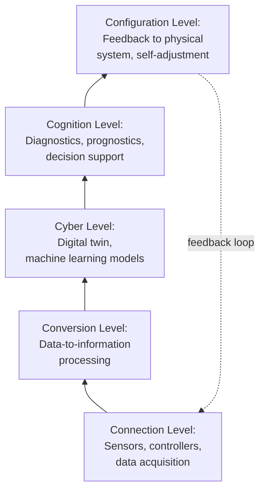
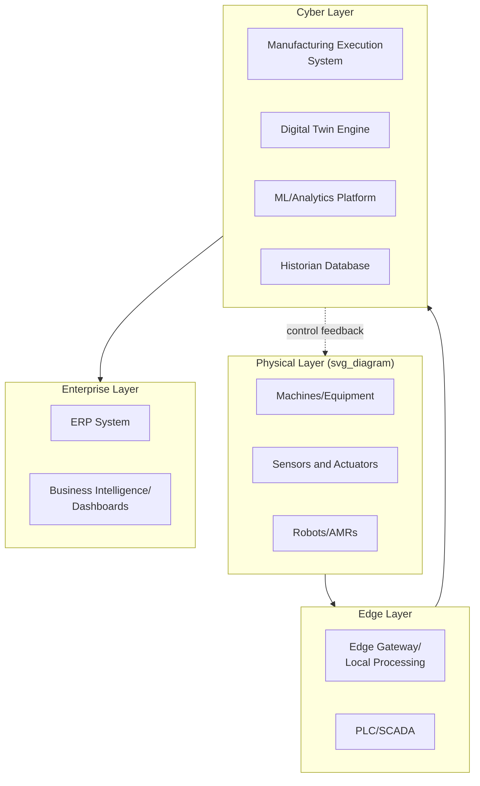

## Smart Manufacturing and Cyber-Physical Systems

### Overview

Smart manufacturing integrates real-time data, advanced automation, and interconnected computational systems to create adaptive, self-optimizing production environments. Cyber-Physical Systems (CPS) form the technical backbone of this paradigm — engineered systems in which computational algorithms and physical processes are tightly integrated through networks of embedded sensors, actuators, and control systems that continuously monitor and influence physical operations. This convergence underpins the broader Industry 4.0 movement, distinguishing it from earlier automation eras by emphasizing bidirectional feedback between the digital and physical domains rather than one-directional control.

### Foundational Concepts

#### Cyber-Physical Systems (CPS) Definition

A CPS integrates three core layers:

- **Physical layer**: machinery, sensors, actuators, and material flows
- **Cyber layer**: computation, data processing, modeling, and decision algorithms
- **Communication/Network layer**: the connective infrastructure enabling data exchange between physical and cyber components in near-real-time

**Key Points**

- CPS differs from traditional embedded systems by emphasizing networked interaction and feedback loops rather than isolated, standalone control
- CPS enables closed-loop control where physical outcomes continuously inform and adjust computational models
- The 5C architecture (Connection, Conversion, Cyber, Cognition, Configuration) is a widely referenced conceptual model for implementing CPS in manufacturing, originally proposed by Lee, Bagheri, and Kao (2015)

#### The 5C Architecture

### Core Enabling Technologies

#### Industrial Internet of Things (IIoT)

Networks of sensors and devices embedded in machinery and production lines that continuously capture operational data (vibration, temperature, pressure, throughput, energy consumption) and transmit it via industrial communication protocols.

**Key Points**

- Common protocols include OPC-UA (Open Platform Communications Unified Architecture), MQTT (Message Queuing Telemetry Transport), and Modbus TCP/IP
- OPC-UA is widely adopted as a platform-independent, service-oriented architecture standard for industrial interoperability, distinguishing it from legacy proprietary protocols
- Edge computing is frequently paired with IIoT to process data locally before transmission, reducing latency and bandwidth demands compared to sending all raw data to centralized cloud systems

#### Digital Twins

A digital twin is a virtual representation of a physical asset, process, or system that is synchronized with its physical counterpart via real-time data feeds, enabling simulation, monitoring, and predictive analysis without disrupting actual operations.

**Digital Twin Fidelity Levels**

| Level | Description | Typical Use Case |
| --- | --- | --- |
| Digital Model | Static virtual representation, no automated data exchange | Initial design simulation |
| Digital Shadow | One-way automatic data flow from physical to virtual | Real-time monitoring/dashboards |
| Digital Twin | Bidirectional data flow; virtual changes can influence physical operation | Closed-loop optimization, predictive control |

[Inference] The specific boundary between "digital shadow" and "full digital twin" implementations varies by vendor and industry usage, since the terminology is not universally standardized across all literature.

#### Industrial AI and Machine Learning

Applied to manufacturing contexts primarily for:

- **Predictive maintenance**: forecasting equipment failure using sensor time-series data (vibration analysis, thermal imaging, acoustic emissions)
- **Quality inspection**: computer vision systems detecting defects at higher speed and consistency than manual inspection
- **Process optimization**: reinforcement learning and optimization algorithms adjusting process parameters (e.g., temperature, feed rate) in real-time to maximize yield or minimize energy use
- **Demand forecasting and production scheduling**: integrating external demand signals with production capacity data

#### Additive Manufacturing (3D Printing) Integration

Increasingly integrated into smart factories for rapid prototyping, tooling, and low-volume/high-complexity part production, often coordinated through the same MES (Manufacturing Execution System) that manages conventional production lines.

#### Autonomous Mobile Robots (AMRs) and Automated Guided Vehicles (AGVs)

Used for intra-factory material transport. AMRs use onboard sensors (LiDAR, cameras) and SLAM (Simultaneous Localization and Mapping) algorithms for dynamic, obstacle-aware navigation, distinguishing them from AGVs, which typically follow fixed physical or virtual paths (e.g., magnetic strips, wire guidance).

#### Collaborative Robots (Cobots)

Robots designed to operate safely alongside human workers without the physical guarding traditionally required for industrial robots, typically incorporating force-limiting joints, vision-based safety zones, and compliance with safety standards such as ISO/TS 15066.

### Architecture of a Smart Manufacturing System

This layered structure generally aligns with the ISA-95 automation pyramid, extended for Industry 4.0 to allow more direct, bidirectional data flows across levels rather than strictly hierarchical, one-way reporting.

### The ISA-95 / Automation Pyramid Context

| Level | Function | Typical Systems |
| --- | --- | --- |
| Level 4 | Business planning and logistics | ERP |
| Level 3 | Manufacturing operations management | MES |
| Level 2 | Supervisory control | SCADA |
| Level 1 | Basic control | PLC, DCS |
| Level 0 | Physical process | Sensors, actuators |

**Key Points**

- Traditional ISA-95 assumes strict hierarchical data flow between levels
- Smart manufacturing architectures increasingly flatten this hierarchy, allowing Level 0/1 data to flow directly to cloud analytics platforms (Level 4+) via edge gateways, bypassing intermediate layers for specific use cases like predictive maintenance

### Implementation Considerations

#### Data Infrastructure Requirements

- **Time-series databases** (e.g., InfluxDB, TimescaleDB) optimized for high-frequency sensor data ingestion
- **Data historians** for long-term storage and trend analysis of process variables
- **Interoperability standards** to unify data from heterogeneous legacy equipment and modern IIoT devices — a common practical challenge given the long lifecycle of industrial equipment (often 15-30 years) relative to IT refresh cycles

#### Cybersecurity in CPS

The convergence of IT (Information Technology) and OT (Operational Technology) networks introduces security exposure that did not exist when industrial control systems were physically isolated ("air-gapped").

**Key Points**

- IEC 62443 is a widely referenced standard series specifically addressing industrial automation and control systems (IACS) security
- Network segmentation (e.g., using the Purdue Enterprise Reference Architecture as a conceptual guide) is commonly recommended to limit lateral movement between IT and OT networks
- Legacy OT equipment often lacks native security features (encryption, authentication) since it was designed for isolated environments, requiring compensating controls at the network layer
- [Inference] The specific security architecture appropriate for a given facility depends heavily on its risk profile, regulatory context, and existing infrastructure, and should be assessed by qualified OT security specialists rather than applying a generic template

#### Change Management and Workforce Implications

- Requires workforce upskilling toward data literacy, systems thinking, and human-machine collaboration rather than purely manual or mechanical skill sets
- Organizational resistance is a frequently cited barrier to Industry 4.0 adoption, often exceeding purely technical implementation challenges
- Maintenance and operations roles increasingly shift from reactive/scheduled tasks toward oversight of predictive and prescriptive analytics outputs

### Relationship to Broader Industry 4.0 Pillars

Smart manufacturing and CPS function as the operational core connecting several adjacent Industry 4.0 concepts:

| Related Concept | Relationship to CPS/Smart Manufacturing |
| --- | --- |
| Big Data Analytics | Processes the high-volume data generated by CPS sensors |
| Cloud/Edge Computing | Provides the computational infrastructure for CPS data processing |
| Additive Manufacturing | A production method integrated within smart factory workflows |
| Horizontal/Vertical Integration | The interoperability principle underlying CPS communication across supply chain and organizational levels |
| Simulation | Underlies digital twin modeling and virtual commissioning |

### Example: Predictive Maintenance Use Case

A CNC machine equipped with vibration and temperature sensors streams data via an OPC-UA gateway to an edge device, which performs initial signal filtering (Conversion level). Processed features are sent to a cloud-based machine learning model (Cyber level) trained to detect bearing degradation patterns. When the model's anomaly score crosses a threshold, it triggers a maintenance work order in the CMMS (Cognition level) and can automatically adjust the machine's operating speed to reduce further stress until maintenance occurs (Configuration level) — illustrating the closed-loop nature of the 5C architecture.

### Common Pitfalls

**Key Points**

- Pursuing sensor and data collection deployment without a clear analytics or decision-making objective, resulting in data accumulation without actionable insight
- Underestimating IT/OT integration complexity, particularly with legacy equipment lacking digital interfaces
- Treating digital transformation as a purely technological initiative rather than one requiring parallel organizational and process changes
- Insufficient cybersecurity planning when connecting previously isolated OT networks to IT/cloud infrastructure

### Related Topics

- Industrial Internet of Things (IIoT) protocols and architecture
- Digital twin modeling and simulation techniques
- Predictive and prescriptive maintenance analytics
- Manufacturing Execution Systems (MES) and ERP integration
- OT/IT cybersecurity frameworks (IEC 62443, Purdue Model)
- Additive manufacturing and hybrid production systems
- Human-robot collaboration and cobot safety standards
- Big data analytics and edge computing in manufacturing