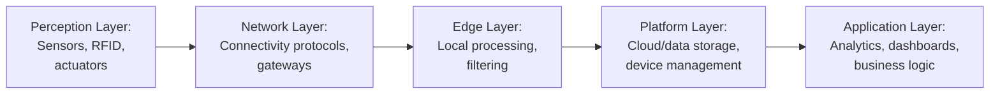
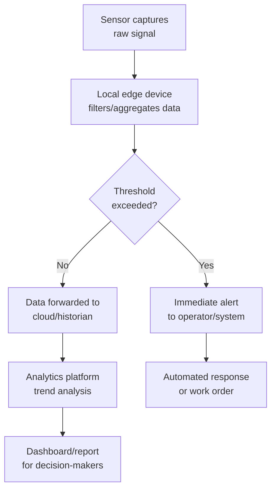

## Internet of Things Applications in Operations

### Overview

The Internet of Things (IoT) in operations refers to networks of physical devices — sensors, actuators, controllers, and connected equipment — that collect, transmit, and act on data to improve visibility, efficiency, and responsiveness across production, logistics, and asset management functions. In an operations management context, IoT serves primarily as a data acquisition and control layer that feeds analytics, automation, and decision-making systems, distinguishing it from consumer IoT applications focused on convenience or lifestyle use cases.

### Core Architecture

#### IoT System Layers

**Key Points**

- The perception layer captures physical-world data through sensors (temperature, pressure, vibration, location, RFID tags) and executes commands through actuators
- The network layer handles data transmission using wired or wireless protocols suited to the operational environment
- Edge processing reduces the volume of data sent upstream and lowers latency for time-sensitive decisions, compared to routing all raw data to a centralized cloud
- The application layer translates processed data into operational outputs: alerts, dashboards, automated triggers, or inputs to enterprise systems (ERP, MES, WMS)

#### Common Connectivity Protocols

| Protocol | Typical Use Case | Characteristics |
| --- | --- | --- |
| MQTT | Lightweight sensor-to-cloud messaging | Low bandwidth, publish-subscribe model |
| OPC-UA | Industrial equipment interoperability | Platform-independent, service-oriented |
| Zigbee/Z-Wave | Short-range mesh networking | Low power, suited to dense sensor deployments |
| LoRaWAN | Long-range, low-power wide-area | Suited to outdoor/remote asset tracking |
| 5G/Cellular | High-bandwidth mobile connectivity | Supports high-density, low-latency applications |
| RFID/NFC | Item-level identification and tracking | Passive or active tagging for inventory/logistics |

[Inference] Protocol selection in practice depends on tradeoffs between range, power consumption, bandwidth, and existing infrastructure at a given facility, rather than any single protocol being universally optimal.

### Applications by Operations Function

#### Predictive and Condition-Based Maintenance

Sensors continuously monitor equipment health indicators (vibration signatures, thermal profiles, oil analysis, acoustic emissions) to detect degradation before failure occurs, shifting maintenance from time-based schedules to condition-triggered interventions.

**Example**

A pump fitted with a vibration sensor streams accelerometer data to an edge gateway. The gateway computes a Fast Fourier Transform (FFT) to identify frequency signatures associated with bearing wear. When amplitude at the characteristic frequency exceeds a calibrated threshold, the system generates a maintenance work order automatically in the CMMS, typically days or weeks before a failure would otherwise occur.

#### Asset Tracking and Inventory Visibility

RFID tags, Bluetooth Low Energy (BLE) beacons, and GPS trackers provide real-time location and status data for tools, materials, work-in-progress (WIP), and finished goods.

**Key Points**

- Reduces manual cycle counting and improves inventory record accuracy
- Enables real-time WIP tracking on production floors, supporting more accurate throughput and bottleneck analysis
- Supports automated replenishment triggers when RFID-tagged bins reach predefined thresholds (a digital evolution of kanban systems)

#### Supply Chain and Logistics Visibility

IoT-enabled tracking across the supply chain provides continuous shipment location, condition (temperature, humidity, shock), and status data, particularly valuable for cold chain logistics (pharmaceuticals, food) where condition monitoring is a regulatory or quality requirement.

#### Energy Management

Smart meters and sensors monitor real-time energy consumption at the equipment, line, or facility level, enabling:

- Identification of energy waste (e.g., equipment left idling)
- Demand response participation (adjusting consumption in response to utility pricing signals)
- Correlation of energy use with production output to identify efficiency opportunities

#### Quality Control and Process Monitoring

In-line sensors and machine vision systems continuously monitor process parameters (temperature, pressure, dimensional tolerances) and product quality characteristics, enabling real-time statistical process control (SPC) rather than periodic sampling-based inspection.

$$UCL = \bar{X} + 3\frac{\sigma}{\sqrt{n}}, \quad LCL = \bar{X} - 3\frac{\sigma}{\sqrt{n}}$$

Continuous IoT sensor feeds allow control charts to be updated in near-real-time rather than at scheduled sampling intervals, enabling faster detection of process drift.

#### Worker Safety and Environmental Monitoring

Wearable sensors and environmental IoT devices monitor conditions such as gas concentrations, noise levels, or worker fatigue indicators (e.g., via heart rate or motion sensors), triggering alerts when thresholds indicating unsafe conditions are exceeded.

#### Fleet and Vehicle Telematics

GPS and onboard diagnostic (OBD) sensors on vehicles or mobile equipment provide route optimization data, fuel consumption tracking, and predictive maintenance signals for transportation and material-handling fleets.

### Data Flow Example: End-to-End IoT Operations Pipeline

### Implementation Considerations

#### Interoperability and Legacy Integration

Many operations environments contain equipment spanning multiple generations of technology. Retrofit solutions — such as external vibration sensors or current clamps added to older machinery — are commonly used to extend IoT visibility to equipment that lacks native digital interfaces, rather than requiring full equipment replacement.

#### Data Volume and Infrastructure

High-frequency sensor networks generate substantial data volumes, requiring:

- Edge computing to filter and pre-process data before transmission, reducing bandwidth and storage requirements
- Time-series databases optimized for high-ingestion-rate sensor data
- Clear data retention policies balancing analytical value against storage cost

#### Cybersecurity Considerations

Connecting operational equipment to networks introduces security exposure. Practices commonly recommended include network segmentation between IT and OT systems, device authentication, and encrypted data transmission — consistent with frameworks such as IEC 62443 for industrial systems.

#### Return on Investment Considerations

**Key Points**

- IoT deployments are frequently justified through downtime reduction, labor efficiency, and inventory accuracy improvements rather than a single dominant benefit
- Pilot programs on a limited scope (single line or asset class) are commonly used to validate value before facility-wide rollout, given the capital and integration effort involved
- [Speculation] Return on investment timelines vary considerably by industry, use case, and existing digital maturity, and generic payback-period figures should be treated cautiously without a specific application context

### Common Pitfalls

**Key Points**

- Deploying sensors broadly without a defined analytics objective, resulting in data collection without corresponding operational action
- Underestimating integration effort with legacy equipment and existing enterprise systems (ERP, MES)
- Insufficient attention to network security when bridging previously isolated operational technology to broader networks
- Failing to align IoT data outputs with actual decision-making workflows, so alerts or dashboards exist but do not change behavior on the floor

### Related Topics

- Predictive maintenance analytics and condition monitoring techniques
- Digital twins and cyber-physical systems
- Warehouse management systems (WMS) and automated inventory control
- Statistical process control (SPC) and real-time quality monitoring
- OT/IT cybersecurity and network segmentation
- Edge computing versus cloud computing architecture tradeoffs
- Supply chain visibility and cold chain logistics monitoring