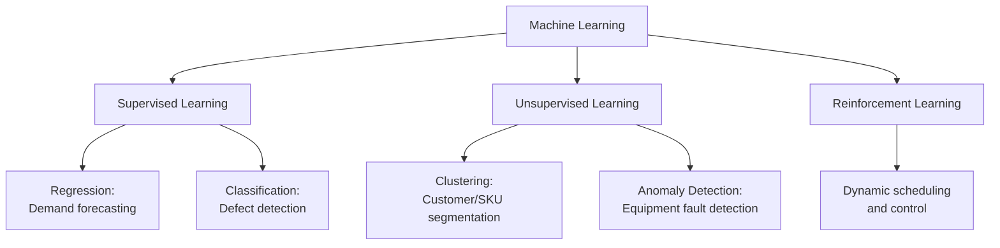
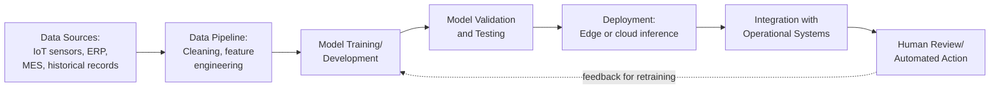

## Artificial Intelligence and Machine Learning in Operations

### Overview

Artificial Intelligence (AI) and Machine Learning (ML) in operations management encompass computational methods that learn patterns from operational data to support forecasting, optimization, quality control, maintenance, and decision-making — often exceeding the speed and consistency of traditional rule-based or manual approaches. Within Industry 4.0, AI/ML functions as the analytical and cognitive layer that transforms raw data collected via IoT and cyber-physical systems into actionable insight and, in more advanced implementations, autonomous action.

### Foundational Concepts

#### Distinguishing AI, ML, and Related Terms

| Term | Definition | Operations Example |
| --- | --- | --- |
| Artificial Intelligence | Broad field of systems performing tasks that typically require human intelligence | Autonomous quality inspection systems |
| Machine Learning | Subset of AI where systems learn patterns from data rather than explicit programming | Demand forecasting from historical sales data |
| Deep Learning | Subset of ML using multi-layer neural networks | Image-based defect detection |
| Optimization/Operations Research | Mathematical methods for finding optimal solutions under constraints (often paired with ML) | Production scheduling, vehicle routing |

**Key Points**

- Not all "AI in operations" is machine learning — many applications combine ML-based prediction with traditional optimization techniques (linear programming, heuristics)
- The distinction matters practically: ML models are data-dependent and probabilistic, while optimization models are typically deterministic given their inputs

#### Types of Machine Learning Relevant to Operations

### Applications by Operations Function

#### Demand Forecasting

ML models (gradient boosting, LSTM neural networks, Prophet-style decomposition models) capture nonlinear relationships and multiple demand drivers (seasonality, promotions, weather, macroeconomic indicators) that traditional time-series methods like simple exponential smoothing may not capture as effectively.

**Key Points**

- Ensemble methods (e.g., XGBoost, Random Forest) are commonly used for demand forecasting due to their ability to handle mixed data types and nonlinear interactions
- Deep learning approaches (LSTM, Temporal Fusion Transformers) are typically applied when large historical datasets and complex temporal dependencies exist
- [Inference] Model selection generally depends on data volume, demand pattern complexity, and forecast horizon; simpler statistical methods often remain competitive for low-data or highly intermittent demand scenarios where ML models lack sufficient training signal

#### Predictive and Prescriptive Maintenance

ML models trained on sensor time-series data (vibration, temperature, acoustic, oil analysis) identify degradation patterns preceding equipment failure, extending beyond rule-based threshold alerts to detect subtler, multivariate failure signatures.

**Common ML Techniques**

- **Anomaly detection** (isolation forests, autoencoders): flags deviations from normal operating patterns without requiring labeled failure examples
- **Remaining Useful Life (RUL) estimation**: regression models predicting time-to-failure based on degradation trends
- **Classification models**: trained on historical failure-labeled data to predict specific failure modes

$$RUL_t = f(x_1, x_2, \ldots, x_n)$$

Where $x_1, \ldots, x_n$ represent sensor feature inputs (vibration amplitude, temperature trend, operating hours) at time $t$.

#### Quality Control and Defect Detection

Computer vision models, typically convolutional neural networks (CNNs), inspect products for surface defects, dimensional deviations, or assembly errors at speeds and consistency levels difficult to achieve through manual visual inspection.

**Example**

A CNN-based inspection system trained on labeled images of acceptable and defective printed circuit boards achieves real-time classification during production. The model outputs a defect probability score; items exceeding a calibrated threshold are automatically routed for manual review or rejection, while the model is periodically retrained as new defect types are identified.

#### Production Scheduling and Resource Optimization

Reinforcement learning (RL) and hybrid ML-optimization approaches address complex, dynamic scheduling problems (job-shop scheduling, flexible manufacturing systems) where traditional static optimization models struggle to adapt to real-time disruptions.

**Key Points**

- RL agents learn scheduling policies through simulated trial-and-error, optimizing for objectives like makespan minimization or on-time delivery
- Hybrid approaches often use ML to predict parameters (e.g., processing time variability) that feed into traditional mixed-integer programming (MIP) solvers
- [Unverified] Pure RL-based scheduling in live production environments remains less common than hybrid approaches in current industrial practice, since RL models often require extensive simulation environments and can behave unpredictably outside trained conditions — though this varies by industry and deployment maturity

#### Supply Chain and Inventory Optimization

ML models improve demand sensing, supplier risk scoring, and dynamic safety stock calculation by incorporating a wider range of signals (weather, social media sentiment, supplier financial health indicators) than traditional inventory formulas.

#### Process Optimization and Digital Twins

ML models embedded within digital twin simulations enable real-time parameter tuning (e.g., adjusting furnace temperature, chemical dosing, machine feed rates) to optimize yield, energy consumption, or throughput, often using reinforcement learning or Bayesian optimization to explore parameter spaces more efficiently than manual trial-and-error.

#### Natural Language Processing (NLP) Applications

- Analyzing maintenance technician notes and work order text to extract failure patterns not captured in structured sensor data
- Processing customer service inquiries and warranty claims to identify emerging quality issues
- Supporting chatbot-based interfaces for internal operations queries (inventory status, order tracking)

### Implementation Architecture

#### Model Lifecycle Management (MLOps in Operations Context)

**Key Points**

- Models require ongoing monitoring for performance degradation ("model drift") as production conditions, equipment, or product mixes change over time
- Retraining pipelines and version control practices, drawn from MLOps disciplines, are increasingly applied to industrial ML deployments to ensure model reliability persists post-deployment
- Explainability tools (e.g., SHAP values) are often used in industrial contexts to help engineers and operators trust and validate model outputs, particularly for high-stakes decisions like quality rejection or safety-related maintenance triggers

### Human-AI Collaboration Considerations

**Key Points**

- Most current industrial AI/ML deployments function as decision-support tools augmenting human judgment rather than fully autonomous decision-makers, particularly in safety-critical or high-consequence contexts
- Change management and workforce trust-building are frequently cited as critical, non-technical success factors, since operators may distrust or override model recommendations without adequate training and transparency
- Human-in-the-loop designs, where model outputs require human confirmation before action, are common in early-stage deployments before transitioning to greater autonomy as trust and validated performance accumulate

### Data Requirements and Common Challenges

**Key Points**

- ML model performance is fundamentally dependent on data quality, volume, and representativeness; sparse or inconsistent historical data (common in legacy manufacturing environments) limits achievable model accuracy
- Labeled data for supervised learning (e.g., confirmed failure events, defect classifications) is often scarce in industrial settings relative to well-labeled datasets in other domains, motivating greater use of unsupervised and semi-supervised techniques
- Class imbalance is a frequent challenge in failure prediction, since failures are typically rare relative to normal operating periods, requiring specialized techniques (oversampling, cost-sensitive learning) rather than standard classification approaches

### Common Pitfalls

**Key Points**

- Deploying ML models without sufficient validation against real operational conditions, leading to poor generalization from training data to live production variability
- Treating AI/ML implementation as a purely technical project without corresponding process redesign or workforce training
- Insufficient plans for model monitoring and retraining, allowing model accuracy to silently degrade as operating conditions drift
- Applying complex deep learning approaches where simpler, more interpretable models would perform comparably and offer greater transparency for operational decision-making

### Related Topics

- Predictive maintenance and condition-based monitoring
- Digital twins and cyber-physical systems
- Statistical process control versus ML-based quality monitoring
- Demand forecasting methods and inventory optimization
- Reinforcement learning for dynamic scheduling
- MLOps and model lifecycle management in industrial settings
- Explainable AI (XAI) for operational decision support
- Change management for AI adoption in operations