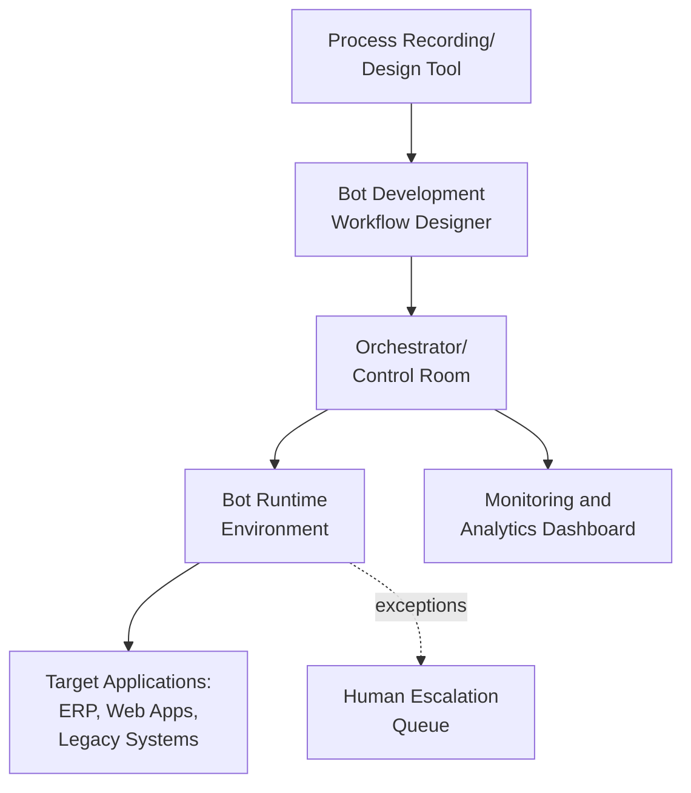
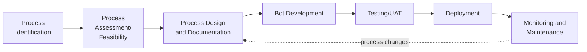

## Robotic Process Automation

### Overview

Robotic Process Automation (RPA) is software technology that automates rule-based, repetitive digital tasks by mimicking human interactions with computer applications — clicking, typing, reading screens, and moving data between systems — without requiring changes to underlying IT infrastructure. Within operations management, RPA primarily targets administrative and transactional processes (order processing, data entry, invoice reconciliation) rather than physical production tasks, distinguishing it from industrial robotics that manipulate physical objects.

### Foundational Concepts

#### RPA vs. Related Automation Technologies

| Technology | Automates | Interacts With |
| --- | --- | --- |
| RPA | Rule-based digital/software tasks | User interfaces, applications, screens |
| Industrial Robotics | Physical manipulation tasks | Physical materials, products |
| Business Process Management (BPM) | End-to-end process workflows and orchestration | Systems and people, often via APIs |
| Intelligent Automation / Hyperautomation | RPA combined with AI/ML for cognitive tasks | Structured and unstructured data |

**Key Points**

- RPA operates at the presentation layer (mimicking UI interactions) rather than requiring direct database or API access, which allows it to work with legacy systems lacking modern integration points
- RPA is fundamentally rule-based; it excels at structured, repetitive, high-volume tasks with clear decision logic rather than tasks requiring judgment or handling significant variability
- When combined with AI capabilities (natural language processing, computer vision, machine learning), the resulting systems are often termed "Intelligent Automation" or "Intelligent Process Automation" (IPA), extending RPA beyond purely rule-based logic

#### Attended vs. Unattended vs. Hybrid Bots

| Type | Trigger | Typical Use Case |
| --- | --- | --- |
| Attended | Initiated by a human user, runs on their workstation | Assisting agents in real-time (e.g., call center data lookup) |
| Unattended | Runs automatically on a schedule or event trigger, no human present | Overnight batch processing (invoice matching, report generation) |
| Hybrid | Combination, with handoffs between human and bot steps | End-to-end order processing with exception handling by humans |

### RPA Architecture

**Key Points**

- The **Orchestrator** (or control room) centrally manages bot scheduling, deployment, credential management, and monitoring across an organization's bot fleet
- Bots interact with target applications through UI automation techniques: screen scraping, object recognition, image recognition, or, where available, API calls
- Exception handling logic routes tasks the bot cannot resolve (ambiguous data, system errors, unexpected screen states) to human operators, since RPA bots generally cannot exercise judgment outside their programmed rules

### Applications in Operations

#### Order Processing and Order-to-Cash

RPA bots extract order data from emails, portals, or EDI feeds, validate it against inventory and pricing systems, and enter it into ERP systems, reducing manual data entry errors and processing time.

#### Procurement and Invoice Processing (Purchase-to-Pay)

**Example**

An incoming supplier invoice (PDF or scanned image) is processed by an RPA bot integrated with Optical Character Recognition (OCR): the bot extracts invoice fields (vendor, amount, line items, PO number), performs a three-way match against the purchase order and goods receipt in the ERP system, and either auto-approves the invoice for payment or flags discrepancies for human review — reducing manual invoice processing time typically associated with this task.

#### Inventory and Supply Chain Data Reconciliation

Bots reconcile inventory records across disparate systems (WMS, ERP, supplier portals), flag discrepancies, and generate exception reports, replacing manual cross-referencing that is prone to human error at scale.

#### Production Reporting and Data Aggregation

Bots pull data from multiple production systems (MES, quality databases, maintenance logs) into consolidated reports or dashboards, eliminating manual compilation that traditionally consumed significant analyst time in operations reporting.

#### Compliance and Audit Trail Generation

RPA bots systematically generate and archive documentation trails for regulatory compliance (e.g., quality records, safety inspection logs), ensuring consistency in recordkeeping compared to manual documentation practices.

#### Customer Service and Order Status Inquiries

Attended bots assist customer service representatives by automatically retrieving order status, shipment tracking, and account information across multiple backend systems during live customer interactions.

### RPA Development Lifecycle

#### Process Selection Criteria

**Key Points**

- Ideal RPA candidates are high-volume, repetitive, rule-based processes with structured data inputs and stable underlying systems
- Processes with frequent exceptions, significant judgment requirements, or high variability are generally poor RPA candidates unless paired with AI capabilities to handle the variability
- Process stability matters significantly: RPA bots interacting with UI elements can break when target application interfaces change (e.g., a software update altering button locations), requiring bot maintenance

### Governance and Risk Considerations

#### Bot Maintenance and Fragility

**Key Points**

- UI-based automation is inherently sensitive to changes in the target application's interface, screen layout, or underlying software version, requiring ongoing maintenance as connected systems are updated
- Organizations commonly establish a Center of Excellence (CoE) to standardize bot development practices, manage a shared bot inventory, and coordinate maintenance across the automation portfolio
- [Inference] The maintenance burden of a given RPA deployment generally scales with the number and update frequency of the target applications it interacts with, though this varies by specific implementation and vendor tooling

#### Security and Access Control

Since bots often operate using credentials with system access equivalent to human users, governance practices typically include:

- Credential vaulting and secure storage rather than embedding credentials in bot scripts
- Role-based access control limiting which processes and data each bot can access
- Audit logging of all bot actions for traceability and compliance review

#### Scalability Considerations

Unlike hiring additional staff, scaling RPA capacity is largely a matter of deploying additional bot licenses/runtime environments, though this scalability is bounded by the availability of well-defined, automatable processes rather than technical capacity alone.

### Relationship to Broader Automation Strategy

RPA is frequently positioned as a starting point for broader digital transformation initiatives due to its relatively low implementation barrier compared to full system replacement or custom integration development.

| Maturity Stage | Characteristics |
| --- | --- |
| Task Automation | Individual repetitive tasks automated in isolation |
| Process Automation | End-to-end process workflows automated with orchestration |
| Intelligent Automation | RPA combined with AI/ML for cognitive tasks (document understanding, decision-making) |
| Hyperautomation | Organization-wide, strategically coordinated automation across processes, combining RPA, AI, process mining, and BPM |

[Inference] "Hyperautomation" as a strategic label reflects an increasingly common industry framing for combining multiple automation technologies at scale, though the specific technology combinations and maturity benchmarks associated with the term vary across vendors and analyst firms.

### Common Pitfalls

**Key Points**

- Automating a poorly designed or inefficient process ("automating a broken process") without first evaluating whether the process itself should be redesigned
- Underestimating the ongoing maintenance burden of bots as connected applications evolve, leading to "bot rot" and declining automation reliability over time
- Insufficient exception handling design, causing bots to fail silently or produce incorrect outputs on edge cases not anticipated during development
- Treating RPA implementation as purely an IT initiative without involving process owners who understand the operational nuances and exceptions of the target process

### Related Topics

- Business process management (BPM) and process mining
- Intelligent automation and cognitive document processing
- Artificial intelligence and machine learning in operations
- Enterprise Resource Planning (ERP) system integration
- Process reengineering and Lean process improvement
- Order-to-cash and procure-to-pay process optimization