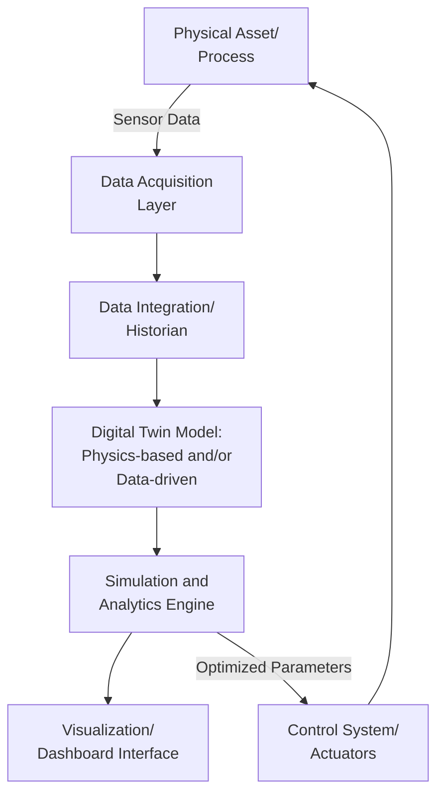
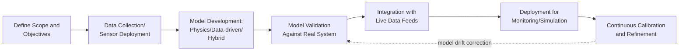

## Digital Twins for Operations

### Overview

A digital twin is a virtual representation of a physical asset, process, or system that is continuously synchronized with its real-world counterpart through live data feeds, enabling simulation, monitoring, analysis, and optimization without disrupting actual operations. In an operations management context, digital twins extend beyond static simulation models by maintaining an ongoing, data-driven link to the physical system they represent, allowing organizations to test scenarios, predict outcomes, and optimize decisions in a virtual environment before or in parallel with real-world execution.

### Foundational Concepts

#### Digital Twin Fidelity Spectrum

| Level | Data Flow | Capability |
| --- | --- | --- |
| Digital Model | None (manual updates only) | Static representation for design or planning |
| Digital Shadow | One-way, automatic (physical → virtual) | Real-time monitoring and visualization |
| Digital Twin | Bidirectional, automatic | Virtual changes can inform or trigger physical action; closed-loop optimization |

**Key Points**

- A digital shadow reflects the physical system's state but cannot influence it directly, whereas a full digital twin supports feedback that can adjust physical operations
- [Inference] Terminology boundaries between these levels are not perfectly standardized across vendors and literature, so organizational usage of "digital twin" sometimes includes what other sources would classify as a digital shadow

#### Core Components

### Types of Digital Twins by Scope

| Type | Scope | Example |
| --- | --- | --- |
| Component Twin | Single part or component | A bearing's wear-state model |
| Asset Twin | Complete machine or equipment unit | A CNC machine or pump |
| System/Process Twin | Interconnected assets forming a production line or process | An assembly line or chemical process unit |
| Facility Twin | Entire plant or facility | A full manufacturing facility layout and flow model |

**Key Points**

- Scope selection typically depends on the specific operational question being addressed; a component twin suits detailed failure prediction, while a facility twin suits layout or capacity planning decisions
- Twins at different scopes are often composed hierarchically, where facility-level twins aggregate data and outputs from underlying asset and process twins

### Modeling Approaches

#### Physics-Based Models

Built on first-principles engineering equations (thermodynamics, mechanics, fluid dynamics) that describe how a system behaves under given conditions. These models generalize well to conditions not seen in historical data but require deep domain engineering expertise to construct accurately.

#### Data-Driven Models

Built using machine learning techniques trained on historical operational data, capturing empirical patterns without requiring explicit physical equations. These models can capture complex behaviors that are difficult to model analytically but are limited to the range of conditions represented in their training data.

#### Hybrid Models

Combine physics-based structure with data-driven components (e.g., using ML to estimate parameters within a physics-based model, or to correct systematic physics-model errors against observed data), often used to balance interpretability and generalization against the ability to capture complex empirical behavior.

$$y_{hybrid} = f_{physics}(x) + g_{ML}(x)$$

Where $f_{physics}$ represents the physics-based prediction and $g_{ML}$ represents a machine learning correction term fitted to the residual error between the physics model and observed data.

### Applications in Operations

#### Predictive Maintenance

A digital twin of a critical asset continuously ingests sensor data (vibration, temperature, load) and compares real-time behavior against the expected model state, flagging deviations that indicate developing faults and estimating Remaining Useful Life (RUL).

**Example**

A digital twin of an industrial gearbox models expected vibration signatures under varying load and speed conditions. When live sensor data deviates from the model's expected signature beyond a calibrated tolerance, the system flags a potential bearing fault and estimates time-to-failure based on the historical degradation trajectories embedded in the model, enabling maintenance planning before an unplanned stoppage occurs.

#### Production Line Optimization and Bottleneck Analysis

Process-level digital twins simulate line throughput under varying configurations (staffing levels, buffer sizes, machine speeds), allowing planners to test "what-if" scenarios virtually before committing to physical changes.

$$\text{Throughput} = \min(\text{Capacity}_1, \text{Capacity}_2, \ldots, \text{Capacity}_n)$$

A digital twin can simulate how throughput changes as individual station capacities or buffer configurations are adjusted, identifying the binding constraint (bottleneck) without disrupting live production.

#### Virtual Commissioning

Before physical installation, a digital twin of a new production line or automation system is tested in simulation against the intended control logic (PLC programs), allowing engineers to identify design flaws, timing issues, or safety concerns before physical construction — reducing costly on-site rework.

#### Energy Optimization

Facility-level digital twins model energy consumption patterns across equipment and processes, enabling simulation of energy-saving interventions (equipment scheduling changes, setpoint adjustments) and quantifying expected savings before implementation.

#### Supply Chain and Logistics Network Twins

Digital twins extended to supply chain networks simulate the impact of disruptions (supplier delays, transportation bottlenecks, demand shocks) on overall network performance, supporting scenario planning and resilience assessment.

#### Quality and Process Control

Twins of specific manufacturing processes (e.g., injection molding, chemical batch processes) model the relationship between process parameters and output quality, enabling virtual experimentation to identify optimal settings without producing defective physical output.

### Digital Twin Development Lifecycle

**Key Points**

- Model validation compares digital twin predictions against actual observed outcomes to establish confidence before operational reliance
- Ongoing calibration is required because physical systems change over time (wear, component replacement, process modifications), and an uncalibrated twin gradually diverges from reality — a phenomenon sometimes referred to as model drift
- [Inference] The appropriate recalibration frequency depends on how quickly the underlying physical system's behavior changes, and should generally be determined empirically for each specific application rather than assumed from a fixed schedule

### Integration with Broader Systems

| System | Relationship to Digital Twin |
| --- | --- |
| IoT Sensors | Primary data source feeding the twin's real-time state |
| MES/SCADA | Provides production context and control interface |
| ERP | Supplies planning data (schedules, orders) that scenario simulations may incorporate |
| CMMS | Receives maintenance triggers generated from twin-based predictions |
| AI/ML Platforms | Provides the analytical models embedded within data-driven or hybrid twins |

### Implementation Considerations

#### Data Requirements

Digital twins require reliable, sufficiently granular sensor data to maintain synchronization with the physical system; gaps or noise in data feeds directly reduce the twin's fidelity and usefulness for decision-making.

#### Computational Infrastructure

Real-time or near-real-time digital twins, particularly for complex physics-based simulations, can be computationally intensive, often requiring a combination of edge processing (for time-sensitive local calculations) and cloud or on-premises high-performance computing (for complex simulation runs).

#### Organizational and Skill Requirements

Building and maintaining digital twins typically requires cross-disciplinary collaboration between domain engineers (who understand the physical system), data scientists (who build data-driven components), and IT/OT specialists (who manage data infrastructure) — a combination of skills not always present within a single traditional operations team.

#### Cost-Benefit Justification

**Key Points**

- Digital twin initiatives are typically justified through specific use cases (avoided downtime, reduced commissioning time, energy savings) rather than as a general-purpose investment, given the significant development effort required
- Starting with a narrow, high-value pilot (e.g., a single critical asset) is a commonly recommended approach before expanding to broader system or facility-level twins
- [Speculation] Generic ROI figures for digital twin projects vary widely across industries and use cases and should not be treated as broadly representative without reference to a specific application context

### Common Pitfalls

**Key Points**

- Building highly detailed models without a clear decision-making objective, resulting in a technically impressive twin that does not drive operational action
- Neglecting ongoing model calibration, allowing the twin to silently diverge from actual system behavior over time
- Underestimating data infrastructure and integration requirements needed to maintain real-time synchronization
- Attempting facility-wide digital twin implementation before validating the approach at a smaller, more manageable scope

### Related Topics

- Cyber-physical systems and smart manufacturing architecture
- Predictive maintenance and Remaining Useful Life (RUL) estimation
- Simulation modeling and discrete-event simulation
- Internet of Things (IoT) sensor infrastructure
- Artificial intelligence and machine learning in operations
- Virtual commissioning and automation system design