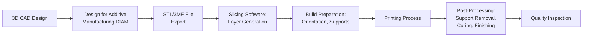
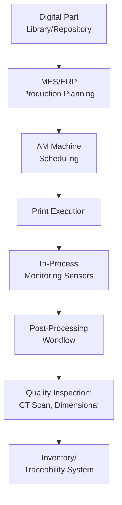

## Additive Manufacturing and 3D Printing

### Overview

Additive manufacturing (AM), commonly known as 3D printing, is a production process that builds parts layer-by-layer directly from digital models, contrasting with subtractive manufacturing (machining) which removes material from a solid block, and formative manufacturing (molding, forging) which shapes material using dies or molds. Within operations management and Industry 4.0, additive manufacturing enables new approaches to prototyping, tooling, spare parts provisioning, and low-volume/high-complexity production, often reshaping traditional make-versus-buy and inventory decisions.

### Foundational Concepts

#### Additive vs. Subtractive vs. Formative Manufacturing

| Method | Process | Material Utilization | Typical Use Case |
| --- | --- | --- | --- |
| Additive | Builds layer-by-layer from digital model | High (minimal waste) | Complex geometries, low-volume, customization |
| Subtractive | Removes material via cutting/machining | Lower (generates waste/scrap) | High-precision parts from solid stock |
| Formative | Shapes material via molds, dies, forging | High, but requires tooling investment | High-volume standardized parts |

**Key Points**

- Additive manufacturing typically enables geometric complexity (internal channels, lattice structures, organic shapes) that would be difficult or impossible to produce via subtractive or formative methods
- Material waste is generally lower in additive processes since material is deposited only where needed, though support structures required for overhangs do consume additional material
- AM economics favor low-volume, high-complexity, or highly customized production, while formative methods generally retain a cost advantage at high production volumes due to per-unit tooling cost amortization

#### The Additive Manufacturing Workflow

### Major Additive Manufacturing Technologies

| Technology | Process Description | Common Materials | Typical Applications |
| --- | --- | --- | --- |
| Fused Deposition Modeling (FDM) | Extrudes molten thermoplastic filament layer-by-layer | ABS, PLA, PETG, nylon | Prototyping, jigs, fixtures |
| Stereolithography (SLA) | UV laser cures liquid photopolymer resin | Photopolymer resins | High-detail prototypes, dental/jewelry |
| Selective Laser Sintering (SLS) | Laser sinters powdered material (typically nylon) | Nylon powders, composites | Functional prototypes, end-use parts |
| Selective Laser Melting (SLM) / Direct Metal Laser Sintering (DMLS) | Laser fully melts metal powder | Titanium, stainless steel, aluminum, cobalt-chrome | Aerospace, medical implants, tooling |
| Electron Beam Melting (EBM) | Electron beam melts metal powder in vacuum | Titanium alloys, cobalt-chrome | Aerospace, orthopedic implants |
| Binder Jetting | Liquid binder selectively deposited onto powder bed | Metals, sand, ceramics | Sand casting molds, metal parts (with sintering) |
| Material Jetting | Droplets of photopolymer jetted and cured layer-by-layer | Photopolymers, multi-material | Multi-material prototypes, medical models |
| Directed Energy Deposition (DED) | Focused energy source melts material as it is deposited | Metal powders/wire | Repair of large components, large-scale metal parts |

[Inference] Technology selection in practice depends on required mechanical properties, surface finish, production volume, and part geometry, with no single technology being universally superior across all these dimensions.

### Applications in Operations

#### Rapid Prototyping

The original and most established AM application: producing physical prototypes directly from CAD models within hours or days rather than the weeks typically required for traditional tooling-based prototyping, accelerating design iteration cycles.

#### Tooling, Jigs, and Fixtures

Manufacturing facilities increasingly print custom jigs, fixtures, and assembly aids in-house rather than outsourcing to traditional toolmakers, reducing lead time and cost for these typically low-volume, custom items.

#### Spare Parts and MRO (Maintenance, Repair, and Operations)

**Example**

A manufacturing facility with an aging piece of equipment needs a replacement bracket for which the original supplier no longer stocks parts. Rather than reverse-engineering and tooling a traditional casting or waiting for a custom machined part, the facility scans or models the bracket, prints a functional replacement in an appropriate engineering-grade polymer or metal via SLS/SLM, and returns the equipment to service — illustrating AM's value for long-tail, low-volume, obsolete, or hard-to-source spare parts discussed under spare parts inventory strategy.

**Key Points**

- AM enables "distributed manufacturing" of spare parts, where digital part files rather than physical inventory are stocked, allowing on-demand printing near the point of need rather than centralized warehousing and shipping
- This shifts spare parts strategy considerations from physical inventory carrying costs toward digital file management, print capacity planning, and material qualification
- Not all spare parts are suitable AM candidates; parts requiring specific certified material properties, tight tolerances, or high-volume replacement remain often better served by traditional stocking approaches

#### Low-Volume and Customized Production

Industries such as medical devices (patient-specific implants, dental aligners, hearing aids) and aerospace (lightweight, topology-optimized brackets) leverage AM for economically viable low-volume, high-customization production that would be cost-prohibitive via traditional tooling-based methods.

#### Topology Optimization and Lightweighting

Design software using topology optimization algorithms generates organic, load-path-following geometries that minimize material and weight while maintaining structural performance — geometries generally producible only through additive processes due to their complexity.

$$\text{Minimize } V(\Omega) \text{ subject to compliance} \leq C_{max}$$

Where $V(\Omega)$ represents material volume within the design domain and the constraint ensures structural stiffness remains within acceptable limits.

#### Bridge Manufacturing

AM is used to produce parts during the gap period between product launch and full-scale tooling availability for traditional manufacturing, allowing production to begin before injection molds or other tooling are completed.

### Integration with Smart Manufacturing Systems

**Key Points**

- Integration with MES and ERP systems allows AM to be scheduled and tracked alongside conventional production processes rather than operating as an isolated capability
- In-process monitoring (thermal imaging, melt pool monitoring for metal AM) is increasingly used to detect print defects in real-time, reducing reliance on post-build inspection alone
- Digital part file management and version control become critical operational disciplines when AM shifts inventory strategy toward on-demand, distributed production

### Design for Additive Manufacturing (DfAM)

**Key Points**

- DfAM principles differ substantially from design for machining or molding, emphasizing considerations such as build orientation, support structure minimization, and overhang angles
- Part consolidation is a common DfAM strategy, redesigning multi-component assemblies into single printed parts, reducing assembly labor and potential failure points
- [Inference] Effective DfAM generally requires specialized training distinct from traditional mechanical design skills, since design rules and failure modes differ meaningfully between additive and conventional manufacturing processes

### Post-Processing Requirements

Most AM parts require post-processing before use, which is frequently underestimated in production time and cost planning:

- Support structure removal (mechanical or chemical dissolution)
- Surface finishing (sanding, bead blasting, polishing)
- Heat treatment (stress relief, annealing) particularly for metal AM parts
- Machining of critical tolerance features that AM processes cannot achieve directly

### Quality Control and Certification Considerations

**Key Points**

- Metal AM parts for critical applications (aerospace, medical) typically require rigorous qualification processes, including material certification, process parameter validation, and non-destructive testing (e.g., CT scanning for internal defects)
- Layer-by-layer construction can introduce anisotropic mechanical properties (differing strength depending on load direction relative to build orientation), a consideration not present in traditionally manufactured parts
- [Unverified] Standardization and certification frameworks for AM parts continue to evolve across industries; specific regulatory requirements should be verified against current standards (e.g., ASTM F42 committee standards) for a given application rather than assumed static

### Economic Considerations

#### Cost Structure Comparison

Unlike traditional manufacturing, AM costs scale primarily with part volume and complexity rather than production quantity, since there is no tooling investment to amortize:

$$Cost_{AM} \approx f(\text{material volume, print time, machine cost})$$

$$Cost_{traditional} = \frac{Tooling}{Q} + Cost_{per-unit}$$

This cost structure explains why AM is typically economical at low volumes (where tooling amortization per unit remains high for traditional methods) but loses relative advantage as volume increases and tooling costs amortize across more units.

[Inference] The specific crossover volume where traditional manufacturing becomes more economical than AM varies considerably by part geometry, material, and specific technology, and should be evaluated case-by-case rather than assumed from a general rule of thumb.

### Common Pitfalls

**Key Points**

- Selecting AM for parts better suited to traditional high-volume manufacturing, ignoring the crossover economics between the two approaches
- Underestimating post-processing time and cost, treating the printed part as immediately finished
- Insufficient attention to anisotropic mechanical properties when designing load-bearing AM parts
- Failing to establish digital file version control and access governance when transitioning toward distributed, on-demand spare parts production

### Related Topics

- Spare parts inventory strategy and distributed manufacturing
- Design for manufacturing and assembly (DFMA)
- Smart manufacturing and cyber-physical systems
- Supply chain risk management and localized production
- Quality control and non-destructive testing methods
- Topology optimization and generative design