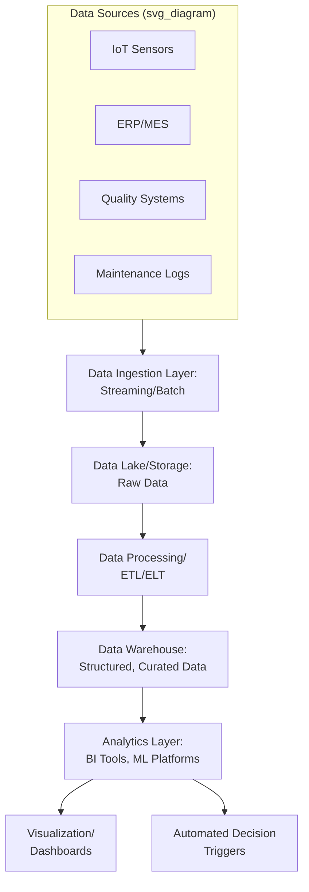

## Big Data and Operations Analytics

### Overview

Big data and operations analytics refers to the collection, processing, and analysis of large-volume, high-velocity, and highly varied datasets generated across production, supply chain, and service operations to support data-driven decision-making. Within Industry 4.0, this discipline provides the analytical foundation that transforms raw data streamed from IoT sensors, ERP systems, and other operational sources into insights supporting descriptive, diagnostic, predictive, and prescriptive decision-making across the organization.

### Foundational Concepts

#### The Characteristics of Big Data (The V's)

| Characteristic | Description | Operations Example |
| --- | --- | --- |
| Volume | Large quantities of data generated continuously | Millions of sensor readings per day across a facility |
| Velocity | Speed at which data is generated and must be processed | Real-time machine telemetry requiring sub-second response |
| Variety | Diverse data types and formats | Structured ERP records, unstructured maintenance notes, sensor time-series, images |
| Veracity | Data quality, accuracy, and trustworthiness | Sensor calibration drift affecting reading reliability |
| Value | The actionable insight ultimately extracted | Reduced downtime from predictive maintenance insights |

**Key Points**

- Traditional relational database and business intelligence tools were generally designed for structured, lower-volume data and often become impractical at the volume and velocity typical of continuous industrial sensor streams
- Veracity is a particularly significant consideration in operations contexts, since sensor malfunctions, calibration drift, and transmission errors can introduce systematic data quality issues that undermine downstream analytics if not addressed

#### The Analytics Maturity Spectrum

| Stage | Question Answered | Typical Technique | Operations Example |
| --- | --- | --- | --- |
| Descriptive | What happened? | Dashboards, reporting, summary statistics | OEE (Overall Equipment Effectiveness) reports |
| Diagnostic | Why did it happen? | Root cause analysis, drill-down, correlation analysis | Identifying which machine parameter correlates with defect spikes |
| Predictive | What will happen? | Statistical forecasting, machine learning | Forecasting equipment failure or demand |
| Prescriptive | What should we do? | Optimization, simulation, reinforcement learning | Recommending optimal production schedule adjustments |

**Key Points**

- Organizations typically progress through these stages sequentially, since diagnostic and predictive capabilities generally depend on having reliable descriptive reporting and clean historical data already in place
- Prescriptive analytics represents the most advanced and operationally valuable stage but also requires the most mature underlying data infrastructure and organizational trust in automated recommendations

### Data Architecture for Operations Analytics

#### Key Architectural Components

**Key Points**

- **Data lakes** store raw, unprocessed data in its native format (structured, semi-structured, unstructured), providing flexibility for varied future analytical uses compared to the rigid schema requirements of traditional data warehouses
- **Data warehouses** store structured, cleaned, and modeled data optimized for query performance and reporting consistency
- **Lakehouse architectures** combine data lake flexibility with data warehouse structure and governance, an approach that has gained adoption as organizations seek to avoid maintaining separate lake and warehouse systems
- **Stream processing** frameworks (e.g., Apache Kafka, Apache Flink) handle continuous, high-velocity data streams requiring near-real-time processing, distinguishing them from batch processing frameworks suited to periodic, large-volume processing

#### Batch vs. Stream Processing

| Approach | Processing Pattern | Latency | Typical Use Case |
| --- | --- | --- | --- |
| Batch | Processes accumulated data at scheduled intervals | Minutes to hours | Daily production reports, historical trend analysis |
| Stream | Processes data continuously as it arrives | Milliseconds to seconds | Real-time anomaly detection, live dashboards |
| Micro-batch | Processes small batches at short, frequent intervals | Seconds | Near-real-time analytics balancing throughput and latency |

### Analytics Applications in Operations

#### Overall Equipment Effectiveness (OEE) Analytics

OEE remains a foundational descriptive metric in manufacturing operations, decomposed into three components:

$$OEE = Availability \times Performance \times Quality$$

$$Availability = \frac{Operating\ Time}{Planned\ Production\ Time}$$

$$Performance = \frac{Ideal\ Cycle\ Time \times Total\ Count}{Operating\ Time}$$

$$Quality = \frac{Good\ Count}{Total\ Count}$$

Big data analytics platforms aggregate real-time machine data to calculate OEE continuously rather than through periodic manual data collection, enabling faster identification of efficiency losses.

#### Root Cause Analysis at Scale

Diagnostic analytics techniques applied to large operational datasets can identify correlations between process variables and outcomes (defects, downtime events) that would be difficult to detect through manual analysis alone, particularly when multiple interacting variables are involved.

**Example**

A beverage bottling facility experiences intermittent capping defects. Traditional troubleshooting examines individual machine parameters sequentially. A big data analytics platform instead correlates capping torque sensor data, ambient humidity readings, bottle supplier batch codes, and line speed across months of production history, identifying a statistically significant interaction between a specific bottle supplier's batch variability and line speeds above a certain threshold — a root cause unlikely to be identified through univariate manual analysis.

#### Predictive Analytics for Demand and Capacity Planning

Aggregating historical sales data, market signals, and operational constraints enables more accurate demand forecasts and capacity planning than traditional methods relying on smaller, siloed datasets.

#### Supply Chain Analytics

Big data techniques applied across supply chain data (supplier performance, logistics tracking, inventory levels) support network-wide visibility and risk identification that individual system-level views cannot provide, since supply chains typically span multiple organizations and disparate systems.

#### Quality Analytics and Statistical Process Control at Scale

Continuous, high-frequency sensor data enables real-time statistical process control across many parameters simultaneously, rather than the periodic, sample-based approach traditionally used with manual quality control methods.

### Key Technologies and Tools

| Category | Examples | Purpose |
| --- | --- | --- |
| Distributed Storage/Processing | Hadoop, Apache Spark | Processing large datasets across clustered computing resources |
| Stream Processing | Apache Kafka, Apache Flink | Real-time data ingestion and processing |
| Time-Series Databases | InfluxDB, TimescaleDB | Optimized storage/query for high-frequency sensor data |
| Data Visualization/BI | Power BI, Tableau, Grafana | Dashboard creation and reporting |
| Cloud Analytics Platforms | AWS, Azure, Google Cloud analytics services | Scalable compute and storage infrastructure |
| Machine Learning Platforms | Various ML frameworks and MLOps tools | Building and deploying predictive/prescriptive models |

[Inference] Specific tool selection generally depends on existing infrastructure, data volume/velocity requirements, and organizational technical capability, rather than any single toolset being universally preferred across all operations analytics implementations.

### Governance and Data Quality Considerations

#### Data Quality Management

**Key Points**

- Sensor calibration drift, transmission errors, and missing data points are common data quality challenges in industrial settings that can silently degrade analytics accuracy if not systematically addressed
- Data validation and cleansing pipelines are typically established as a prerequisite step before analytics or model development, since analytics quality is fundamentally bounded by input data quality ("garbage in, garbage out")
- Master data management practices help ensure consistency in how entities (equipment IDs, product codes, location identifiers) are referenced across disparate source systems

#### Data Governance

- Establishing clear data ownership and stewardship responsibilities across departments
- Defining data access controls, particularly for sensitive operational or safety data
- Ensuring data lineage traceability, allowing analysts to trace a given insight or metric back to its originating source systems

### Organizational Considerations

**Key Points**

- Building operations analytics capability typically requires cross-functional collaboration between operations domain experts (who understand process context), data engineers (who build data pipelines), and data scientists (who build analytical models)
- A common practical challenge is bridging the gap between IT/data science teams and operations/plant floor teams, who often have differing priorities, vocabularies, and success metrics
- Analytics initiatives that fail to translate insights into operational action (e.g., dashboards viewed but not acted upon) represent a frequently cited failure mode, distinct from purely technical implementation challenges

### Common Pitfalls

**Key Points**

- Investing heavily in data infrastructure without a clear connection to specific operational decisions the analytics are meant to support
- Underestimating data quality and cleansing effort required before analytics can produce reliable insights
- Building descriptive dashboards without progressing toward diagnostic, predictive, or prescriptive capabilities that drive greater operational value
- Insufficient integration between analytics outputs and actual operational workflows, resulting in insights that are generated but not acted upon

### Related Topics

- Artificial intelligence and machine learning in operations
- Internet of Things applications in operations
- Statistical process control and quality management
- Overall Equipment Effectiveness (OEE) and productivity metrics
- Data governance and master data management
- Predictive maintenance and condition monitoring
- Supply chain visibility and analytics