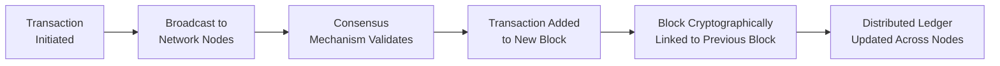

## Blockchain in Supply Chain Management

### Overview

Blockchain in supply chain management refers to the application of distributed ledger technology to record, verify, and share transactional and provenance data across multiple supply chain parties in a manner that is tamper-resistant, transparent, and does not depend on a single centralized authority. Within Industry 4.0, blockchain addresses trust and traceability challenges inherent in multi-party supply chains, where participants (suppliers, manufacturers, logistics providers, retailers) often operate disparate, siloed systems and have varying incentives to accurately share information.

### Foundational Concepts

#### What Distinguishes Blockchain from Traditional Databases

| Characteristic | Traditional Centralized Database | Blockchain |
| --- | --- | --- |
| Control | Single organization owns and controls | Distributed across network participants |
| Data Modification | Can be altered by the controlling authority | Extremely difficult to alter once recorded (immutability) |
| Trust Model | Requires trusting the database owner | Trust derived from cryptographic verification and consensus |
| Transparency | Visible only to those granted access by owner | Configurable, but often visible to all authorized network participants |

**Key Points**

- Blockchain's core value proposition in supply chain contexts is enabling multiple, potentially non-trusting parties to share a single, verifiable version of transactional data without requiring a central intermediary to arbitrate trust
- Immutability means that once a transaction is recorded and confirmed, altering it would require altering all subsequent blocks across a majority of network participants, which is computationally and practically difficult by design
- [Inference] The practical trust benefit of blockchain depends heavily on how many independent, appropriately incentivized parties participate in the network; a blockchain controlled by a single dominant party can functionally resemble a centralized database with extra cryptographic overhead

#### Core Technical Components

**Key Points**

- Each block contains a cryptographic hash of the previous block, forming a chain where altering any historical block would invalidate all subsequent hashes, making tampering evident
- **Consensus mechanisms** (methods by which network participants agree on the validity of transactions) vary by blockchain type; common approaches include Proof of Work, Proof of Stake, and permissioned consensus protocols like Practical Byzantine Fault Tolerance (PBFT)
- **Smart contracts** are self-executing code stored on the blockchain that automatically execute predefined actions when specified conditions are met, enabling automated contract enforcement without manual intervention

#### Public vs. Permissioned Blockchains

| Type | Access | Governance | Typical Supply Chain Use |
| --- | --- | --- | --- |
| Public | Open to anyone | Decentralized, no single controlling entity | Less common in enterprise supply chains due to performance/privacy constraints |
| Permissioned/Private | Restricted to approved participants | Controlled by a consortium or single organization | Most common in supply chain applications (e.g., Hyperledger Fabric) |
| Consortium | Restricted to a defined group of organizations | Jointly governed by consortium members | Multi-party supply chain networks (e.g., shared industry ledgers) |

**Key Points**

- Enterprise supply chain implementations predominantly use permissioned or consortium blockchains rather than fully public blockchains, primarily due to data privacy requirements, transaction throughput needs, and the desire to control network participation
- Hyperledger Fabric is a frequently referenced open-source permissioned blockchain framework specifically designed for enterprise/consortium use cases, distinguishing it from public blockchain platforms originally designed for cryptocurrency applications

### Applications in Supply Chain Management

#### Product Traceability and Provenance

Blockchain enables recording each step of a product's journey — raw material sourcing, processing, manufacturing, distribution — as an immutable record that all authorized supply chain participants can verify.

**Example**

A food safety consortium blockchain records each handoff of a produce shipment: farm harvest data, cold storage temperature logs, processing facility timestamps, and retail delivery confirmation, each cryptographically linked to the previous record. If a foodborne illness outbreak is traced to a specific batch, retailers and regulators can query the blockchain to identify the precise source and distribution path in a fraction of the time traditional paper-based or siloed digital record tracing would require — a capability that has been piloted in produce traceability initiatives by major retailers.

#### Anti-Counterfeiting and Authentication

By recording a product's origin and chain of custody immutably, blockchain supports verification that a product is genuine, addressing counterfeiting concerns particularly relevant in pharmaceuticals, luxury goods, and electronics supply chains.

#### Supplier and Compliance Verification

Blockchain-based records can verify supplier certifications (ethical sourcing, environmental compliance, quality certifications) in a manner that is more difficult to falsify than traditional paper or centralized digital documentation, supporting supply chain due diligence and regulatory compliance efforts.

#### Smart Contract-Enabled Automated Settlement

Smart contracts can automate payment release, penalty application, or other contractual actions based on verified supply chain events (e.g., automatic payment upon verified delivery confirmation), reducing administrative processing delays and disputes associated with manual contract enforcement.

$$\text{if } (\text{delivery\_confirmed} = \text{true}) \text{ and } (\text{quality\_check} = \text{pass}) \rightarrow \text{execute payment}$$

#### Multi-Party Visibility and Reduced Information Asymmetry

In traditional supply chains, each party typically maintains its own records, creating reconciliation overhead and potential for disputes when records disagree. A shared blockchain ledger provides a single source of truth that all authorized parties reference, reducing reconciliation effort and disputes arising from mismatched records.

#### Cold Chain and Condition Monitoring Integration

When combined with IoT sensors, blockchain can create immutable records of environmental conditions (temperature, humidity) throughout a shipment's journey, providing verifiable proof of proper handling for temperature-sensitive goods (pharmaceuticals, food) rather than relying on potentially alterable centralized logs.

### Integration Architecture with IoT and Enterprise Systems

```mermaid
flowchart TB
    A[IoT Sensors:<br/>Location, Temperature,<br/>Condition Data] --> B[Data Oracle/<br/>Gateway]
    B --> C[Blockchain Network:<br/>Permissioned Ledger]
    D[ERP/WMS Systems] --> C
    E[Supplier Systems] --> C
    C --> F[Smart Contract<br/>Execution]
    C --> G[Shared Dashboard/<br/>Query Interface]
    F --> H[Automated Actions:<br/>Payments, Alerts]
```

**Key Points**

- An "oracle" refers to a mechanism that feeds external, real-world data (such as IoT sensor readings) into a blockchain, since blockchains cannot natively access external data sources directly
- Oracles represent a notable point of vulnerability in blockchain-IoT integrations, since the blockchain's immutability guarantee only extends to data once recorded — inaccurate or manipulated sensor data fed via a compromised oracle would still be recorded immutably as if accurate, meaning blockchain does not inherently solve data accuracy at the point of origin

### Implementation Considerations

#### Consortium Formation and Governance

**Key Points**

- Effective supply chain blockchain implementations typically require multiple independent organizations to agree to participate, share data, and adhere to common data standards — a coordination challenge that is often cited as a greater barrier than the underlying technology itself
- Governance questions (who can add participants, how disputes are resolved, who bears infrastructure costs) require deliberate design and consortium agreement before technical implementation
- [Inference] The success of many supply chain blockchain initiatives appears to depend more heavily on achieving sufficient multi-party adoption and standardized data formats than on the specific blockchain technology chosen

#### Scalability and Performance

Blockchain transaction throughput and latency vary significantly by platform and consensus mechanism, and high-volume supply chain applications (e.g., tracking millions of individual items) may require careful architecture decisions such as recording only key events or aggregated batches rather than every granular transaction on-chain.

#### Data Privacy Considerations

Since blockchain ledgers are typically visible to all authorized network participants, supply chain implementations must carefully design what data is recorded on-chain versus off-chain, particularly for commercially sensitive information (pricing, volumes) that participating organizations may not wish to share broadly even within a trusted consortium.

#### Integration with Legacy Systems

Connecting existing ERP, WMS, and supplier systems to a blockchain network requires middleware and integration development, representing a significant practical implementation cost often underestimated relative to the blockchain technology itself.

### Comparison with Alternative Traceability Approaches

| Approach | Trust Model | Typical Use Case |
| --- | --- | --- |
| Centralized Database | Single trusted operator | Single-organization traceability, simpler multi-party sharing via APIs |
| Blockchain | Distributed, cryptographically verified | Multi-party scenarios with limited mutual trust, need for immutable audit trail |
| EDI (Electronic Data Interchange) | Bilateral trust between trading partners | Established point-to-point transaction exchange |

[Inference] Blockchain is generally most justified in supply chain contexts where multiple independent parties with limited mutual trust need to share verifiable data and a centralized intermediary is impractical or undesirable; for supply chains dominated by a single organization with strong existing partner relationships, traditional centralized or EDI-based approaches may achieve similar traceability benefits with lower implementation complexity.

### Common Pitfalls

**Key Points**

- Applying blockchain to problems that traditional centralized databases or existing EDI systems could solve equally well, incurring unnecessary implementation complexity
- Underestimating the organizational and governance challenge of achieving multi-party consortium participation and data standardization
- Treating blockchain as a guarantee of data accuracy, when it only guarantees the immutability of recorded data — inaccurate data entered at the source (including via compromised IoT oracles) remains inaccurate once recorded
- Insufficient planning for integration effort with existing legacy ERP and supply chain systems

### Related Topics

- Internet of Things applications in operations
- Supply chain risk management and resilience
- Product traceability and quality management
- Smart contracts and automated settlement systems
- Supplier compliance and ethical sourcing verification
- Cold chain logistics monitoring