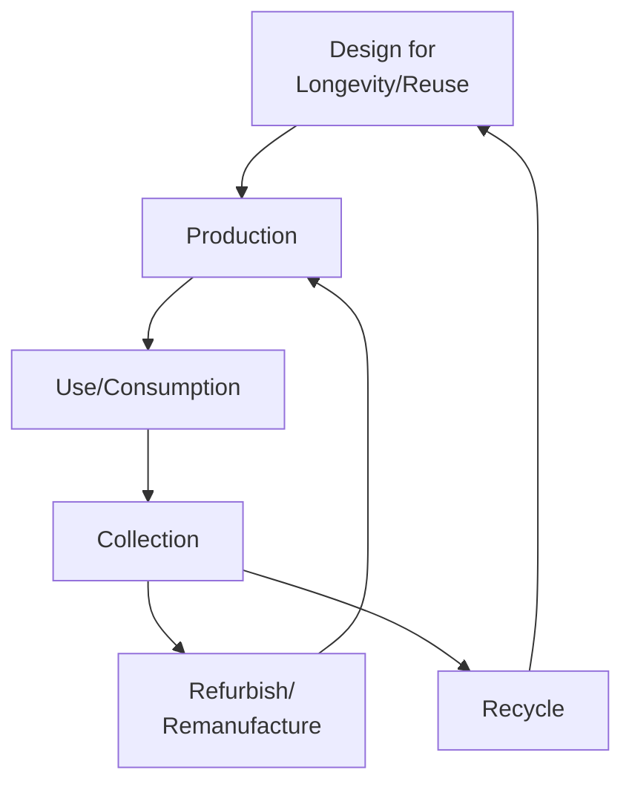
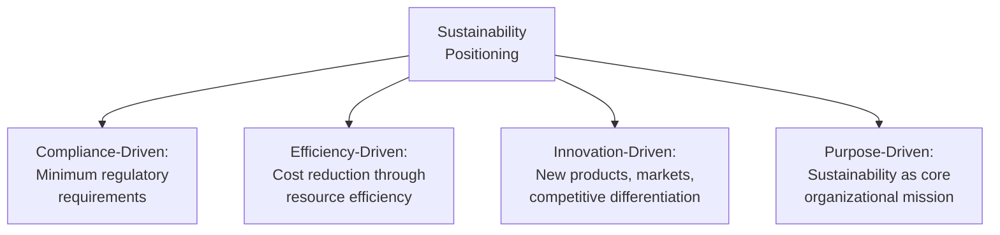

## Sustainable Operations Strategy

### Overview

Sustainable operations strategy integrates environmental, social, and economic considerations into core operational decision-making — including facility design, sourcing, production processes, and logistics — moving sustainability from a peripheral compliance function to a central strategic consideration influencing competitiveness, risk management, and long-term value creation. Rather than treating sustainability as a constraint imposed on operations, this framing positions it as a driver of operational decisions across the full value chain.

### Foundational Frameworks

#### The Triple Bottom Line

Sustainable operations strategy is commonly organized around three interdependent dimensions:

| Dimension | Focus | Operations Examples |
| --- | --- | --- |
| Economic (Profit) | Financial viability and long-term value creation | Cost efficiency, resource productivity, risk mitigation |
| Environmental (Planet) | Ecological impact and resource stewardship | Emissions reduction, waste minimization, energy efficiency |
| Social (People) | Human and community wellbeing | Labor practices, worker safety, community impact |

**Key Points**

- The triple bottom line framework, introduced by John Elkington in the 1990s, argues that organizations should measure and report performance across all three dimensions rather than financial performance alone
- [Inference] In practice, tensions frequently arise between these dimensions (e.g., a lower-cost supplier with weaker labor practices), requiring operations leaders to make explicit tradeoff decisions rather than assuming all three dimensions can always be simultaneously optimized

#### Circular Economy Principles

An alternative and increasingly referenced framework, the circular economy model, aims to redesign operations to eliminate waste and pollution, keep materials in use, and regenerate natural systems — contrasting with the traditional linear "take-make-dispose" model.

**Key Points**

- Circular economy principles emphasize designing products and processes for disassembly, reuse, and material recovery from the outset, rather than addressing waste only at end-of-life
- This shifts operations strategy toward reverse logistics capability, remanufacturing processes, and materials recovery as core operational competencies rather than afterthoughts

### Environmental Dimensions of Operations Strategy

#### Energy Management and Decarbonization

**Key Points**

- Operations strategy increasingly incorporates energy efficiency and decarbonization targets directly into facility design, equipment selection, and process optimization decisions rather than treating energy as a fixed overhead cost
- Common approaches include energy audits, equipment upgrades to higher-efficiency alternatives, renewable energy procurement (on-site generation or power purchase agreements), and process redesign to reduce energy-intensive steps
- Scope 1, 2, and 3 emissions categorization (direct emissions, purchased energy emissions, and value chain emissions respectively) is a widely used framework, originating from the Greenhouse Gas Protocol, for structuring an organization's carbon footprint measurement and reduction strategy

$$\text{Total Emissions} = \text{Scope 1} + \text{Scope 2} + \text{Scope 3}$$

[Inference] Scope 3 emissions (supply chain and product use-phase emissions) typically represent the largest share of total emissions for many manufacturing organizations, though the specific proportion varies substantially by industry and should be assessed through organization-specific carbon accounting rather than assumed universally.

#### Waste Reduction and Lean-Sustainability Integration

Sustainable operations strategy frequently builds on existing Lean manufacturing principles, since many Lean waste categories (overproduction, excess inventory, defects, unnecessary transportation) directly correspond to environmental waste and resource inefficiency.

| Lean Waste Type | Environmental Sustainability Connection |
| --- | --- |
| Overproduction | Wasted raw materials, energy, and embedded emissions in unsold goods |
| Excess Inventory | Increased storage energy consumption, obsolescence-related waste |
| Defects/Rework | Wasted materials and energy in producing non-conforming output |
| Unnecessary Transportation | Increased fuel consumption and transportation emissions |
| Excess Motion/Processing | Increased energy consumption relative to value-added output |

#### Sustainable Sourcing and Supply Chain

Extending sustainability considerations upstream to supplier selection and management, including environmental performance criteria, responsible material sourcing (e.g., conflict minerals avoidance), and supply chain emissions reduction collaboration.

#### Water Stewardship

Particularly relevant in water-intensive industries (textiles, food and beverage, semiconductor manufacturing), involving water use reduction, recycling/reuse systems, and responsible discharge management, especially in water-stressed operating regions.

### Social Dimensions of Operations Strategy

#### Labor Practices and Worker Wellbeing

**Key Points**

- Encompasses fair wages, safe working conditions, reasonable working hours, and freedom of association, extending across an organization's own operations and, increasingly, its supplier base
- Supply chain labor auditing and certification (e.g., through third-party social compliance programs) has become a common operational practice for organizations sourcing from regions or suppliers with elevated labor risk exposure
- [Inference] The specific labor standards and audit rigor considered adequate vary by industry, region, and stakeholder expectations, and organizations typically benchmark against recognized frameworks (e.g., ILO conventions) rather than defining standards independently

#### Community Impact and Local Economic Development

Operations siting and sourcing decisions increasingly weigh community impact considerations, including local employment generation, community engagement processes, and mitigation of negative externalities (noise, traffic, environmental impact on surrounding communities).

#### Diversity, Equity, and Inclusion in Operations Workforce

Extending workforce management practices to address representation, equitable advancement opportunities, and inclusive workplace practices within operations and manufacturing workforces specifically, which have historically shown different demographic patterns than other organizational functions.

### Strategic Integration Approaches

#### Sustainability as Competitive Advantage vs. Compliance Cost

**Key Points**

- Organizations vary considerably in how centrally sustainability features in operations strategy, ranging from minimum regulatory compliance to sustainability as a primary source of competitive differentiation
- Efficiency-driven approaches often present the most straightforward business case, since resource efficiency (energy, materials, waste reduction) frequently yields direct cost savings alongside environmental benefit, reducing the tension between economic and environmental objectives
- Innovation-driven and purpose-driven positioning typically require more significant organizational and strategic commitment, often justified through broader considerations like brand reputation, regulatory anticipation, or long-term market positioning rather than direct near-term cost savings alone

#### Life Cycle Assessment (LCA)

A structured methodology for evaluating environmental impacts across a product's entire life cycle — raw material extraction, production, distribution, use, and end-of-life — providing a more complete picture than assessing operational impacts in isolation.

**Key Points**

- LCA often reveals that the largest environmental impact of a product occurs outside an organization's direct operational control (e.g., in raw material extraction or the product's use phase), informing where sustainability efforts may yield the greatest impact
- [Inference] The specific life cycle stage with greatest environmental impact varies substantially by product category and should be determined through product-specific LCA study rather than assumed generically

### Regulatory and Standards Context

| Framework/Standard | Focus |
| --- | --- |
| ISO 14001 | Environmental management systems |
| ISO 45001 | Occupational health and safety management |
| Greenhouse Gas (GHG) Protocol | Carbon emissions accounting and reporting |
| Global Reporting Initiative (GRI) | Sustainability reporting standards |
| Task Force on Climate-related Financial Disclosures (TCFD) | Climate risk financial disclosure |

[Unverified] Specific regulatory requirements and reporting standards continue to evolve across jurisdictions (e.g., evolving mandatory climate disclosure regulations in various regions); current requirements for a specific organization's operating jurisdictions should be verified against up-to-date regulatory sources rather than assumed static.

### Measurement and KPIs

| Metric Category | Example Metrics |
| --- | --- |
| Emissions | Total Scope 1/2/3 emissions, emissions intensity per unit output |
| Energy | Energy consumption per unit output, renewable energy percentage |
| Waste | Waste-to-landfill diversion rate, material recovery rate |
| Water | Water withdrawal/consumption per unit output, water recycling rate |
| Social | Lost-time injury frequency rate, supplier audit compliance rate |
| Circularity | Percentage recycled/recyclable material content, product take-back rate |

### Implementation Considerations

#### Organizational Structure and Governance

**Key Points**

- Sustainable operations strategy implementation typically requires cross-functional coordination between operations, procurement, product design, and corporate sustainability functions, since sustainability decisions in one function (e.g., material selection in design) directly affect operational outcomes (recyclability, waste) in another
- Executive-level sponsorship and integration of sustainability metrics into operational performance management (alongside traditional cost, quality, and delivery metrics) is commonly cited as important for embedding sustainability into day-to-day operational decision-making rather than treating it as a separate reporting exercise

#### Data and Measurement Infrastructure

Robust sustainability strategy requires reliable data infrastructure for tracking emissions, resource consumption, and waste across often-complex, multi-tier supply chains — a data collection and verification challenge that frequently extends beyond an organization's direct operational boundary and into supplier reporting capability.

### Common Pitfalls

**Key Points**

- Treating sustainability initiatives as isolated projects disconnected from core operational decision-making and performance metrics
- "Greenwashing" — overstating sustainability performance or focusing communication on minor initiatives while core operational practices remain largely unchanged, which carries reputational risk if identified by stakeholders or regulators
- Underestimating supply chain (Scope 3) impact by focusing sustainability efforts primarily on direct operations, where impact may be a smaller share of total footprint
- Pursuing sustainability initiatives without adequate data infrastructure to measure actual impact, limiting the ability to verify progress or identify highest-impact opportunities

### Related Topics

- Circular economy and closed-loop supply chains
- Life cycle assessment (LCA) methodology
- Green supply chain management and sustainable sourcing
- Lean manufacturing and waste reduction
- Corporate social responsibility (CSR) and ESG reporting
- Reverse logistics and remanufacturing operations
- Carbon accounting and emissions reduction strategy