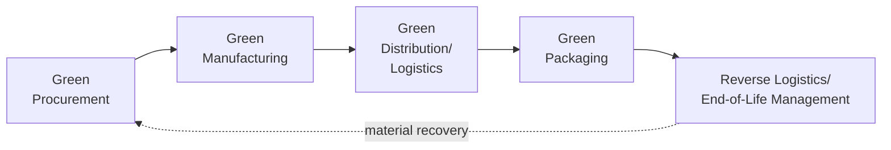
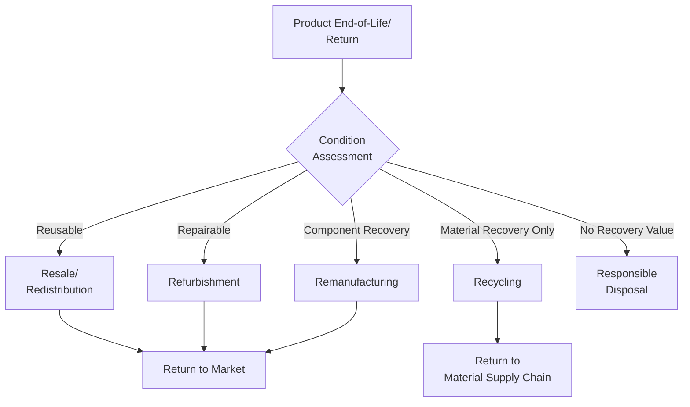

## Green Supply Chain Management

### Overview

Green supply chain management (GSCM) integrates environmental considerations into supply chain design and management — spanning supplier selection, procurement, production, distribution, and end-of-life product handling — with the aim of minimizing ecological impact while maintaining or improving operational and economic performance. GSCM extends environmental responsibility beyond an organization's own operations to encompass the full network of suppliers, logistics providers, and downstream partners involved in bringing a product to market and managing its eventual disposal or recovery.

### Foundational Concepts

#### Scope of Green Supply Chain Management

**Key Points**

- GSCM differs from traditional supply chain management primarily by explicitly incorporating environmental criteria (emissions, resource consumption, waste, hazardous material content) alongside traditional cost, quality, and delivery performance criteria at each stage
- The closed-loop element (reverse logistics feeding back into procurement via recovered materials) distinguishes GSCM from a purely linear "green" supply chain that addresses environmental impact only in forward-flow activities

#### Relationship to Sustainable Operations Strategy and Circular Economy

GSCM operationalizes the environmental dimension of broader sustainable operations strategy specifically within the supply chain function, and frequently draws on circular economy principles (material recovery, remanufacturing, closed-loop material flows) as core design elements rather than optional add-ons.

### Green Procurement and Supplier Management

#### Supplier Environmental Assessment

**Key Points**

- Organizations increasingly incorporate environmental performance criteria into supplier selection and evaluation processes, alongside traditional criteria like cost, quality, and delivery reliability
- Common assessment approaches include supplier environmental questionnaires, third-party environmental certifications (e.g., ISO 14001), and increasingly, direct emissions data reporting from suppliers
- Supplier scorecards incorporating environmental metrics (emissions intensity, waste management practices, hazardous substance compliance) alongside traditional performance dimensions are a widely used practical tool for ongoing supplier management

#### Sustainable Material Sourcing

Involves sourcing decisions that account for material environmental footprint, responsible extraction practices, and traceability — including practices such as sourcing recycled or renewable materials over virgin/non-renewable alternatives where feasible, and avoiding materials associated with significant environmental degradation (e.g., certain conflict minerals, unsustainably harvested timber).

#### Supplier Collaboration and Capability Building

**Key Points**

- Rather than solely applying compliance-based supplier auditing, many organizations engage in collaborative capability-building with key suppliers to jointly improve environmental performance, particularly for strategically important or high-impact suppliers
- [Inference] Collaborative approaches generally prove more effective than purely punitive compliance enforcement for driving meaningful supplier environmental improvement, particularly for suppliers lacking the technical or financial capacity for unilateral environmental investment, though the appropriate mix of collaboration versus enforcement varies by supplier relationship context

### Green Manufacturing and Production

#### Resource Efficiency in Production

Extends Lean manufacturing waste-reduction principles with explicit environmental framing: reducing material waste, energy consumption, and water use per unit of output, often through process redesign, equipment upgrades, or production scheduling optimization.

#### Hazardous Substance Management

Compliance with regulations restricting hazardous substances in products and processes (e.g., RoHS — Restriction of Hazardous Substances — in electronics manufacturing) requires substitution of restricted materials and verification throughout multi-tier supply chains where restricted substances might otherwise enter unknowingly through sub-tier suppliers.

#### Design for Environment (DfE)

Incorporating environmental considerations into product design decisions upstream of manufacturing, including designing for disassembly, material reduction, recyclability, and using fewer or more easily separable material types — decisions that significantly influence downstream environmental impact and reverse logistics feasibility.

### Green Logistics and Distribution

#### Transportation Optimization

**Key Points**

- Route optimization, load consolidation, and modal shift (e.g., shifting from air to sea/rail freight where transit time permits) are common levers for reducing transportation-related emissions
- Network design decisions (warehouse and distribution center location relative to demand centers) directly influence transportation distance and associated emissions, making facility location a green logistics consideration rather than purely a cost/service optimization

$$\text{Transportation Emissions} = \text{Distance} \times \text{Weight/Volume} \times \text{Emission Factor}_{mode}$$

Emission factors vary substantially by transportation mode, generally following the pattern: air freight has the highest per-unit emissions, followed by road, then rail, with ocean freight typically having the lowest per-unit emissions among common freight modes — though specific figures depend on vehicle/vessel type, load factor, and fuel source.

#### Green Warehousing

Energy-efficient warehouse design and operation (LED lighting, optimized HVAC, on-site renewable energy generation) alongside warehouse management practices that reduce unnecessary movement and energy consumption within storage and fulfillment operations.

#### Alternative Fuel and Electric Vehicle Fleets

Transitioning logistics fleets toward lower-emission alternatives (electric vehicles, biofuels, hydrogen) represents a growing lever for reducing transportation emissions, though adoption is often constrained by charging/refueling infrastructure availability and vehicle range considerations for longer-haul applications.

### Green Packaging

**Key Points**

- Packaging optimization strategies include material reduction (right-sizing packaging to product dimensions), material substitution (recyclable or biodegradable materials replacing non-recyclable alternatives), and reusable packaging systems for business-to-business logistics
- Packaging decisions involve tradeoffs: reduced packaging material can increase product damage risk during transit, potentially offsetting environmental gains through increased returns, replacement production, and associated waste — requiring holistic evaluation rather than optimizing packaging weight in isolation

### Reverse Logistics and End-of-Life Management

**Key Points**

- Reverse logistics network design (collection points, return processing facilities) requires distinct operational planning from forward logistics, often involving different volume patterns, transportation economics, and processing requirements
- Remanufacturing (restoring used products to like-new condition) generally recovers more economic and environmental value than recycling (which recovers only raw material value), making the condition-assessment decision point in the diagram above operationally and environmentally significant
- Extended Producer Responsibility (EPR) regulations, adopted in various forms across multiple jurisdictions, place responsibility on manufacturers for the end-of-life management of their products, creating regulatory incentive for reverse logistics capability development

### Measurement and Performance Frameworks

#### Supply Chain Carbon Footprint Analysis

Applying the Scope 1/2/3 emissions framework specifically to supply chain analysis, with particular attention to Scope 3 (value chain) emissions, which for many organizations represent the largest share of total emissions and are predominantly generated through supplier and logistics activities rather than direct operations.

#### Green Supply Chain KPIs

| Metric Category | Example Metrics |
| --- | --- |
| Emissions | Supply chain carbon footprint, transportation emissions per unit shipped |
| Supplier Performance | Percentage of suppliers meeting environmental certification standards |
| Material Efficiency | Recycled material content percentage, packaging material per unit shipped |
| Circularity | Product return/recovery rate, remanufactured product percentage |
| Compliance | Hazardous substance compliance rate across supply tiers |

### Standards and Certifications Relevant to GSCM

| Standard/Certification | Focus |
| --- | --- |
| ISO 14001 | Environmental management systems (applicable to suppliers and own operations) |
| ISO 14040/14044 | Life cycle assessment methodology standards |
| Cradle to Cradle Certified | Product and material circularity certification |
| Forest Stewardship Council (FSC) | Responsible forestry and wood/paper sourcing |
| RoHS/REACH | Hazardous substance restriction compliance (electronics and chemicals respectively) |

[Unverified] Specific regulatory requirements under frameworks such as RoHS and REACH continue to evolve, and current compliance obligations for a given product category and market should be verified against current regulatory text rather than assumed static.

### Implementation Challenges

#### Multi-Tier Supply Chain Visibility

**Key Points**

- Environmental impact and compliance risk (e.g., hazardous substances, labor practices, conflict minerals) frequently originate not at an organization's direct (Tier 1) suppliers but at deeper sub-tier suppliers, where visibility and control are considerably more limited
- Achieving meaningful multi-tier supply chain visibility typically requires either direct sub-tier supplier engagement or reliance on Tier 1 suppliers to cascade requirements downstream — both of which present practical verification challenges
- Technologies such as blockchain-based traceability and supplier collaboration platforms are increasingly applied to address this visibility gap, though [Inference] their effectiveness generally depends on achieving sufficient participation and data accuracy across multiple independent supply chain tiers

#### Cost-Environmental Performance Tradeoffs

While resource efficiency initiatives (reduced material/energy waste) frequently align cost reduction with environmental benefit, other GSCM initiatives (premium sustainable materials, alternative fuel logistics, extensive supplier auditing) can carry near-term cost premiums, requiring organizations to weigh these investments against long-term risk mitigation, brand, and regulatory anticipation benefits.

### Common Pitfalls

**Key Points**

- Focusing green supply chain efforts primarily on Tier 1 suppliers and direct operations while overlooking greater environmental impact or compliance risk in deeper supply chain tiers
- Optimizing individual GSCM elements (e.g., packaging weight reduction) in isolation without considering system-wide tradeoffs (e.g., increased product damage and associated waste)
- Treating supplier environmental compliance as a one-time audit rather than an ongoing collaborative and monitoring relationship
- Insufficient data infrastructure to verify actual supply chain environmental performance, relying on self-reported supplier claims without independent verification

### Related Topics

- Sustainable operations strategy
- Circular economy and reverse logistics
- Life cycle assessment (LCA) methodology
- Blockchain in supply chain management
- Supply chain risk management
- Extended producer responsibility (EPR) regulations
- Design for environment and sustainable product design