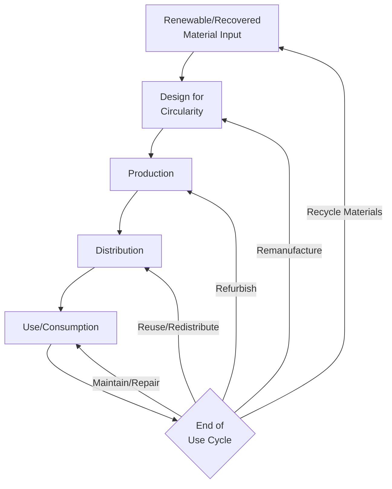
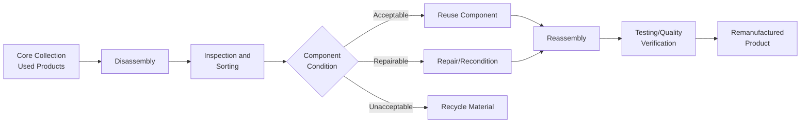

## Circular Economy Principles in Operations

### Overview

Circular economy principles in operations involve redesigning production systems, product architectures, and material flows to eliminate waste, keep materials and products in productive use for as long as possible, and regenerate natural systems — replacing the traditional linear "take-make-dispose" industrial model. Within operations management, this represents a systemic shift in how facilities, processes, and supply networks are designed, moving beyond incremental waste reduction toward fundamentally closed-loop material and product flows.

### Foundational Concepts

#### Linear vs. Circular Economic Models

**Key Points**

- The circular model introduces multiple recovery loops (maintain, reuse, refurbish, remanufacture, recycle) rather than a single end-of-life disposal pathway, and generally prioritizes tighter, higher-value loops (maintenance, reuse) over looser, lower-value loops (material recycling) since tighter loops preserve more of the original product's embedded value and energy
- This value hierarchy is often referred to as the "R-strategies" or "waste hierarchy," extending beyond the traditional reduce-reuse-recycle framework

#### The R-Strategy Hierarchy

| Strategy | Description | Value Retention |
| --- | --- | --- |
| Refuse/Rethink | Eliminating need for the product or redesigning its function entirely | Highest |
| Reduce | Using fewer materials/resources in production and use | High |
| Reuse | Using a product again for the same purpose without modification | High |
| Repair | Fixing a defective product to restore its function | High |
| Refurbish | Restoring an older product to good working condition | Medium-High |
| Remanufacture | Disassembling a product and rebuilding it to original specifications | Medium-High |
| Repurpose | Using a discarded product or components for a different function | Medium |
| Recycle | Processing materials to recover raw material value | Lower |
| Recover (Energy) | Incinerating materials to recover energy content | Lowest (of recovery options) |

**Key Points**

- Strategies toward the top of the hierarchy generally require less energy and material reprocessing, and preserve more of the value embedded in the original manufacturing process, compared to strategies further down
- [Inference] Operations strategy design generally aims to enable higher-value loops where technically and economically feasible for a given product category, though the appropriate mix of strategies depends heavily on product type, materials involved, and market conditions for recovered goods

### Design for Circularity

#### Design for Disassembly (DfD)

Product design decisions that facilitate easy separation of components and materials at end-of-life, including standardized fasteners (avoiding permanent adhesives where feasible), modular architecture, and clear material labeling to support sorting.

#### Material Selection for Circularity

**Key Points**

- Favoring single-material components over composite/mixed-material assemblies where feasible, since material separation is required before recycling and mixed materials are often more difficult or costly to separate
- Selecting materials with established recycling infrastructure and market demand for recovered material, since a material being technically recyclable does not guarantee an economically viable recycling pathway exists
- Incorporating recycled content into new production reduces demand for virgin material extraction and can create market pull supporting the broader recycling ecosystem

#### Modularity and Standardization

Designing products with modular, standardized components extends product life through easier repair and component upgrade, and simplifies remanufacturing by enabling component-level replacement rather than requiring full product disassembly and rebuild.

### Circular Business Models in Operations

#### Product-as-a-Service (PaaS)

**Key Points**

- Shifts the business model from selling products outright to providing the function of a product as a service (e.g., leasing equipment rather than selling it), retaining ownership and end-of-life responsibility with the provider
- This model creates a direct operational and financial incentive for the manufacturer to design products for durability, repairability, and recyclability, since the provider bears the cost of eventual product recovery and refurbishment rather than transferring that cost entirely to the customer
- Requires operational capabilities not always present in traditional product-selling organizations: reverse logistics networks, refurbishment facilities, and usage-based service and maintenance operations

#### Remanufacturing Operations

Remanufacturing involves disassembling used products, inspecting and sorting components, replacing or repairing worn components, and reassembling to original (or equivalent) performance specifications, generally at meaningfully lower cost and environmental impact than manufacturing an equivalent new product.

**Key Points**

- "Core" refers to the used product or component collected as the input to a remanufacturing process; consistent core supply (volume and quality/condition) is a common operational challenge, since core availability depends on external product return patterns rather than being directly controllable like raw material procurement
- Remanufactured products typically carry the same performance warranty as new equivalents, distinguishing remanufacturing from simple refurbishment, which may not restore full original specification performance

#### Industrial Symbiosis

Arrangements where the waste or by-product output of one operation serves as an input material for another operation, often between geographically co-located but otherwise unrelated organizations, reducing aggregate waste and virgin material demand across the participating network.

**Example**

A widely cited industrial symbiosis case is the Kalundborg Eco-Industrial Park in Denmark, where a power plant's excess steam and heat supply nearby facilities, a pharmaceutical plant's biological sludge is used as fertilizer, and fly ash from power generation is used in cement production — illustrating how by-products from one process can serve as functional inputs to otherwise unrelated processes when facilities are appropriately co-located and coordinated.

### Reverse Logistics Network Design

**Key Points**

- Circular operations require reverse logistics capability distinct from forward distribution logistics: collection point network design, sorting/grading facilities, and processing routing decisions (reuse vs. remanufacture vs. recycle) based on returned product condition
- Reverse logistics volume and timing are often less predictable than forward logistics, since they depend on external factors like product end-of-life timing and customer return behavior, complicating capacity planning compared to demand-driven forward logistics
- Network design decisions must balance collection point density (affecting collection convenience and participation rates) against processing facility consolidation (affecting processing cost efficiency through scale)

### Measuring Circularity

#### Material Circularity Indicators

**Key Points**

- Metrics such as recycled/reused material input percentage, product lifetime extension (compared to industry baseline), and end-of-life recovery rate are commonly used to assess a product or operation's circularity performance
- The Ellen MacArthur Foundation's Material Circularity Indicator (MCI) is a frequently referenced framework combining recycled input content, recycled output potential, and product utility/lifetime into a composite circularity score
- [Inference] No single universally standardized circularity metric currently dominates industry practice, and organizations often adapt or combine multiple frameworks depending on their specific product category and reporting requirements

#### Circular Economy KPIs for Operations

| Metric | Description |
| --- | --- |
| Recycled Content Rate | Percentage of recycled/recovered material in production inputs |
| Product Take-Back Rate | Percentage of sold products returned at end-of-life |
| Remanufacturing Yield | Percentage of returned cores successfully remanufactured to specification |
| Material Recovery Rate | Percentage of material recovered (by weight) from end-of-life products |
| Landfill Diversion Rate | Percentage of operational and end-of-life waste diverted from landfill |

### Integration with Broader Operations Functions

| Function | Circular Economy Integration |
| --- | --- |
| Product Design | Design for disassembly, modularity, material selection |
| Procurement | Recycled/recovered material sourcing, supplier take-back agreements |
| Production | Remanufacturing process capability, flexible processes accommodating variable-condition cores |
| Logistics | Reverse logistics network, core collection infrastructure |
| Inventory Management | Spare parts strategy incorporating remanufactured/refurbished options |

### Implementation Challenges

**Key Points**

- Circular business models often require significant upfront investment in reverse logistics infrastructure and remanufacturing capability before revenue or cost benefits materialize, presenting a capital allocation challenge relative to conventional linear operations
- Consistent, high-quality core supply for remanufacturing is often difficult to guarantee, since it depends on external product usage and return behavior rather than being directly controlled by the manufacturer
- Market acceptance of remanufactured or refurbished products can vary by industry and customer segment, requiring marketing and warranty strategies to address potential quality perception concerns
- Regulatory and standards frameworks for circular products (e.g., defining acceptable remanufacturing quality standards) are less mature and consistent across jurisdictions compared to established standards for new product manufacturing

### Common Pitfalls

**Key Points**

- Pursuing recycling-focused strategies (lower on the value hierarchy) while neglecting higher-value strategies like design for reuse, repair, and remanufacturing that would preserve more product value
- Underestimating the reverse logistics and core supply management capability required to sustain circular business models at scale
- Designing circular initiatives around a single product line without considering system-wide material and process integration opportunities (e.g., industrial symbiosis potential)
- Treating circularity purely as an environmental initiative rather than integrating it into core business model and operational strategy design

### Related Topics

- Sustainable operations strategy
- Green supply chain management and reverse logistics
- Product-as-a-service and servitization business models
- Design for manufacturing, assembly, and disassembly
- Spare parts inventory strategy and remanufacturing
- Life cycle assessment (LCA) methodology
- Industrial symbiosis and eco-industrial parks