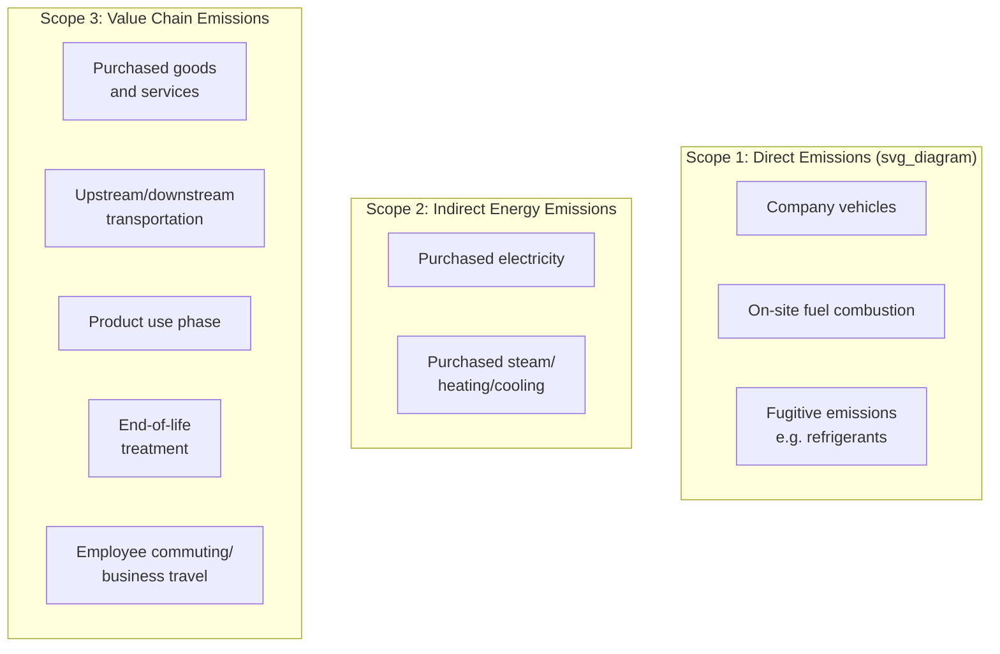
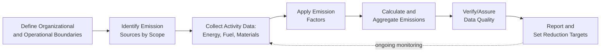

## Carbon Footprint Measurement and Reduction

### Overview

Carbon footprint measurement and reduction encompasses the methodologies used to quantify greenhouse gas (GHG) emissions attributable to an organization's operations and value chain, and the strategic and operational levers used to reduce those emissions over time. Within operations management, this discipline requires establishing measurement boundaries, applying standardized accounting protocols, and integrating reduction targets into operational decision-making across facilities, processes, and supply chains.

### Foundational Concepts

#### Greenhouse Gas Protocol Scope Framework

The GHG Protocol, developed by the World Resources Institute and World Business Council for Sustainable Development, is the most widely referenced standard for corporate carbon accounting, organizing emissions into three scopes:

| Scope | Definition | Operations Examples |
| --- | --- | --- |
| Scope 1 | Direct emissions from owned or controlled sources | Company fleet fuel combustion, on-site boilers, process emissions |
| Scope 2 | Indirect emissions from purchased energy | Grid electricity consumption at facilities |
| Scope 3 | All other indirect emissions across the value chain | Supplier emissions, logistics, product use, waste disposal |

**Key Points**

- Scope 3 is further subdivided into 15 categories under the GHG Protocol (e.g., purchased goods and services, upstream transportation, business travel, use of sold products), and typically represents the largest and most difficult-to-measure share of total emissions for most organizations, since it depends on data from external parties across the value chain
- [Inference] The relative proportion of Scope 1, 2, and 3 emissions varies substantially by industry; asset-heavy manufacturing organizations may have proportionally larger Scope 1/2 footprints than organizations with outsourced production, where Scope 3 typically dominates

### Carbon Accounting Methodology

#### Emissions Calculation Approach

The general calculation method multiplies activity data by an emissions factor specific to that activity type:

$$Emissions = \text{Activity Data} \times \text{Emissions Factor}$$

**Example**

A facility consumes 500,000 kWh of grid electricity in a reporting period. Using a regional grid emissions factor of 0.45 kg CO2e per kWh (a figure that varies substantially by region based on the local electricity generation mix):

$$Emissions = 500{,}000 \text{ kWh} \times 0.45 \text{ kg CO}_2\text{e/kWh} = 225{,}000 \text{ kg CO}_2\text{e} = 225 \text{ metric tons CO}_2\text{e}$$

[Inference] Actual applicable emissions factors vary by region, energy provider, and reporting year as grid generation mixes change, so current, jurisdiction-specific emissions factors should be used rather than generic assumed values for any actual carbon accounting exercise.

#### CO2 Equivalent (CO2e) Standardization

Different greenhouse gases have different global warming potentials (GWP); emissions are standardized to CO2 equivalent units to allow aggregate comparison:

$$CO_2e = \sum_{i} (\text{Mass of gas}_i \times GWP_i)$$

| Gas | Approximate 100-Year GWP (relative to CO2) |
| --- | --- |
| Carbon Dioxide (CO2) | 1 |
| Methane (CH4) | ~28-36 |
| Nitrous Oxide (N2O) | ~265-298 |

[Unverified] Specific GWP values are periodically revised by the Intergovernmental Panel on Climate Change (IPCC) across assessment reports; current authoritative GWP figures should be verified against the most recent IPCC assessment report rather than assumed fixed indefinitely.

#### Location-Based vs. Market-Based Scope 2 Accounting

**Key Points**

- **Location-based accounting** uses average emissions factors for the local electricity grid, reflecting the physical reality of the grid mix serving a facility's location
- **Market-based accounting** reflects emissions from the specific electricity products an organization has contractually chosen (e.g., renewable energy certificates or power purchase agreements), which can differ substantially from the local grid average
- Organizations following the GHG Protocol are generally expected to report both methods, since they can produce meaningfully different results and each conveys different information about physical grid impact versus contractual/market choices

### Measurement Boundaries and Organizational Scope

#### Operational vs. Financial Control Approaches

| Approach | Boundary Definition |
| --- | --- |
| Equity Share | Emissions accounted for in proportion to equity ownership stake |
| Financial Control | Emissions from operations where the organization has financial control, regardless of ownership percentage |
| Operational Control | Emissions from operations where the organization has full authority to implement operating policies |

[Inference] The choice of boundary approach affects which facilities and operations are included in an organization's reported footprint, and organizations typically select and consistently apply one approach based on their organizational structure and reporting objectives, since switching approaches between reporting periods complicates trend comparison.

### Measurement Process and Data Infrastructure

**Key Points**

- Activity data collection for Scope 1 and 2 emissions is generally more straightforward, drawing on directly metered energy consumption and fuel purchase records within an organization's own operational boundary
- Scope 3 data collection is considerably more challenging, often requiring supplier engagement, spend-based estimation (using industry-average emissions factors applied to procurement spend data), or hybrid approaches combining supplier-specific data where available with estimated data elsewhere
- Third-party verification/assurance of reported emissions data is increasingly common and, in some jurisdictions, required, to provide external validation of reporting accuracy

### Carbon Reduction Strategies by Scope

#### Scope 1 Reduction Levers

- Fleet electrification or transition to lower-emission fuel alternatives
- Process efficiency improvements reducing on-site fuel combustion requirements
- Refrigerant management programs addressing fugitive emissions from cooling and refrigeration equipment
- Fuel switching (e.g., natural gas to lower-carbon alternatives) for industrial heating processes

#### Scope 2 Reduction Levers

- Energy efficiency improvements reducing overall electricity consumption
- On-site renewable energy generation (solar, wind) directly reducing grid electricity purchases
- Power Purchase Agreements (PPAs) contracting for renewable electricity supply
- Renewable Energy Certificate (REC) purchases supporting market-based accounting improvements, though [Inference] the extent to which REC purchases alone drive genuine additional renewable generation (versus simply reallocating existing renewable output) is a subject of ongoing debate in carbon accounting practice

#### Scope 3 Reduction Levers

**Key Points**

- Supplier engagement programs encouraging or requiring upstream emissions reduction, sometimes incorporated into supplier scorecards or procurement criteria
- Product design changes reducing material intensity or shifting to lower-carbon materials, addressing purchased goods and use-phase emissions categories
- Logistics network optimization and modal shift (as discussed under green supply chain management) to reduce transportation-related emissions
- Given that Scope 3 typically represents the largest share of total emissions for many organizations, meaningful overall footprint reduction generally requires sustained supply chain engagement rather than focusing exclusively on direct operational improvements

### Target Setting Frameworks

#### Science-Based Targets

**Key Points**

- The Science Based Targets initiative (SBTi) provides a framework for organizations to set emissions reduction targets aligned with the level of decarbonization required to limit global warming to specific thresholds (e.g., 1.5°C) consistent with the Paris Agreement
- Science-based targets typically require inclusion of Scope 3 emissions where they represent a significant share of an organization's total footprint, rather than allowing organizations to set targets covering only Scope 1 and 2
- [Unverified] Specific SBTi methodology requirements and target validation criteria are periodically updated; current criteria should be verified against SBTi's published guidance rather than assumed static

#### Net Zero and Carbon Neutrality Distinctions

| Term | General Definition |
| --- | --- |
| Carbon Neutral | Emissions offset through purchased carbon credits/offsets to achieve net-zero reported footprint |
| Net Zero | Emissions reduced as far as technically feasible, with only residual, hard-to-abate emissions addressed through high-quality removal offsets |
| Carbon Negative | Removing more carbon from the atmosphere than the organization emits |

[Inference] These terms are used with varying rigor across organizations and are not always consistently defined or independently verified, so claims using these terms should generally be evaluated against the specific methodology and third-party verification (if any) backing the claim, rather than assumed to meet a single universal standard.

### Carbon Offsets and Removal

**Key Points**

- Carbon offsets represent emissions reductions or removals achieved elsewhere (e.g., reforestation, renewable energy projects) purchased to compensate for an organization's own emissions
- Offset quality varies considerably, with key considerations including additionality (whether the reduction would have occurred without the offset funding), permanence (particularly relevant for nature-based removal projects vulnerable to reversal, e.g., forest fires), and verification rigor
- [Inference] Best practice generally emphasizes prioritizing direct emissions reduction over offset reliance, using offsets primarily for genuinely hard-to-abate residual emissions rather than as a substitute for operational decarbonization, though organizational practice varies considerably in how this principle is applied

### Integration with Operations Decision-Making

**Key Points**

- Internal carbon pricing — assigning a notional cost per ton of CO2e to internal capital allocation and operational decisions — is a mechanism some organizations use to incorporate carbon considerations directly into standard financial decision-making processes (e.g., equipment purchase evaluations, facility siting decisions)
- Carbon footprint data increasingly informs facility location decisions, supplier selection, transportation mode selection, and product design choices as a standard input alongside traditional cost and performance criteria
- Embedding emissions considerations into existing operational KPI frameworks (alongside cost, quality, delivery) supports more consistent day-to-day integration compared to treating carbon management as a separate, periodic reporting exercise

### Common Pitfalls

**Key Points**

- Focusing measurement and reduction efforts primarily on Scope 1 and 2 emissions while underestimating the often-larger Scope 3 footprint
- Relying on generic or outdated emissions factors rather than region- and time-specific factors, introducing measurement inaccuracy
- Overreliance on carbon offsets as a substitute for genuine operational emissions reduction, exposing the organization to reputational risk if offset quality or additionality is later questioned
- Setting emissions targets without establishing the underlying data infrastructure and measurement rigor needed to track progress reliably over time

### Related Topics

- Sustainable operations strategy
- Green supply chain management
- Life cycle assessment (LCA) methodology
- Circular economy principles in operations
- Energy management and renewable energy procurement
- ESG reporting and regulatory disclosure frameworks