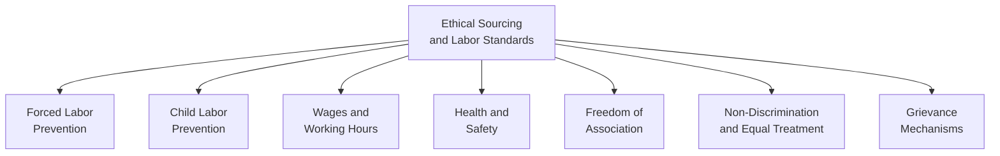
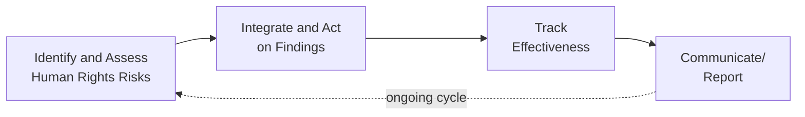
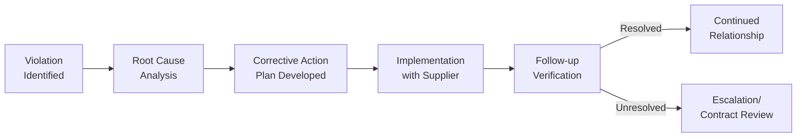

## Ethical Sourcing and Labor Standards

### Overview

Ethical sourcing and labor standards encompass the policies, standards, and operational practices organizations use to ensure that products and materials are procured through supply chains that respect worker rights, provide safe working conditions, and avoid practices such as forced labor, child labor, and unsafe workplace conditions. Within operations management, this discipline requires embedding labor and human rights criteria into supplier selection, contract management, and ongoing supply chain monitoring, extending ethical responsibility beyond an organization's own workforce to its full supplier network.

### Foundational Concepts

#### Core International Labor Standards

**Key Points**

- The International Labour Organization (ILO) establishes foundational international labor standards frequently referenced as the baseline for ethical sourcing programs, including prohibitions on forced labor, child labor, and discrimination, alongside protections for freedom of association and collective bargaining
- These standards are commonly referred to as the ILO's fundamental conventions or, collectively with related principles, the basis for widely used private-sector codes of conduct
- [Inference] While ILO conventions establish international norms, actual enforcement and legal applicability depend on individual country ratification and domestic law, meaning ethical sourcing programs typically rely on private supplier codes of conduct and auditing to enforce standards beyond what may be locally mandated

#### Scope of Ethical Sourcing Concerns

### Supply Chain Labor Risk Assessment

#### Multi-Tier Risk Considerations

**Key Points**

- Labor risk in supply chains is generally understood to increase at deeper supply chain tiers, since Tier 1 suppliers (with whom an organization has direct contracts) are typically subject to greater scrutiny than sub-tier suppliers providing raw materials or components further upstream
- Risk factors commonly used to prioritize supply chain labor due diligence include: country-level labor rights risk indices, industry sector risk (e.g., labor-intensive manufacturing, agriculture, and extractives are commonly flagged as higher-risk sectors), and the presence of vulnerable worker populations (migrant workers, informal labor arrangements)
- Achieving visibility into sub-tier suppliers is a widely cited practical challenge, since organizations often lack direct contractual relationships or leverage over suppliers beyond their immediate Tier 1 partners

#### Human Rights Due Diligence

A structured process for identifying, preventing, mitigating, and accounting for how an organization addresses actual and potential adverse human rights impacts, drawing on frameworks such as the UN Guiding Principles on Business and Human Rights.

### Supplier Code of Conduct and Compliance Mechanisms

#### Code of Conduct Development

**Key Points**

- Organizations typically establish supplier codes of conduct specifying minimum labor standards suppliers must meet, often referencing established frameworks (ILO conventions, applicable local law, whichever is more stringent) rather than creating entirely independent standards
- Codes of conduct commonly address the core areas outlined above (forced labor, child labor, wages/hours, health and safety, freedom of association) alongside environmental and business ethics provisions in a combined supplier code
- Contractual incorporation of the code of conduct (making compliance a condition of the supply agreement) provides the legal basis for compliance enforcement and, where necessary, contract termination

#### Third-Party Social Compliance Auditing

**Key Points**

- Independent third-party audits assess supplier facilities against code of conduct requirements, typically combining document review (payroll records, worker age documentation, working hour logs), facility inspection, and worker interviews
- Audit frequency and rigor are commonly risk-tiered, with higher-risk suppliers (by country, sector, or prior audit findings) subject to more frequent or unannounced audits compared to lower-risk suppliers
- [Inference] Traditional announced, document-based auditing has documented limitations in detecting certain violations (e.g., coached worker interviews, falsified records), leading many organizations to supplement or replace it with unannounced audits, worker voice technology, and other verification methods, though the relative effectiveness of these approaches continues to be debated in practice

#### Industry Multi-Stakeholder Initiatives

Rather than each organization independently auditing shared suppliers, many industries have developed collaborative auditing and certification programs allowing shared suppliers to be audited once against a common standard, with results shared among participating buyer organizations, reducing audit duplication and audit fatigue for suppliers serving multiple customers.

### Common Labor Standard Violations and Detection Indicators

| Violation Category | Common Detection Indicators |
| --- | --- |
| Forced Labor | Retention of worker identity documents, debt bondage/recruitment fee indicators, restricted worker movement |
| Child Labor | Inadequate age verification documentation, workers appearing younger than minimum working age |
| Excessive Working Hours | Payroll/time records showing hours exceeding legal or code limits, inconsistent record-keeping |
| Unsafe Working Conditions | Inadequate safety equipment, blocked emergency exits, absence of safety training records |
| Wage Violations | Payment below minimum wage, unauthorized wage deductions, delayed wage payment |
| Suppression of Association | Absence of worker representation mechanisms, retaliation against worker organizing |

[Inference] These indicators support risk identification but do not by themselves confirm a violation has occurred; confirmed findings generally require the fuller due diligence process (documentation review, worker interviews, facility inspection) described above, applied by appropriately trained auditors.

### Worker Voice and Grievance Mechanisms

**Key Points**

- Establishing accessible grievance mechanisms — channels through which workers can report concerns or violations without fear of retaliation — is increasingly recognized as a critical complement to periodic auditing, since audits provide only a point-in-time snapshot while grievance mechanisms can surface ongoing issues
- Worker voice technology platforms (e.g., anonymous mobile surveys or hotlines) have been adopted by some organizations to gather ongoing worker feedback outside the traditional audit cycle, intended to address some of the detection limitations of announced, document-based auditing
- Effective grievance mechanisms generally require credible non-retaliation protections and responsive remediation processes, since a grievance channel without meaningful follow-through does not meaningfully improve worker outcomes

### Remediation and Corrective Action

**Key Points**

- Best practice generally favors a remediation-first approach — working with suppliers to correct violations and build sustainable compliance capability — over immediate contract termination, since termination can shift the affected workers' situation to an unknown (and potentially worse) subsequent buyer relationship without addressing the underlying issue
- Severe violations (e.g., confirmed forced labor or child labor) typically warrant more immediate and serious response, potentially including contract suspension, distinguishing them from less severe compliance gaps addressable through corrective action planning
- [Inference] The appropriate balance between remediation support and contract consequences generally depends on violation severity, supplier responsiveness, and the specific risk of worker harm from either continuing or ending the relationship, and is typically evaluated case-by-case rather than through a single fixed policy response

### Regulatory and Legal Context

| Framework/Regulation | Focus |
| --- | --- |
| UN Guiding Principles on Business and Human Rights | Foundational framework for corporate human rights due diligence |
| UK Modern Slavery Act | Requires qualifying organizations to report on steps taken to address modern slavery in supply chains |
| US Uyghur Forced Labor Prevention Act | Restricts imports of goods linked to forced labor in specific regions |
| EU Corporate Sustainability Due Diligence Directive | Mandates human rights and environmental due diligence for qualifying companies |

[Unverified] Regulatory requirements in this area are evolving rapidly across multiple jurisdictions, with new mandatory due diligence legislation periodically introduced; specific current legal obligations for a given organization's operating and sourcing jurisdictions should be verified against current legal text and legal counsel rather than assumed static from any single reference point.

### Integration with Broader Sustainability Strategy

Ethical sourcing represents the social dimension of the triple bottom line framework discussed under sustainable operations strategy, and is increasingly integrated alongside environmental supplier criteria within combined supplier scorecards and codes of conduct, rather than managed as an entirely separate program from environmental green supply chain management initiatives.

### Measurement and KPIs

| Metric | Description |
| --- | --- |
| Supplier Audit Compliance Rate | Percentage of audited suppliers meeting code of conduct standards |
| Corrective Action Closure Rate | Percentage of identified violations successfully remediated within a target timeframe |
| Grievance Mechanism Utilization | Number and resolution rate of worker-submitted grievances |
| Sub-Tier Visibility Coverage | Percentage of supply chain (by tier or spend) with established labor risk visibility |
| Training Completion Rate | Percentage of relevant suppliers/workers completing labor rights and compliance training |

### Common Pitfalls

**Key Points**

- Relying exclusively on announced, document-based audits, which have documented limitations in detecting sophisticated violations such as coached interviews or falsified records
- Focusing compliance efforts on Tier 1 suppliers while lacking visibility into higher-risk sub-tier suppliers where violations may be more prevalent
- Responding to violations with immediate contract termination without considering whether remediation would better serve affected workers' interests
- Treating ethical sourcing as a compliance/audit exercise disconnected from broader supplier relationship management and procurement decision-making, limiting the organization's practical leverage to drive sustained improvement

### Related Topics

- Sustainable operations strategy
- Green supply chain management
- Supply chain risk management
- Corporate social responsibility (CSR) and ESG reporting
- Supplier relationship management
- Human rights due diligence frameworks