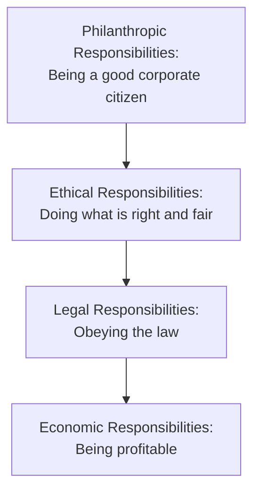
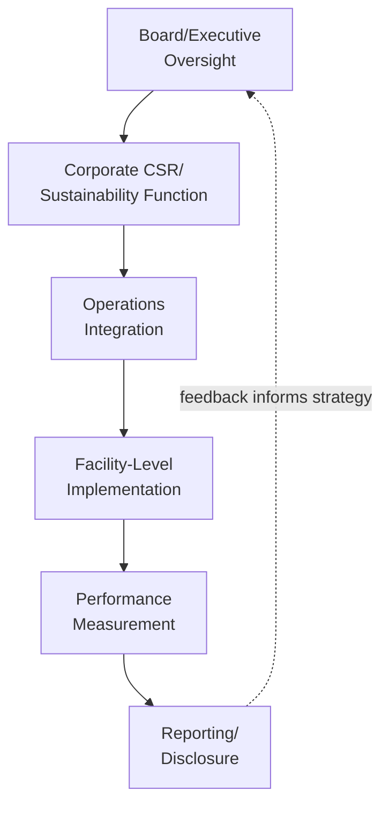

## Corporate Social Responsibility in Operations

### Overview

Corporate social responsibility (CSR) in operations refers to the integration of social, environmental, and ethical considerations into an organization's operational decision-making, extending an organization's accountability beyond shareholders to encompass employees, communities, customers, and broader society. Within operations management specifically, CSR translates into concrete practices spanning workforce treatment, community engagement, environmental stewardship, and stakeholder accountability embedded directly into how production, sourcing, and logistics activities are conducted, rather than existing solely as a separate corporate communications or philanthropic function.

### Foundational Concepts

#### CSR Relative to Related Frameworks

| Framework | Primary Focus | Relationship to Operations |
| --- | --- | --- |
| Corporate Social Responsibility (CSR) | Voluntary organizational commitment to social/environmental responsibility | Broad umbrella encompassing operational practices, philanthropy, and stakeholder engagement |
| Environmental, Social, and Governance (ESG) | Structured framework for measuring and reporting non-financial performance, often for investors | Provides measurable metrics that operations must generate data to support |
| Triple Bottom Line | Framework balancing economic, environmental, and social performance | Conceptual foundation often underlying both CSR and sustainable operations strategy |
| Sustainable Operations Strategy | Operations-specific integration of sustainability into strategic decisions | The operational execution layer through which many CSR commitments are realized |

**Key Points**

- CSR is often described as a broader, more voluntary and values-driven organizational commitment, while ESG typically refers to a more structured, metric-driven framework increasingly used by investors and regulators to assess non-financial performance
- [Inference] In practice, many organizations use these terms with overlapping or inconsistent boundaries, and the specific distinctions drawn between CSR, ESG, and sustainability terminology vary considerably across companies, industries, and reporting frameworks

#### Carroll's CSR Pyramid

A widely referenced framework describing the hierarchy of organizational responsibilities:

**Key Points**

- Carroll's model, introduced in 1979 and subsequently refined, positions economic viability as the foundational responsibility upon which legal, ethical, and philanthropic responsibilities are built, rather than treating profitability as separate from or in opposition to social responsibility
- Applied to operations, this suggests operational CSR initiatives should generally be evaluated not only for their social benefit but also for their compatibility with continued economic viability, since an organization unable to sustain profitable operations cannot sustain its broader social contributions

### CSR Dimensions Within Operations

#### Workforce and Labor Practices

Encompasses fair wages, safe working conditions, employee development opportunities, and diversity/inclusion practices within an organization's own operational workforce — overlapping substantially with, but distinct in scope from, the supply chain-focused ethical sourcing and labor standards discussed separately, since this dimension addresses the organization's direct employees rather than supplier workers.

#### Community Engagement and Local Economic Impact

**Key Points**

- Operations siting decisions (facility location, expansion, closure) carry significant community impact, including local employment effects, tax base contributions, and infrastructure demands, making community engagement a relevant operational consideration rather than purely a corporate affairs function
- Community investment programs (local hiring commitments, workforce training partnerships, infrastructure contributions) are commonly used to build positive community relationships around major operational facilities
- Facility closure or relocation decisions similarly carry substantial community impact, and CSR-oriented approaches often incorporate transition support (severance, retraining assistance, advance notice) beyond minimum legal requirements

#### Environmental Stewardship

Overlaps substantially with sustainable operations strategy and green supply chain management, encompassing emissions reduction, resource efficiency, and waste management as core CSR commitments operationalized through specific operational practices and targets.

#### Product Responsibility and Safety

Ensuring products manufactured meet safety standards and that operational quality processes adequately protect end consumers, extending beyond minimum regulatory compliance to proactive safety culture and transparent communication when issues arise (e.g., product recalls).

#### Philanthropic and Volunteer Programs

Operational facilities often serve as a base for community philanthropic activities (employee volunteer programs, in-kind donations of operational output or expertise), representing the more discretionary, "philanthropic responsibility" tier of Carroll's framework.

### CSR Governance and Organizational Integration

**Key Points**

- Effective integration of CSR into operations typically requires embedding responsibility within operational management structures (plant managers, operations leadership) rather than confining CSR exclusively to a separate corporate sustainability department disconnected from day-to-day operational decision-making
- Performance management systems that incorporate CSR-related metrics (safety incident rates, community investment, environmental performance) alongside traditional operational KPIs (cost, quality, delivery) support more consistent day-to-day integration
- [Inference] Organizations where CSR functions operate in isolation from operational decision-making structures more commonly experience a gap between stated CSR commitments and actual operational practice, though the specific organizational structures that best avoid this gap vary by company size and industry

### Stakeholder Engagement in Operations

**Key Points**

- CSR frameworks generally emphasize broader stakeholder consideration beyond shareholders alone, including employees, communities, customers, suppliers, and regulators, each with distinct operational touchpoints
- Stakeholder mapping and engagement processes help operations leaders identify which stakeholder concerns are most material to specific operational decisions (e.g., community concerns around a facility expansion, supplier concerns around payment terms and contract fairness)
- Materiality assessment — determining which social and environmental issues are most significant to both the organization and its stakeholders — is a commonly used process for prioritizing where operational CSR efforts should focus, since organizations typically cannot address all possible social and environmental considerations with equal intensity

### Measurement and Reporting Frameworks

| Framework | Focus |
| --- | --- |
| Global Reporting Initiative (GRI) | Comprehensive sustainability reporting standards spanning economic, environmental, and social topics |
| Sustainability Accounting Standards Board (SASB) | Industry-specific, financially material sustainability disclosure standards |
| UN Sustainable Development Goals (SDGs) | Framework for aligning organizational contributions with global development priorities |
| ISO 26000 | Guidance standard (non-certifiable) on social responsibility |

[Unverified] Reporting framework requirements and adoption are evolving, including ongoing convergence efforts between various sustainability reporting standards; current applicable frameworks for a specific organization's reporting jurisdiction should be verified against current guidance rather than assumed static.

#### CSR-Related Operational KPIs

| Metric Category | Example Metrics |
| --- | --- |
| Workforce | Lost-time injury frequency rate, employee turnover, training hours per employee |
| Community | Local hiring percentage, community investment spend, community grievance resolution rate |
| Environmental | Emissions, waste diversion, water use (overlapping with sustainable operations metrics) |
| Governance/Ethics | Ethics training completion, whistleblower/grievance case resolution |

### The Business Case for Operational CSR

**Key Points**

- Risk mitigation is frequently cited as a primary business justification, since poor labor practices, environmental incidents, or community conflict can result in regulatory penalties, reputational damage, and operational disruption (e.g., community opposition delaying facility permits)
- Talent attraction and retention benefits are commonly associated with strong CSR practices, particularly as workforce expectations around employer social responsibility have evolved
- Operational efficiency gains often accompany certain CSR initiatives (e.g., resource efficiency improvements that reduce both environmental impact and operating cost), aligning economic and social objectives in these specific cases
- [Inference] The strength of the business case varies by initiative type and industry context; not all CSR investments yield direct, quantifiable financial returns, and organizations often justify some initiatives (e.g., philanthropic community investment) primarily through qualitative reputational and stakeholder relationship benefits rather than direct financial ROI

### Common Pitfalls

**Key Points**

- "Greenwashing" or "CSR-washing" — overstating social responsibility performance through communications while core operational practices remain largely unchanged, carrying reputational risk if identified by stakeholders, media, or regulators
- Treating CSR as a separate corporate function disconnected from actual operational decision-making, resulting in a gap between stated commitments and on-the-ground practice
- Pursuing highly visible philanthropic initiatives while underinvesting in foundational operational responsibilities (safe working conditions, fair labor practices, environmental compliance) that Carroll's framework positions as more fundamental
- Insufficient stakeholder engagement leading to CSR initiatives that do not address the concerns stakeholders themselves consider most material

### Related Topics

- Sustainable operations strategy
- Ethical sourcing and labor standards
- Green supply chain management
- ESG reporting and regulatory disclosure frameworks
- Stakeholder management and materiality assessment
- Occupational health and safety management