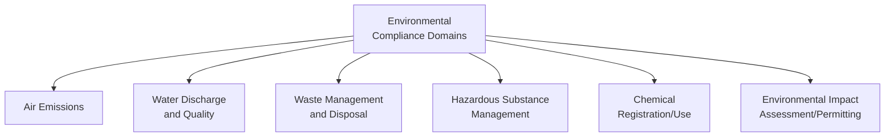
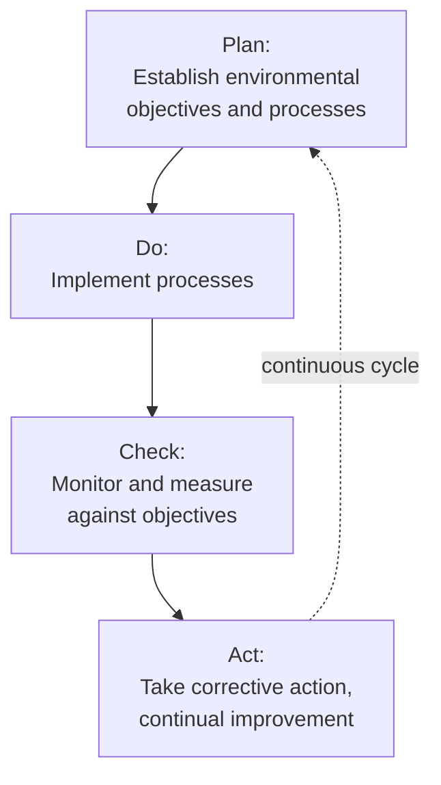
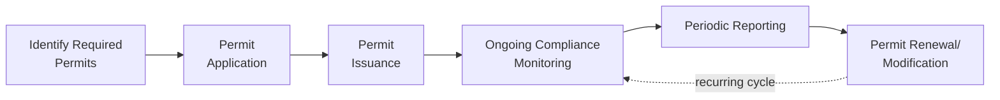

## Environmental Regulations and Compliance

### Overview

Environmental regulations and compliance encompass the legal requirements governing an organization's environmental impact — emissions, waste, water discharge, hazardous materials, and resource use — and the operational systems and processes used to ensure ongoing adherence to these requirements. Within operations management, environmental compliance functions as both a risk management necessity (avoiding legal penalties, operational shutdowns, and reputational damage) and, increasingly, a strategic consideration influencing facility design, process selection, and supply chain management decisions.

### Foundational Concepts

#### Regulatory Structure and Jurisdiction Layers

**Key Points**

- Environmental regulation typically operates across multiple jurisdictional layers — international agreements, national/federal law, and state/regional or local regulations — with organizations generally required to comply with the most stringent applicable requirement across all relevant layers
- Multinational organizations operating across jurisdictions face compliance complexity from varying and sometimes conflicting regulatory requirements, often necessitating either jurisdiction-specific compliance programs or adopting a single, most-stringent global standard applied uniformly across all operations
- [Inference] The specific regulatory requirements applicable to any given facility depend heavily on its precise location, industry classification, and activities, and should be verified against current, jurisdiction-specific regulatory sources and legal counsel rather than assumed from general principles alone

#### Major Regulatory Domains

### Key Regulatory Frameworks by Domain

#### Air Emissions

Regulations typically govern permissible emission levels for specific pollutants (particulate matter, sulfur oxides, nitrogen oxides, volatile organic compounds) from industrial sources, often requiring permits specifying emission limits, monitoring requirements, and reporting obligations.

**Key Points**

- Air permitting frameworks commonly categorize facilities by emission potential (e.g., "major source" vs. "minor source" classifications in various regulatory systems), with more stringent permitting and monitoring requirements typically applying to higher-emission facilities
- Continuous emissions monitoring systems (CEMS) are often required for larger industrial sources, providing real-time compliance data rather than relying solely on periodic testing

#### Water Discharge and Quality

Regulations governing wastewater discharge typically establish permissible pollutant concentration limits, requiring pretreatment before discharge to public water systems or the environment, alongside monitoring and reporting obligations.

**Example**

A manufacturing facility discharging process wastewater into a municipal sewer system typically operates under a discharge permit specifying maximum allowable concentrations for specific pollutants (e.g., heavy metals, pH range, biological oxygen demand). The facility installs pretreatment equipment to reduce pollutant concentrations before discharge and conducts periodic sampling to verify compliance, submitting results to the relevant regulatory authority as required by the permit — illustrating the combination of engineering controls and monitoring/reporting obligations typical of environmental compliance programs.

#### Waste Management and Disposal

**Key Points**

- Regulations typically distinguish between hazardous and non-hazardous waste categories, with hazardous waste subject to more stringent generation, storage, transportation, and disposal requirements, often including "cradle to grave" tracking (manifest systems documenting waste from generation through final disposal)
- Waste characterization (determining whether a given waste stream is classified as hazardous under applicable regulatory criteria) is a foundational compliance step, since misclassification can result in improper handling and regulatory violations
- Storage time limits, labeling requirements, and designated storage area specifications commonly apply to hazardous waste pending disposal, distinguishing hazardous waste handling from general operational waste management practices

#### Hazardous Substance and Chemical Management

Frameworks such as REACH (Registration, Evaluation, Authorisation and Restriction of Chemicals) in the European Union and various national chemical management regulations require registration, safety data documentation, and in some cases restriction or authorization requirements for chemical substances used in production processes.

[Unverified] Specific chemical regulatory requirements, restricted substance lists, and registration thresholds are periodically updated across jurisdictions; current requirements for specific chemicals and applicable jurisdictions should be verified against current regulatory text rather than assumed static.

#### Environmental Impact Assessment and Permitting

Major facility construction, expansion, or significant operational changes often require environmental impact assessment processes and corresponding permits before proceeding, evaluating anticipated environmental effects and, in many jurisdictions, providing opportunity for public comment or community input.

### Environmental Management Systems (EMS)

#### ISO 14001 Framework

The most widely referenced international standard for environmental management systems, providing a structured framework for organizations to systematically manage and improve environmental performance.

**Key Points**

- ISO 14001 follows the Plan-Do-Check-Act (PDCA) continuous improvement cycle common to other ISO management system standards (e.g., ISO 9001 for quality), providing a systematic rather than ad-hoc approach to environmental management
- Certification to ISO 14001 is voluntary but increasingly expected by customers, particularly in business-to-business relationships and industries with heightened environmental scrutiny, and can also support demonstrating due diligence in regulatory compliance efforts
- The standard requires establishing environmental objectives, but does not itself specify particular performance thresholds — actual regulatory compliance still depends on meeting applicable jurisdiction-specific legal requirements alongside the management system framework

### Compliance Management Processes

#### Regulatory Tracking and Applicability Assessment

**Key Points**

- Organizations operating across multiple facilities and jurisdictions typically maintain systematic processes for tracking applicable regulations, since requirements can change over time and vary significantly by location and specific facility activities
- Regulatory change management processes (monitoring for new or amended regulations, assessing applicability, and updating compliance programs accordingly) are commonly supported by dedicated environmental compliance software or specialized regulatory tracking services, particularly for organizations with complex multi-jurisdictional operations

#### Permit Management

Operational facilities typically require multiple environmental permits (air, water discharge, hazardous waste handling) each with distinct renewal timelines, monitoring requirements, and reporting obligations, requiring systematic permit tracking to avoid inadvertent lapses.

#### Environmental Auditing and Self-Assessment

Regular internal environmental audits help identify compliance gaps before they result in regulatory violations, often structured around specific regulatory requirements applicable to a facility and conducted on a periodic schedule (e.g., annually) alongside any externally mandated inspections.

#### Incident Response and Reporting

Environmental compliance programs typically include defined procedures for responding to and reporting environmental incidents (spills, exceedances, equipment failures with environmental implications), since many regulatory frameworks impose specific, often time-sensitive reporting obligations for such events distinct from routine periodic compliance reporting.

### Enforcement and Non-Compliance Consequences

| Consequence Type | Description |
| --- | --- |
| Monetary Penalties | Fines assessed for regulatory violations, often scaled by violation severity and duration |
| Operational Restrictions | Required production curtailment or shutdown until compliance is restored |
| Remediation Obligations | Required cleanup or corrective action for environmental contamination |
| Permit Revocation | Loss of operating permits, potentially halting operations entirely |
| Reputational Impact | Public disclosure of violations affecting stakeholder and customer relationships |
| Criminal Liability | In cases of willful or particularly severe violations, potential criminal charges against the organization or individuals |

[Inference] The specific consequences and their severity vary considerably by jurisdiction, violation type, and regulatory enforcement posture, and should not be assumed uniform across different regulatory contexts.

### Integration with Broader Sustainability Strategy

**Key Points**

- Environmental compliance represents the mandatory baseline that broader sustainable operations strategy typically builds upon, since voluntary sustainability commitments generally extend beyond minimum legal requirements rather than replacing them
- Organizations increasingly treat regulatory compliance as a starting point rather than an end goal, using compliance management systems as the foundation for more ambitious voluntary environmental performance improvements
- Anticipating regulatory trends (e.g., tightening emissions standards, expanding extended producer responsibility requirements) is often incorporated into longer-term operational and capital investment planning, since compliance requirements generally become more stringent over time in most jurisdictions rather than relaxing

### Common Pitfalls

**Key Points**

- Treating environmental compliance as a purely legal/administrative function disconnected from operational decision-making, missing opportunities to design compliance considerations into process and facility design from the outset
- Inadequate regulatory change tracking, resulting in inadvertent non-compliance as requirements evolve, particularly across multi-jurisdictional operations
- Reactive rather than proactive compliance management, addressing violations only after they are identified through external inspection rather than through systematic internal auditing
- Underestimating the compliance complexity of expanding operations into new jurisdictions with differing regulatory requirements

### Related Topics

- Sustainable operations strategy
- Carbon footprint measurement and reduction
- Green supply chain management
- Waste management and circular economy principles
- ISO 14001 and environmental management systems
- Facility siting and environmental impact assessment