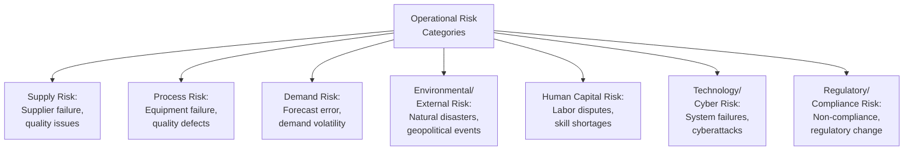
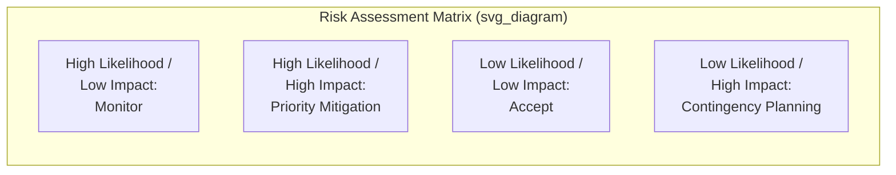
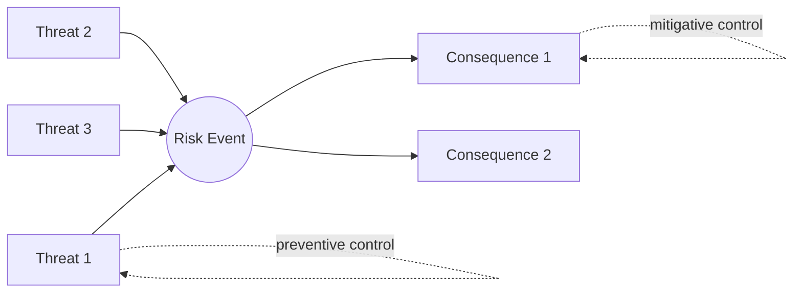
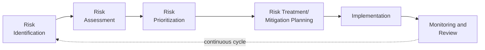

## Operational Risk Identification and Assessment

### Overview

Operational risk identification and assessment is the systematic process of recognizing, analyzing, and prioritizing potential events or conditions that could disrupt an organization's operations, supply chain, or ability to deliver products and services. This discipline provides the foundational analytical layer underpinning broader risk management and supply chain resilience efforts, enabling organizations to allocate risk mitigation resources based on structured evaluation rather than ad-hoc or reactive responses to disruptions as they occur.

### Foundational Concepts

#### Categories of Operational Risk

**Key Points**

- Operational risks are commonly distinguished from strategic risks (affecting long-term competitive positioning) and financial risks (affecting capital structure and financial performance), though in practice these categories frequently interact — a supply disruption (operational) can trigger financial consequences (revenue loss) and strategic consequences (customer relationship damage)
- Risk categorization frameworks vary across organizations and industries, and the specific taxonomy used matters less than ensuring the chosen framework provides comprehensive coverage relevant to the organization's specific operational context

#### Risk Identification vs. Risk Assessment

| Stage | Purpose | Typical Outputs |
| --- | --- | --- |
| Risk Identification | Systematically recognizing potential risk events | Risk register/inventory of identified risks |
| Risk Assessment | Analyzing likelihood and impact of identified risks | Prioritized risk ranking, risk heat maps |

### Risk Identification Methods

#### Structured Brainstorming and Workshops

Cross-functional workshops bringing together operations, procurement, quality, and other relevant functions to systematically surface potential risk events, often structured around process maps or value chain stages to ensure comprehensive coverage rather than relying on ad-hoc recall of past incidents.

#### Historical Data and Incident Analysis

Reviewing past operational disruptions, near-misses, and industry incident data to identify recurring risk patterns and previously unrecognized vulnerabilities, providing an empirical foundation to complement forward-looking brainstorming approaches.

#### Process Mapping and Failure Mode Analysis

Systematically mapping operational and supply chain processes to identify points of vulnerability, often using techniques such as Failure Mode and Effects Analysis (FMEA) — more commonly associated with reliability and maintenance contexts but applicable to broader operational risk identification by systematically examining how each process step could fail and the resulting consequences.

#### Supply Chain Mapping

**Key Points**

- Extending risk identification beyond direct (Tier 1) suppliers to understand multi-tier supply chain structure, since critical vulnerabilities often exist at deeper tiers not directly visible through standard supplier relationships
- Identifying single-source dependencies, geographic concentration risk (multiple suppliers located in the same region subject to correlated disruption risk, e.g., a shared natural disaster exposure), and critical path dependencies within the broader supply network
- [Inference] Achieving comprehensive multi-tier supply chain visibility is often practically difficult given limited direct relationships with sub-tier suppliers, meaning risk assessments frequently must work with incomplete visibility and should account for this limitation rather than assuming full network transparency

#### External Environmental Scanning

Systematically monitoring external factors — geopolitical developments, regulatory changes, climate-related risk indicators, economic indicators — that could introduce or amplify operational risk exposure, extending risk identification beyond purely internal process examination.

### Risk Assessment Frameworks

#### Likelihood-Impact Matrix (Risk Heat Map)

The most widely used framework for prioritizing identified risks, plotting each risk according to its estimated probability of occurrence and potential impact severity.

$$\text{Risk Score} = \text{Likelihood} \times \text{Impact}$$

**Key Points**

- This simplified multiplicative scoring approach provides a common basis for ranking and prioritizing risks, though [Inference] more sophisticated assessments often incorporate additional dimensions such as detection difficulty, velocity of onset, or recovery time, recognizing that a purely multiplicative likelihood-impact score does not capture every dimension relevant to risk prioritization
- Low-likelihood, high-impact risks (sometimes termed "tail risks") warrant particular attention despite their low probability, since standard expected-value calculations can understate their strategic importance if the impact would be catastrophic or difficult to recover from

#### Qualitative vs. Quantitative Assessment

| Approach | Method | Typical Application |
| --- | --- | --- |
| Qualitative | Expert judgment, categorical ratings (low/medium/high) | Initial risk screening, risks with limited historical data |
| Semi-Quantitative | Numerical scoring scales applied to qualitative judgments | Risk ranking and prioritization across a risk register |
| Quantitative | Statistical/probabilistic modeling using historical data | Risks with sufficient historical data for statistical modeling (e.g., equipment failure rates) |

[Inference] Quantitative assessment generally provides more precise risk estimates but requires sufficient historical data, which is often unavailable for novel or rare risk events, meaning qualitative and semi-quantitative approaches remain widely used in practice even where quantitative methods would theoretically be preferable.

#### Value at Risk (VaR) and Related Quantitative Approaches

For risks with sufficient historical data, quantitative techniques can estimate the potential financial impact of operational risk exposure at a given confidence level:

$$VaR_{\alpha} = \inf\{x : P(Loss > x) \leq 1 - \alpha\}$$

Where $\alpha$ represents the confidence level (e.g., 95%) and the expression identifies the loss threshold that will not be exceeded with that confidence level over the assessment period.

[Unverified] While VaR and related quantitative risk techniques originated primarily in financial risk management, their application to operational risk contexts requires careful adaptation given differing data availability and risk characteristics, and the appropriateness of specific quantitative methods should be evaluated against the specific risk context rather than applied uniformly.

### Bowtie Analysis

A visual risk assessment method mapping the causes (threats) leading to a risk event and the consequences flowing from it, alongside the preventive controls (reducing likelihood) and mitigative controls (reducing impact) positioned on either side.

**Key Points**

- Bowtie analysis is particularly useful for visualizing the relationship between multiple potential causes and consequences of a single central risk event, and for clearly identifying which controls address prevention (left side) versus mitigation of consequences after the event occurs (right side)
- This structure helps identify control gaps — points where no preventive or mitigative control exists for a given threat or consequence pathway — supporting more targeted risk treatment planning

### Supply Chain Risk-Specific Assessment Considerations

#### Supplier Risk Scoring

**Key Points**

- Supplier risk assessments commonly incorporate financial health indicators (credit ratings, financial statement analysis), operational performance history (on-time delivery, quality metrics), geographic/geopolitical exposure, and single-source dependency status
- Combining these dimensions into composite supplier risk scores supports prioritization of risk mitigation efforts (dual-sourcing, safety stock, closer monitoring) toward the highest-risk supplier relationships rather than applying uniform scrutiny across the entire supplier base

#### Geographic Concentration and Correlated Risk

Assessing whether multiple critical suppliers or facilities are concentrated in geographic regions subject to correlated disruption risk (natural disasters, political instability, regional infrastructure dependencies), since apparent supplier diversification can mask underlying geographic concentration risk if not explicitly mapped and assessed.

### Risk Register and Documentation

A risk register serves as the central documentation tool consolidating identified risks, their assessment scores, ownership assignments, and mitigation status, typically maintained as a living document updated as new risks are identified and existing risk assessments are revised.

| Risk Register Field | Purpose |
| --- | --- |
| Risk Description | Clear articulation of the specific risk event |
| Category | Classification (supply, process, demand, external, etc.) |
| Likelihood Rating | Probability assessment |
| Impact Rating | Severity assessment across relevant dimensions (financial, operational, reputational) |
| Risk Score | Combined likelihood-impact prioritization score |
| Risk Owner | Individual/function accountable for monitoring and mitigation |
| Mitigation Status | Current treatment actions and their progress |

### Integration with Broader Risk Management Process

Risk identification and assessment represent the initial stages of a broader, cyclical risk management process; assessed risks feed into subsequent risk treatment decisions (avoidance, mitigation, transfer, or acceptance) and supply chain resilience strategies, with ongoing monitoring feeding new information back into the identification stage as conditions change.

### Standards and Frameworks

| Standard | Focus |
| --- | --- |
| ISO 31000 | General risk management principles and guidelines, applicable across risk types |
| ISO 28000 | Security management systems specifically for supply chains |
| COSO Enterprise Risk Management Framework | Broader enterprise risk management, encompassing operational risk as one component |

### Common Pitfalls

**Key Points**

- Focusing risk identification primarily on internal operational processes while underweighting external and multi-tier supply chain risks that are less directly visible
- Relying solely on historical incident data for risk identification, which may fail to capture emerging or novel risk types without historical precedent
- Treating the likelihood-impact matrix as a fully objective measure rather than recognizing that likelihood and impact estimates typically involve significant subjective judgment, particularly for rare events with limited historical data
- Conducting risk assessment as a periodic, isolated exercise rather than maintaining an ongoing, continuously updated risk register reflecting evolving operational and external conditions

### Related Topics

- Supply chain resilience and business continuity planning
- Failure Mode and Effects Analysis (FMEA)
- Supplier risk management and diversification strategies
- Business continuity and disaster recovery planning
- Enterprise risk management frameworks
- Geopolitical risk and supply chain geographic diversification