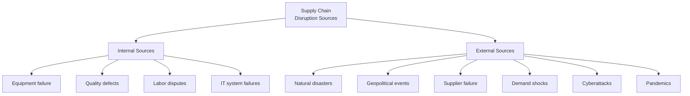

## Sources of Supply Chain Disruption

### Overview

Sources of supply chain disruption encompass the range of internal and external events that can interrupt the flow of materials, information, or products across a supply network, affecting an organization's ability to produce, deliver, and meet customer demand. Understanding the distinct categories and characteristics of disruption sources provides the empirical foundation for the risk identification and assessment processes discussed previously, and directly informs which resilience strategies are appropriate for a given organization's specific risk exposure profile.

### Foundational Classification Framework

#### Internal vs. External Disruption Sources

**Key Points**

- Internal disruption sources originate within an organization's own direct operations and are generally more controllable through internal process improvement and investment
- External disruption sources originate outside an organization's direct control, requiring resilience strategies (redundancy, flexibility, monitoring) rather than pure prevention, since the organization cannot directly control whether the triggering event occurs

#### Disruption Characterization Dimensions

| Dimension | Description | Example Contrast |
| --- | --- | --- |
| Predictability | How foreseeable the disruption is | Seasonal demand fluctuation (predictable) vs. earthquake (largely unpredictable) |
| Duration | How long the disruption effects persist | Short-term equipment breakdown vs. multi-year geopolitical trade restriction |
| Scope | Geographic/organizational breadth of impact | Single-facility fire vs. region-wide natural disaster |
| Velocity | Speed of onset | Sudden event (explosion) vs. gradual deterioration (supplier financial decline) |

[Inference] Effective resilience strategy generally requires distinguishing disruptions along these dimensions, since appropriate mitigation approaches differ substantially — for example, strategies suited to sudden, short-duration disruptions (buffer inventory) may be poorly suited to gradual, long-duration disruptions (which may instead require structural supply chain redesign).

### Natural and Environmental Disruption Sources

#### Natural Disasters

**Key Points**

- Earthquakes, hurricanes, floods, wildfires, and other natural disasters can disrupt supply chains through direct facility damage, transportation infrastructure destruction, or workforce displacement
- Geographic concentration of suppliers or facilities in disaster-prone regions creates correlated risk exposure, meaning multiple supply chain nodes can be simultaneously affected by a single natural disaster event, undermining the risk-reduction benefit that supplier diversification would otherwise provide if diversified suppliers are concentrated in the same geographic region
- [Inference] Climate change is widely discussed in current risk management literature as a factor potentially increasing the frequency or severity of certain climate-related natural disasters in various regions, though specific regional and event-type projections involve significant uncertainty and should be evaluated using current climate science and regional risk assessments rather than general assumption

#### Climate-Related Chronic Risks

Distinguished from acute natural disaster events, chronic climate risks include gradual changes such as shifting precipitation patterns, rising average temperatures, and long-term water scarcity trends that can affect agricultural supply chains, facility operating conditions, and resource availability over extended timeframes.

### Geopolitical and Regulatory Disruption Sources

#### Geopolitical Instability

Political conflicts, civil unrest, sanctions, and diplomatic tensions can disrupt supply chains through trade restrictions, border closures, asset seizure risk, or direct physical disruption to operations in affected regions.

#### Trade Policy Changes

**Key Points**

- Tariff changes, trade agreement modifications, export/import restrictions, and sanctions regimes can rapidly alter the cost structure or feasibility of existing supply chain configurations, sometimes with limited advance notice
- Organizations with supply chains concentrated in specific countries or trade relationships face concentrated exposure to policy changes affecting those specific relationships
- [Unverified] Trade policy developments are inherently subject to change based on evolving political and economic conditions; current trade policy affecting specific supply chain relationships should be verified against current government and trade authority sources rather than assumed stable

#### Regulatory Changes

New or modified regulations (environmental, labor, safety, product standards) can require supply chain reconfiguration, additional compliance investment, or supplier requalification, particularly when regulations diverge across the multiple jurisdictions a global supply chain may span.

### Supplier and Partner-Related Disruption Sources

#### Supplier Financial Distress or Failure

**Key Points**

- Supplier bankruptcy, financial insolvency, or business closure can disrupt supply continuity, particularly for sole-source or highly specialized suppliers where alternative sourcing options are limited
- Financial distress often develops gradually and may be detectable through financial health monitoring (credit ratings, payment behavior, financial statement analysis) before culminating in outright supplier failure, distinguishing it from sudden-onset disruption sources
- Sub-tier supplier failure (disruption at a supplier's own supplier, beyond an organization's direct visibility) represents a particularly difficult-to-detect disruption source given typical limitations in multi-tier supply chain visibility

#### Quality and Compliance Failures

Supplier quality failures, product recalls, or compliance violations (e.g., discovered labor standard violations, environmental non-compliance) can disrupt supply continuity directly (through required supplier changes) or indirectly (through reputational and regulatory consequences).

#### Capacity Constraints

Supplier capacity limitations — whether from underinvestment, unexpected demand surges across the supplier's customer base, or capacity loss from the supplier's own disruptions — can create supply shortfalls even absent outright supplier failure.

### Operational and Internal Disruption Sources

#### Equipment and Infrastructure Failure

Manufacturing equipment breakdown, IT system outages, and facility infrastructure failures (power, utilities) represent internal disruption sources generally addressed through the reliability and maintenance management practices discussed elsewhere, alongside redundancy planning for critical systems.

#### Quality Defects and Process Failures

Internal quality failures can disrupt supply chains both directly (halting production for corrective action) and downstream (triggering recalls or customer-facing disruptions), connecting operational risk to the quality management disciplines addressing root cause prevention.

#### Labor Disruptions

Strikes, labor disputes, and workforce shortages can disrupt production continuity, whether occurring within an organization's own workforce or at critical supplier or logistics provider operations (e.g., port worker strikes affecting global shipping).

### Demand-Side Disruption Sources

#### Demand Volatility and Forecast Error

**Key Points**

- Sudden demand shifts — whether from changing consumer preferences, competitive actions, or broader economic conditions — can create supply-demand imbalances even absent any supply-side disruption, distinguishing demand-side from supply-side disruption sources
- The bullwhip effect, where demand variability amplifies as it propagates upstream through a supply chain due to order batching, forecast inaccuracy, and lead time effects, can transform relatively modest end-customer demand fluctuations into significant upstream supply chain disruption

$$\text{Order Variance at Tier } n > \text{Order Variance at Tier } n-1$$

This relationship, central to bullwhip effect dynamics, illustrates how demand signal distortion compounds moving upstream through supply chain tiers.

### Technology and Cyber Disruption Sources

#### Cyberattacks

**Key Points**

- Ransomware attacks, data breaches, and other cyberattacks targeting an organization's own systems or critical supplier/logistics provider systems can disrupt production scheduling, order processing, and logistics coordination, particularly as supply chains become more digitally interconnected through the IoT and system integration approaches discussed under digital transformation
- Cyber risk exposure extends beyond an organization's own IT security posture to encompass the security practices of interconnected suppliers and partners, since a breach at a connected third party can propagate operational impact even when an organization's own systems remain uncompromised

#### IT System and Digital Infrastructure Failures

Beyond malicious cyberattacks, system outages, software failures, or data corruption within critical operational systems (ERP, MES, transportation management systems) can disrupt coordination and visibility across supply chain operations.

### Pandemic and Public Health Disruption Sources

**Key Points**

- Pandemics and significant public health events can disrupt supply chains simultaneously across multiple dimensions: workforce availability (illness, quarantine requirements), demand patterns (shifting consumption behavior), transportation and logistics capacity, and supplier operations across affected regions
- [Inference] Public health disruptions are notable among disruption sources for their potential to simultaneously affect supply, demand, and logistics dimensions across broad geographic scope at once, rather than being confined to a single supply chain node or dimension, though the specific characteristics and severity vary by the nature of the particular public health event

### Disruption Source Interaction and Cascading Effects

**Key Points**

- Disruptions frequently cascade beyond their initial point of origin, propagating through interconnected supply chain relationships and sometimes triggering secondary disruptions distinct from the original event (e.g., panic buying or safety stock hoarding behavior amplifying an initial supply shortage)
- Multiple disruption sources can also compound simultaneously (e.g., a natural disaster occurring during a period of geopolitical tension), and assessment approaches that consider only single-source disruption scenarios in isolation may understate risk exposure from compounding or cascading events

### Implications for Risk Assessment and Resilience Planning

Understanding the specific characteristics of different disruption sources directly informs which resilience strategies are most appropriate:

| Disruption Characteristic | Relevant Resilience Consideration |
| --- | --- |
| High predictability, moderate impact | Buffer inventory, capacity planning |
| Low predictability, high impact | Diversification, contingency planning, scenario analysis |
| Gradual onset | Early warning monitoring systems, financial health tracking |
| Sudden onset | Rapid response protocols, pre-established alternative sourcing |
| Geographically concentrated risk | Geographic diversification of suppliers and facilities |
| Cascading/compounding potential | Network-wide visibility and stress testing across multiple simultaneous scenarios |

### Common Pitfalls

**Key Points**

- Focusing disruption planning primarily on a narrow set of historically experienced disruption types while underweighting novel or previously unencountered disruption sources
- Assuming supplier diversification adequately mitigates risk without verifying that diversified suppliers are not geographically or otherwise correlated in their exposure to the same disruption sources
- Underestimating cascading and compounding disruption dynamics by assessing disruption sources in isolation rather than considering interaction effects
- Insufficient attention to gradual-onset disruption sources (supplier financial decline, chronic climate risk) that lack the visibility and urgency of sudden-onset events but can be equally consequential

### Related Topics

- Operational risk identification and assessment
- Supply chain resilience and business continuity planning
- Supplier diversification and dual-sourcing strategies
- Geopolitical risk management
- Cybersecurity in operational technology
- Bullwhip effect and demand management