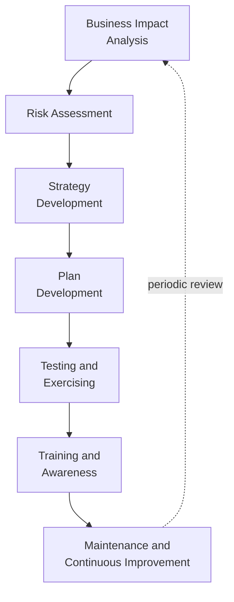
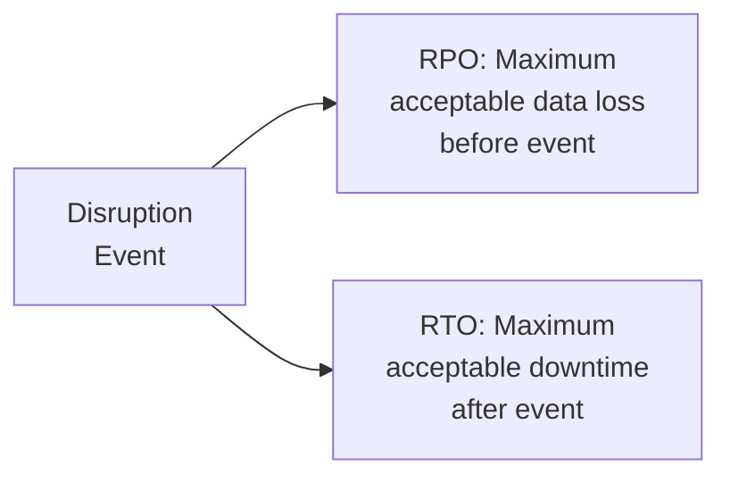
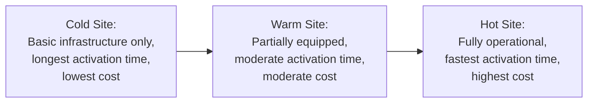
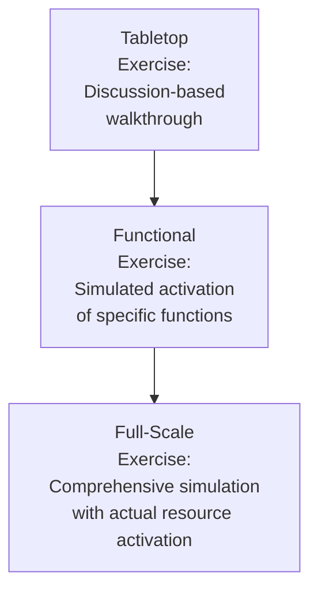

## Business Continuity Planning

### Overview

Business continuity planning (BCP) is the structured process of developing systems, procedures, and organizational capabilities to ensure that critical business functions can continue operating, or resume quickly, during and after a disruptive event. Within operations management, BCP translates the risk identification and disruption source analysis discussed previously into concrete, actionable plans that specify how an organization will maintain or restore operations when disruptions materialize, moving from risk awareness to operational preparedness.

### Foundational Concepts

#### Business Continuity vs. Related Disciplines

| Discipline | Primary Focus | Relationship to BCP |
| --- | --- | --- |
| Business Continuity Planning (BCP) | Organization-wide continuation of critical business functions | Broadest scope, encompassing all critical functions |
| Disaster Recovery (DR) | Restoration of IT systems and technology infrastructure | Typically a subset/component of BCP focused specifically on technology |
| Crisis Management | Immediate response and decision-making during a crisis event | Operates alongside BCP, focused on the acute response phase |
| Emergency Response | Immediate life-safety and physical response to an incident | Precedes and feeds into broader BCP activation |

**Key Points**

- These disciplines are frequently used with overlapping terminology across organizations, but BCP is generally understood as the broadest framework encompassing the continuation of all critical business functions, of which IT disaster recovery represents one important component
- [Inference] Organizations vary in how they structure the relationship and governance between these disciplines, though effective overall resilience generally requires coordination across all of them rather than treating each as entirely independent

### Business Continuity Planning Lifecycle

### Business Impact Analysis (BIA)

#### Purpose and Methodology

The BIA systematically identifies critical business functions and quantifies the impact of their disruption over time, providing the analytical foundation for prioritizing continuity planning effort and resource allocation.

**Key Points**

- The BIA process typically involves surveying or interviewing function owners across the organization to identify which processes are critical, what resources and dependencies they require, and how quickly disruption impact escalates over time
- Critical function identification generally considers financial impact, regulatory/legal consequences, customer/contractual obligations, and reputational impact of disruption, rather than any single dimension in isolation

#### Recovery Time Objective (RTO) and Recovery Point Objective (RPO)

| Metric | Definition | Example |
| --- | --- | --- |
| Recovery Time Objective (RTO) | Maximum acceptable time a function can be unavailable before unacceptable consequences occur | Order processing system must be restored within 4 hours |
| Recovery Point Objective (RPO) | Maximum acceptable amount of data loss, measured in time | Transaction data backups must not lose more than 1 hour of data |

**Key Points**

- RTO and RPO are typically established separately for each critical business function or system based on the specific consequences of that function's unavailability, since different functions generally have different tolerance thresholds for downtime
- These metrics directly drive the technical and procedural design of recovery strategies — a function with a very short RTO generally requires more expensive, higher-readiness recovery infrastructure (e.g., real-time system redundancy) compared to a function with a longer acceptable RTO

#### Maximum Tolerable Downtime (MTD) and the Impact Escalation Curve

$$MTD = \text{Point at which disruption impact becomes unacceptable/unrecoverable for the organization}$$

**Key Points**

- Impact from disruption typically escalates non-linearly over time rather than at a constant rate, with many critical functions showing an acceleration point beyond which consequences become significantly more severe or irreversible
- RTO is generally set with meaningful margin below MTD, since RTO represents the planning target while MTD represents the absolute limit beyond which recovery may no longer prevent unacceptable organizational harm

### Risk Assessment Integration

BCP builds directly on the risk identification and assessment processes and disruption source analysis discussed previously, using identified high-priority risks to inform which specific disruption scenarios the continuity plan should address in detail, rather than developing generic plans disconnected from an organization's actual risk profile.

### Continuity Strategy Development

#### Common Continuity Strategy Approaches

| Strategy | Description | Typical Application |
| --- | --- | --- |
| Redundancy | Duplicate critical resources/capacity | Backup production facilities, redundant IT systems |
| Diversification | Multiple suppliers/locations reducing single-point dependency | Dual-sourcing critical materials |
| Workforce Flexibility | Cross-training and flexible staffing arrangements | Enabling coverage when specific personnel are unavailable |
| Alternative Site Arrangements | Pre-arranged access to alternative operating locations | Hot sites, cold sites, or reciprocal agreements with partner organizations |
| Manual Workarounds | Documented manual processes replacing automated systems | Paper-based order processing during IT system outage |
| Inventory Buffers | Strategic stock positioned to absorb short-term supply disruption | Safety stock for critical materials, discussed under spare parts inventory strategy |

**Key Points**

- Strategy selection generally involves balancing the cost of maintaining continuity capability against the potential impact of disruption if that capability is absent, since maintaining extensive redundancy across all functions is typically cost-prohibitive
- Hot sites (fully equipped, immediately operational alternative facilities), warm sites (partially equipped, requiring some setup time), and cold sites (basic infrastructure requiring substantial setup) represent a spectrum of alternative site readiness levels, each with correspondingly different cost and activation time tradeoffs

#### Alternative Site Readiness Spectrum

### Plan Development and Documentation

#### Core Plan Components

**Key Points**

- **Activation criteria and procedures**: clear thresholds and decision-making authority for formally activating the continuity plan, avoiding ambiguity about when and by whom activation decisions are made
- **Roles and responsibilities**: designated continuity team roles with clear accountability, including backup personnel assignments in case primary role holders are themselves unavailable during the disruption
- **Communication protocols**: predetermined communication channels and messaging for internal stakeholders, customers, suppliers, and, where relevant, regulators or media
- **Recovery procedures**: step-by-step procedures for restoring each critical function, ideally detailed enough to be followed by personnel who may not be the original process experts if key staff are unavailable during the actual event

#### Crisis Communication Planning

A dedicated communication plan addressing what information needs to reach which stakeholders, through which channels, and with what approval process, recognizing that communication during an actual crisis often needs to occur faster than normal organizational approval processes typically allow, requiring pre-authorized communication templates and escalation paths established in advance.

### Testing and Exercising

| Exercise Type | Description | Resource Intensity |
| --- | --- | --- |
| Tabletop Exercise | Discussion-based scenario walkthrough with key stakeholders | Low |
| Functional Exercise | Testing specific plan components or systems in a simulated but limited environment | Moderate |
| Full-Scale Exercise | Comprehensive simulation involving actual activation of alternative sites, systems, and personnel | High |

**Key Points**

- Regular testing is widely considered essential to BCP effectiveness, since untested plans frequently contain gaps, outdated information, or unrealistic assumptions that only become apparent when a plan is actually exercised
- Testing frequency and exercise type typically escalate over time as an organization's continuity program matures, often beginning with tabletop exercises before progressing to more resource-intensive functional and full-scale exercises
- Exercise findings should feed back into plan revision, since the purpose of testing is identifying and correcting plan gaps rather than simply demonstrating existing plan adequacy

### Training and Awareness

Beyond the dedicated continuity team, broader organizational awareness of business continuity procedures — particularly for personnel with defined roles during plan activation — supports more effective actual response, since a plan understood only by a small planning team may not be effectively executed by the broader workforce during an actual disruption.

### Plan Maintenance

**Key Points**

- Continuity plans require periodic review and update as organizational structure, critical processes, personnel, technology systems, and risk exposure change over time, since a static plan gradually becomes less accurate and effective as underlying organizational conditions evolve
- Triggers for plan review typically include scheduled periodic review (e.g., annually), significant organizational changes (mergers, facility changes, key system implementations), and lessons learned from actual disruption events or testing exercises
- [Inference] Organizations with more dynamic operating environments (rapid growth, frequent organizational change, evolving risk exposure) generally require more frequent plan review than more stable organizations, though specific appropriate review cadence should be determined based on organization-specific rate of change

### Standards and Frameworks

| Standard | Focus |
| --- | --- |
| ISO 22301 | International standard for business continuity management systems |
| NIST SP 800-34 | Contingency planning guide, particularly relevant to IT/information systems |
| NFPA 1600 | Standard on continuity, emergency, and crisis management |

[Unverified] Specific certification requirements and standard content are periodically revised; current standard versions and requirements should be verified against the issuing standards body's current published guidance rather than assumed static.

### Integration with Supply Chain Resilience

Business continuity planning for an organization's own operations represents one component of broader supply chain resilience, which also requires extending continuity considerations to critical suppliers and logistics partners, since an organization's own continuity plan may be undermined if critical upstream suppliers lack corresponding continuity capability of their own.

### Common Pitfalls

**Key Points**

- Developing detailed continuity plans without adequate testing, resulting in plans that appear comprehensive on paper but contain unrecognized gaps or unrealistic assumptions
- Allowing plans to become outdated as organizational structure, key personnel, and systems change, without establishing systematic review triggers
- Focusing continuity planning narrowly on IT disaster recovery while underdeveloping broader business function continuity (personnel, facilities, supplier dependencies)
- Insufficient organizational awareness beyond the core planning team, limiting effective plan execution during an actual disruption when broader workforce participation is required

### Related Topics

- Operational risk identification and assessment
- Sources of supply chain disruption
- Supply chain resilience and network design
- Crisis management and emergency response
- IT disaster recovery planning
- Supplier risk management and continuity requirements