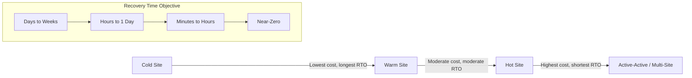
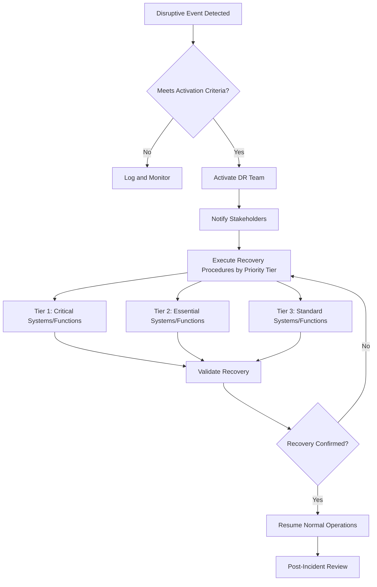

## Disaster Recovery Strategies

### Definition and Scope

Disaster recovery (DR) refers to the policies, tools, and procedures an organization uses to restore critical operations, systems, and infrastructure following a disruptive event. Within supply chain resilience, DR extends beyond IT systems to encompass physical facilities, logistics networks, supplier relationships, workforce continuity, and data integrity. It is a subset of the broader discipline of business continuity management (BCM), which addresses the continuation of operations during and after a disruption, whereas DR focuses specifically on restoration of systems and infrastructure to a defined operational state.

### Relationship to Business Continuity Planning

**Key Points**

- Business Continuity Planning (BCP) is the umbrella strategy covering people, processes, communication, and facilities during a crisis.
- Disaster Recovery is a technical and operational subset of BCP, focused on restoring IT infrastructure, data, and physical operational capacity.
- Supply Chain Risk Management (SCRM) intersects with DR when disruptions originate from or propagate through supplier networks, transportation systems, or logistics nodes.
- A mature resilience program integrates DR planning with SCRM so that single points of failure (a sole-source supplier, a single distribution hub, a centralized data center) are identified and mitigated jointly.

### Core Objectives: RTO and RPO

Two metrics anchor virtually all DR strategy design:

- **Recovery Time Objective (RTO)**: The maximum acceptable duration between a disruption and the restoration of a system, process, or function to an operational state.
- **Recovery Point Objective (RPO)**: The maximum acceptable amount of data loss measured in time — i.e., how far back in time the restored data/state can be relative to the disruption event.

$$RPO_{max} = t_{disruption} - t_{last\_backup}$$

A shorter RTO and RPO generally require greater investment in redundancy, real-time replication, and automation. Organizations typically tier systems and processes by criticality, assigning tighter RTO/RPO targets to mission-critical functions (e.g., order management, cold-chain monitoring) and looser targets to lower-priority functions (e.g., internal reporting dashboards).

| Tier | Example Function | Typical RTO | Typical RPO |
| --- | --- | --- | --- |
| Tier 1 (Critical) | Order processing, ERP core, warehouse control systems | Minutes to 1 hour | Near-zero (seconds to minutes) |
| Tier 2 (Essential) | CRM, procurement systems, supplier portals | 4–24 hours | 1–4 hours |
| Tier 3 (Standard) | Internal reporting, non-critical archives | 24–72 hours | 24 hours |

[Inference] Exact RTO/RPO thresholds vary significantly by industry, regulatory environment, and organizational risk appetite; the table above illustrates a common tiering pattern rather than a universal standard.

### Risk Assessment and Business Impact Analysis (BIA)

Before selecting a DR strategy, organizations conduct a **Business Impact Analysis** to quantify the operational and financial consequences of disruption to each process or system.

**Key Points**

- Identify critical business functions and their interdependencies (upstream suppliers, downstream distribution, IT dependencies).
- Quantify financial impact per unit of downtime (e.g., revenue loss per hour, contractual penalty exposure, reputational cost).
- Identify Maximum Tolerable Downtime (MTD) — the absolute ceiling beyond which the organization suffers unrecoverable harm.
- Map single points of failure across both IT infrastructure and physical/logistics networks (e.g., a single port of entry, a sole raw-material supplier, one data center region).
- Prioritize recovery sequencing based on interdependency chains — restoring a system that depends on another unrestored system yields no functional recovery.

### Disaster Recovery Site Strategies

Organizations typically choose among several infrastructure redundancy models, distinguished by cost and recovery speed trade-offs.

- **Cold Site**: A facility with basic infrastructure (power, connectivity, space) but no pre-installed systems or data. Requires full setup and data restoration before use. Lowest cost, longest RTO.
- **Warm Site**: Partially configured with some hardware and periodically updated data. Reduces setup time relative to a cold site but still requires synchronization and activation steps.
- **Hot Site**: A fully replicated, continuously synchronized facility capable of near-immediate failover. Highest maintenance cost but minimal RTO/RPO.
- **Active-Active (Multi-Site) Architecture**: Two or more sites simultaneously handle live production load, with automatic load redistribution upon failure of one site. This eliminates failover delay entirely but requires the most sophisticated architecture and highest ongoing cost.

### Data Backup Strategies

**Key Points**

- **3-2-1 Backup Rule**: Maintain 3 copies of data, on 2 different media types, with 1 copy stored off-site (or off-network).
- **Backup types**:
  - *Full backup*: Complete copy of all data; simplest restoration but highest storage and time cost.
  - *Incremental backup*: Captures only changes since the last backup (full or incremental); fastest to create, slowest to restore (requires chaining).
  - *Differential backup*: Captures changes since the last full backup; restoration requires only the last full backup plus the latest differential.
- **Immutable backups** (write-once, read-many) protect against ransomware encryption or malicious deletion of backup copies.
- **Geographic redundancy**: Off-site or cloud-based replication protects against regional disasters (earthquakes, floods, power grid failures) that could affect both primary and local backup infrastructure simultaneously.

$$Backup\_Window = t_{backup\_end} - t_{backup\_start}$$

The backup window must fit within available low-traffic periods without degrading production system performance — a key constraint in scheduling full backups for high-transaction-volume operations such as distribution centers or point-of-sale networks.

### Supply Chain-Specific DR Considerations

Disaster recovery in an operations management context extends beyond IT to physical and logistical resilience:

**Example**

A manufacturer relying on a single overseas supplier for a critical component faces a supply chain single point of failure analogous to an unreplicated data center. A regional disaster (port closure, natural disaster, geopolitical disruption) at the supplier's location produces an outage with no automated "failover," unlike a hot-site IT architecture.

- **Supplier diversification**: Qualifying multiple suppliers across different geographic regions reduces dependency on any single node, analogous to multi-site IT redundancy.
- **Safety stock and buffer inventory**: Maintaining strategic inventory reserves for critical materials provides a time buffer (similar to RPO) during supply disruptions, allowing recovery processes to execute without halting production immediately.
- **Alternative logistics routing**: Pre-identified backup transportation modes and routes (e.g., alternate ports, carriers, or transport modes) reduce recovery time when primary routes are disrupted.
- **Contractual resilience clauses**: Force majeure provisions, service level agreements (SLAs) with penalty/remedy structures, and dual-sourcing contract commitments formalize supplier-side recovery expectations.

### Disaster Recovery Plan (DRP) Components

A formal DRP typically documents:

1. **Scope and objectives** — which systems, sites, and processes are covered.
2. **Roles and responsibilities** — a designated Disaster Recovery Team with clear escalation and decision authority (often called an Incident Commander or DR Coordinator structure).
3. **Activation criteria** — the specific conditions or thresholds that trigger DRP invocation.
4. **Communication plan** — internal (employees, executives) and external (customers, suppliers, regulators, media) notification protocols.
5. **Recovery procedures** — step-by-step technical and operational restoration sequences, ordered by BIA-derived priority.
6. **Testing and maintenance schedule** — periodic validation exercises and plan revision cadence.

### DR Testing Methodologies

**Key Points**

- **Tabletop exercises**: Discussion-based walkthroughs where stakeholders talk through a simulated scenario without executing actual system failover. Low cost, useful for validating decision logic and communication chains.
- **Walkthrough tests**: More detailed procedural review, often including document verification and role confirmation, without live system interruption.
- **Simulation tests**: Simulate a disaster scenario in a non-production or isolated environment to test technical recovery procedures without affecting live operations.
- **Parallel tests**: Recovery systems are activated and run alongside (not replacing) production systems, validating that recovery infrastructure functions correctly under real data loads.
- **Full interruption tests**: Production systems are intentionally taken offline and recovery procedures are executed in full. Highest fidelity but highest risk; typically reserved for mature DR programs with sufficient safeguards.

[Inference] The frequency and rigor of testing (e.g., annual tabletop vs. semi-annual full interruption) generally correlates with the criticality tier of the system in question, though specific cadences are organization- and regulation-dependent.

### Disaster Recovery as a Service (DRaaS)

Cloud-based DRaaS offerings allow organizations to outsource DR infrastructure to third-party providers, replicating on-premises systems to cloud environments for failover on demand. This shifts capital expenditure (maintaining a physical hot/warm site) to operational expenditure (subscription-based cloud replication), and is particularly relevant for mid-sized operations lacking the capital to build dedicated redundant facilities.

**Key Points**

- Reduces upfront infrastructure investment.
- Scales recovery capacity elastically based on actual failover needs.
- Introduces dependency on the DRaaS provider's own resilience and SLA commitments — effectively transferring (not eliminating) certain risk categories.
- Requires careful contractual definition of RTO/RPO guarantees, data sovereignty, and exit/portability terms.

### Illustrative Example: DR Activation Workflow

### Post-Incident Review and Continuous Improvement

Following any DR activation (real or simulated), organizations conduct a structured post-incident review to:

- Compare actual recovery time/data loss against the targeted RTO/RPO.
- Identify procedural gaps, communication failures, or resource shortfalls encountered during execution.
- Update the DRP, BIA, and supplier risk registers based on lessons learned.
- Feed findings into broader enterprise risk management and supply chain resilience frameworks, closing the loop between incident response and proactive risk mitigation.

**Conclusion**

Disaster recovery strategy within operations management sits at the intersection of IT resilience and physical/logistical continuity. Effective DR requires quantified objectives (RTO/RPO), a tiered criticality framework grounded in Business Impact Analysis, appropriately matched infrastructure redundancy (cold through active-active), disciplined data backup practices, and — critically for supply chain contexts — extension of these same redundancy principles to supplier networks, logistics routing, and inventory buffers. Regular testing and post-incident review ensure the strategy remains aligned with evolving risk exposure rather than becoming a static, unvalidated document.

**Related Topics**

- Business Continuity Planning (BCP) frameworks
- Business Impact Analysis (BIA) methodology
- Supplier risk assessment and diversification strategies
- Safety stock optimization and buffer inventory modeling
- Enterprise risk management (ERM) frameworks
- Force majeure and contractual risk allocation
- Crisis communication planning
- Cloud infrastructure redundancy and multi-region architecture
- Cybersecurity incident response (ransomware-specific DR considerations)
- Just-in-time (JIT) vs. just-in-case (JIC) inventory strategy trade-offs