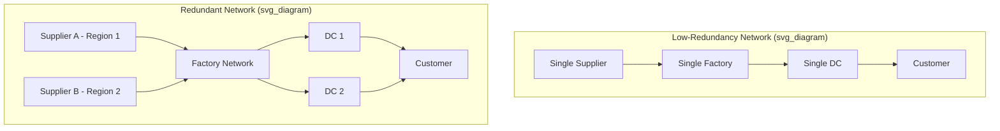
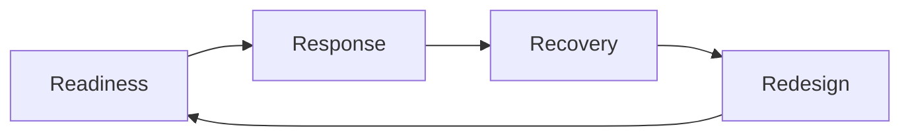

## Building Redundancy and Resilience

### Definition and Scope

Redundancy and resilience are complementary but distinct concepts in supply chain and operations risk management. **Redundancy** refers to the deliberate duplication of critical resources, capacity, or pathways (suppliers, inventory, facilities, transportation routes) so that failure of one component does not halt the system. **Resilience** is the broader systemic capacity to absorb disruption, adapt operations under stress, and recover to (or beyond) baseline performance. Redundancy is one *mechanism* for achieving resilience; resilience also depends on flexibility, visibility, collaboration, and organizational responsiveness that redundancy alone does not provide.

### Redundancy vs. Resilience vs. Efficiency

**Key Points**

- Efficiency-optimized supply chains minimize slack (inventory, capacity, supplier count) to reduce cost, which inherently increases fragility to disruption.
- Redundancy intentionally reintroduces slack — buffer inventory, backup suppliers, spare capacity — trading cost for risk mitigation.
- Resilience encompasses redundancy but also includes non-redundant capabilities: rapid reconfiguration, information visibility, cross-functional decision agility, and collaborative supplier relationships.
- The strategic tension is typically framed as **"efficiency vs. resilience"** — a trade-off curve rather than a binary choice, requiring organizations to select a deliberate risk-cost position rather than defaulting to either extreme.

$$Resilience\_Cost = C_{redundancy} + C_{flexibility} + C_{coordination} - Savings_{avoided\_disruption}$$

[Inference] This cost framing is a conceptual simplification; in practice the avoided-disruption savings term is difficult to quantify precisely because disruption probability and impact are inherently uncertain and organization-specific.

### Sources of Supply Chain Vulnerability

Before selecting redundancy mechanisms, organizations map the specific vulnerabilities the design must address:

- **Supply-side vulnerability**: Dependency on a single supplier, single geographic region, or single-source raw material.
- **Demand-side vulnerability**: Volatility, forecast error, or concentration in a small number of customers/channels.
- **Process/infrastructure vulnerability**: Reliance on a single production facility, single distribution center, or single IT system without failover.
- **Logistics/transportation vulnerability**: Dependency on a single port, carrier, or transportation mode.
- **External/environmental vulnerability**: Exposure to geopolitical instability, natural disaster zones, regulatory shifts, or currency risk in a concentrated geography.

### Core Redundancy Mechanisms

#### Supplier Base Diversification

**Key Points**

- **Single sourcing**: One supplier per component; lowest cost and highest negotiating leverage, but highest disruption risk.
- **Dual/multi sourcing**: Two or more qualified suppliers per critical component, often geographically dispersed, allowing volume shift if one supplier fails.
- **Geographic diversification**: Selecting suppliers across different regions/countries to avoid correlated regional risk (natural disasters, regional political instability, regional labor disputes).
- Dual sourcing typically increases per-unit procurement cost (loss of volume-based discounts) but reduces the probability-weighted cost of stockout during a supply disruption.

**Example**

An automotive manufacturer sourcing a critical semiconductor component from a single supplier in one country faces total production stoppage if that supplier's facility is disrupted. Qualifying a second supplier in a different region — even at a higher unit cost — creates a redundant pathway that preserves partial or full production continuity during a regional disruption.

#### Inventory Buffers (Safety Stock)

Safety stock provides a time buffer against demand variability and supply disruption, conceptually analogous to a Recovery Point Objective in IT systems — it defines how much disruption the system can absorb before operational impact occurs.

$$SS = z \times \sigma_{LT} \times \sqrt{L}$$

Where:

- $SS$ = safety stock quantity
- $z$ = service level factor (from the standard normal distribution, corresponding to the desired service level, e.g., $z = 1.65$ for a 95% service level)
- $\sigma_{LT}$ = standard deviation of demand during lead time
- $L$ = average lead time

A more complete formulation incorporating both demand and lead-time variability:

$$SS = z \times \sqrt{(L \times \sigma_D^2) + (D^2 \times \sigma_L^2)}$$

Where $D$ is average demand and $\sigma_L$ is the standard deviation of lead time itself. This form captures the compounding risk when *both* demand and supplier lead time are variable — a common real-world condition during supply chain disruptions.

**Key Points**

- Excess safety stock increases holding cost, carrying risk of obsolescence (particularly for perishable or technology-dependent goods).
- Insufficient safety stock increases stockout risk and associated lost-sales or production-stoppage cost.
- Strategic (not purely statistical) safety stock decisions also consider criticality tiering — higher buffers for components with long replacement lead times or single-source exposure.

#### Capacity Redundancy

- **Excess production capacity**: Maintaining underutilized manufacturing capacity that can be activated during demand spikes or when a sister facility is disrupted.
- **Flexible/modular manufacturing**: Production lines designed to be reconfigured across multiple product lines, allowing capacity reallocation without new capital investment.
- **Contract manufacturing / co-manufacturing agreements**: Pre-negotiated arrangements with third-party manufacturers to absorb overflow production during disruption, without maintaining that capacity internally at all times.

#### Network and Facility Redundancy

- **Multiple distribution centers**: Geographically dispersed DCs allow demand to be served from an alternate node if one location is disrupted, analogous to active-active IT architecture.
- **Multi-modal transportation**: Maintaining qualified alternative transport modes (rail, road, air, sea) and carriers so that disruption to one mode does not halt movement of goods.
- **Port/route diversification**: Identifying and periodically validating alternate ports of entry/exit and shipping routes.

### Building Flexibility (Non-Redundant Resilience Levers)

Redundancy addresses "having a backup"; flexibility addresses "adapting without needing a pre-built backup." Both contribute to resilience.

**Key Points**

- **Postponement strategies**: Delaying final product differentiation/customization until closer to the point of demand, allowing generic components/inventory to serve multiple end configurations.
- **Modular product design**: Designing products with interchangeable components across product lines, expanding the pool of substitutable suppliers and inventory.
- **Cross-training workforce**: Enabling labor to shift across production lines or functions during localized disruption or absenteeism spikes.
- **Flexible contracts**: Volume-flexible or capacity-option contracts with suppliers/carriers that can scale up or down without renegotiation delay.

### Supply Chain Visibility and Information Redundancy

**Key Points**

- **Multi-tier visibility**: Mapping not only direct (Tier 1) suppliers but also Tier 2 and Tier 3 sub-suppliers, since disruptions often originate deeper in the supply network than direct contractual relationships reveal.
- **Real-time monitoring systems**: IoT sensors, control towers, and supply chain visibility platforms that provide early warning of disruption (weather, geopolitical events, supplier financial distress).
- **Redundant data/communication channels**: Ensuring that critical supply chain coordination information (orders, shipment status, inventory levels) does not depend on a single communication system or single point of contact.

[Inference] The specific technology platforms used for multi-tier visibility vary substantially by industry and are evolving rapidly; the underlying principle — visibility beyond Tier 1 — is the durable concept rather than any specific tool.

### Resilience Framework: The 4 R's

A commonly referenced framework structures resilience capability into four phases:

1. **Readiness**: Proactive risk identification, BIA, and redundancy/flexibility design completed before disruption occurs.
2. **Response**: Immediate action taken upon disruption detection (activation of backup suppliers, rerouting logistics, drawing down safety stock).
3. **Recovery**: Restoration of normal operating parameters, potentially leveraging DR-style tiered prioritization.
4. **Redesign** (or "Review/Learning"): Post-disruption analysis feeding back into structural changes — new supplier qualification, adjusted safety stock policy, network redesign — to reduce vulnerability to recurrence.

### Quantifying Resilience: Time-to-Recover and Time-to-Survive

Two operational metrics used in resilience assessment (distinct from IT-focused RTO/RPO, though conceptually related):

- **Time-to-Recover (TTR)**: The time required for a specific node (supplier, facility) to restore full functional capacity after a disruption.
- **Time-to-Survive (TTS)**: The maximum duration the broader supply chain can continue to meet demand using existing inventory/redundant capacity while a disrupted node remains offline, before service failure occurs.

**Key Points**

- If $TTS > TTR$ for a given node, the built-in redundancy is sufficient to bridge the disruption without customer-facing impact.
- If $TTS < TTR$, the node represents an under-protected vulnerability requiring additional buffer, dual-sourcing, or capacity investment.
- Systematic TTR/TTS mapping across all critical nodes is sometimes referred to as a resilience "heat map," prioritizing risk-mitigation investment toward nodes with the largest TTR–TTS gap.

$$Resilience\_Gap_i = TTR_i - TTS_i$$

Nodes where $Resilience\_Gap_i > 0$ represent priority investment targets for additional redundancy.

### Cost-Benefit Evaluation of Redundancy Investments

**Example**

Consider a component with a 2% annual probability of a disruption causing 30 days of stockout, at an estimated cost of $500,000 in lost production per disruption event. The annualized expected cost of *not* investing in redundancy is:

$$E[Cost] = P(disruption) \times Impact = 0.02 \times \$500{,}000 = \$10{,}000$$

If a dual-sourcing arrangement costs $25,000 annually in reduced volume discounts but effectively eliminates disruption exposure to that supplier, the raw expected-value comparison would suggest the redundancy investment is not justified on this metric alone. However, this simplified expected-value calculation excludes risk-aversion considerations, tail-risk severity (a single low-probability event could exceed available cash reserves or breach customer SLAs with contractual penalties disproportionate to the direct production loss), and correlated/compounding disruption scenarios — all of which typically justify redundancy investment beyond pure expected-value optimization. [Inference] Organizations vary considerably in how they weight tail risk versus expected value; this is a strategic risk-appetite decision rather than a purely quantitative one.

### Redundancy in Financial and Contractual Risk Management

- **Insurance and contingent business interruption coverage**: Financial redundancy mechanisms that transfer disruption cost risk to a third party rather than requiring physical/operational redundancy.
- **Force majeure and flexible contract terms**: Pre-negotiated contractual provisions defining obligations and remedies during supplier-side disruption.
- **Diversified customer/revenue base**: Reduces demand-side concentration risk, functioning as a demand-side analog to supply-side diversification.

### Organizational and Governance Resilience

Redundancy and resilience are not purely technical/logistical; organizational structure contributes materially:

**Key Points**

- **Cross-functional risk governance**: Dedicated risk committees or supply chain resilience roles with authority to activate contingency plans without prolonged escalation delay.
- **Decentralized decision authority**: Allowing regional or facility-level managers limited autonomous authority to activate pre-approved contingency measures, reducing response latency during disruption.
- **Collaborative supplier relationships**: Deep, trust-based relationships with key suppliers (information sharing, joint risk planning) that improve response speed and access to scarce capacity during industry-wide disruptions, functioning as a relational form of redundancy distinct from pure multi-sourcing.

**Conclusion**

Building redundancy and resilience in operations management requires deliberately reintroducing strategic slack — through supplier diversification, safety stock, capacity buffers, and network redundancy — while simultaneously developing organizational and informational flexibility that pure duplication cannot provide. The central design discipline is not maximizing redundancy universally, but calibrating it against quantified vulnerability (via BIA-style criticality mapping and TTR/TTS gap analysis) so that investment is concentrated where the cost of disruption materially exceeds the cost of protection. Resilience is therefore best understood as a continuously managed portfolio of redundancy, flexibility, and visibility investments rather than a one-time architectural decision.

**Related Topics**

- Business Impact Analysis (BIA) methodology
- Disaster recovery strategies
- Supplier risk assessment and qualification frameworks
- Just-in-time (JIT) vs. just-in-case (JIC) inventory strategy trade-offs
- Multi-tier supply chain mapping and visibility platforms
- Postponement and modular product design strategies
- Contingent business interruption insurance
- Scenario planning and stress testing for supply networks
- Total Cost of Ownership (TCO) analysis in sourcing decisions
- Enterprise risk management (ERM) frameworks