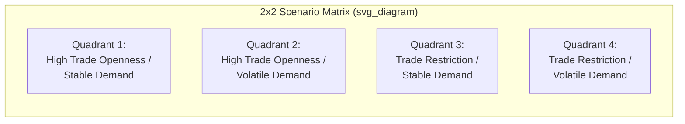
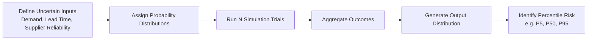

## Scenario Planning and Stress Testing

### Definition and Scope

Scenario planning is a structured methodology for exploring plausible future states of the operating environment and evaluating how a supply chain or operation would perform under each. Stress testing is the quantitative evaluation of a system's performance under specified adverse conditions, typically applied to test the limits of resilience mechanisms (redundancy, capacity, financial buffers) already in place. Where scenario planning is primarily exploratory and strategic (informing long-term design decisions), stress testing is primarily diagnostic and operational (validating whether current capabilities meet defined thresholds under duress).

### Scenario Planning vs. Forecasting vs. Stress Testing

**Key Points**

- **Forecasting** projects a single most-likely future based on historical data and trend extrapolation; it is a point estimate (or a probability distribution around one central expectation).
- **Scenario planning** deliberately constructs multiple divergent, internally consistent futures — not to predict which will occur, but to test strategic robustness across a range of possibilities.
- **Stress testing** applies a specific, often extreme, shock to a defined system (a facility, a supplier, a financial position) and measures the quantitative impact against operational thresholds.
- The three are complementary: scenario planning defines *which* futures matter, stress testing quantifies *how badly* a specific system would be affected, and forecasting continues to inform baseline expectations against which deviations are measured.

### Origins and Strategic Rationale

[Inference] Scenario planning as a formal management discipline is often traced to military and energy-sector origins (notably its use at Royal Dutch Shell in anticipating the 1970s oil shocks), though its application to supply chain and operations risk management is a more recent extension of the same underlying logic: forecasting alone fails when the future is discontinuous with the past, so decision-makers benefit from rehearsing responses to multiple plausible discontinuities in advance.

The core rationale is that supply chains optimized for a single expected future are structurally fragile to divergent outcomes, whereas strategies validated across multiple scenarios tend to be more robust even though they may sacrifice some efficiency under the single most-likely case.

### Scenario Planning Methodology

#### Step 1: Define Scope and Time Horizon

Establish the boundaries of the exercise — which business units, product lines, geographies, or supply chain tiers are in scope, and over what time horizon (operational: 0–12 months; tactical: 1–3 years; strategic: 3–10+ years).

#### Step 2: Identify Key Driving Forces

**Key Points**

- **Predetermined elements**: Trends with high certainty of occurrence (demographic shifts, known regulatory changes with confirmed effective dates, committed infrastructure projects).
- **Critical uncertainties**: Factors with high impact but genuinely unknown outcomes (geopolitical realignment, technology disruption pace, climate event frequency/severity, trade policy direction).
- Driving forces are typically sourced from PESTEL categories (Political, Economic, Social, Technological, Environmental, Legal) to ensure comprehensive coverage rather than narrow operational bias.

#### Step 3: Construct the Scenario Matrix

The most common structuring technique selects the **two most impactful and most uncertain** driving forces and arrays them as orthogonal axes, generating four quadrant scenarios.

**Key Points**

- Each quadrant is developed into a narrative scenario with an internally consistent logic — not merely a label, but a plausible story of how that combination of conditions would manifest operationally.
- Scenarios should be **plausible, not merely possible** — extreme low-probability combinations are typically excluded unless the impact is severe enough to warrant contingency planning regardless of probability (tail-risk scenarios).
- Best practice avoids labeling any single quadrant as "the base case," since doing so undermines the exercise's purpose of avoiding single-point-estimate thinking.

#### Step 4: Develop Scenario Narratives

For each quadrant, develop a detailed narrative addressing: what triggered this state, how key stakeholders (suppliers, competitors, regulators, customers) behave under it, and what the implied operational and financial conditions look like (demand levels, input costs, lead times, regulatory compliance burden).

#### Step 5: Assess Strategic Implications and "Wind Tunnel" Testing

Existing and proposed strategies are run through each scenario ("wind-tunneled") to evaluate performance:

**Key Points**

- Identify strategies that perform reasonably well across *all* scenarios ("robust strategies") versus strategies that only succeed in one specific scenario ("bet strategies").
- Identify early warning indicators — observable real-world signals that would indicate which scenario is beginning to materialize, enabling earlier strategic pivoting.
- Develop contingent action plans keyed to specific scenario indicators, rather than waiting for full scenario confirmation before acting.

### Stress Testing Methodology

Stress testing, by contrast, takes a defined system and subjects it to a specific quantified shock, typically producing a numerical output against a threshold.

#### Types of Stress Tests

- **Sensitivity analysis**: Varies a single input variable (e.g., lead time, demand, supplier capacity) while holding others constant, to isolate that variable's impact on system performance.
- **Scenario-based stress test**: Applies a full combined shock (e.g., a specific supplier's total capacity loss combined with a demand spike) reflecting a realistic compound disruption.
- **Reverse stress testing**: Starts from a defined failure outcome (e.g., inability to meet 20% of customer orders for 30 days) and works backward to identify what combination of conditions would produce that outcome — useful for surfacing non-obvious vulnerability combinations that forward-looking scenario construction might miss.
- **Historical stress test**: Replays a documented historical disruption (a specific past hurricane, port closure, or pandemic-driven demand shift) against the current network configuration to assess whether structural changes since that event have improved or degraded resilience.

#### Quantitative Framework

A basic stress test evaluates system output under shock relative to a defined threshold:

$$Capacity\_Shortfall = D_{shock} - S_{available}$$

Where $D_{shock}$ is demand or requirement under the stressed scenario and $S_{available}$ is available supply/capacity under the same conditions. A positive shortfall indicates the system fails to meet the stress condition at current configuration.

For network-level stress testing incorporating redundancy, the **Time-to-Survive vs. Time-to-Recover** framework (introduced in resilience design) is directly applicable as a stress test output:

$$Resilience\_Margin = TTS - TTR$$

A stress test scenario is considered "passed" for a given node if $Resilience\_Margin \geq 0$ under the applied shock magnitude; a negative margin flags a specific vulnerability requiring remediation.

**Example**

A stress test models the simultaneous loss of the top two suppliers (by volume) for a critical component for a 45-day period. Available safety stock plus tertiary supplier surge capacity yields a calculated TTS of 30 days, while the fastest realistic re-sourcing/recovery pathway (TTR) is 50 days. The resulting negative resilience margin (30 − 50 = −20 days) identifies a materially under-protected node, prompting either increased safety stock, accelerated tertiary supplier qualification, or contractual capacity-reservation agreements with the tertiary source.

### Monte Carlo Simulation in Stress Testing

For systems with multiple interacting variability sources (demand variability, lead time variability, multiple supplier failure probabilities), deterministic single-scenario stress tests understate risk. **Monte Carlo simulation** addresses this by running a large number of randomized trials across the joint probability distributions of key variables, producing a distribution of outcomes rather than a single point estimate.

**Key Points**

- Each simulation trial samples random values for uncertain inputs (demand, lead time, supplier reliability) from their respective probability distributions.
- Aggregating results across thousands of trials yields a probability distribution of outcomes (e.g., stockout probability, service level achieved, total cost) rather than a single deterministic answer.
- This allows quantification of tail risk (e.g., "5th percentile outcome") rather than relying solely on the expected/average case, which is particularly relevant for low-probability, high-impact disruption planning.
- [Inference] Simulation fidelity depends heavily on the accuracy of the underlying input distributions; poorly calibrated distributions (e.g., underestimating supplier failure correlation) can produce misleadingly optimistic tail-risk estimates even with a technically sound simulation methodology.

### Financial Stress Testing

Beyond operational stress testing, organizations apply the same discipline to financial resilience:

- **Liquidity stress testing**: Assessing whether cash reserves and credit facilities are sufficient to sustain operations through an extended disruption period without revenue.
- **Margin sensitivity testing**: Evaluating profitability impact under combined shocks (input cost inflation, demand contraction, and freight cost spikes simultaneously).
- **Covenant/compliance stress testing**: For regulated industries or organizations with debt covenants, testing whether stressed financial scenarios would breach contractual or regulatory thresholds.

### Integrating Scenario Planning and Stress Testing into Governance

**Key Points**

- **Cadence**: Strategic scenario planning is typically conducted periodically (annually or biennially) given its long-horizon strategic nature, while targeted stress tests on specific critical nodes may be conducted more frequently (quarterly) or triggered by material network changes (new supplier onboarding, facility relocation).
- **Ownership**: Scenario planning is typically owned at a strategic/executive level (informing capital allocation and network design decisions), while stress testing is often executed at an operational/analytical level (supply chain risk or planning teams) with results escalated when thresholds are breached.
- **Feedback loop**: Stress test results on specific nodes should inform which scenarios are prioritized in subsequent scenario planning cycles, and scenario planning outputs (key uncertainties) should inform which stress tests are designed, creating a continuous rather than isolated risk management cycle.

### Common Pitfalls

**Key Points**

- **Anchoring on a single "most likely" scenario**, which defeats the purpose of multi-scenario planning and reintroduces single-point-forecast fragility.
- **Underestimating correlated risk** — treating supplier failures, demand shocks, and logistics disruptions as independent when historically they are often correlated (e.g., a regional natural disaster simultaneously affecting a supplier, a port, and local demand).
- **Stress testing only historical scenarios** without considering structurally novel future risks (e.g., testing only against past pandemic patterns without considering different disruption mechanisms).
- **Failure to convert scenario/stress test findings into action** — conducting the analytical exercise without a defined process for translating findings into contingency plans, contractual changes, or network redesign investment.

**Conclusion**

Scenario planning and stress testing serve distinct but complementary functions in supply chain risk management: scenario planning explores the qualitative range of plausible strategic futures to test the robustness of overall strategy, while stress testing quantitatively evaluates specific systems against defined shock magnitudes to identify concrete vulnerabilities. Effective practice requires both — scenario planning without quantitative stress testing risks producing strategic narratives without actionable specificity, while stress testing without broader scenario context risks narrowly optimizing against known historical shocks while remaining blind to structurally novel future disruptions. Mature risk management programs operate these as an integrated, recurring cycle rather than isolated periodic exercises.

**Related Topics**

- Building redundancy and resilience
- Disaster recovery strategies
- Business Impact Analysis (BIA) methodology
- Monte Carlo simulation techniques in operations research
- Multi-tier supply chain mapping and visibility platforms
- Value-at-Risk (VaR) and financial risk quantification
- Time-to-Recover (TTR) and Time-to-Survive (TTS) metrics
- Enterprise risk management (ERM) frameworks
- Early warning indicator systems and risk monitoring dashboards
- Contingency and business continuity planning