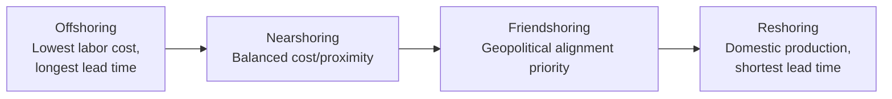
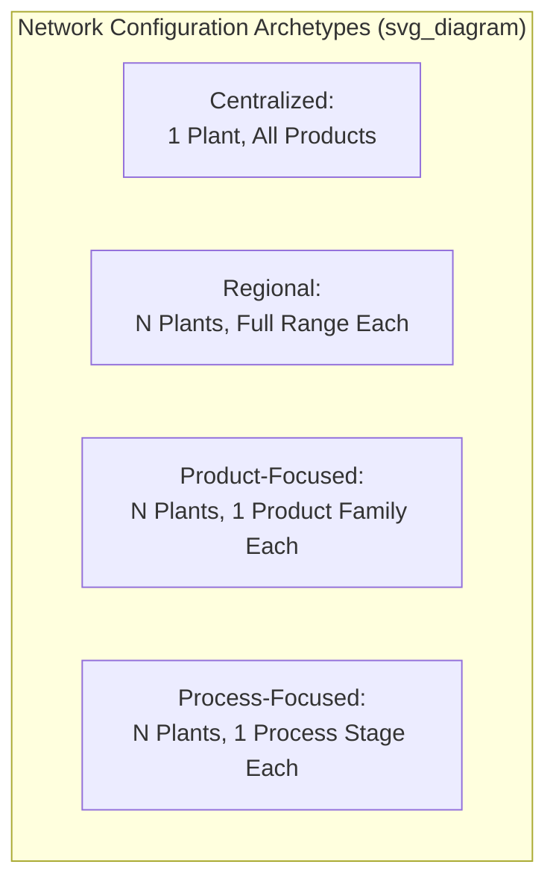
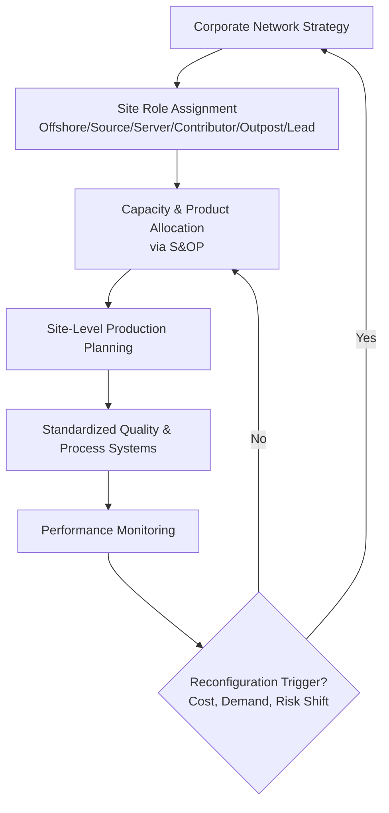

## Global Manufacturing Network Strategy

### Definition and Scope

Global manufacturing network strategy is the discipline of designing, configuring, and coordinating a firm's production facilities across multiple countries and regions to optimize cost, responsiveness, risk exposure, and access to markets, talent, and technology. It addresses not only where to locate individual plants but how those plants collectively function as an interdependent system — determining which facilities produce which products, how capacity is allocated, and how the network evolves as strategic conditions change.

### Strategic Objectives of Global Manufacturing Networks

**Key Points**

- **Cost minimization**: Leveraging labor cost differentials, economies of scale, tax incentives, and input cost advantages across locations.
- **Market access and responsiveness**: Positioning production close to demand to reduce lead time, tariff exposure, and logistics cost, and to satisfy local-content regulatory requirements.
- **Risk diversification**: Spreading production across multiple geographies to reduce exposure to single-country political, regulatory, currency, or natural disaster risk.
- **Access to knowledge and capability**: Locating facilities near specialized labor pools, supplier ecosystems, or innovation clusters (e.g., electronics manufacturing clusters in East Asia, automotive engineering clusters in Germany).
- **Flexibility and future-proofing**: Building a network capable of shifting volume and capability across sites as demand, cost structures, or trade policy shift over time.

These objectives frequently conflict — for example, the lowest-cost location for labor is often not the location closest to end-market demand — requiring the network strategy to represent a deliberate trade-off position rather than a simultaneous optimum across all dimensions.

### The Offshoring–Reshoring–Nearshoring Spectrum

**Key Points**

- **Offshoring**: Relocating production to a distant lower-cost country, historically driven primarily by labor cost arbitrage.
- **Nearshoring**: Relocating production to a nearby country (often sharing a border, trade bloc, or short transit time) to balance cost advantages with reduced lead time and logistics risk relative to offshoring.
- **Reshoring** (or "backshoring"): Returning production to the firm's home country, typically driven by rising offshore labor costs, automation reducing the labor cost advantage of offshore locations, supply chain risk concerns, intellectual property protection, or reputational/regulatory pressure (e.g., "Made in [Country]" market preferences).
- **Friendshoring**: A more recent strategic pattern of concentrating production and sourcing within geopolitically aligned countries, driven primarily by geopolitical risk mitigation rather than pure cost or distance considerations.

[Inference] The relative prevalence of these strategies shifts over time in response to macroeconomic and geopolitical conditions (labor cost convergence, trade policy shifts, automation cost curves); a network strategy therefore requires periodic reassessment rather than a one-time location decision.

### Network Configuration Archetypes

Manufacturing networks are typically classified along two structural dimensions: the number/dispersion of production sites, and the degree of product/process specialization at each site.

#### Centralized (Single-Site) Configuration

A single global or regional plant produces the full product range. Maximizes economies of scale and simplifies coordination, but concentrates risk and increases logistics cost/lead time to distant markets.

#### Regional Configuration ("Region-for-Region")

Each major region (e.g., North America, Europe, Asia-Pacific) has its own production facility serving that region's demand. Balances responsiveness to regional demand and regulatory requirements against some loss of global scale economies.

#### Product-Focused Configuration

Each plant specializes in a specific product line or product family, serving global demand for that product from one or a small number of locations. Maximizes manufacturing scale economies and specialization but increases logistics distance for markets far from the specialized plant.

#### Process-Focused Configuration

Each plant specializes in a specific stage of the production process (e.g., component fabrication, subassembly, final assembly), with semi-finished goods shipped between plants. Common in industries with complex, multi-stage value chains (e.g., electronics, automotive), but increases coordination complexity and work-in-process inventory across the network.

### Facility Role Typology (Ferdows Framework)

[Unverified] A widely referenced classification of manufacturing plant strategic roles within a global network — commonly attributed to research by Kasra Ferdows — categorizes facilities along two dimensions: the primary reason for the site's location (access to low-cost resources vs. access to strategic knowledge/markets), and the extent of technical/managerial competence developed at the site beyond pure production execution.

| Plant Role | Primary Location Driver | Competence Level |
| --- | --- | --- |
| Offshore | Low-cost production factors | Low — executes to specification |
| Source | Low-cost production factors | High — develops process improvements, becomes a network resource |
| Server | Market access / tariff avoidance | Low to moderate — serves local/regional market |
| Contributor | Market access / tariff avoidance | High — develops product/process innovations for the region |
| Outpost | Access to knowledge/technology clusters | Low — primarily gathers intelligence |
| Lead | Access to knowledge/technology clusters | High — drives innovation for the entire network |

**Key Points**

- Plants are not static in this classification — a facility initially established as an "Offshore" site for cost reasons can evolve into a "Source" site as local capability and process expertise develop over time.
- This upgrading trajectory is a deliberate strategic consideration in network design: firms increasingly plan for capability development at offshore/nearshore sites rather than treating them as permanently low-competence execution nodes.

### Key Location Decision Factors

**Key Points**

- **Labor cost and productivity** (cost per unit of output, not merely wage rate — productivity-adjusted labor cost is the relevant comparison).
- **Trade policy and tariffs**, including free trade agreement membership, rules-of-origin requirements, and exposure to trade dispute risk.
- **Logistics infrastructure and lead time** to key markets and supplier bases.
- **Currency risk and exchange rate volatility**, which affects both cost competitiveness and the value of repatriated earnings.
- **Political and regulatory stability**, including expropriation risk, labor law, environmental regulation, and intellectual property protection strength.
- **Supplier ecosystem proximity**, particularly for industries with dense, geographically clustered supplier networks (e.g., automotive, electronics).
- **Energy cost and availability**, increasingly significant for energy-intensive manufacturing processes.
- **Tax incentives and government subsidies**, including free trade zones, tax holidays, and targeted industrial policy incentives.
- **Talent availability**, particularly for skilled technical and engineering labor required for higher-complexity manufacturing processes.

### Quantitative Location Evaluation: Total Cost of Ownership

A common analytical error in network design is comparing locations solely on unit labor cost, which excludes materially significant total cost components.

$$TCO = C_{production} + C_{logistics} + C_{tariffs} + C_{inventory\_carrying} + C_{quality\_risk} + C_{coordination}$$

**Key Points**

- **$C_{inventory\_carrying}$**: Longer supply lines to distant offshore facilities require holding more in-transit and safety stock inventory, a cost frequently omitted from simple landed-cost comparisons.
- **$C_{quality\_risk}$**: Expected cost of quality defects, rework, and warranty claims, which can vary by location due to differences in process maturity, worker training levels, and quality management system rigor.
- **$C_{coordination}$**: Management overhead, travel cost, and communication complexity associated with coordinating a geographically and often linguistically/culturally distant facility, plus time-zone-driven decision latency.
- A location that appears cost-advantageous on unit production cost alone can be TCO-negative once logistics, inventory carrying cost, tariff exposure, and coordination overhead are fully accounted for — a key rationale behind observed reshoring and nearshoring trends in recent years.

### Network Flexibility and Reconfiguration

**Key Points**

- **Multi-site qualification**: Designing products and processes so that more than one facility in the network is qualified to produce a given product, allowing volume to shift between sites in response to demand changes, cost shifts, or disruption — directly analogous to supplier dual-sourcing redundancy but applied to owned/controlled manufacturing assets.
- **Modular and standardized process design**: Standardizing equipment, tooling, and process documentation across sites reduces the time and cost required to transfer production between facilities.
- **Capacity buffer allocation**: Deliberately under-utilizing capacity at certain network nodes to preserve surge capability, trading some scale efficiency for network-level flexibility.
- **Real options thinking**: Treating network configuration decisions (e.g., building a smaller initial plant with pre-approved expansion rights, or maintaining a dormant qualified backup facility) as options with a defined cost of maintaining flexibility, comparable to a financial option premium, exercised only if specific triggering conditions occur.

### Global Network Coordination Mechanisms

**Key Points**

- **Centralized planning systems**: Enterprise-level Sales & Operations Planning (S&OP) processes that allocate demand across the network based on cost, capacity, and lead time, typically supported by integrated ERP and advanced planning system (APS) tooling.
- **Standardized manufacturing systems**: Common quality management systems, production standards (e.g., ISO 9001), and often a shared "production system" methodology (analogous to a Toyota Production System-style framework) applied consistently across sites to ensure comparable output quality and enable easier volume transfer between facilities.
- **Knowledge transfer mechanisms**: Structured processes (rotational assignments, centers of excellence, standardized best-practice documentation) for propagating process improvements developed at one site across the broader network — particularly relevant to realizing the "Source" and "Contributor" plant role upgrades described above.
- **Governance structure**: Decisions about which network node produces which product mix are typically governed by a combination of central strategic planning (long-term capital allocation, site role assignment) and more localized/tactical planning (short-term production scheduling within assigned capability).

### Risk Considerations Specific to Global Networks

**Key Points**

- **Geopolitical and trade policy risk**: Exposure to tariff changes, export controls, and trade disputes, particularly acute for networks concentrated in a small number of countries or reliant on cross-border component flows subject to shifting rules of origin.
- **Currency exposure**: Networks with production cost in one currency and revenue in another carry ongoing exchange rate risk, sometimes hedged financially but also mitigated structurally through network design (natural hedging via matching production and sales currency exposure).
- **Intellectual property risk**: Locating sensitive process technology or proprietary designs in jurisdictions with weaker IP enforcement carries elevated technology leakage risk, a factor increasingly weighted alongside pure cost considerations.
- **Concentration risk**: A network overly concentrated in a single country or region — even if individually low-cost and well-run — reproduces the single-point-of-failure vulnerability addressed under supply chain redundancy and resilience planning.

**Example**

A consumer electronics firm with final assembly concentrated in a single country faces compounding exposure: a regional natural disaster, a bilateral trade dispute imposing new tariffs, or a sudden currency devaluation each independently threaten total network output, since no alternate qualified site exists to absorb reallocated volume. A firm with final assembly split across two qualified facilities in different trade blocs faces the same individual shocks but retains a functioning fallback pathway.

### Network Strategy Evolution and Periodic Reassessment

**Key Points**

- Global manufacturing network strategy is not a one-time design decision but requires periodic reassessment as labor cost differentials narrow or widen, trade policy shifts, automation technology changes the labor-cost-to-total-cost ratio, and demand geography evolves.
- **Automation's structural effect**: As automation reduces the proportion of total production cost attributable to direct labor, the traditional cost rationale for offshoring to low-labor-cost countries weakens relative to other location factors (market proximity, logistics cost, trade policy), which [Inference] is frequently cited as a contributing factor in observed reshoring/nearshoring trends, though the magnitude of this effect varies substantially by industry and automation maturity.
- Network redesign decisions typically involve significant capital investment and multi-year implementation timelines, making the periodic strategic reassessment cycle materially slower than tactical supply chain adjustments (e.g., supplier switching), which increases the importance of building flexibility into the initial network design rather than relying solely on future reconfiguration capability.

**Conclusion**

Global manufacturing network strategy requires balancing cost optimization, market responsiveness, and risk diversification across a portfolio of production sites whose strategic roles evolve over time. Rather than treating location decisions as isolated cost-minimization exercises, effective network design applies total-cost-of-ownership analysis, assigns differentiated strategic roles to individual facilities, and deliberately builds in multi-site qualification and capacity flexibility to enable reconfiguration as trade policy, labor cost differentials, automation economics, and demand geography shift. The discipline sits at the intersection of operations strategy, international business, and supply chain risk management, requiring periodic reassessment rather than a static, one-time configuration decision.

**Related Topics**

- Building redundancy and resilience
- Total Cost of Ownership (TCO) analysis in sourcing decisions
- Facility location decision models
- Trade policy, tariffs, and rules-of-origin compliance
- Sales & Operations Planning (S&OP) processes
- Automation and robotics in manufacturing
- Global supply chain risk management
- Currency risk and hedging in international operations
- Lean manufacturing and standardized production systems
- Make-vs-buy and vertical integration decisions