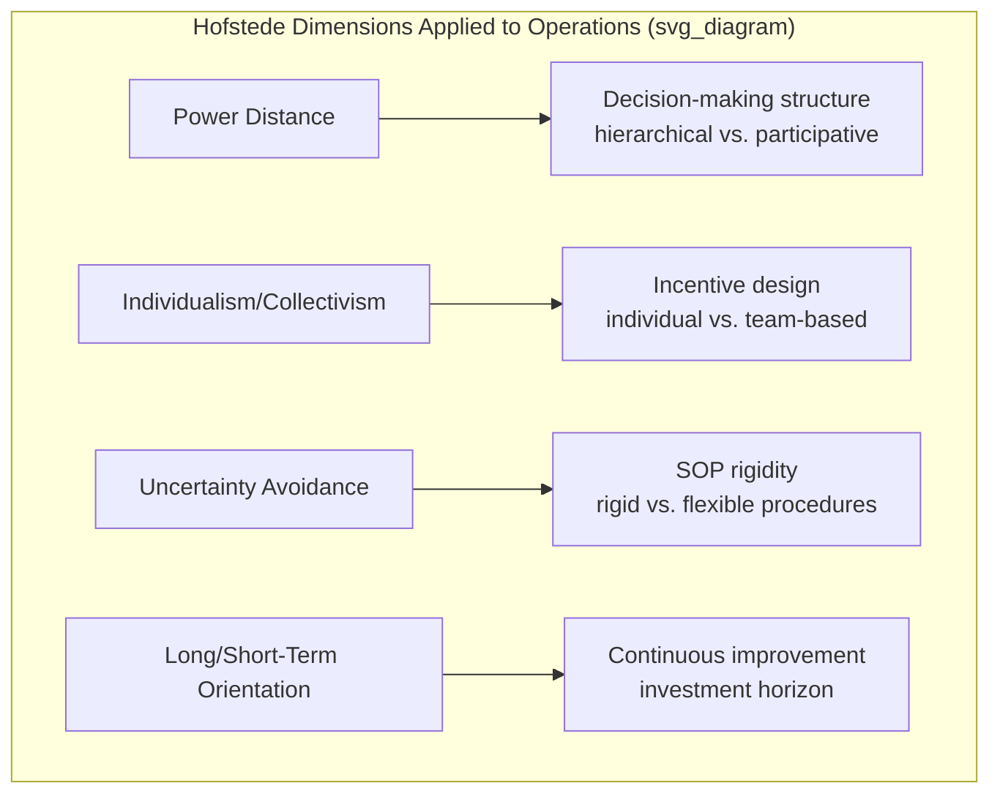
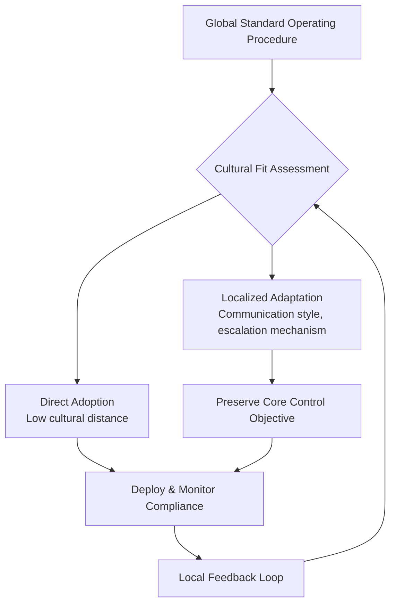

## Cross-Cultural Management in Operations

### Definition and Scope

Cross-cultural management in operations addresses how national, regional, and organizational cultural differences affect the design, coordination, and execution of operational processes across a globally distributed workforce, supplier base, and facility network. It extends beyond general cross-cultural business communication to focus specifically on how cultural variation influences operational outcomes: process compliance, quality standards interpretation, decision-making speed, supervisory relationships, and cross-site coordination effectiveness.

### Why Culture Matters in Operations Specifically

**Key Points**

- Standardized operational processes (quality systems, safety protocols, production standards) are frequently designed at a corporate headquarters and deployed globally, but their *interpretation and execution* are mediated by local cultural norms around authority, communication, and risk tolerance.
- Cross-site coordination — a core requirement in global manufacturing networks and multi-tier supply chains — depends heavily on shared understanding of commitments, deadlines, and escalation norms, all of which vary culturally.
- Quality and safety incident reporting behavior is culturally influenced: cultures with higher power distance or greater emphasis on saving face may underreport problems to supervisors, directly affecting the reliability of operational data used for continuous improvement.
- Supplier relationship management, contract interpretation, and negotiation dynamics vary significantly across cultural contexts, affecting how supply chain risk and performance issues are surfaced and resolved.

### Hofstede's Cultural Dimensions Framework

[Unverified] One of the most widely referenced frameworks for analyzing national cultural variation in management contexts was developed by Geert Hofstede based on large-scale survey research, originally conducted within IBM's international operations. While methodologically debated and criticized for treating national culture as static and homogeneous, the framework remains a common starting reference point in cross-cultural operations training and academic curricula.

**Key Points**

- **Power Distance**: The degree to which unequal distribution of authority is accepted within a society. High power-distance cultures tend toward more hierarchical, top-down operational decision-making and less upward challenge of supervisory decisions; low power-distance cultures tend toward more participative decision-making and greater comfort with subordinates questioning instructions.
- **Individualism vs. Collectivism**: The degree to which people prioritize individual achievement/autonomy versus group/team cohesion. This affects the design of performance incentive systems (individual bonuses vs. team-based rewards) and the acceptance of individual accountability structures common in Western-designed quality systems (e.g., individually signed-off inspection checkpoints).
- **Uncertainty Avoidance**: The degree of comfort with ambiguity and unstructured situations. High uncertainty-avoidance cultures tend to favor detailed, rigid standard operating procedures and formal rules; low uncertainty-avoidance cultures tend to be more comfortable with flexible, improvised responses to novel operational situations.
- **Masculinity vs. Femininity**: [Unverified — terminology as originally defined] The relative cultural emphasis on competitive achievement and material success versus cooperation, quality of life, and consensus. This dimension is sometimes relabeled "achievement vs. nurturing orientation" in more recent applications due to the ambiguity of the original terminology.
- **Long-Term vs. Short-Term Orientation**: The degree of cultural emphasis on long-term pragmatic adaptation and perseverance versus short-term, tradition-respecting, immediate-results orientation. This affects willingness to invest in long-payback continuous improvement initiatives versus prioritizing immediate production targets.
- **Indulgence vs. Restraint**: The degree to which a culture allows relatively free gratification of basic human desires versus regulating them through strict social norms.

[Inference] The framework's dimension scores are aggregate national averages derived from historical survey data; actual behavior of any specific individual, team, or facility can diverge substantially from the national aggregate, and using the framework to stereotype individuals rather than inform general sensitivity to variation is a recognized methodological risk.

### Trompenaars' Cultural Dimensions (Complementary Framework)

[Unverified] A related framework developed by Fons Trompenaars offers additional dimensions relevant to operational contexts, including universalism vs. particularism (whether rules are applied uniformly or adapted to specific relationships/circumstances) and specific vs. diffuse relationships (the degree of separation between professional and personal relationship spheres). The universalism/particularism dimension is particularly relevant to standardized global quality and compliance systems, since it predicts whether local operational staff are more likely to apply corporate-mandated procedures uniformly regardless of circumstance, or to adapt them contextually based on specific situational relationships.

### High-Context vs. Low-Context Communication

[Unverified] A distinct and widely applied framework, generally attributed to anthropologist Edward T. Hall, classifies cultures by the degree to which communication relies on explicit verbal content ("low-context") versus implicit contextual cues, shared understanding, and non-verbal signals ("high-context").

**Key Points**

- **Low-context communication cultures** tend to favor explicit, detailed written instructions, direct verbal feedback, and unambiguous documentation — a communication style well-matched to Western-originated standard operating procedure and quality documentation conventions.
- **High-context communication cultures** rely more heavily on shared implicit understanding, indirect feedback, and relationship context; instructions and feedback that appear complete and unambiguous to a low-context communicator may be perceived as incomplete or even socially inappropriate (overly blunt) in a high-context setting.
- **Operational implication**: A corporate quality or safety directive translated literally but without adaptation to local communication norms may be technically understood but behaviorally under-adopted if it conflicts with local expectations around how directives, criticism, or corrective feedback are appropriately communicated.

**Example**

A quality manager trained in a low-context communication environment provides direct, explicit written criticism of a defect rate to a supervisor in a high-context cultural setting, expecting this directness to be read as professional and constructive. If the local cultural norm expects indirect, face-saving feedback delivered through informal or private channels rather than explicit written documentation, the direct approach may be perceived as a serious face-threatening act, potentially reducing rather than increasing the supervisor's engagement with the underlying quality issue — an outcome opposite to the intended operational effect.

### Cross-Cultural Challenges in Specific Operational Domains

#### Quality Management Systems

**Key Points**

- Standardized quality frameworks (e.g., Six Sigma, ISO 9001-based systems) originated predominantly in specific cultural and institutional contexts and encode implicit assumptions about individual accountability, direct escalation of problems, and comfort with statistical/analytical decision-making that may not transfer uniformly across cultural settings.
- Root-cause analysis techniques that rely on open, blame-free discussion of failure (e.g., "Five Whys") can function differently in high power-distance or face-saving cultural contexts, where openly discussing an error chain in front of supervisors may be culturally difficult regardless of the stated blame-free intent of the methodology.

#### Lean and Continuous Improvement Programs

- Lean manufacturing methodologies (originating substantially from Japanese manufacturing practice, notably the Toyota Production System) embed specific cultural assumptions — including long-term orientation, collective responsibility for process improvement, and a particular relationship between workers and management around suggestion systems — that require deliberate adaptation, not literal transplantation, when deployed into different cultural operating environments.
- [Inference] Documented cases of lean implementation difficulty in cross-cultural transplantation are frequently attributed in the literature to a mismatch between the underlying cultural assumptions embedded in the methodology and the receiving culture's norms around hierarchy, individual initiative, and long-term commitment, though the specific causal weight of cultural factors versus other implementation factors (training quality, management commitment, incentive alignment) is difficult to isolate empirically.

#### Supervisory and Workforce Management

- **Authority and supervision styles**: Expatriate managers accustomed to a participative, low-power-distance management style may face reduced perceived legitimacy in high power-distance operational cultures where clear hierarchical authority is expected; conversely, an authoritarian management style transplanted into a low power-distance culture may generate resentment and reduced engagement.
- **Incentive system design**: Individual performance-based incentive systems common in some operational contexts may underperform relative to team-based incentive structures in more collectivist cultural settings, and vice versa.
- **Time orientation and scheduling**: Cultural variation in monochronic (sequential, schedule-driven) versus polychronic (flexible, relationship-driven) time orientation affects adherence to rigid production scheduling systems and perceived reliability of committed delivery dates across a multi-site network.

#### Supplier and Partner Relationship Management

- **Contract interpretation**: Universalist cultural contexts tend to treat contracts as comprehensive and binding regardless of relationship context; particularist contexts may treat contracts as a starting framework subject to renegotiation based on evolving relationship and circumstance — a distinction directly relevant to supply chain risk management and contractual resilience clauses.
- **Negotiation style**: Direct, time-boxed negotiation approaches common in some cultural contexts may be perceived as rushed or disrespectful in cultures that place higher value on relationship-building preceding substantive negotiation, potentially affecting supplier relationship quality and willingness to prioritize the buyer during capacity constraints.

### Organizational Strategies for Cross-Cultural Operations Management

**Key Points**

- **Cultural due diligence in site/partner selection**: Incorporating cultural fit assessment alongside cost and capability criteria when selecting new manufacturing locations, joint venture partners, or key suppliers.
- **Localized adaptation of standardized systems**: Deliberately adapting the communication style, escalation mechanisms, and incentive structure of globally standardized operational systems to local cultural context, while preserving the underlying performance standard or control objective.
- **Cross-cultural training programs**: Structured training for expatriate managers and cross-site coordination teams covering the specific cultural dimensions relevant to the operational relationship, rather than generic cultural awareness training disconnected from operational specifics.
- **Local leadership development**: Developing local nationals into leadership and technical expert roles (connecting to the "Source" and "Contributor" plant role upgrading trajectory in global network strategy) both to build local operational credibility and to create bicultural bridge personnel capable of translating between corporate standards and local operational context.
- **Structured cross-site communication protocols**: Establishing explicit, agreed-upon communication norms (response time expectations, escalation triggers, meeting protocols) for cross-cultural coordination, since implicit assumptions about "normal" communication behavior are precisely where cross-cultural friction concentrates.

### Measuring Cross-Cultural Effectiveness in Operations

**Key Points**

- **Process compliance audit variance across sites**: Comparing documented procedure compliance rates across culturally distinct facilities, controlling for other factors, can surface locations where cultural friction is affecting standard adoption.
- **Incident/defect underreporting analysis**: Comparing self-reported quality or safety incident rates against independent audit-detected incident rates by site can reveal cultural underreporting patterns that would otherwise distort continuous improvement prioritization.
- **Cross-site coordination lead time**: Measuring decision and response latency in cross-site coordination processes (e.g., time from problem escalation to resolution decision) can indicate where cultural or communication-style mismatches are introducing coordination friction beyond what time-zone difference alone would predict.

[Inference] Isolating the specific causal contribution of cultural factors from other confounding factors (language barrier, technology infrastructure quality, organizational maturity of the specific site) in these metrics is analytically difficult; cross-cultural effectiveness measurement typically requires triangulating quantitative metrics with qualitative assessment (site visits, structured interviews) rather than relying on quantitative metrics in isolation.

**Conclusion**

Cross-cultural management in operations recognizes that globally standardized processes, quality systems, and coordination mechanisms are executed by people embedded in distinct cultural contexts that shape how authority, communication, risk, and commitment are understood and enacted. Frameworks such as Hofstede's cultural dimensions and high-context/low-context communication theory provide structured vocabulary for anticipating where standardized operational approaches may require deliberate local adaptation — in quality system design, incentive structures, supervisory approach, and supplier relationship management — without abandoning the underlying performance objectives those systems were designed to achieve. Effective practice combines cultural due diligence in strategic decisions (site selection, partner selection), localized adaptation of standardized systems, and ongoing measurement that distinguishes genuine cultural effectiveness gaps from other confounding operational factors.

**Related Topics**

- Global manufacturing network strategy
- Cross-cultural negotiation and supplier relationship management
- Lean manufacturing and Toyota Production System principles
- Quality management systems (Six Sigma, ISO 9001)
- Expatriate management and international human resources
- Organizational behavior and leadership across cultures
- Multi-tier supply chain governance
- Change management in global process standardization
- Joint venture and international partnership structuring
- Communication protocols for distributed/multi-site teams