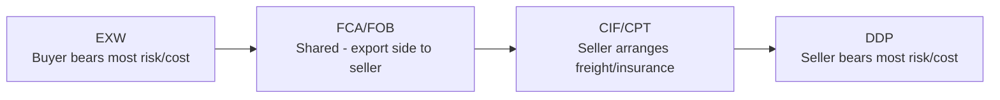
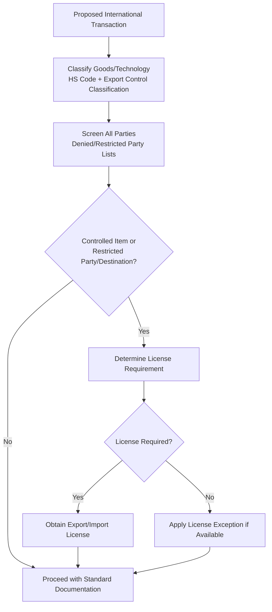

## International Logistics and Trade Compliance

### Definition and Scope

International logistics encompasses the planning, execution, and control of the physical movement, storage, and documentation of goods across international borders, integrating transportation mode selection, customs clearance, and multi-modal coordination. Trade compliance is the discipline of ensuring that all cross-border movement of goods, technology, and related transactions adheres to the applicable import/export laws, tariff regulations, sanctions regimes, and documentation requirements of every jurisdiction involved. The two are inseparable in practice: logistics execution that ignores compliance requirements produces shipment delays, financial penalties, or seizure, while compliance frameworks unconnected to logistics execution remain theoretical.

### Core International Trade Documentation

**Key Points**

- **Commercial Invoice**: The primary document declaring transaction value, parties, and goods description, used by customs authorities to assess duties and taxes.
- **Bill of Lading (B/L)**: A transport document issued by the carrier serving three functions — evidence of the contract of carriage, receipt for the goods, and (in negotiable form) a document of title enabling transfer of ownership during transit.
- **Certificate of Origin**: Documents the country in which goods were manufactured or substantially transformed, used to determine eligibility for preferential tariff treatment under trade agreements and to apply country-specific trade restrictions.
- **Packing List**: An itemized inventory of shipment contents, weights, and dimensions, used by customs and logistics providers to verify shipment contents against the commercial invoice.
- **Letter of Credit (L/C)**: A bank-issued payment guarantee conditional on the seller presenting specified compliant documents, widely used in international trade to mitigate counterparty payment risk between unfamiliar trading partners.
- **Export/Import License**: Government-issued authorization required for specific controlled goods, technologies, or destination countries, distinct from routine customs clearance documentation.

### Incoterms: Allocating Risk and Responsibility

Incoterms (International Commercial Terms), published and periodically revised by the International Chamber of Commerce, define standardized allocation of cost, risk, and responsibility between buyer and seller at each stage of an international shipment.

**Key Points**

- Incoterms address three core questions for any given shipment: at what point does risk of loss/damage transfer from seller to buyer, who is responsible for arranging and paying for transportation, and who is responsible for export/import customs clearance and associated duties.
- Incoterms do **not** address transfer of legal title/ownership, payment terms, or the governing law of the contract — these remain separate contractual matters commonly confused with Incoterm scope.

| Incoterm | Seller Responsibility | Risk Transfer Point |
| --- | --- | --- |
| EXW (Ex Works) | Minimal — goods made available at seller's premises | At seller's premises |
| FOB (Free on Board) | Export clearance, delivery to vessel | Once goods pass ship's rail/are loaded |
| CIF (Cost, Insurance, Freight) | Freight and insurance to destination port | Once goods loaded at origin port |
| DDP (Delivered Duty Paid) | Maximum — all transport, duties, and import clearance | At buyer's named destination |

[Inference] The specific risk-transfer mechanics for maritime-specific terms (FOB, CIF, CFR) were revised in more recent Incoterms editions to reference loading onto the vessel rather than the historically referenced "ship's rail," reflecting practical difficulty in precisely defining that boundary; practitioners should confirm which Incoterms edition (e.g., a specific year's revision) governs a given contract, since obligations can differ materially between editions.

### Customs Classification and Valuation

#### Harmonized System (HS) Codes

**Key Points**

- The Harmonized System is an internationally standardized numerical classification system for traded products, maintained by the World Customs Organization, used globally as the basis for tariff schedules and trade statistics.
- HS codes typically consist of a 6-digit international core, with individual countries extending the code to 8 or 10 digits for national tariff and statistical purposes.
- Correct HS classification directly determines the applicable duty rate, eligibility for trade agreement preferences, and applicability of specific regulatory requirements (e.g., safety certifications, quota restrictions) — misclassification is a leading cause of customs compliance penalties and shipment delays.

#### Customs Valuation

- Most jurisdictions apply the **World Trade Organization Customs Valuation Agreement** methodology, under which the primary valuation basis is **transaction value** — the price actually paid or payable for the goods, adjusted for specified additions (e.g., royalties, assists, packing costs) and exclusions (e.g., separately identified freight/insurance charges, depending on the applicable Incoterm and jurisdiction).
- Related-party transactions (e.g., intra-company transfers between a manufacturer and its own foreign subsidiary) face heightened customs valuation scrutiny to ensure the declared transfer price reflects an arm's-length equivalent, intersecting with transfer pricing tax compliance requirements.

### Tariffs, Duties, and Trade Agreements

**Key Points**

- **Most Favored Nation (MFN) tariff rates**: The standard tariff rate a country applies to imports from other World Trade Organization member countries in the absence of a preferential trade agreement.
- **Preferential tariff rates**: Reduced or zero tariff rates available under bilateral or regional free trade agreements, contingent on the goods meeting the agreement's specific **rules of origin** requirements.
- **Rules of origin**: Criteria determining whether a good qualifies as "originating" in a trade agreement member country, typically based on either a wholly-obtained standard, a substantial transformation/tariff-shift test, or a regional value content percentage threshold — directly relevant to global manufacturing network design, since multi-country production processes must be structured to satisfy origin rules to access preferential tariff treatment.
- **Anti-dumping and countervailing duties**: Additional duties imposed on specific imported goods found to be sold below fair market value (dumping) or benefiting from foreign government subsidies, applied on a product- and country-specific basis following formal investigation processes.
- **Tariff engineering**: The legitimate practice of designing or modifying a product, its components, or its country of assembly specifically to qualify for a more favorable tariff classification or origin status, distinct from misclassification (which is a compliance violation).

### Export Controls and Sanctions Compliance

**Key Points**

- **Export control regimes** restrict or require licensing for the export of specific goods, software, and technology — particularly dual-use items (goods with both civilian and military applications) — to specified destinations, end-users, or end-uses.
- **Denied party screening**: The practice of screening all counterparties (customers, suppliers, freight forwarders, financial intermediaries) in a transaction against government-maintained restricted/denied party lists before proceeding, typically automated through third-party screening software integrated into order management or ERP systems.
- **Economic sanctions**: Country-, sector-, or entity-specific restrictions on trade and financial transactions, which can prohibit transactions entirely (comprehensive sanctions) or restrict specific categories of goods, services, or financial dealings (targeted/sectoral sanctions).
- **Re-export and deemed export rules**: Many export control regimes extend jurisdiction beyond the initial export to restrict subsequent re-export of controlled items or technology from a third country, and to restrict disclosure of controlled technology to foreign nationals even within the exporting country ("deemed export").
- [Inference] Sanctions and export control regimes change relatively frequently in response to evolving geopolitical conditions; specific restricted-party lists, controlled-item lists, and sanctioned-country designations require ongoing monitoring against current government sources rather than reliance on a static compliance reference, as historical accuracy does not guarantee current validity.

### Free Trade Zones and Bonded Warehousing

**Key Points**

- **Free Trade Zones (FTZs)** (also termed Foreign Trade Zones, Special Economic Zones, or bonded zones depending on jurisdiction) are designated areas where imported goods can be stored, processed, or assembled without immediate payment of duties, with duties assessed only if/when goods formally enter the domestic customs territory.
- **Duty deferral and elimination benefits**: Goods re-exported from an FTZ without entering domestic commerce typically avoid duty entirely; goods that undergo manufacturing/assembly within the zone may qualify for duty assessment based on the finished product's classification rather than the higher-duty component classifications ("inverted tariff" mitigation).
- **Bonded warehousing**: Allows duty payment deferral on imported goods held in storage, providing cash flow benefits for importers holding inventory before final distribution/sale decisions are made.

### Logistics Mode Selection and Trade-offs

**Key Points**

- **Ocean freight**: Lowest cost per unit for large volumes, longest transit time, requires container/vessel scheduling coordination and is exposed to port congestion and capacity availability risk.
- **Air freight**: Highest cost per unit weight/volume, shortest transit time, typically reserved for high-value, time-sensitive, or perishable goods where inventory carrying cost savings and reduced stockout risk offset the freight premium.
- **Rail freight**: Intermediate cost and transit time, particularly relevant for continental/cross-border land routes (e.g., intra-Eurasian or intra-North American corridors), increasingly promoted as a nearshoring-compatible alternative to both ocean and air freight for applicable trade lanes.
- **Multi-modal/intermodal transportation**: Combining transport modes (e.g., ocean plus rail/truck drayage) under a single transport document and often a single logistics service provider, reducing coordination complexity at the cost of some flexibility to independently optimize each leg.

$$Landed\_Cost = C_{FOB} + C_{freight} + C_{insurance} + C_{duties} + C_{customs\_fees} + C_{inland\_transport}$$

The landed cost calculation — not the FOB or ex-factory price alone — is the relevant basis for total cost comparison across sourcing and logistics routing alternatives, directly connecting to the total-cost-of-ownership framework used in global manufacturing network location decisions.

### Trade Compliance Program Management

**Key Points**

- **Import/Export Compliance Program**: A formal internal governance structure defining classification procedures, denied-party screening protocols, recordkeeping requirements, and escalation procedures for compliance uncertainty, typically overseen by a designated trade compliance function.
- **Recordkeeping requirements**: Most jurisdictions impose statutory recordkeeping periods (commonly several years) for import/export transaction documentation, supporting potential customs audits.
- **Voluntary self-disclosure**: Many customs and export control authorities offer reduced penalty frameworks for companies that proactively identify and disclose their own compliance violations, compared to violations discovered through independent government enforcement action — a significant factor in trade compliance program design and internal audit prioritization.
- **Customs broker and freight forwarder engagement**: Most importers/exporters engage licensed customs brokers to handle classification, documentation, and customs clearance execution, though ultimate legal compliance responsibility (particularly for classification accuracy and valuation) typically remains with the importer of record rather than transferring fully to the broker.
- **Automated compliance technology**: Global Trade Management (GTM) software platforms integrate HS classification databases, denied-party screening, landed cost calculation, and free trade agreement qualification logic, typically integrated with ERP and transportation management systems to embed compliance checks directly into transaction processing workflows.

### Risk Management Intersection

**Key Points**

- International logistics and trade compliance risk directly intersects with broader supply chain resilience planning: tariff changes, export control tightening, and sanctions expansions represent a category of "predetermined element" and "critical uncertainty" driving forces relevant to scenario planning exercises.
- Customs delays, documentation errors, and compliance holds represent an operational disruption category distinct from but comparable in impact to supplier or facility disruptions, warranting inclusion in Business Impact Analysis and stress testing exercises focused on cross-border-dependent supply chains.
- Trade compliance violations carry both direct financial penalty risk and indirect risk (loss of trusted trader/certified importer status, which can materially increase future customs clearance time and inspection frequency) — making compliance a resilience factor in its own right, not solely a legal risk category.

**Conclusion**

International logistics and trade compliance together govern whether goods can legally and efficiently cross borders in support of global operations. Effective practice requires accurate customs classification and valuation, correct application of Incoterms to allocate risk and cost, systematic denied-party screening and export control classification, and mode/route selection grounded in total landed cost rather than freight cost alone. Because tariff schedules, trade agreements, and sanctions regimes change over time, sustained compliance requires an ongoing governance program — supported increasingly by automated Global Trade Management technology — rather than a one-time documentation exercise, with direct implications for both cost competitiveness and supply chain resilience.

**Related Topics**

- Global manufacturing network strategy
- Total Cost of Ownership (TCO) analysis in sourcing decisions
- Building redundancy and resilience
- Scenario planning and stress testing
- Free trade agreements and rules of origin
- Global Trade Management (GTM) technology platforms
- Transfer pricing and related-party transaction compliance
- Warehousing and distribution network design
- Transportation and logistics network optimization
- Customs brokerage and import/export documentation management