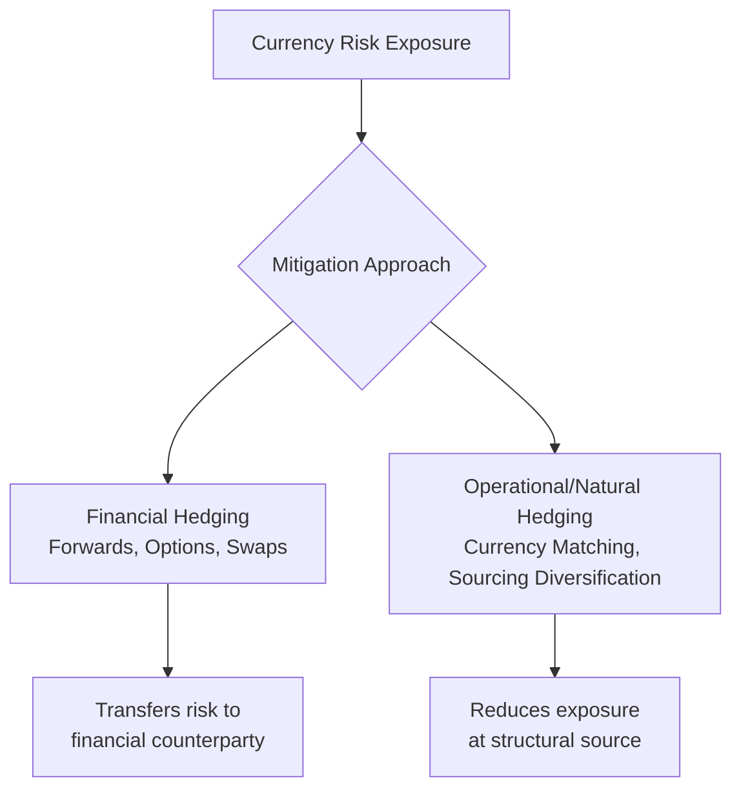
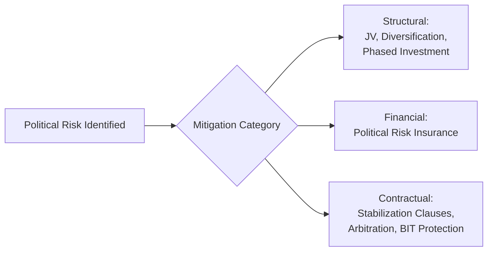

## Managing Currency and Political Risk

### Definition and Scope

Currency risk (foreign exchange risk) is the exposure of an organization's cash flows, asset values, and reported financial results to fluctuations in exchange rates between the currencies in which it transacts. Political risk is the exposure of operations, assets, and contractual rights to adverse actions or instability originating from governmental, regulatory, or geopolitical sources in the countries where a firm operates or sources. Both risk categories are inherent to global operations management because international manufacturing networks, sourcing relationships, and market access strategies necessarily create cross-border financial and legal exposure that a purely domestic operation does not face.

### Categories of Currency Risk

**Key Points**

- **Transaction risk**: Exposure arising from specific committed transactions denominated in a foreign currency (e.g., a purchase order to a foreign supplier payable in 90 days), where exchange rate movement between contract date and settlement date changes the effective cost or revenue.
- **Translation risk** (accounting exposure): Exposure arising when consolidating financial statements of foreign subsidiaries into the parent company's reporting currency, where currency fluctuation changes the reported value of foreign assets, liabilities, and earnings without necessarily reflecting a change in underlying cash flow.
- **Economic risk** (operating exposure): The longer-term, structural exposure of a firm's competitive position and future cash flows to exchange rate movements — for example, a firm with cost base in one currency and revenue in another faces a shifting relative cost competitiveness position as exchange rates move over time, independent of any specific transaction or accounting period.

$$Transaction\_Impact = Q \times (S_{settlement} - S_{contract})$$

Where $Q$ is the transaction quantity in foreign currency units, $S_{settlement}$ is the spot exchange rate at settlement, and $S_{contract}$ is the exchange rate implicitly assumed (or contractually fixed) at the time the transaction was committed.

### Currency Risk Mitigation: Financial Hedging Instruments

**Key Points**

- **Forward contracts**: A contractual agreement to exchange a specified amount of currency at a specified future date at a rate agreed today, eliminating transaction risk for that specific cash flow but requiring accurate forecasting of the underlying exposure amount and timing.
- **Currency options**: Provide the right, but not the obligation, to exchange currency at a specified rate before a specified date, allowing the holder to benefit from favorable rate movement while capping downside exposure, at the cost of an upfront option premium.
- **Currency swaps**: Agreements to exchange principal and/or interest payments in one currency for equivalent payments in another currency over an extended period, commonly used to hedge longer-term structural exposure (e.g., financing a foreign subsidiary) rather than individual transactions.
- **Money market hedges**: Using borrowing and investing in different currencies to synthetically replicate the effect of a forward contract, an alternative approach when forward markets for a specific currency pair are illiquid or unavailable.

[Inference] The choice between hedging instruments typically reflects a trade-off between the certainty and simplicity of forwards versus the flexibility and premium cost of options; specific instrument selection is highly dependent on the treasury function's risk tolerance, the liquidity of the relevant currency pair, and applicable hedge accounting requirements, which vary across organizations and are not reducible to a single universal decision rule.

### Currency Risk Mitigation: Operational (Natural) Hedging

Beyond financial instruments, operations management itself provides structural mechanisms to reduce currency exposure, often preferred for reducing exposure at the source rather than transferring it to a financial counterparty.

**Key Points**

- **Natural hedging through currency matching**: Structuring production cost base and revenue in the same currency — for example, locating manufacturing for a specific regional market within that region, so that both costs (labor, local inputs) and revenue (local sales) are denominated in the same currency, reducing net exposure without requiring financial instruments. This directly connects to the "region-for-region" manufacturing network configuration archetype.
- **Multi-currency sourcing diversification**: Sourcing critical inputs from suppliers in multiple currency zones reduces the impact of any single currency's movement on total input cost, functioning as a currency-risk analog to supplier geographic diversification for supply disruption risk.
- **Pricing strategy adjustment**: Contractual mechanisms such as currency clauses (pricing indexed to a reference exchange rate, with periodic adjustment) or local-currency invoicing pass-through arrangements that shift some or all currency risk to the counterparty, typically negotiated based on relative bargaining power.
- **Lead time and inventory positioning**: Reducing the time between transaction commitment and settlement (e.g., through shorter supply chain lead times) inherently reduces the magnitude of potential exchange rate movement during the exposure window, connecting to broader lead-time-reduction operational objectives.

### Categories of Political Risk

**Key Points**

- **Expropriation/nationalization risk**: The risk that a host government seizes or forces divestment of foreign-owned assets, ranging from outright confiscation to more gradual "creeping expropriation" through discriminatory regulation, taxation, or operating restrictions.
- **Regulatory and policy risk**: The risk of adverse changes in law, regulation, tax policy, labor law, or industry-specific regulation that materially affect operating cost or feasibility, distinct from outright asset seizure.
- **Trade policy risk**: The risk of tariff increases, export/import restrictions, or trade agreement withdrawal directly affecting cross-border operations — a category with direct overlap with international logistics and trade compliance risk management.
- **Currency inconvertibility/transfer risk**: The risk that a host government restricts the ability to convert local currency earnings into a foreign currency or to repatriate profits/capital out of the country, distinct from currency *value* risk since it concerns the ability to move funds at all rather than the exchange rate at which they move.
- **Political violence and civil unrest risk**: Direct physical risk to personnel, facilities, and supply chain continuity from war, terrorism, civil conflict, or widespread social unrest.
- **Contract repudiation/breach of contract risk**: The risk that a government entity unilaterally breaches or refuses to honor contractual commitments, particularly relevant for firms with government contracts or concessions in the host country.

### Political Risk Assessment Frameworks

**Key Points**

- **Country risk ratings**: Third-party political and country risk rating services (e.g., country risk indices published by rating agencies, specialized political risk consultancies, and multilateral organizations) provide standardized comparative scoring used as an initial screening input for location and investment decisions.
- **Structured qualitative assessment**: Systematic evaluation of specific risk indicators — government stability, institutional quality/rule of law strength, history of expropriation or contract disputes, ethnic/religious/regional conflict indicators, and dependency on a single political leader or party — often synthesized into an internal risk scoring methodology tailored to the firm's specific operational exposure profile.
- **Scenario-based political risk analysis**: Applying the scenario planning methodology (predetermined elements and critical uncertainties specific to political/institutional trajectories) to construct plausible political futures for a specific country or region, distinct from generic country risk ratings which represent a single point-in-time assessment rather than a range of plausible future trajectories.

[Inference] Quantitative country risk ratings are necessarily backward- and currently-looking in their underlying data, and historically stable countries have experienced rapid political risk deterioration; over-reliance on static ratings without supplementary scenario-based forward-looking analysis is a recognized limitation in political risk assessment practice.

### Political Risk Mitigation Strategies

#### Structural/Operational Mitigation

**Key Points**

- **Joint ventures with local partners**: Sharing ownership with a local partner (particularly a well-connected or state-linked partner in some contexts) can reduce expropriation risk by embedding local political stakeholders in the venture's success, though this trades off some operational control and carries its own partner-relationship risk.
- **Diversification across countries**: Analogous to supply chain redundancy, avoiding concentration of critical production or sourcing capacity in a single politically volatile jurisdiction reduces the magnitude of impact from any single country's political disruption.
- **Phased/staged investment**: Structuring capital investment in stages contingent on continued favorable political and regulatory conditions, rather than committing full capital upfront, preserving greater ability to limit losses if political conditions deteriorate.
- **Local content and employment strategies**: Deliberately building local supplier relationships, local employment, and local economic contribution can increase the host government's and local community's stake in the venture's continuation, indirectly reducing expropriation and adverse regulatory risk.

#### Financial and Contractual Mitigation

- **Political risk insurance**: Specialized insurance coverage (available from private insurers and multilateral/government agencies, such as national export credit agencies and development finance institutions) covering losses from expropriation, political violence, and currency inconvertibility, functioning as a financial risk-transfer mechanism analogous to contingent business interruption insurance for supply disruption risk.
- **Contractual stabilization clauses**: Contract provisions with host governments (common in extractive industries and large infrastructure concessions) that attempt to freeze or limit the applicability of future regulatory/tax changes to the specific project, though enforceability varies and is itself subject to host country legal and political conditions.
- **International arbitration clauses**: Contractual commitment to resolve disputes through international arbitration mechanisms rather than host country domestic courts, intended to reduce (though not eliminate) home-court bias risk in contract or investment disputes with government counterparties.
- **Bilateral investment treaties (BITs)**: Treaties between countries providing certain investor protections (including protection against uncompensated expropriation and guaranteed dispute resolution mechanisms) for investments made by nationals of one treaty country in the other — relevant background legal protection independent of any specific contract with the host government.

### Interaction Between Currency and Political Risk

**Key Points**

- Political instability frequently precipitates currency instability — a government facing political crisis often experiences capital flight, currency depreciation, and potential imposition of currency controls simultaneously, meaning these two risk categories are often correlated rather than independent in practice.
- Currency inconvertibility (the ability to repatriate funds) sits at the direct intersection of both categories: it is triggered by political/regulatory decisions but manifests as a currency-related operational constraint.
- Joint scenario planning exercises that model currency and political risk together (rather than in separate, siloed analyses) better capture this correlation, consistent with the broader stress-testing principle that correlated risks are frequently underestimated when each risk factor is modeled independently.

### Governance and Organizational Structure for Currency and Political Risk Management

**Key Points**

- **Centralized treasury function**: Currency hedging decisions are typically centralized at a corporate treasury level to achieve netting benefits (offsetting exposures across business units before hedging only the net residual exposure) and to apply consistent risk management policy, rather than allowing individual operating units to hedge independently.
- **Political risk governance**: Larger multinational firms often maintain a dedicated political/geopolitical risk function or embed this responsibility within broader enterprise risk management governance, feeding into capital allocation, market entry, and network design decision processes (connecting directly to global manufacturing network strategy's risk diversification objective).
- **Board and executive-level risk reporting**: Material currency and political risk exposures are typically reported at board/executive governance levels given their potential magnitude relative to overall firm financial results, distinguishing them from purely operational-level risk management matters.

**Conclusion**

Managing currency and political risk in global operations requires distinguishing between transaction, translation, and economic currency exposure, and between expropriation, regulatory, trade policy, transfer, and political violence risk categories — each of which calls for a different combination of financial, structural, and contractual mitigation. Financial hedging instruments (forwards, options, swaps) and political risk insurance provide risk-transfer mechanisms, while operational strategies (natural currency hedging through market-matched production, geographic diversification, joint ventures, and phased investment) address exposure at a structural level, often in ways directly connected to broader global manufacturing network and supply chain resilience design choices. Because currency and political risk are frequently correlated rather than independent, effective risk management integrates both into joint scenario planning and centralized governance rather than treating them as separate, siloed risk categories.

**Related Topics**

- Global manufacturing network strategy
- International logistics and trade compliance
- Building redundancy and resilience
- Scenario planning and stress testing
- Enterprise risk management (ERM) frameworks
- Joint venture and international partnership structuring
- Foreign direct investment (FDI) decision frameworks
- Multilateral development finance and export credit agencies
- Hedge accounting and financial derivatives regulation
- Sovereign risk and country credit rating methodologies