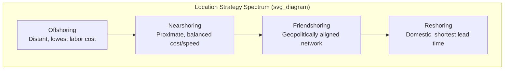
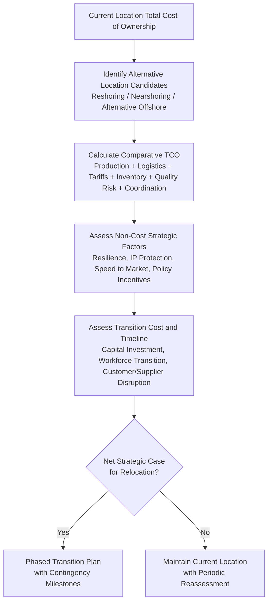

## Reshoring, Nearshoring, and Offshoring Trends

### Definition and Scope

Reshoring, nearshoring, and offshoring describe the three primary strategic postures a firm can adopt regarding the geographic location of production and sourcing relative to its home market and end-demand markets. While the previous treatment of global manufacturing network strategy introduced this spectrum as one dimension of network design, this topic addresses the phenomenon in greater depth: the specific economic and strategic drivers behind each posture, the historical evolution of dominant trends, and the analytical frameworks used to evaluate a location-shift decision.

### Definitions and Distinguishing Characteristics

**Key Points**

- **Offshoring**: Relocating production or sourcing to a distant foreign country, historically undertaken primarily to exploit labor cost differentials, regardless of geographic proximity to end-demand markets.
- **Nearshoring**: Relocating production or sourcing to a foreign country that is geographically proximate to the home/demand market (often sharing a border, regional trade bloc membership, or short transit time), balancing some cost advantage against reduced lead time, logistics risk, and time-zone/cultural coordination friction relative to offshoring.
- **Reshoring** (or "backshoring" / "onshoring"): Relocating production back to the firm's home country after a period of offshore or nearshore production, typically reversing a prior offshoring decision as underlying cost or risk conditions change.
- **Friendshoring** (or "allyshoring"): A more recent variant concentrating production and sourcing within a network of geopolitically aligned countries, prioritizing geopolitical risk mitigation and supply chain trust over pure cost or pure proximity considerations.
- These categories are not mutually exclusive network-wide postures — a single firm may simultaneously offshore certain product lines (where cost sensitivity dominates and logistics lead time tolerance is high), nearshore others (where responsiveness matters more), and reshore still others (where automation or IP protection considerations dominate), reflecting a portfolio approach to network configuration rather than a single uniform strategy.

### Historical Evolution of Dominant Trends

[Inference] The relative dominance of these strategies has shifted across recent decades in response to macroeconomic, technological, and geopolitical conditions, though specific historical periodization and causal weighting vary across analyses:

- **Offshoring-dominant era**: Following broad trade liberalization and the integration of large low-labor-cost manufacturing economies into global trade networks (particularly from the late 20th century onward), offshoring became a dominant strategic default for cost-sensitive manufacturing, driven substantially by large and sustained labor cost differentials between developed and developing economies.
- **Rising reshoring/nearshoring interest**: A more recent trend toward reconsidering offshored production has been attributed in industry and academic commentary to several converging factors: narrowing labor cost differentials as offshore economies developed, rising offshore wages and total landed cost (including logistics, inventory carrying cost, and quality risk previously underweighted in simple cost comparisons), increased automation reducing the labor cost proportion of total production cost, heightened supply chain risk awareness following major disruption events, and growing geopolitical and trade policy uncertainty affecting long, cross-border-dependent supply chains.
- **Friendshoring emergence**: More recently, geopolitical risk considerations — including trade tensions between major economic blocs, export control tightening, and strategic industry policy (particularly around technologically sensitive sectors) — have driven increased emphasis on aligning supply chain geography with geopolitical alliance structures, a consideration distinct from and additional to pure cost or pure proximity logic.

[Speculation] The durability and ultimate scale of the reshoring/nearshoring/friendshoring shift relative to the prior offshoring-dominant era remains a matter of ongoing debate among economists and industry analysts, with some viewing it as a structural realignment and others viewing observed shifts as more limited or sector-specific than headline commentary suggests; given the topic's dependence on continuously evolving economic and policy data, current-state quantitative trend data should be verified against up-to-date sources rather than relied upon as a fixed historical conclusion.

### Economic Drivers: Total Cost of Ownership Reassessment

**Key Points**

- **Labor cost convergence**: As offshore manufacturing economies develop, wage growth narrows the labor cost differential that originally motivated offshoring, reducing the primary economic rationale over time in a manner specific to each country's development trajectory.
- **Total landed cost vs. unit production cost**: A recurring theme in the shift toward reshoring/nearshoring is the recognition that comparing only unit labor or unit production cost across locations systematically understates the true cost of distant offshore production, once freight cost, extended-supply-line inventory carrying cost, quality/rework risk, tariff exposure, and coordination overhead are fully incorporated — directly applying the total-cost-of-ownership framework introduced in global manufacturing network strategy.
- **Automation and labor cost proportion**: As automation technology reduces the proportion of total production cost attributable to direct labor for a given process, the comparative cost advantage of low-labor-cost offshore locations diminishes proportionally, since automation capital cost tends to be less geographically differentiated than labor cost. [Inference] This effect is highly process- and industry-specific — labor-intensive assembly processes with limited automation feasibility retain stronger offshoring cost incentives than highly automatable processes.

$$\Delta TCO_{reshoring} = (TCO_{offshore} - TCO_{domestic})$$

A reshoring decision is economically favorable when this differential turns negative — that is, when the fully-loaded offshore total cost of ownership, inclusive of all previously discussed cost components, exceeds the fully-loaded domestic total cost of ownership, which increasingly occurs as labor cost differentials narrow and automation reduces domestic production's labor cost disadvantage.

### Non-Cost Strategic Drivers

**Key Points**

- **Supply chain resilience and risk reduction**: Shorter, more geographically proximate, or more politically aligned supply chains reduce exposure to the specific vulnerability categories addressed under building redundancy and resilience — reduced lead time exposure, reduced logistics disruption risk, and reduced concentration in geopolitically volatile regions.
- **Speed to market and responsiveness**: Proximate production reduces lead time to demand, supporting faster response to demand volatility, fashion/trend-sensitive product cycles, and reduced forecast error exposure (shorter lead time reduces the forecast horizon required, generally improving forecast accuracy).
- **Intellectual property protection**: Domestic or geopolitically aligned production reduces exposure to technology leakage risk in jurisdictions with weaker intellectual property enforcement, a consideration of increasing weight for technologically sensitive industries.
- **"Made in [Country]" market and regulatory preference**: Consumer preference for domestically produced goods in certain markets/categories, and government procurement policies favoring domestic content, can create demand-side incentives for reshoring independent of underlying cost comparison.
- **Government industrial policy incentives**: Targeted subsidies, tax incentives, and strategic industry support programs in some jurisdictions have been directed at incentivizing domestic or allied-country production in specific strategic sectors (e.g., semiconductors, critical minerals processing, pharmaceuticals), directly altering the cost calculus for firms in those sectors. [Unverified] The specific programs, eligibility criteria, and scale of such incentives vary by country and change over time with shifting government policy; current program details should be verified against current government sources rather than assumed static.

### Nearshoring-Specific Considerations

**Key Points**

- **Regional trade bloc advantages**: Nearshoring within an existing free trade agreement or customs union structure can combine reduced logistics distance with preferential tariff access, provided rules-of-origin requirements are satisfied — creating a compounding benefit relative to nearshoring outside such a structure.
- **Time zone alignment**: Reduced time zone difference between nearshore production and headquarters/demand markets improves real-time coordination capability (video conferencing overlap, same-business-day communication) relative to distant offshore locations, directly addressing a cross-cultural and coordination friction point.
- **Reduced but not eliminated labor cost advantage**: Nearshore locations frequently retain some labor cost advantage relative to the home market (positioning nearshoring as a middle position on the cost spectrum), though this advantage is typically smaller than that offered by more distant offshore locations with lower absolute labor costs — the core nearshoring trade-off is accepting a smaller labor cost advantage in exchange for reduced logistics, coordination, and risk exposure.

### Reshoring-Specific Considerations

**Key Points**

- **Automation as a reshoring enabler**: Reshoring decisions are frequently paired with simultaneous investment in automation, since domestic reshoring without automation would typically face a larger labor cost disadvantage than the offshore alternative; automating the reshored process is often what makes the total cost of ownership comparison favorable despite higher nominal domestic wage rates.
- **Workforce and skills availability**: Reshoring can be constrained by availability of domestic manufacturing labor with relevant skills, particularly in regions or countries where manufacturing employment has declined over an extended offshoring period, requiring workforce development investment alongside the physical relocation decision.
- **Brownfield vs. greenfield reshoring**: Reshoring may involve reactivating or repurposing existing domestic facilities (brownfield) or constructing new facilities (greenfield), with materially different capital cost, timeline, and risk profiles.

### Decision Framework: Evaluating a Location Shift

A structured location-shift evaluation typically proceeds through the following analytical stages:

**Key Points**

- **Transition cost and timeline**: Any location shift carries substantial one-time transition costs (capital investment in new/reconfigured facilities, workforce hiring and training, supplier requalification, potential dual-running costs during transition, and customer service risk during the changeover period) that must be weighed against the ongoing TCO differential — a large ongoing cost advantage can still fail a payback-period test if transition costs are sufficiently high.
- **Reversibility asymmetry**: [Inference] Reshoring decisions following a period of offshoring often face higher transition friction than the original offshoring decision did, since domestic supplier ecosystems, specialized labor pools, and supporting infrastructure may have atrophied during the offshore period, requiring not merely a location reversal but a partial rebuilding of domestic manufacturing ecosystem capability.
- **Periodic reassessment discipline**: Given that labor cost differentials, automation economics, trade policy, and geopolitical alignment all continue to evolve, the optimal location-strategy position is not a permanent decision but requires the same periodic strategic reassessment cycle discussed under global manufacturing network strategy.

### Risk and Resilience Connection

**Key Points**

- The reshoring/nearshoring/offshoring decision is not purely an efficiency optimization but a direct application of the efficiency-versus-resilience trade-off introduced under building redundancy and resilience — offshoring to a single distant low-cost location often represents the efficiency-maximizing, resilience-minimizing position, while nearshoring/reshoring/friendshoring represent points that trade some efficiency for reduced supply chain vulnerability, shorter lead times, and reduced geopolitical/currency risk exposure.
- A portfolio approach — combining a primary offshore source with a qualified nearshore or domestic backup source for critical items — applies dual-sourcing redundancy logic directly to the location-strategy decision, rather than treating reshoring/nearshoring/offshoring as a single all-or-nothing network-wide choice.

**Conclusion**

Reshoring, nearshoring, and offshoring represent points along a strategic spectrum trading off labor cost advantage, logistics/lead-time performance, geopolitical risk exposure, and coordination complexity. While offshoring's dominance was historically driven by large labor cost differentials, a fuller total-cost-of-ownership analysis — incorporating logistics, inventory carrying cost, quality risk, tariff exposure, and coordination overhead — combined with automation's effect on reducing labor cost's share of total production cost, and heightened attention to supply chain resilience and geopolitical alignment, has shifted many firms toward reconsidering pure offshore concentration in favor of nearshoring, friendshoring, or selective reshoring. Because the underlying economic and geopolitical drivers continue to evolve, location strategy requires ongoing reassessment rather than a fixed historical determination, and is best evaluated using a structured comparative total-cost-of-ownership and strategic-risk framework rather than headline labor-cost comparison alone.

**Related Topics**

- Global manufacturing network strategy
- Building redundancy and resilience
- Total Cost of Ownership (TCO) analysis in sourcing decisions
- International logistics and trade compliance
- Managing currency and political risk
- Automation and robotics in manufacturing
- Free trade agreements and rules of origin
- Government industrial policy and manufacturing incentives
- Supply chain scenario planning and stress testing
- Workforce development and manufacturing skills gaps