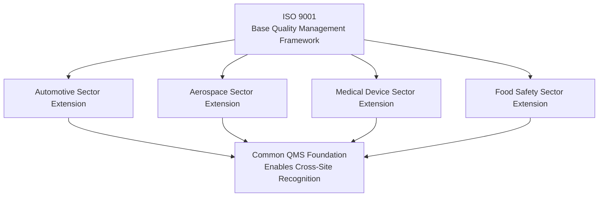
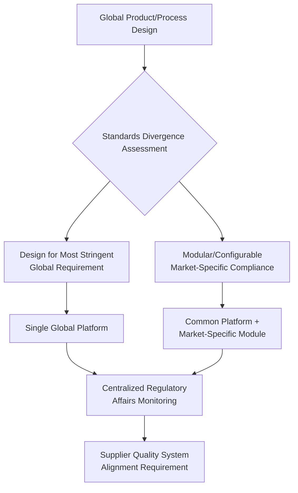

## Global Quality Standards Harmonization

### Definition and Scope

Global quality standards harmonization is the process of aligning quality management requirements, product specifications, testing methods, and certification schemes across national and regional jurisdictions so that a single design, process, or quality system can satisfy compliance requirements in multiple markets with minimal duplicative modification. It addresses a structural tension in global operations: multinational firms benefit from designing and manufacturing standardized products for global distribution, but historically fragmented, jurisdiction-specific quality and regulatory requirements can force costly product variants, duplicate testing, and redundant certification processes for functionally identical goods.

### Why Harmonization Matters in Global Operations

**Key Points**

- **Reduced compliance cost and complexity**: Without harmonization, a firm selling into multiple markets may need to maintain distinct product variants, testing protocols, and documentation to satisfy each jurisdiction's unique requirements, directly increasing production complexity and reducing the scale economies otherwise available from standardized global manufacturing.
- **Faster market access**: Mutual recognition of test results and certifications between jurisdictions reduces the time and cost required to bring a product to a new market, since redundant re-testing and re-certification can be avoided.
- **Supply chain simplification**: Harmonized component and material standards allow a single qualified supplier base to serve multiple regional manufacturing sites within a global network, directly supporting the multi-site qualification and flexibility objectives discussed under global manufacturing network strategy.
- **Trade facilitation**: Divergent technical standards and conformity assessment requirements function as a form of non-tariff trade barrier; harmonization reduces this barrier independent of formal tariff policy, complementing the tariff and rules-of-origin harmonization addressed under trade agreements.

### Key International Standards-Setting Bodies

**Key Points**

- **International Organization for Standardization (ISO)**: A non-governmental international standards body that develops and publishes voluntary international standards across virtually all industry sectors, most notably the ISO 9000 family for quality management systems.
- **International Electrotechnical Commission (IEC)**: Develops international standards specifically for electrical, electronic, and related technologies, frequently working in coordination with ISO on jointly developed standards.
- **Codex Alimentarius Commission**: A joint body (established by the Food and Agriculture Organization and the World Health Organization) developing international food safety and quality standards, widely referenced in international food trade disputes and used as a benchmark under World Trade Organization food safety agreements.
- **International standards developed through regional and industry-specific bodies**: Numerous sector-specific harmonization bodies exist for specific industries (e.g., pharmaceutical, automotive, aerospace, medical device), often developing more detailed technical standards than the broad cross-sector ISO/IEC frameworks.

### ISO 9001 and Quality Management System Harmonization

**Key Points**

- **ISO 9001** is the most widely adopted international standard specifying requirements for a quality management system (QMS), applicable across virtually any industry or organization type, providing a common quality system framework that can be certified by accredited third-party bodies and recognized across jurisdictions.
- **Process-based, requirements framework**: Rather than specifying particular product specifications, ISO 9001 specifies process requirements (management responsibility, resource management, process control, measurement/analysis/improvement) that a certified quality management system must satisfy, making it adaptable across diverse industries and product types.
- **Certification and accreditation structure**: ISO 9001 certification is issued by accredited third-party certification bodies, themselves overseen by national accreditation bodies, creating a multi-tier governance structure intended to ensure certification consistency and credibility across countries.
- **Sector-specific extensions**: Numerous industry-specific quality management standards build on the ISO 9001 base framework with additional sector-specific requirements — for example, automotive-sector-specific and aerospace-sector-specific quality management standards layer additional supplier and process-control requirements onto the ISO 9001 foundation, allowing a common cross-industry quality framework while addressing industry-specific risk profiles.

### Regulatory Harmonization Mechanisms

#### Mutual Recognition Agreements (MRAs)

**Key Points**

- Bilateral or multilateral agreements between regulatory authorities in different jurisdictions to accept each other's conformity assessment results (testing, inspection, certification) without requiring duplicate assessment in the importing jurisdiction.
- MRAs reduce compliance cost and market entry time significantly for covered product categories, but typically require substantial prior alignment of the underlying technical requirements and confidence in the equivalence of the respective conformity assessment infrastructure between the participating jurisdictions.
- [Inference] The scope and product coverage of specific MRAs vary considerably and are subject to periodic renegotiation or suspension based on evolving trade relationships; the existence of an MRA framework between two jurisdictions does not guarantee coverage of any specific product category without verification against the current, product-specific agreement text.

#### Equivalence and Reference Standards

- Some regulatory frameworks explicitly designate specific international standards (e.g., a specific ISO or IEC standard) as an accepted or presumptively compliant method of satisfying a domestic regulatory requirement, reducing the need for jurisdiction-specific technical requirement development from first principles.
- The World Trade Organization's Agreement on Technical Barriers to Trade encourages (though does not universally mandate) member countries to base domestic technical regulations on relevant international standards where they exist, functioning as a broader multilateral policy framework supporting harmonization, distinct from any specific bilateral MRA.

#### Regional Harmonization Blocs

- Regional economic and regulatory blocs frequently pursue harmonization of technical standards and conformity assessment procedures among member states as part of broader regional trade integration, reducing internal technical barriers to trade within the bloc even where full global harmonization has not been achieved.
- Regional harmonization can create a two-tier structure: substantial harmonization within a regional bloc, combined with continued technical requirement divergence between different regional blocs, meaning a firm's harmonization strategy often needs to address both intra-regional and inter-regional standard alignment.

### Persistent Sources of Standards Divergence

Despite substantial international harmonization progress, complete global standards uniformity has not been achieved, and firms operating global manufacturing networks must manage residual divergence:

**Key Points**

- **Safety and environmental regulation differences**: National and regional differences in risk tolerance and regulatory philosophy (e.g., differing approaches to chemical substance restriction, electrical safety requirements, or environmental compliance thresholds) can persist even where broader quality management framework harmonization (e.g., ISO 9001 adoption) is widespread.
- **Measurement and testing methodology differences**: Even where a nominal standard is shared, differences in required testing methodology, sample size, or acceptance criteria between jurisdictions can produce divergent compliance outcomes for functionally similar products.
- **Labeling, documentation, and language requirements**: Jurisdiction-specific labeling, packaging, and documentation language requirements frequently persist as a residual localization requirement even where underlying technical/safety standards are substantially harmonized.
- **National security and strategic industry exceptions**: Certain product categories (particularly those intersecting with national security, critical infrastructure, or strategic industry policy) may face persistent or increasing standards divergence driven by policy objectives distinct from pure technical or safety rationale, connecting to the broader friendshoring and geopolitical risk considerations discussed under managing political risk.

### Operational Strategies for Managing Standards Divergence

**Key Points**

- **Design for global compliance ("design margin" strategy)**: Designing products to meet the most stringent applicable requirement across all target markets from the outset, avoiding market-specific redesign at the cost of potentially over-engineering for markets with less stringent requirements — a strategy that trades some cost efficiency for manufacturing and supply chain simplification.
- **Modular/configurable compliance design**: Designing products with modular components or configurable elements specifically to accommodate market-specific regulatory variation (e.g., swappable power supply modules for different electrical safety/voltage standards) without requiring a fully distinct product platform per market.
- **Centralized regulatory affairs function**: Maintaining a centralized organizational function tracking evolving standards and regulatory requirements across all markets served, feeding requirements into both product design and manufacturing quality system specifications, rather than relying on decentralized, market-by-market compliance tracking that risks inconsistency and duplicated effort.
- **Supplier quality system alignment**: Requiring the supplier base to maintain harmonized quality management certification (e.g., common ISO 9001-based certification) as a qualification prerequisite, supporting the multi-site production qualification flexibility objective in global manufacturing network design by ensuring consistent input quality regardless of which network node sources from a given supplier.

### Quality Harmonization and Supply Chain Risk Management

**Key Points**

- Harmonized quality standards across a supplier base directly support supply chain redundancy objectives: if multiple qualified suppliers across different regions certify to the same harmonized quality standard, a firm can more readily requalify or shift volume to an alternate supplier during a disruption, since the quality baseline is already consistent rather than requiring supplier-specific requalification testing.
- Divergent or unharmonized standards act as a friction point in dual-sourcing and network flexibility strategies, since a component or process qualified under one jurisdiction's standard may require additional testing or modification before being accepted as equivalent for a different market's requirements — a hidden cost that total-cost-of-ownership analysis for network flexibility should account for.
- Standards harmonization gaps can also function as a specific category of critical uncertainty in scenario planning exercises — regulatory divergence trends (whether toward greater harmonization or toward fragmentation, particularly along geopolitical bloc lines) represent a plausible driving force axis for scenario construction relevant to long-term network design decisions.

### Certification and Audit Considerations

**Key Points**

- **Third-party certification and accreditation credibility**: The value of harmonization depends on confidence in the consistency and rigor of certification issued across different countries' accredited certification bodies; perceived inconsistency in certification rigor between jurisdictions can undermine the practical benefit of nominal standard harmonization even where the written standard itself is identical.
- **Ongoing surveillance audits**: Most quality management certifications (including ISO 9001) require periodic surveillance audits to maintain certification validity, meaning harmonized certification status requires continuous compliance maintenance rather than a one-time qualification event — directly relevant to ongoing supplier and facility quality monitoring within a global network.
- **Multi-site certification scope**: For firms operating multiple facilities within a global manufacturing network, quality management system certification can be structured as a single certificate covering multiple sites under a common corporate quality system, or as separate site-specific certifications — a structural choice affecting both certification cost and the degree to which certification demonstrates true cross-site process consistency.

**Conclusion**

Global quality standards harmonization reduces the compliance cost, market entry friction, and supply chain complexity that would otherwise result from fragmented, jurisdiction-specific quality and technical requirements. International standards bodies (ISO, IEC, and sector-specific equivalents), mutual recognition agreements, and regional harmonization blocs have substantially reduced — though not eliminated — standards divergence across markets. Firms operating global manufacturing networks manage residual divergence through design-for-global-compliance strategies, modular compliance architecture, centralized regulatory affairs monitoring, and supplier quality system alignment requirements, with harmonized quality baselines directly supporting the multi-site flexibility and supplier diversification objectives central to broader supply chain resilience and global network strategy.

**Related Topics**

- Global manufacturing network strategy
- International logistics and trade compliance
- Building redundancy and resilience
- Cross-cultural management in operations
- Total Quality Management (TQM) principles
- Supplier quality assurance and audit programs
- Technical barriers to trade under WTO agreements
- Product liability and regulatory compliance risk
- Six Sigma and statistical process control
- Regional trade bloc regulatory integration