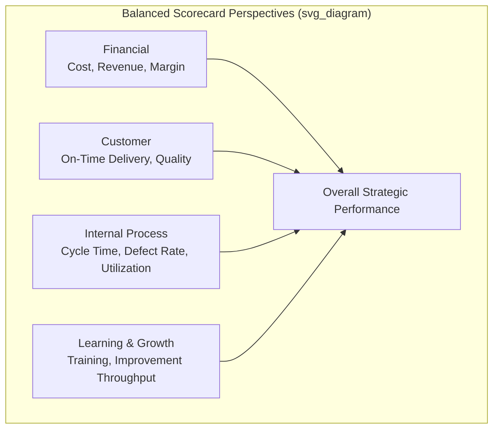
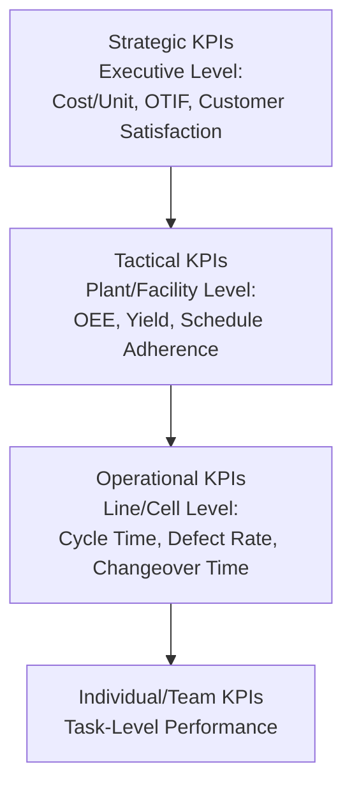

## Key Performance Indicators for Operations

### Definition and Scope

Key performance indicators (KPIs) for operations are quantifiable metrics used to measure how effectively an organization's operational processes achieve strategic and tactical objectives across cost, quality, speed, dependability, and flexibility dimensions. Unlike general business metrics, operations KPIs are specifically designed to be actionable at the process level — directly connected to decisions operations managers and frontline supervisors can influence — while also aggregating meaningfully into higher-level performance reporting for executive and strategic decision-making.

### Characteristics of Effective KPIs

**Key Points**

- **Alignment with strategic objectives**: An effective KPI should trace clearly back to a specific competitive priority (cost, quality, speed, dependability, or flexibility) that the organization has deliberately chosen to emphasize, rather than being tracked simply because it is easily measurable.
- **Actionability**: The metric should be influenced by decisions and actions within the control (or substantial influence) of the individuals or teams accountable for it; metrics driven predominantly by external factors outside operational control provide poor incentive alignment.
- **Leading vs. lagging indicators**: Lagging indicators measure outcomes after they occur (e.g., customer complaints, financial results); leading indicators measure conditions predictive of future outcomes (e.g., preventive maintenance compliance predicting future equipment downtime). A balanced KPI framework includes both, since lagging indicators alone provide feedback too late for proactive intervention.
- **SMART criteria**: A widely referenced framework for KPI definition — Specific, Measurable, Achievable, Relevant, Time-bound — used to ensure a metric is operationally well-defined rather than vague or aspirational.
- **Avoiding metric gaming and unintended consequences**: A KPI measured in isolation can incentivize local optimization that harms overall system performance (a classic example being an on-time-delivery metric pursued through excess safety stock that inflates inventory carrying cost) — effective KPI frameworks pair metrics with counterbalancing measures to avoid this behavior.

### The Balanced Scorecard Framework

[Unverified] A widely referenced framework for structuring organizational performance measurement — generally attributed to Robert Kaplan and David Norton — organizes KPIs across four perspectives to avoid over-reliance on purely financial lagging indicators.

**Key Points**

- **Financial perspective**: Traditional financial outcome metrics (cost, revenue, profitability) — largely lagging indicators reflecting the ultimate result of operational performance.
- **Customer perspective**: Metrics reflecting the customer's experience of operational performance (on-time delivery, quality as experienced by the customer, responsiveness).
- **Internal process perspective**: Metrics measuring the efficiency and effectiveness of internal operational processes (cycle time, defect rates, capacity utilization) — the core domain of most operations-specific KPIs.
- **Learning and growth perspective**: Metrics reflecting the organization's capacity for future improvement (employee training completion, process improvement initiative throughput, technology adoption).

### KPIs by Operational Performance Dimension

#### Cost KPIs

**Key Points**

- **Cost per unit**: Total operational cost divided by units produced, the most fundamental operational cost efficiency metric, though it requires careful definition of which cost categories (direct labor, materials, overhead allocation) are included for meaningful comparison across periods or facilities.
- **Total landed cost**: As introduced under international logistics, the fully-loaded cost of a delivered unit including production, freight, duties, and inventory carrying cost — a more complete cost metric than production cost alone for globally sourced or distributed goods.
- **Overhead absorption rate**: The proportion of fixed overhead cost absorbed per unit of output, sensitive to capacity utilization and therefore useful for diagnosing whether cost performance issues stem from process inefficiency or simply low volume.

#### Quality KPIs

- **Defect rate / parts per million (PPM) defective**: The proportion or rate of units failing to meet specification, a core lagging quality indicator directly tied to customer-experienced quality and rework/scrap cost.
- **First Pass Yield (FPY)**: The proportion of units that complete a process step correctly on the first attempt without rework, a leading indicator of process capability distinct from final defect rate, which may be masked by downstream rework.

$$FPY = \frac{Units\ passing\ without\ rework}{Total\ units\ entering\ process} \times 100\%$$

- **Cost of Quality (COQ)**: Aggregates prevention cost, appraisal (inspection) cost, and failure cost (both internal failure — scrap/rework before shipment — and external failure — warranty/returns after shipment), providing a financial framing of quality performance that connects quality metrics directly to cost KPIs.
- **Customer complaint rate / return rate**: Lagging indicators reflecting quality as experienced by the end customer, distinct from internal defect detection metrics which may not capture all customer-perceived quality issues.

#### Speed and Delivery KPIs

- **Cycle time**: The total elapsed time for a unit to complete a defined process (e.g., order-to-delivery, or a specific production step), a core operational speed metric directly affecting responsiveness and inventory requirements.
- **Lead time**: Often used interchangeably with cycle time in some contexts, but more precisely refers to the total time from order placement to order fulfillment as experienced by the customer, which may include queue time not captured in a narrower process cycle time definition.
- **On-Time Delivery (OTD) / On-Time-In-Full (OTIF)**: The proportion of orders delivered on or before the committed date (OTD), often combined with completeness of the order (OTIF), a widely used customer-facing dependability and speed composite metric.
- **Throughput**: The rate at which a process or system produces completed units per unit of time, directly connected to capacity utilization and constraint/bottleneck analysis.

#### Dependability KPIs

- **Schedule adherence**: The degree to which actual production or delivery matches the planned schedule, a leading indicator of process control distinct from the ultimate on-time delivery outcome.
- **Overall Equipment Effectiveness (OEE)**: A composite metric combining availability (uptime versus planned production time), performance (actual speed versus designed speed), and quality (good units versus total units produced) into a single equipment effectiveness measure widely used in manufacturing.

$$OEE = Availability \times Performance \times Quality$$

Where each component ratio is expressed as a value between 0 and 1 (or as a percentage), such that a facility with 90% availability, 95% performance, and 99% quality would yield an OEE of approximately 84.6%, illustrating how compounding sub-90% component rates can produce a substantially lower composite OEE than intuition based on any single component alone might suggest.

#### Flexibility KPIs

- **Changeover/setup time**: The time required to reconfigure a process or production line from one product/configuration to another, directly affecting the economic feasibility of small-batch or mixed-model production.
- **Volume flexibility range**: The proportion by which production volume can be increased or decreased within a defined response time, relevant to demand variability accommodation and connecting to the capacity redundancy concepts in building resilience.
- **New product introduction lead time**: The time required to bring a new product from design finalization to full-scale production capability, relevant to responsiveness in fast-moving or innovation-intensive industries.

### Inventory and Asset Utilization KPIs

**Key Points**

- **Inventory turnover**: The rate at which inventory is sold/consumed and replaced over a period, calculated as cost of goods sold divided by average inventory value, with higher turnover generally indicating more efficient inventory management (subject to service-level trade-offs).

$$Inventory\ Turnover = \frac{Cost\ of\ Goods\ Sold}{Average\ Inventory\ Value}$$

- **Days of Inventory on Hand (DIO)**: The inverse-scaled expression of inventory turnover expressed in days of supply, often more intuitively interpretable for operational planning purposes than a turnover ratio.
- **Capacity utilization**: The proportion of available production capacity actually used over a period, a key metric for both cost efficiency (fixed cost absorption) and flexibility (available surge capacity) assessment.
- **Perfect Order Rate**: A composite metric combining multiple dimensions (on-time, complete, damage-free, accurately documented) into a single measure of overall order fulfillment quality, illustrating the broader principle that composite indices can provide a more holistic performance view than any single-dimension metric alone, at some cost of diagnostic specificity about which underlying dimension is driving performance.

### KPI Cascading and Alignment Across Organizational Levels

**Key Points**

- Effective KPI frameworks cascade strategic-level objectives into progressively more granular, directly actionable metrics at each organizational level, ensuring line-level metrics genuinely aggregate into the strategic outcomes leadership cares about rather than existing as disconnected local measures.
- **Metric proliferation risk**: Tracking an excessive number of KPIs at any given organizational level dilutes management attention and can create conflicting incentive signals; leading operations management practice generally favors a focused set of vital-few metrics per level over comprehensive but unfocused metric dashboards.
- Cross-functional KPI alignment (ensuring, for example, that a procurement cost-reduction KPI does not conflict with a manufacturing quality or continuity KPI through a supplier selection trade-off) requires deliberate organizational design rather than assuming naturally aligned incentives across functional boundaries.

### KPI Benchmarking

**Key Points**

- **Internal benchmarking**: Comparing KPI performance across different facilities, lines, or time periods within the same organization, useful for identifying internal best-practice sites and improvement opportunity gaps.
- **Competitive/industry benchmarking**: Comparing KPI performance against industry-average or best-in-class external reference points, providing external context for whether internally-tracked trends represent genuinely strong performance or merely local improvement against a weak baseline.
- **Best-practice/functional benchmarking**: Comparing specific process performance against organizations outside the immediate industry that excel at a comparable process, sometimes revealing improvement approaches not visible within industry-specific benchmarking alone.
- [Inference] The availability and reliability of external benchmarking data varies substantially by industry and metric; benchmarking comparisons should account for definitional differences in how a given metric is calculated across different organizations or data sources, since superficially identical metric names can mask materially different underlying calculation methodologies.

### Technology and Data Infrastructure for KPI Tracking

**Key Points**

- **Real-time dashboards and visual management**: Increasingly, operations KPIs are displayed through real-time digital dashboards (at both plant-floor and management levels) rather than periodic static reports, enabling faster response to emerging performance deviations.
- **Manufacturing Execution Systems (MES) and IoT sensor integration**: Automated data capture from production equipment and process sensors increasingly replaces manual data collection for metrics such as OEE, throughput, and cycle time, improving both data accuracy and reporting frequency.
- **Statistical Process Control (SPC) integration**: Many quality KPIs are tracked using SPC control charts, distinguishing between normal process variation and statistically significant deviations warranting investigation, rather than reacting to every individual data point fluctuation.

### Connecting KPIs to Continuous Improvement

**Key Points**

- KPI trend monitoring functions as the primary trigger mechanism for continuous improvement initiative prioritization — sustained underperformance or negative trend direction on a given KPI typically initiates root-cause investigation and targeted improvement project selection.
- Leading indicators are particularly valuable in a continuous improvement context because they allow intervention before a lagging outcome (such as a customer complaint or missed delivery) actually materializes, shifting improvement activity from reactive to proactive.
- KPI performance data also serves as the before/after comparison basis for validating whether a specific continuous improvement initiative achieved its intended effect, connecting performance measurement directly to the broader continuous improvement management cycle.

**Conclusion**

Key performance indicators for operations translate strategic competitive priorities — cost, quality, speed, dependability, and flexibility — into specific, actionable, measurable metrics that can be tracked and cascaded from executive strategy down to line-level execution. Effective KPI design balances leading and lagging indicators, avoids incentivizing local optimization at the expense of overall system performance, and integrates with real-time data infrastructure to support both ongoing operational control and the structured continuous improvement cycle that uses KPI trend data to prioritize and validate improvement initiatives. Because metric definitions and appropriate targets vary by industry and strategic context, KPI frameworks require periodic review to ensure continued alignment with evolving strategic priorities rather than static, unreviewed metric tracking.

**Related Topics**

- Overall Equipment Effectiveness (OEE) and equipment reliability
- Statistical Process Control (SPC) and control charts
- Total Quality Management (TQM) and Cost of Quality
- Lean manufacturing and waste elimination
- Balanced Scorecard strategic management
- Business Impact Analysis and criticality tiering
- Global quality standards harmonization
- Manufacturing Execution Systems (MES) and IoT integration
- Root cause analysis methodologies (Five Whys, fishbone diagrams)
- Benchmarking methodologies and best-practice analysis