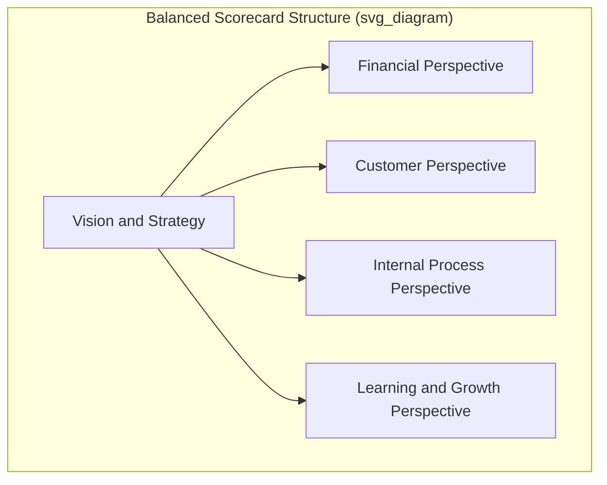
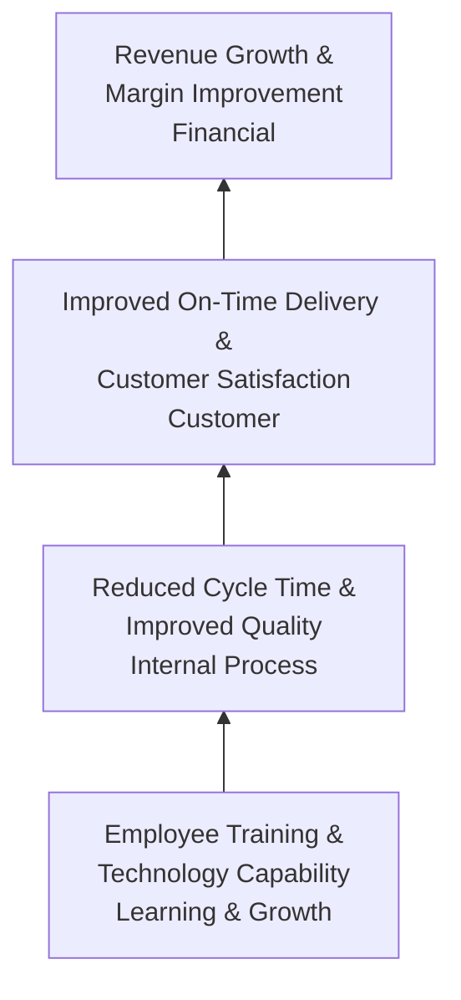

## The Balanced Scorecard Framework

### Definition and Origin

The Balanced Scorecard is a strategic performance management framework that translates an organization's strategy into a coherent set of performance measures spanning four interconnected perspectives, designed to counteract the historical over-reliance on purely financial metrics for evaluating and managing organizational performance. [Unverified] The framework is generally attributed to Robert Kaplan and David Norton, originating from research and publications in the early 1990s, and has since become one of the most widely referenced strategic performance management frameworks in both academic and practitioner contexts.

### Rationale: Limitations of Financial-Only Performance Measurement

**Key Points**

- **Lagging nature of financial metrics**: Financial results (profit, revenue, cost) reflect the outcome of decisions and operational performance from prior periods; by the time a financial metric reveals a problem, the underlying operational cause may have been developing for an extended period without visibility.
- **Absence of forward-looking indicators**: Financial metrics alone provide no direct visibility into the operational, customer, or organizational capability drivers that will determine future financial performance, creating a structural blind spot for proactive management intervention.
- **Short-term bias risk**: Management systems evaluated purely on near-term financial metrics can incentivize decisions that improve short-term financial results at the expense of longer-term capability building (e.g., deferring equipment maintenance or employee training investment to improve a current quarter's financial metrics, at the cost of future operational performance).
- The Balanced Scorecard addresses these limitations by requiring explicit measurement and management attention across leading (operational, customer, capability-building) indicators alongside traditional lagging financial indicators.

### The Four Perspectives

#### Financial Perspective

**Key Points**

- Addresses the question: "To succeed financially, how should we appear to our shareholders/stakeholders?"
- Encompasses traditional outcome-oriented financial metrics: revenue growth, profitability margins, return on invested capital, cost efficiency, and cash flow measures.
- Functions as the ultimate outcome perspective in the framework — the other three perspectives are generally understood to be leading indicators that, if well-managed, drive improved financial outcomes over time, making the financial perspective the natural culmination of the causal chain the framework proposes.

#### Customer Perspective

**Key Points**

- Addresses the question: "To achieve our vision, how should we appear to our customers?"
- Encompasses metrics reflecting the customer's direct experience and perception of the organization's value proposition: customer satisfaction, customer retention/loyalty, market share, on-time delivery performance, and product/service quality as experienced by the customer.
- Directly connects to operational KPIs discussed previously (On-Time-In-Full, customer complaint rate) — the customer perspective is typically where operations-generated performance data becomes visible to strategic management in customer-relevant terms.

#### Internal Process Perspective

**Key Points**

- Addresses the question: "To satisfy our customers and shareholders, what business processes must we excel at?"
- Encompasses metrics measuring the efficiency, quality, and effectiveness of the internal operational processes that produce customer value: cycle time, defect rates, capacity utilization, process yield, and innovation/new-product-development process performance.
- This perspective is the primary home for the operations-specific KPIs discussed under key performance indicators for operations (OEE, first-pass yield, cycle time), positioning day-to-day operations management performance explicitly within the broader strategic measurement architecture rather than as a separate, disconnected reporting stream.

#### Learning and Growth Perspective

**Key Points**

- Addresses the question: "To achieve our vision, how will we sustain our ability to change and improve?"
- Encompasses metrics reflecting the organization's capacity for future performance improvement: employee skills and training completion, employee satisfaction and retention, information system/technology capability, and organizational culture/alignment indicators.
- Frequently the most underdeveloped perspective in practical Balanced Scorecard implementations, since these metrics are often less standardized and more difficult to quantify precisely than financial, customer, or process metrics — [Inference] this practical implementation challenge is commonly noted in Balanced Scorecard literature and case studies, though the specific degree of underdevelopment varies by organization.
- Functions as the foundational perspective in the framework's causal logic: investment in employee capability and organizational learning is proposed to drive improved internal process performance, which drives improved customer outcomes, which ultimately drives improved financial results.

### The Strategy Map: Linking Perspectives Causally

**Key Points**

- A **strategy map** is a visual representation of the hypothesized cause-and-effect relationships linking objectives across the four perspectives, typically constructed bottom-up (learning and growth enabling internal process improvement, enabling customer value delivery, enabling financial results).
- The strategy map makes explicit the specific causal chain an organization believes connects its capability-building and process investments to its ultimate financial objectives, allowing that causal hypothesis to be tested and refined based on actual observed relationships between the metrics over time.
- [Inference] A frequently noted implementation challenge is that the causal linkages in a strategy map are hypothesized rather than empirically proven at the time of design; validating and refining these linkages typically requires ongoing analysis of actual metric relationships as performance data accumulates, rather than assuming the initially designed causal map is correct in perpetuity.

### Building a Balanced Scorecard: Implementation Process

**Key Points**

1. **Translate strategy into objectives**: Clarify the organization's strategic priorities into specific, distinct objectives within each of the four perspectives.
2. **Develop the strategy map**: Establish the hypothesized causal linkages between objectives across perspectives, ensuring the learning/process/customer objectives credibly connect to the financial objectives.
3. **Select measures for each objective**: Choose specific, measurable KPIs for each objective, applying the same SMART and actionability criteria discussed under general KPI design, while ensuring a limited number of well-chosen measures per objective rather than exhaustive metric proliferation.
4. **Set targets**: Establish specific performance targets for each measure, informed by strategic ambition, benchmarking, and baseline current performance.
5. **Identify strategic initiatives**: Define the specific programs, projects, or continuous improvement initiatives intended to close the gap between current performance and target performance for each measure.
6. **Cascade throughout the organization**: Translate the enterprise-level scorecard into aligned scorecards at business unit, departmental, and potentially individual levels, ensuring lower-level metrics genuinely support (rather than merely coexist with) the enterprise-level strategic objectives — directly paralleling the KPI cascading structure discussed previously.

### Balanced Scorecard vs. Other Performance Frameworks

**Key Points**

- **Balanced Scorecard vs. simple KPI dashboards**: A generic KPI dashboard may track numerous operational metrics without an explicit strategic causal structure connecting them; the Balanced Scorecard's distinguishing feature is the deliberate, limited, and strategically-derived selection of measures organized around an explicit strategy map rather than comprehensive operational metric tracking.
- **Balanced Scorecard vs. Objectives and Key Results (OKRs)**: [Unverified] OKRs, a goal-setting framework with separate origins, share some structural similarity (linking high-level objectives to measurable key results) but are generally applied with a different cadence (often quarterly goal-setting cycles) and typically without the Balanced Scorecard's specific four-perspective structural requirement; organizations sometimes use the two frameworks in combination rather than as strict alternatives.
- **Balanced Scorecard vs. Malcolm Baldrige / EFQM excellence models**: Broader business excellence frameworks (such as those underlying major national/regional quality awards) typically encompass a wider range of organizational criteria (leadership, strategic planning, workforce, process management, and results) than the Balanced Scorecard's four-perspective structure, though both share the underlying principle that sustained financial results depend on managing a broader set of leading organizational capabilities.

### Common Implementation Pitfalls

**Key Points**

- **Treating the scorecard as a reporting exercise rather than a management system**: A frequently cited implementation failure mode is populating scorecard metrics for periodic reporting without genuinely using the framework to drive resource allocation, strategic initiative prioritization, and management review discussions — reducing the framework to a compliance exercise rather than an active strategic management tool.
- **Excessive metric proliferation within each perspective**: Including too many measures per perspective dilutes strategic focus and recreates the metric-overload problem the framework is intended to solve relative to comprehensive but unfocused KPI dashboards.
- **Weak or unvalidated causal linkages**: Constructing a strategy map with intuitively plausible but empirically unverified causal connections between perspectives, without subsequent effort to test whether the hypothesized linkages actually hold using accumulated performance data.
- **Static scorecards in dynamic strategic environments**: Failing to periodically revisit and revise the scorecard as strategic priorities, competitive conditions, or market context evolve, resulting in a scorecard that continues measuring what once mattered strategically rather than current priorities.
- **Insufficient cascading and organizational buy-in**: Developing a strategically sound enterprise-level scorecard that is not effectively translated into meaningful, connected objectives at lower organizational levels, resulting in a strategic tool disconnected from day-to-day operational decision-making.

### Balanced Scorecard Application in Operations Management Context

**Key Points**

- The internal process perspective provides the natural home for the full range of operations-specific KPIs (cost, quality, speed, dependability, flexibility metrics) discussed previously, but the Balanced Scorecard framework requires operations managers to explicitly connect those process metrics to customer and financial outcomes rather than optimizing process metrics in isolation.
- Continuous improvement initiative prioritization can be explicitly structured around Balanced Scorecard strategic initiatives, ensuring improvement project selection is driven by strategic objective gaps identified through the scorecard rather than by ad hoc or purely local process concerns.
- Learning and growth perspective metrics (workforce training, technology capability) are directly relevant to operations management capability-building — including cross-cultural management training, automation/technology adoption initiatives, and the workforce development considerations relevant to reshoring decisions — positioning these operational capability investments within the broader strategic measurement framework rather than treating them as isolated HR or technology initiatives.

**Conclusion**

The Balanced Scorecard framework structures organizational performance measurement across financial, customer, internal process, and learning and growth perspectives, connected through an explicit strategy map hypothesizing how capability-building and process improvement ultimately drive financial results. Its principal value in an operations management context is positioning operational process metrics — the traditional domain of operations KPIs — within a broader strategic causal chain connecting operational performance to customer outcomes and financial results, rather than allowing operational metrics to be tracked and optimized in strategic isolation. Effective implementation requires disciplined measure selection, genuine use of the scorecard to drive strategic initiative prioritization and resource allocation, and periodic revalidation of both the specific metrics and the underlying causal assumptions as strategic context evolves.

**Related Topics**

- Key performance indicators for operations
- Strategy maps and cause-and-effect analysis
- Continuous improvement methodologies (Kaizen, PDCA, Six Sigma)
- Objectives and Key Results (OKR) goal-setting frameworks
- Business excellence models (Malcolm Baldrige, EFQM)
- Overall Equipment Effectiveness (OEE) and process metrics
- Organizational learning and workforce development
- Strategic initiative prioritization and resource allocation
- Total Quality Management (TQM) principles
- Performance management system design