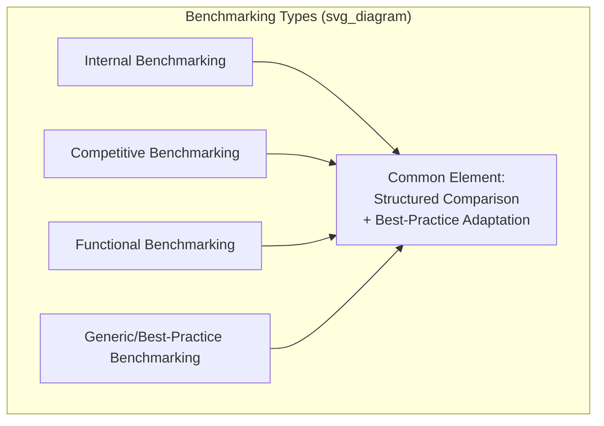
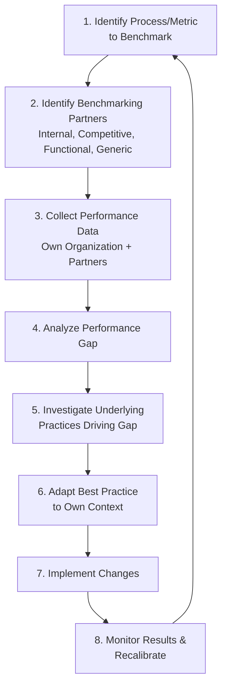

## Benchmarking Methodologies

### Definition and Scope

Benchmarking is the systematic process of comparing an organization's processes, practices, and performance metrics against reference points — whether internal, competitive, or drawn from unrelated industries — to identify performance gaps and best-practice approaches capable of closing them. It is distinguished from simple performance measurement (tracking a KPI over time) by its explicitly comparative and improvement-oriented purpose: benchmarking does not merely quantify current performance but seeks to identify *why* a reference organization achieves superior performance and *how* that approach might be adapted.

### Benchmarking vs. KPI Tracking vs. Competitive Analysis

**Key Points**

- **KPI tracking** measures an organization's own performance over time against internally set targets; it does not inherently involve external comparison.
- **Benchmarking** explicitly compares performance against an external (or separate internal) reference point specifically to identify improvement opportunity and underlying best-practice methods, not merely to establish relative ranking.
- **Competitive analysis** (in a strategic/marketing sense) typically focuses on competitors' market positioning, pricing, and product strategy; **competitive benchmarking** as an operations discipline focuses more narrowly on comparing specific operational processes and performance metrics against competitors, often as one benchmarking type among several rather than the entirety of the discipline.

### Types of Benchmarking

#### Internal Benchmarking

**Key Points**

- Compares performance across different facilities, business units, teams, or time periods within the same organization.
- **Advantages**: Data access is straightforward (no external cooperation required), and process/definitional consistency is typically higher since internal units usually share common reporting systems and metric definitions.
- **Limitations**: Internal benchmarking can only surface improvement potential up to the level of the best-performing internal unit — it cannot reveal performance possibilities beyond what already exists somewhere within the organization, limiting its usefulness for identifying breakthrough (rather than incremental) improvement opportunities.
- Particularly relevant for organizations with a global manufacturing network spanning multiple facilities, where internal benchmarking across network nodes can directly surface transferable best practices relevant to the knowledge transfer mechanisms discussed under global network coordination.

#### Competitive Benchmarking

**Key Points**

- Compares performance directly against direct industry competitors, typically for metrics where competitive parity or advantage is strategically significant (cost position, delivery performance, product quality).
- **Data access challenge**: Direct competitors are generally unwilling to share detailed operational performance data voluntarily; competitive benchmarking therefore often relies on publicly available financial disclosures, industry association aggregated/anonymized data, third-party market research, reverse engineering of competitor products, or specialized competitive intelligence services.
- **Strategic relevance**: Because the reference point is a direct competitor, competitive benchmarking results map most directly onto immediate competitive positioning implications, but the same competitive dynamic that makes the comparison strategically relevant also makes obtaining accurate, detailed data more difficult than other benchmarking types.

#### Functional Benchmarking

**Key Points**

- Compares a specific business function or process (e.g., warehousing, customer service, procurement) against organizations that excel at that function, regardless of whether those organizations are direct industry competitors.
- **Advantage over competitive benchmarking**: Because the reference organizations are not necessarily competitors, they are often more willing to share detailed process information, since no direct competitive threat is created by the disclosure — functional benchmarking partnerships are frequently structured as mutually beneficial information exchanges between non-competing organizations facing similar functional challenges.
- **Example**: A hospital system benchmarking its supply procurement function against a large retail chain's procurement practices, since procurement excellence principles can transfer across industries even though the organizations do not compete.

#### Generic (Best-Practice) Benchmarking

**Key Points**

- The broadest form of benchmarking, comparing a core business process against the recognized best-practice performer for that process type across any industry, based purely on process similarity rather than industry, functional department, or competitive relationship.
- **Rationale**: Many core operational processes (order fulfillment, inventory management, quality control) share underlying structural similarities across otherwise unrelated industries, meaning the theoretically best available practice for a given process type may exist in an entirely unrelated sector.
- [Inference] A frequently cited illustrative example in benchmarking literature involves a courier or logistics company benchmarking its vehicle/equipment turnaround process against motorsport pit-crew practices, illustrating the generic benchmarking principle that the best available practice for a specific process type can originate from an industry with no direct business relationship to the benchmarking organization; specific case details of such examples should be treated as illustrative rather than verified without independent confirmation.

### The Benchmarking Process: A Structured Methodology

**Key Points**

- **Step 1 — Process/metric selection**: Prioritize benchmarking effort toward processes with the greatest strategic significance and/or largest suspected performance gap, since benchmarking is resource-intensive and cannot be applied exhaustively across every operational process simultaneously.
- **Step 2 — Partner identification**: Select the benchmarking type (internal, competitive, functional, generic) appropriate to the process and strategic context, balancing data accessibility against the potential magnitude of the improvement opportunity available from each benchmarking type.
- **Step 3 — Data collection**: Gather comparable performance data, with particular attention to ensuring metric definitions are genuinely comparable across organizations (a recurring challenge given that superficially identical metric names can reflect materially different underlying calculation methods).
- **Step 4 — Gap analysis**: Quantify the performance differential between the organization's current state and the benchmark reference point, providing the basis for prioritizing which specific gaps warrant deeper investigation.
- **Step 5 — Practice investigation**: The step most distinguishing benchmarking from simple comparative measurement — investigating *how* the benchmark performer achieves its superior result (process design, technology, organizational structure, skill development) rather than stopping at the numerical gap itself.
- **Step 6 — Adaptation**: Modifying the identified best practice to fit the benchmarking organization's specific context, constraints, and capabilities, rather than assuming direct, unmodified transplantation of another organization's practice will produce equivalent results in a different operational context.
- **Step 7–8 — Implementation and recalibration**: Implementing the adapted practice and subsequently monitoring whether the anticipated performance improvement materializes, feeding results back into future benchmarking cycle prioritization.

### Data Comparability Challenges

**Key Points**

- **Metric definition inconsistency**: The same nominal metric name (e.g., "cycle time," "defect rate," "on-time delivery") can be calculated using different underlying methodologies, scope boundaries, or exclusion criteria across organizations, making superficial numerical comparison potentially misleading without careful definitional verification.
- **Contextual/structural differences**: Differences in scale, product complexity, geographic operating context, regulatory environment, or vertical integration level between the benchmarking organization and its reference point can explain part or all of an observed performance gap, independent of genuine best-practice differences — a gap analysis that fails to account for these structural differences risks misattributing a context-driven gap to a practice-driven gap.
- **Data recency and static comparison risk**: Benchmark reference data reflects the reference organization's performance at a specific point in time; since both the benchmarking organization and its reference points continue to evolve, benchmarking is properly understood as a recurring cyclical process rather than a one-time comparison exercise.

### Benchmarking Consortia and Data-Sharing Networks

**Key Points**

- Formal benchmarking consortia and industry associations facilitate structured, often anonymized, data-sharing among multiple participating organizations, addressing the competitive sensitivity concern that limits direct bilateral competitive benchmarking.
- Standardized benchmarking frameworks and shared metric definitions developed by such consortia help address the metric-definition-inconsistency challenge, since participants agree to a common calculation methodology as a condition of participation.
- [Unverified] Specific benchmarking consortium organizations, participation requirements, and covered industries vary and evolve over time; details of any specific benchmarking service or consortium should be verified against current sources rather than assumed static.

### Benchmarking and Continuous Improvement Integration

**Key Points**

- Benchmarking gap analysis provides one of the primary inputs for continuous improvement initiative prioritization, complementing internally-generated KPI trend analysis by adding an external reference point indicating the scale of improvement potential that may not be visible from internal trend data alone.
- A performance metric that appears satisfactory when evaluated only against the organization's own historical trend can reveal a substantial improvement opportunity once benchmarked against external best-practice performance, illustrating why benchmarking is a necessary complement to (not a replacement for) internal KPI monitoring.
- Benchmarking findings often directly inform specific root-cause analysis and structured improvement methodology application (e.g., a benchmarking-identified gap in changeover time might trigger a Single-Minute Exchange of Die improvement initiative), connecting the comparative diagnostic function of benchmarking to the execution-focused continuous improvement methodologies used to close the identified gap.

### Common Pitfalls in Benchmarking Practice

**Key Points**

- **Benchmarking metrics without benchmarking practices**: Collecting comparative performance numbers without conducting the deeper investigation into underlying process and organizational practices driving the performance difference, resulting in awareness of a gap without actionable insight into how to close it.
- **Direct, unadapted practice transplantation**: Attempting to copy a benchmark partner's practice exactly without adapting it to the benchmarking organization's specific context, scale, technology base, or workforce capability, risking implementation failure even when the original practice is genuinely effective in its native context.
- **One-time benchmarking exercises**: Treating benchmarking as a single project rather than a recurring organizational capability, missing the ongoing performance evolution of both the organization and its reference points over time.
- **Ignoring structural comparability limitations**: Drawing improvement conclusions from a performance gap that is substantially explained by structural differences (scale, product mix, regulatory context) rather than genuine best-practice differences, leading to inappropriate or infeasible improvement targets.

**Conclusion**

Benchmarking methodologies provide a structured approach to identifying performance improvement opportunities by systematically comparing an organization's processes and performance against internal, competitive, functional, or generic best-practice reference points. Its distinguishing value beyond simple KPI tracking lies in the deeper investigation of *why* a reference performer achieves superior results and *how* that underlying practice can be adapted to a different organizational context, rather than stopping at numerical gap identification. Effective benchmarking requires careful attention to data comparability (consistent metric definitions and awareness of structural differences), a full structured process from partner identification through implementation and recalibration, and treatment as a recurring organizational capability integrated with the broader continuous improvement management cycle rather than a one-time comparative exercise.

**Related Topics**

- Key performance indicators for operations
- Continuous improvement methodologies (Kaizen, PDCA, Six Sigma)
- Root cause analysis methodologies (Five Whys, fishbone diagrams)
- The balanced scorecard framework
- Total Quality Management (TQM) principles
- Global manufacturing network strategy (internal cross-site benchmarking)
- Single-Minute Exchange of Die (SMED) and changeover reduction
- Business excellence models (Malcolm Baldrige, EFQM)
- Competitive intelligence and strategic analysis
- Overall Equipment Effectiveness (OEE) and process capability metrics