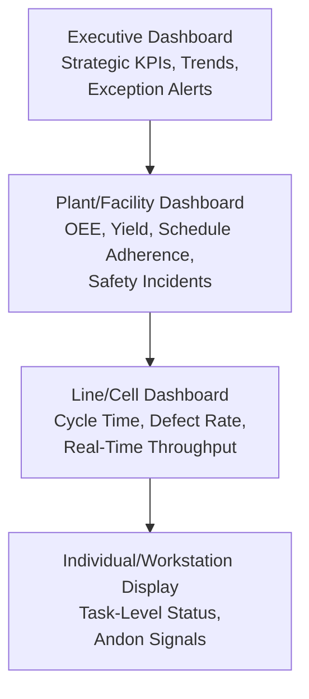
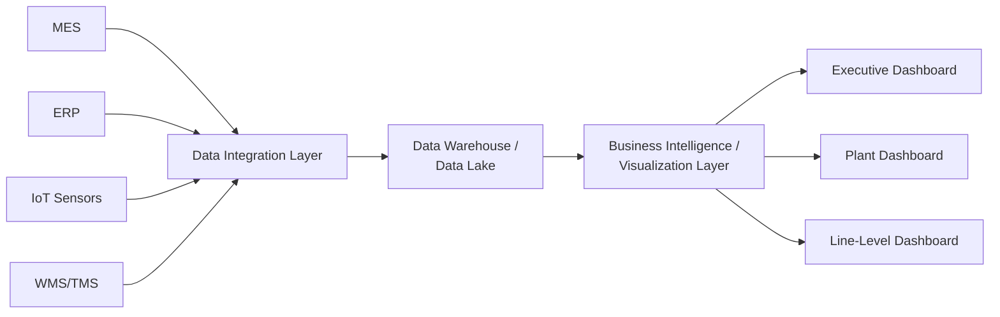

## Operations Dashboards and Reporting

### Definition and Scope

Operations dashboards and reporting encompass the systems, visual design principles, and organizational processes used to present operational performance data to decision-makers at appropriate levels of detail, frequency, and format to support timely, informed action. Where key performance indicators define *what* is measured, dashboards and reporting define *how* that measurement is communicated, aggregated, and made actionable — a distinct discipline spanning data visualization design, information architecture, and organizational decision-making process design.

### Dashboards vs. Reports vs. Scorecards

**Key Points**

- **Reports** are typically periodic, static (or point-in-time) documents providing detailed data for a defined reporting period, often including narrative analysis and commentary alongside quantitative data — designed for thorough review rather than at-a-glance monitoring.
- **Dashboards** are typically visual, often real-time or near-real-time, interfaces presenting a curated set of key metrics in condensed graphical form, designed for rapid status assessment and exception identification rather than deep analytical review.
- **Scorecards** (as distinct from dashboards in strict usage, though the terms are frequently used interchangeably in practice) typically emphasize performance against specific targets across a structured framework (such as the Balanced Scorecard's four perspectives), with explicit target-versus-actual comparison as a defining structural feature.
- [Inference] In practice, these terms are used inconsistently across organizations and software platforms, with considerable definitional overlap; the underlying distinction that matters operationally is the frequency, level of detail, and intended use case (rapid monitoring vs. deep analysis vs. target tracking) rather than strict adherence to any single terminology convention.

### Dashboard Hierarchy and Organizational Levels

**Key Points**

- **Executive dashboards**: Present highly aggregated, strategically significant metrics (often aligned with Balanced Scorecard perspectives) at low update frequency, emphasizing trend direction and material exceptions requiring executive attention rather than granular operational detail.
- **Facility/plant-level dashboards**: Present a broader set of operational metrics (OEE, first-pass yield, schedule adherence, safety incident tracking) at higher update frequency, supporting plant management decision-making on a daily or shift basis.
- **Line/cell-level dashboards**: Present real-time or near-real-time process-specific metrics directly to production supervisors and operators, supporting immediate operational response to emerging issues.
- **Andon and visual management displays**: Real-time visual signals (often color-coded status indicators) at the individual workstation or line level, providing immediate status visibility and triggering rapid escalation when a defined threshold or abnormal condition is detected — a specific dashboard application rooted in lean manufacturing visual management principles.
- Each level's dashboard design should reflect the decision-making cadence and scope of authority at that organizational level — providing line-level real-time granularity to an executive audience creates information overload, while providing only aggregated executive-level metrics to line supervisors provides insufficient detail for immediate operational action.

### Dashboard Design Principles

**Key Points**

- **Purpose-driven metric selection**: Every element on a dashboard should support a specific decision or action the intended audience needs to make; dashboards designed by simply including all available data tend toward information overload and reduced actionability, echoing the metric-proliferation risk discussed under KPI design.
- **Visual hierarchy and prioritization**: The most critical or exception-worthy information should be visually prominent (position, size, color) relative to routine or contextual information, allowing rapid visual scanning to identify what requires attention.
- **Exception-based highlighting**: Effective dashboards typically use visual cues (color coding, threshold-based alerts) to distinguish normal-range performance from performance requiring attention, rather than presenting all metrics with equal visual weight regardless of status — directly supporting management-by-exception decision-making.
- **Appropriate level of aggregation**: Data should be aggregated to match the decision-making scope of the intended audience — a common design failure is presenting overly granular, high-variance raw data to an audience that needs trend-level or aggregate information to make appropriate decisions.
- **Consistent and intuitive visual encoding**: Consistent color conventions (e.g., a consistent meaning for red/yellow/green status indicators across all dashboards an organization uses), chart type selection appropriate to the data relationship being shown, and avoidance of unnecessary visual complexity (e.g., 3D chart effects that distort quantitative perception) support faster and more accurate interpretation.
- **Actionability and drill-down capability**: Well-designed dashboards often provide the ability to drill down from an aggregate/exception indicator into underlying detail, supporting root-cause investigation directly from the point where an anomaly is first observed, rather than requiring a separate detailed report retrieval process.

### Statistical Process Control Integration in Dashboards

**Key Points**

- Dashboards displaying process performance metrics increasingly incorporate statistical process control logic — distinguishing between normal process variation (common cause) and statistically significant deviation (special cause) — rather than triggering visual alerts based on simple fixed thresholds that do not account for a process's inherent variability.
- **Control charts** displaying a metric's value over time alongside statistically derived upper and lower control limits provide a more analytically rigorous exception-detection mechanism than simple red/yellow/green threshold coloring, reducing both false-positive alerts (reacting to normal variation) and false-negative gaps (failing to detect a genuine process shift that remains within a simplistic fixed threshold).

$$UCL, LCL = \bar{X} \pm 3\sigma$$

Where $\bar{X}$ is the process mean and $\sigma$ is the process standard deviation, representing the commonly used three-sigma control limit convention in statistical process control charting; a data point falling outside these limits, or specific non-random patterns within the limits, signals a special-cause variation warranting investigation rather than normal process noise.

### Reporting Cadence and Frequency

**Key Points**

- **Real-time/near-real-time reporting**: Appropriate for metrics requiring immediate operational response (equipment status, safety incidents, line-level throughput), typically delivered through automated data feeds from Manufacturing Execution Systems or IoT sensor infrastructure rather than manual compilation.
- **Daily/shift reporting**: Appropriate for operational management decisions with a daily planning cycle (schedule adherence, daily yield, absenteeism), balancing timeliness against the noise inherent in very short reporting periods.
- **Weekly/monthly reporting**: Appropriate for tactical management review and trend analysis where day-to-day fluctuation is less relevant than sustained directional movement (inventory turnover trends, supplier performance scorecards, cost trend analysis).
- **Quarterly/annual strategic reporting**: Appropriate for strategic-level review connected to the Balanced Scorecard cadence and broader strategic planning cycles, where the focus is on strategic initiative progress and longer-term trend validation rather than operational-level detail.
- Matching reporting frequency to the actual decision cadence at each organizational level avoids both under-informed decision-making (infrequent reporting for a fast-moving operational decision) and unnecessary reporting overhead (excessively frequent reporting for a slow-moving strategic metric where frequent updates add noise without decision-relevant information).

### Technology Architecture for Operations Dashboards

**Key Points**

- **Data sources**: Modern operations dashboards typically aggregate data from multiple underlying systems — Manufacturing Execution Systems (MES), Enterprise Resource Planning (ERP) systems, IoT sensor networks, warehouse management systems, and transportation management systems — requiring a data integration layer capable of reconciling potentially inconsistent data formats, update frequencies, and definitional conventions across source systems.
- **Data warehousing and business intelligence platforms**: Centralized data warehouse or data lake architectures are commonly used to consolidate data from disparate operational systems into a structure suitable for dashboard reporting and ad hoc analytical query, decoupling dashboard performance from the transactional load on operational source systems.
- **Real-time streaming architectures**: For dashboards requiring true real-time (rather than periodically refreshed) data, streaming data architectures process and display data continuously as it is generated, as distinct from traditional batch extract-transform-load (ETL) processes that refresh data on a scheduled interval.
- [Inference] Specific software platforms and architectural patterns for operations dashboard technology evolve rapidly; general architectural principles (data integration layer, appropriate real-time vs. batch processing selection, visualization layer decoupled from source transactional systems) remain durable even as specific vendor products and tools change over time.

### Governance and Data Quality Considerations

**Key Points**

- **Single source of truth principle**: Where multiple dashboards across organizational levels reference the same underlying metric, maintaining a single consistent calculation methodology and data source is essential to avoid the situation where different dashboards display conflicting values for a nominally identical metric, which undermines organizational trust in dashboard data generally.
- **Data quality and validation**: Automated data feeds from operational systems require ongoing data quality monitoring (sensor calibration drift, system integration errors, missing data handling) since dashboard credibility depends on underlying data accuracy, and erroneous data displayed with dashboard visual authority can be more damaging to decision-making than an acknowledged data gap.
- **Metric definition documentation and version control**: Given the previously discussed risk of inconsistent metric definitions (particularly relevant when comparing dashboard data across facilities or over time as calculation methodologies evolve), maintaining clear documentation of exactly how each displayed metric is calculated, and version-controlling changes to that calculation methodology, supports both internal consistency and external benchmarking comparability.
- **Access and permission structure**: Different organizational levels and functions typically require different data access scope, both for information-relevance reasons (avoiding overload) and in some cases for data sensitivity reasons (facility-level cost data may not be appropriate for broad organizational visibility even where it would be technically useful).

### Dashboards and the Continuous Improvement Feedback Loop

**Key Points**

- Well-designed operational dashboards function as the primary early-warning mechanism feeding the continuous improvement cycle, surfacing performance deviations and exceptions that trigger root-cause investigation before they escalate into more severe or customer-visible problems.
- Dashboard trend visualization directly supports before/after validation of continuous improvement initiative effectiveness, providing the visual and quantitative evidence base for confirming whether a specific improvement project achieved its intended effect.
- The drill-down capability discussed under dashboard design principles is particularly valuable in this context, allowing a manager who observes an aggregate-level exception to navigate directly to the underlying granular data supporting root-cause analysis, shortening the time between anomaly detection and corrective action initiation.

### Common Pitfalls in Operations Dashboard and Reporting Design

**Key Points**

- **Vanity metrics and dashboard sprawl**: Accumulating dashboards and metrics over time without periodic review and rationalization, resulting in a proliferation of underused or redundant dashboards that dilute attention from the metrics that genuinely drive decisions.
- **Mismatched granularity for audience**: Presenting overly detailed, high-variance data to strategic audiences or overly aggregated data to operational audiences, undermining the decision-relevance of the dashboard for its intended use.
- **Threshold-based alerting without statistical grounding**: Using simplistic fixed thresholds for exception highlighting rather than statistically-grounded control limits, resulting in either excessive false-positive alerting (alert fatigue, causing genuine exceptions to be ignored among noise) or failure to detect genuine process shifts that remain within an overly wide fixed threshold.
- **Data trust erosion from inconsistent definitions**: Allowing the same-named metric to be calculated differently across different dashboards or reporting systems, eroding organizational confidence in dashboard data broadly once such inconsistencies are discovered.
- **Reporting without action linkage**: Producing reports and dashboards that are reviewed but not clearly connected to a specific decision-making or escalation process, resulting in dashboards that document performance without effectively driving improvement action.

**Conclusion**

Operations dashboards and reporting translate the underlying discipline of key performance indicator measurement into effective decision support, requiring careful attention to organizational-level-appropriate aggregation, visual design principles that support rapid exception identification, statistically grounded rather than arbitrary alerting thresholds, and technology architecture capable of reliably integrating data from diverse operational source systems. Their value depends not on comprehensive data inclusion but on purpose-driven curation matched to the specific decisions each organizational level and audience must make, combined with sufficient data governance discipline to maintain a single, trusted, consistently defined view of performance across the organization. Properly designed, dashboards and reporting function as the operational nervous system connecting performance measurement to the continuous improvement action cycle, rather than serving merely as passive historical documentation.

**Related Topics**

- Key performance indicators for operations
- The balanced scorecard framework
- Statistical Process Control (SPC) and control charts
- Overall Equipment Effectiveness (OEE) and real-time monitoring
- Manufacturing Execution Systems (MES) and IoT integration
- Lean manufacturing visual management and Andon systems
- Business intelligence and data warehousing architecture
- Continuous improvement methodologies (Kaizen, PDCA, Six Sigma)
- Data governance and data quality management
- Root cause analysis methodologies