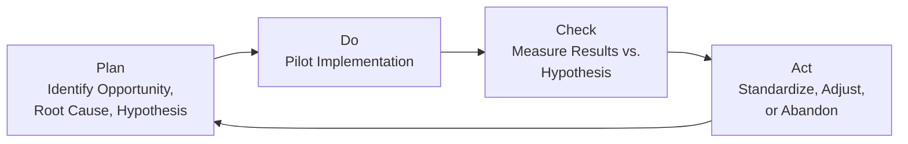
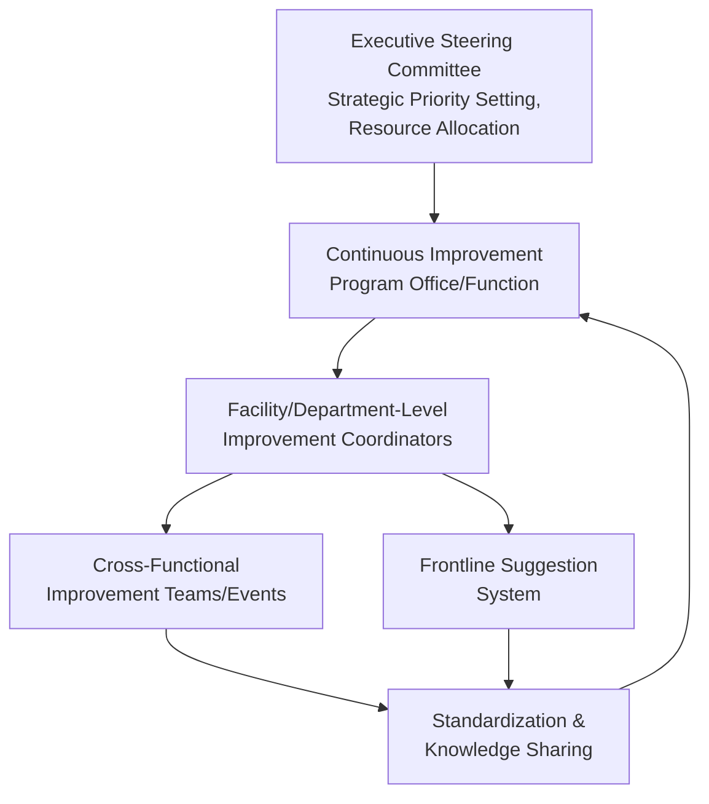
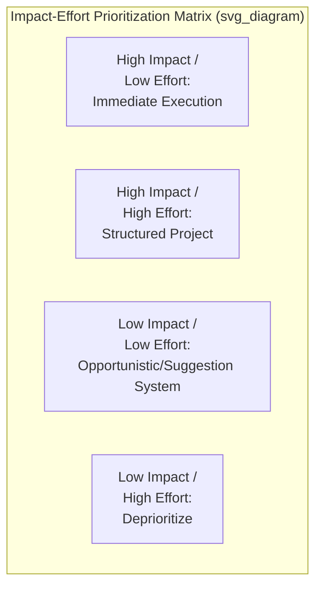

## Continuous Improvement Program Design

### Definition and Scope

Continuous improvement program design is the discipline of structuring organizational systems, methodologies, governance, and culture to enable sustained, incremental (and periodically breakthrough) performance improvement over time, rather than relying on isolated, ad hoc improvement projects. Where individual improvement methodologies (Kaizen events, Six Sigma projects, lean tools) provide the tactical execution mechanisms, program design addresses the higher-level organizational architecture — governance structure, initiative prioritization, resourcing, capability building, and cultural reinforcement — required to sustain improvement activity as an ongoing organizational capability rather than a temporary initiative.

### Continuous Improvement Philosophy: Kaizen and Incremental Change

**Key Points**

- [Unverified] The term "Kaizen," widely associated with Japanese manufacturing management philosophy and closely linked to the Toyota Production System, refers to a philosophy of continuous, incremental improvement involving all employees, as distinct from large, infrequent, top-down transformational change initiatives.
- **Incremental vs. breakthrough improvement**: Continuous improvement programs typically need to accommodate both small, frequent, employee-driven incremental improvements (the core Kaizen philosophy) and larger, more structured, resource-intensive breakthrough improvement projects (often using more formal methodologies such as Six Sigma), recognizing that these two improvement modes require different organizational mechanisms and cannot be managed through a single uniform process.
- **Employee involvement as a structural principle**: A defining feature of mature continuous improvement program design is broad employee participation in identifying and implementing improvements, rather than improvement activity being restricted to a specialized improvement function or external consultants — reflecting the premise that frontline employees possess direct process knowledge unavailable to more removed analytical functions.

### The PDCA Cycle as a Foundational Structure

**Key Points**

- **Plan-Do-Check-Act (PDCA)**, [Unverified] widely associated with quality management pioneers including Walter Shewhart and later popularized by W. Edwards Deming, provides the foundational iterative structure underlying most continuous improvement program methodologies.
- **Plan**: Identify the improvement opportunity, analyze root causes, and develop a specific improvement hypothesis and implementation plan.
- **Do**: Implement the planned change, typically on a limited or pilot scale initially to manage risk and allow learning before full-scale rollout.
- **Check**: Measure and evaluate the results of the implemented change against the original improvement hypothesis, using the KPI and dashboard infrastructure discussed previously to provide the before/after comparison basis.
- **Act**: Based on the check results, standardize the change if successful (embedding it into standard operating procedure), adjust and re-cycle if partially successful, or abandon and pursue an alternative approach if unsuccessful — with the cycle then repeating on the next identified improvement opportunity.

### Structured Improvement Methodologies

**Key Points**

- **Six Sigma / DMAIC (Define-Measure-Analyze-Improve-Control)**: A structured, data-driven methodology for reducing process variation and defects, typically applied to more complex or higher-stakes improvement problems than routine Kaizen activity, often executed by formally trained practitioners (commonly using a belt-based certification structure) within a defined project management structure.
- **Kaizen events (rapid improvement workshops)**: Time-boxed, intensive, cross-functional improvement workshops (often lasting several days) focused on rapidly analyzing and improving a specific, bounded process, balancing the incremental Kaizen philosophy with a structured, resourced project format distinct from ad hoc, unstructured continuous small improvements.
- **Lean tools and waste elimination**: A family of specific analytical and process design tools (value stream mapping, 5S workplace organization, Single-Minute Exchange of Die for changeover reduction, poka-yoke error-proofing) applied within the broader lean/continuous improvement philosophy, each targeting specific categories of process waste.
- **Suggestion systems**: Formal mechanisms for capturing, evaluating, and implementing improvement ideas generated by frontline employees outside the context of a formally scheduled improvement event, representing the most decentralized and continuous form of improvement idea generation within a comprehensive program design.

[Inference] Organizations vary considerably in which specific methodologies they adopt and how they integrate multiple methodologies (e.g., combining Lean and Six Sigma into a unified "Lean Six Sigma" program structure); the underlying PDCA logic is common across most structured variants even where specific tool sets and terminology differ.

### Program Governance Structure

**Key Points**

- **Executive sponsorship and steering**: Sustained continuous improvement programs typically require visible executive-level sponsorship, both to signal organizational priority and to make resource allocation decisions (dedicated improvement staff time, capital for process changes) that individual departments may be unable to authorize independently.
- **Dedicated improvement function/program office**: Many mature programs establish a dedicated function responsible for methodology standardization, practitioner training and certification, cross-facility knowledge sharing, and program-level performance tracking, distinct from the specific individuals executing improvement projects within operational departments.
- **Facility/department-level coordination**: Local improvement coordinators or champions embedded within operational departments bridge the program-level governance structure and day-to-day operational improvement activity, ensuring program methodology and priorities translate into locally relevant, actionable improvement initiatives.
- **Cross-functional and cross-site knowledge sharing mechanisms**: Structured processes for propagating successful improvement approaches across different facilities or departments — directly connecting to the knowledge transfer mechanisms discussed under global manufacturing network coordination — prevent redundant re-solving of similar problems at different network nodes.

### Initiative Prioritization Frameworks

**Key Points**

- **Impact-effort matrix**: A common prioritization tool plotting potential improvement initiatives by expected performance impact against required implementation effort/resource investment, generally favoring high-impact, low-effort initiatives for immediate execution while reserving high-impact, high-effort initiatives for more structured, resourced project treatment.
- **KPI-gap-driven prioritization**: Using the gap between current KPI performance and target (or benchmark-derived) performance to systematically prioritize which processes warrant improvement attention, directly connecting the measurement infrastructure (KPIs, dashboards, benchmarking) discussed previously to program-level resource allocation decisions.
- **Strategic alignment screening**: Filtering candidate improvement initiatives against explicit strategic priorities (potentially structured via the Balanced Scorecard's strategic initiative identification step) to ensure improvement resource allocation supports genuine strategic objectives rather than defaulting to the most visible or most frequently complained-about operational irritant.
- **Cost of Quality and financial impact quantification**: Translating expected improvement impact into financial terms (using Cost of Quality categories or direct cost/revenue impact estimates) to support consistent cross-initiative prioritization comparison and to build the business case required for resource allocation approval.

### Capability Building and Training Infrastructure

**Key Points**

- **Tiered practitioner training**: Many structured programs (particularly Six Sigma-based programs) use a tiered certification structure providing different depths of methodology training to different roles — broad basic awareness training for all employees, intermediate practitioner training for those regularly leading improvement projects, and advanced training for those developing program methodology and coaching other practitioners.
- **On-the-job coaching and mentorship**: Formal training alone is generally considered insufficient for developing genuine improvement capability; ongoing coaching and mentorship during actual improvement project execution reinforces classroom training with practical application experience.
- **Building improvement capability into standard job roles**: Mature programs increasingly embed basic improvement methodology awareness and expectation into standard job descriptions and performance expectations across the organization, rather than treating improvement activity as an optional or specialized add-on responsibility separate from an employee's core job function.

### Sustaining Momentum: Cultural and Motivational Factors

**Key Points**

- **Recognition and incentive alignment**: Programs that recognize and reward improvement contribution (through both formal incentive systems and informal recognition) tend to sustain higher engagement than programs relying solely on management directive or job responsibility framing without positive reinforcement.
- **Visible leadership participation**: Leadership visibly participating in improvement activities (attending Kaizen events, personally reviewing improvement results, allocating genuine resources rather than only rhetorical support) reinforces the program's legitimacy and priority relative to competing operational demands.
- **Avoiding initiative fatigue**: Launching excessive simultaneous improvement initiatives, or frequently changing program methodology and branding, can create organizational fatigue and cynicism toward improvement programs generally — sustained programs generally favor methodological consistency and a manageable, prioritized initiative pipeline over broad simultaneous activity.
- **Psychological safety for problem surfacing**: Employees are more likely to surface genuine process problems (a prerequisite for meaningful improvement identification) in an organizational culture that treats problem identification as valuable rather than as an implicit admission of individual or team failure — directly connecting to the cross-cultural management considerations around blame-free root-cause analysis discussed previously, since organizational and national culture both influence willingness to surface problems.

### Measuring Continuous Improvement Program Effectiveness

**Key Points**

- **Program-level metrics**: Beyond the specific KPI improvement achieved by individual projects, program-level metrics might include the number of active improvement initiatives, the cycle time from idea generation to implementation, the proportion of suggestion system ideas implemented, and aggregate financial impact (via Cost of Quality reduction or direct savings) across the improvement portfolio.
- **Sustainment tracking**: Verifying that implemented improvements are sustained over time (rather than reverting to prior practice after initial implementation attention fades) is a distinct and commonly underemphasized measurement dimension — the PDCA cycle's "Act" phase standardization step is intended to address this, but ongoing monitoring is required to confirm standardization actually holds in practice.
- **Return on improvement investment**: Comparing the aggregate resource investment in the continuous improvement program (dedicated staff time, training cost, program office overhead) against the aggregate financial benefit realized, supporting the business case for continued program resourcing at executive governance review.

### Integration with Broader Performance Measurement Infrastructure

**Key Points**

- Continuous improvement program design does not operate independently of the KPI, dashboard, and benchmarking infrastructure discussed in prior topics — it is the organizational mechanism that converts the diagnostic signals from that infrastructure (KPI gaps, dashboard-flagged exceptions, benchmarking-identified best-practice gaps) into structured, resourced, prioritized action.
- The Balanced Scorecard's explicit "strategic initiatives" component provides one common structural link between strategic performance measurement and continuous improvement program prioritization, ensuring improvement resource allocation is traceable to strategic objectives rather than operating as a disconnected parallel process.
- [Inference] Organizations with weak integration between measurement infrastructure and improvement program governance commonly experience a pattern where performance problems are well-documented through dashboards and KPI reporting but inadequately translated into resourced improvement action — underscoring that measurement and improvement program design, while conceptually distinct disciplines, require deliberate structural connection to jointly function as an effective performance management system.

**Conclusion**

Continuous improvement program design establishes the organizational architecture — governance structure, methodology selection, prioritization frameworks, capability-building infrastructure, and cultural reinforcement mechanisms — required to sustain improvement activity as an ongoing capability rather than an episodic initiative. Built on the foundational PDCA iterative logic, mature programs combine decentralized, continuous, employee-driven incremental improvement (the Kaizen philosophy) with more structured, resourced methodologies (Six Sigma DMAIC, Kaizen events) for higher-complexity improvement problems, governed through a structure connecting executive strategic prioritization to facility-level execution and cross-site knowledge sharing. Sustained program effectiveness depends as much on cultural and motivational factors — leadership visibility, recognition systems, psychological safety for problem surfacing, and avoidance of initiative fatigue — as on methodological rigor, and requires deliberate structural integration with the broader KPI, dashboard, and benchmarking measurement infrastructure to ensure diagnosed performance gaps translate reliably into resourced improvement action.

**Related Topics**

- Key performance indicators for operations
- The balanced scorecard framework
- Benchmarking methodologies
- Operations dashboards and reporting
- Six Sigma and DMAIC methodology
- Lean manufacturing and waste elimination tools
- Root cause analysis methodologies (Five Whys, fishbone diagrams)
- Cross-cultural management in operations
- Cost of Quality (COQ) frameworks
- Change management and organizational culture