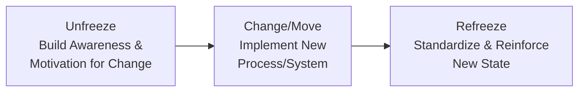
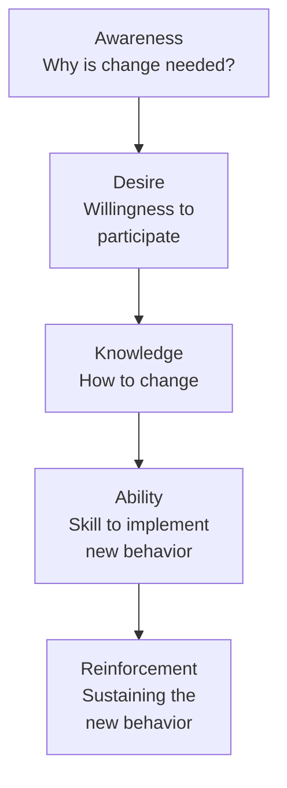

## Change Management for Operational Initiatives

### Definition and Scope

Change management for operational initiatives is the discipline of planning and executing the human, organizational, and process transition activities required to ensure that operational changes — new systems, redesigned processes, facility relocations, continuous improvement implementations, or network reconfigurations — achieve sustained adoption and their intended performance outcomes. It is distinguished from the technical or analytical design of the change itself: a well-designed process improvement, technology implementation, or network redesign can fail to deliver expected benefits if the organizational and behavioral transition required to operate under the new state is inadequately managed.

### Why Change Management Matters Specifically in Operations

**Key Points**

- **High interdependency of operational processes**: Operational changes frequently affect multiple interconnected roles, shifts, and process steps simultaneously, meaning inadequately managed change can create cascading disruption across a broader scope than the immediate change target.
- **Frontline workforce scale**: Operational changes often require behavior change from a large frontline workforce (production operators, warehouse staff, logistics personnel) rather than a smaller group of office-based knowledge workers, requiring change management approaches suited to scale, shift-based communication constraints, and varying literacy/language considerations.
- **Direct link to continuity and safety**: Poorly managed change in an operational context can create immediate safety risks or service continuity failures in a way that is less immediately consequential in many non-operational business change contexts, raising the stakes of change management rigor.
- **Connection to sustainment failure**: As noted under continuous improvement program design, a commonly observed failure mode is reversion to prior practice after initial implementation attention fades — a change management, rather than a purely technical design, failure.

### Sources of Resistance to Operational Change

**Key Points**

- **Loss of established competence and status**: Employees who have developed expertise and informal status under existing processes may perceive a new process as devaluing that accumulated expertise, particularly where new technology or automation shifts required skills.
- **Uncertainty and job security concerns**: Changes associated with automation, network reconfiguration (reshoring/offshoring decisions), or significant process redesign can generate legitimate concern about job security, requiring direct and honest communication rather than avoidance of the topic.
- **Distrust of management motive**: Where prior change initiatives have been poorly communicated or have not delivered promised benefits, employees may reasonably discount the stated rationale for a new change, creating a credibility deficit that compounds with each subsequent poorly managed change.
- **Practical workflow disruption during transition**: Even changes ultimately beneficial in steady state typically create temporary productivity or quality disruption during the transition period, which can generate legitimate operational resistance distinct from purely psychological resistance to change itself.
- **Cross-cultural variation in change response**: Consistent with the cross-cultural management considerations discussed previously, cultural dimensions such as uncertainty avoidance and power distance can influence both the nature of resistance expressed and the appropriate communication and engagement approach for a given operational workforce.

### Established Change Management Models

#### Lewin's Three-Stage Model

[Unverified] A foundational change management model, generally attributed to psychologist Kurt Lewin, conceptualizes organizational change as a three-stage process:

**Key Points**

- **Unfreeze**: Creating awareness of the need for change and destabilizing the current equilibrium sufficiently to create openness to a new approach, often involving clear communication of the performance gap or strategic rationale motivating the change.
- **Change (Move)**: The active transition period during which new processes, behaviors, or systems are implemented and the organization moves toward the desired future state.
- **Refreeze**: Stabilizing and embedding the new state as the new normal operating standard, through reinforcement mechanisms (updated standard operating procedures, revised training, adjusted performance metrics and incentives) that prevent reversion to prior practice.

#### Kotter's Eight-Step Model

[Unverified] A widely referenced, more granular change management model, generally attributed to John Kotter, structures large-scale organizational change into eight sequential steps: establishing a sense of urgency, forming a guiding coalition, developing a vision and strategy, communicating the change vision, empowering broad-based action, generating short-term wins, consolidating gains and producing more change, and anchoring new approaches in the organizational culture.

**Key Points**

- **Sense of urgency**: Establishing why the change is necessary now, often connecting directly to the KPI gaps, benchmarking findings, or strategic scenario planning outputs that motivated the initiative in the first place.
- **Guiding coalition**: Assembling a sufficiently influential and cross-functional group of change sponsors, distinct from relying solely on a single executive sponsor or a purely technical project team.
- **Short-term wins**: Deliberately structuring the implementation to generate visible, credible early successes, which build momentum and credibility for the broader change, particularly relevant for operational changes implemented incrementally across multiple facilities or process areas.
- **Anchoring in culture**: The final step's emphasis on culture connects directly to the "refreeze" concept in Lewin's model and to the sustainment challenge discussed under continuous improvement program design — without this final embedding step, initial implementation success can still erode over time.

#### ADKAR Model

[Unverified] A more individual-focused change management model, associated with change management research by Prosci, structures successful individual change adoption around five sequential building blocks: Awareness (of the need for change), Desire (to participate and support the change), Knowledge (of how to change), Ability (to implement required skills and behaviors), and Reinforcement (to sustain the change).

**Key Points**

- The ADKAR model's individual-level focus complements the more organizational-level focus of Lewin's and Kotter's models, providing a diagnostic framework for identifying *where* in an individual's change journey resistance or adoption failure is occurring — for example, distinguishing an awareness gap (people don't understand why change is needed) from an ability gap (people understand and want to change but lack the skill to execute the new process), since these different gap types require different intervention approaches.

### Stakeholder Analysis and Engagement Planning

**Key Points**

- **Stakeholder mapping**: Identifying all groups affected by or influential over the operational change (frontline operators, supervisors, union representatives where applicable, supporting functions such as maintenance and quality, and external parties such as key suppliers or customers), assessing each group's likely level of support/resistance and relative influence over implementation success.
- **Tailored engagement approach by stakeholder group**: Different stakeholder groups typically require different communication content, channel, and engagement depth — frontline operators may need concrete, task-level training and hands-on demonstration, while supervisory and management stakeholders may need more strategic rationale and performance-impact framing.
- **Union and labor relations considerations**: In unionized operational environments, certain categories of operational change (particularly those affecting job classifications, staffing levels, or working conditions) may be subject to formal consultation or negotiation requirements under applicable labor agreements, requiring change management planning to incorporate labor relations processes as a formal workstream rather than an informal communication consideration alone.

### Communication Planning for Operational Change

**Key Points**

- **Multi-channel, repeated communication**: Given the scale and shift-based structure of many operational workforces, effective change communication typically requires multiple channels (shift briefings, visual postings at the point of work, direct supervisor communication, town halls) and repeated messaging over time, rather than a single announcement, to reach the full workforce across shifts and account for message retention limitations.
- **Two-way communication and feedback channels**: Establishing structured mechanisms for the workforce to ask questions, raise concerns, and provide implementation feedback (rather than purely one-directional top-down communication) both improves change design quality (frontline feedback often identifies practical implementation issues not visible to change designers) and increases perceived legitimacy of the change process.
- **Consistency between message and visible management behavior**: Communication credibility depends on consistency between stated change rationale/commitment and observable management behavior and resource allocation — a gap between communicated priority and visible resourcing (echoing the executive sponsorship theme in continuous improvement program design) undermines trust in subsequent change communications.

### Training and Capability Transition

**Key Points**

- **Role-specific training design**: Training content and format should be tailored to the specific new tasks, systems, or behaviors required for each affected role, rather than generic organization-wide training that does not address role-specific practical application.
- **Hands-on and simulation-based training for operational skills**: Given the practical, physical nature of many operational tasks, hands-on practice and simulation-based training (rather than purely classroom or documentation-based instruction) is often necessary to build genuine operational capability and confidence before full transition to the new process.
- **Train-the-trainer cascades for scale**: For changes affecting a large, multi-shift, or multi-site workforce, a train-the-trainer approach — training a smaller group of internal trainers or super-users who then train the broader workforce — is commonly used to achieve training scale and consistency more efficiently than a purely centralized training delivery model.
- **Transitional support and coaching period**: A defined period of enhanced on-the-floor support (additional supervision, readily available expert coaching, temporarily relaxed performance expectations) immediately following go-live helps bridge the gap between initial training and full independent proficiency under the new process.

### Phased Implementation and Piloting

**Key Points**

- **Pilot implementation**: Testing an operational change at a limited scale (a single line, shift, or facility) before full-scale rollout allows identification and correction of practical implementation issues, and generates the "short-term win" evidence base useful for building broader organizational confidence — directly connecting to the "Do" phase of the PDCA cycle discussed under continuous improvement program design.
- **Phased rollout sequencing**: For multi-site or multi-line changes, sequencing implementation across sites/lines (rather than simultaneous full-network implementation) allows lessons learned at earlier implementation sites to inform and improve later implementation waves, though this must be balanced against the extended timeline and potential inconsistency risk of running old and new processes in parallel across the network for an extended period.
- **Parallel running and cutover strategies**: For systems or process changes with significant continuity risk (particularly relevant for connected topics such as ERP or MES system implementations), running old and new processes in parallel for a defined validation period before full cutover reduces the risk of an abrupt, unvalidated transition, at the cost of temporary duplicated effort during the parallel period.

### Measuring Change Management Effectiveness

**Key Points**

- **Adoption rate tracking**: Measuring the proportion of the target workforce or process actually operating under the new state (versus continuing prior practice, whether through active resistance or simple habit persistence) provides a direct behavioral adoption metric distinct from the ultimate performance outcome metric the change was intended to improve.
- **Sustainment metrics over time**: Tracking adoption and performance metrics at multiple points after initial implementation (not only immediately post-go-live) to detect reversion patterns before they become entrenched, directly addressing the sustainment challenge highlighted under continuous improvement program design.
- **Employee sentiment and feedback data**: Structured feedback mechanisms (surveys, focus groups, supervisor-reported sentiment) provide leading indicators of change management effectiveness that may predict subsequent adoption or sustainment performance before it becomes visible in lagging operational metrics.
- **Connecting to the original performance case**: Ultimately, change management effectiveness should be evaluated against whether the original KPI gap, benchmarking finding, or strategic rationale that motivated the change has actually been closed — connecting change management measurement back to the broader performance measurement infrastructure rather than treating adoption as a standalone success criterion independent of the underlying performance objective.

**Conclusion**

Change management for operational initiatives addresses the organizational and human transition requirements that determine whether a technically well-designed operational change — a new system, redesigned process, network reconfiguration, or continuous improvement implementation — actually achieves sustained adoption and its intended performance benefit. Established models (Lewin's unfreeze-change-refreeze, Kotter's eight-step organizational model, and the individually-focused ADKAR framework) provide complementary diagnostic and planning structures for understanding resistance sources and structuring implementation sequence. Effective practice requires deliberate stakeholder analysis and tailored engagement, multi-channel and two-way communication suited to the scale and shift-based structure of operational workforces, role-specific and hands-on training, phased/piloted implementation sequencing, and sustained post-implementation measurement — recognizing that the sustainment challenge extends well beyond the initial go-live event and requires ongoing reinforcement to prevent reversion to prior practice.

**Related Topics**

- Continuous improvement program design
- Cross-cultural management in operations
- Key performance indicators for operations
- Operations dashboards and reporting
- Global manufacturing network strategy
- Labor relations and unionized workforce management
- Training program design and instructional methods
- Organizational culture and leadership
- Manufacturing Execution Systems (MES) and ERP implementation
- Reshoring, nearshoring, and offshoring trends (workforce transition implications)