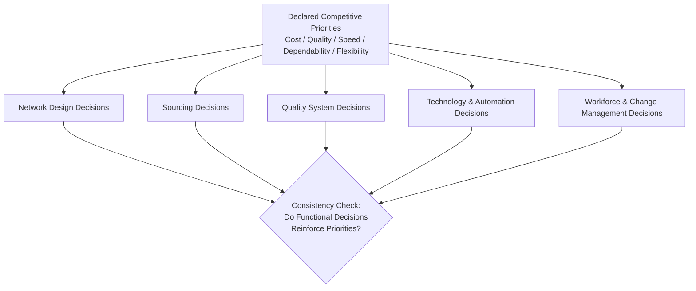
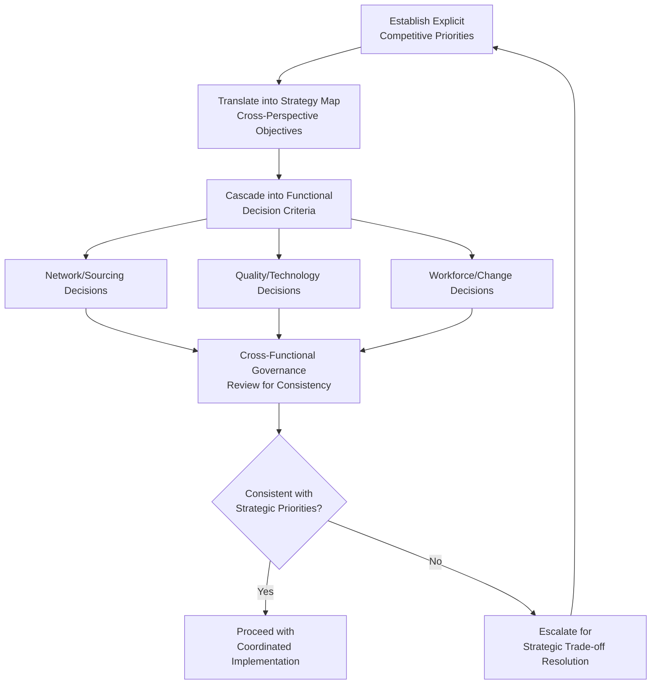

## Integrating Functional Decisions into Operations Strategy

### Definition and Scope

Integrating functional decisions into operations strategy is the discipline of ensuring that decisions made within individual operational functions — capacity planning, sourcing, quality management, network design, technology adoption, workforce management — collectively cohere into a unified strategic direction rather than being optimized independently against narrow functional objectives. It addresses a persistent organizational challenge: operations management necessarily divides work across specialized functions, but competitive advantage depends on how well those functional decisions reinforce rather than conflict with one another and with the firm's overall competitive positioning.

### The Integration Problem: Why Functional Decisions Can Diverge

**Key Points**

- **Functional specialization creates local optimization incentives**: Individual functional areas (procurement, manufacturing, quality, logistics, technology) typically have their own performance metrics and management structures, creating a natural tendency toward optimizing functional performance even when this conflicts with cross-functional or strategic performance, as discussed under the KPI-gaming risk identified in performance measurement.
- **Sequential vs. concurrent decision-making**: Functional decisions made sequentially (e.g., a sourcing decision made without full visibility into its manufacturing network or quality system implications) are more prone to integration failure than decisions made with genuine cross-functional input at the point of decision, rather than only during subsequent implementation.
- **Differing time horizons across functions**: Capacity and network design decisions typically operate on multi-year horizons, while scheduling and inventory decisions operate on daily-to-weekly horizons; integration failure can occur when longer-horizon strategic decisions are made without adequate consideration of their operational-horizon implementation implications, or conversely when short-horizon operational decisions gradually drift away from the original strategic intent without deliberate realignment.

### The Competitive Priorities Framework as an Integration Anchor

**Key Points**

- A foundational operations strategy concept holds that competitive priorities — cost, quality, speed, dependability, and flexibility — cannot all be simultaneously maximized without trade-off, requiring an explicit strategic choice about relative priority emphasis that should then consistently inform decisions across every functional area.
- **Trade-off consistency test**: A useful diagnostic for functional integration is whether decisions made within sourcing, network design, quality management, and technology adoption are all consistent with the same declared competitive priority emphasis — for example, a firm declaring speed and flexibility as primary competitive priorities but simultaneously pursuing an offshoring strategy optimized purely for lowest unit labor cost exhibits an integration failure between its stated strategic priority and its network/sourcing functional decisions.
- **Order winners vs. order qualifiers**: [Unverified] A widely referenced strategic operations concept, generally associated with operations strategy scholar Terry Hill, distinguishes between "order qualifiers" (performance dimensions a firm must meet merely to be considered by customers, without differentiating it competitively) and "order winners" (the specific dimension(s) that actually secure customer orders); functional integration requires ensuring that scarce resource investment prioritizes order-winning dimensions rather than being spread evenly or misallocated toward dimensions that are already qualifying-level adequate.

### Integration Across Global Network and Sourcing Decisions

**Key Points**

- Global manufacturing network configuration, the reshoring/nearshoring/offshoring positioning, and supply chain redundancy strategy must be evaluated jointly rather than sequentially, since a network configuration decision optimized purely for landed cost can directly undermine a resilience or responsiveness strategic priority established under a separate risk management functional process.
- The total-cost-of-ownership framework introduced under global manufacturing network strategy exemplifies functional integration in practice — by explicitly incorporating logistics, inventory carrying cost, quality risk, and coordination overhead alongside production cost, it forces the sourcing/network decision to account for downstream quality management and logistics functional consequences rather than treating unit production cost as an independently optimizable functional metric.
- Currency and political risk management decisions (hedging structure, natural hedging through network design, political risk mitigation strategy selection) require joint consideration with network design decisions, since network configuration itself is one of the primary structural levers for managing both currency and political risk exposure, meaning a treasury-only or a network-design-only approach to these risks, pursued independently, will systematically underutilize available mitigation options.

### Integration Across Quality, Technology, and Workforce Decisions

**Key Points**

- Quality management system design (harmonized standards, statistical process control approach, Cost of Quality prioritization) must be integrated with technology and automation investment decisions, since automation adoption changes the underlying process capability and defect generation mechanisms that the quality system is designed to monitor and control.
- Cross-cultural management considerations must be integrated into both quality system design and change management planning for any multinational operational change, since a quality system or change initiative designed without accounting for cultural variation in authority relationships, communication style, and problem-surfacing behavior risks the exact standardization-versus-local-adaptation tension discussed under global quality harmonization and cross-cultural management.
- Continuous improvement program design should be explicitly linked to the KPI, dashboard, and benchmarking measurement infrastructure — as emphasized previously, disconnection between measurement and improvement program governance is a commonly observed integration failure resulting in well-documented but poorly-actioned performance gaps.

### Integration Mechanisms: Organizational and Process Structures

**Key Points**

- **Cross-functional strategic planning processes**: Formal Sales & Operations Planning (S&OP) or Integrated Business Planning processes bring demand planning, supply/capacity planning, financial planning, and new product introduction functions into a shared, recurring planning cycle, providing a structural mechanism for functional integration at the tactical-to-strategic planning horizon rather than relying on informal or ad hoc cross-functional coordination.
- **Strategy maps and the Balanced Scorecard's cross-perspective causal linkage**: As discussed previously, an explicit strategy map connecting learning/growth, internal process, customer, and financial perspectives provides a structural mechanism forcing consideration of how functional-level process decisions (internal process perspective) connect to and support customer and financial strategic objectives, rather than functional metrics being tracked in isolation.
- **Cross-functional governance for major strategic decisions**: Network design, major technology investment, and significant sourcing strategy shifts typically warrant formal cross-functional steering committee governance (spanning operations, finance, risk management, and commercial functions) rather than being decided within a single functional silo, given the broad cross-functional consequences such decisions typically carry.
- **Scenario planning as an integration exercise**: The scenario planning methodology discussed under risk management inherently requires cross-functional input (demand-side commercial perspective, supply-side sourcing perspective, network/facility perspective, financial perspective) to construct plausible, internally consistent scenario narratives, functioning as both a risk management tool and a practical mechanism for surfacing functional interdependencies that might otherwise remain implicit.

### Integration Failure Patterns and Diagnostic Indicators

**Key Points**

- **Metric conflict across functions**: Observing that improving one function's KPI systematically degrades another function's KPI (e.g., procurement cost reduction driving quality or continuity metrics downward) is a direct diagnostic signal of unintegrated functional incentive structures requiring either metric redesign or explicit cross-functional trade-off governance.
- **Strategy-implementation gap**: A stated strategic priority (e.g., resilience, or speed-to-market) that is not reflected in actual resource allocation, network configuration, or capital investment decisions indicates an integration failure between strategic intent articulated at a corporate level and functional-level decision-making that has not been realigned to reflect that intent.
- **Recurring cross-functional escalation**: Frequent need for executive-level dispute resolution between functions (e.g., recurring conflict between sourcing cost targets and quality/manufacturing requirements) suggests the underlying functional decision processes lack sufficient structural integration mechanisms, requiring resolution through governance redesign rather than repeated case-by-case executive arbitration.
- **Siloed continuous improvement activity**: Improvement initiatives that consistently target single-function optimization without cross-functional impact assessment risk generating functional performance improvement that does not translate into genuine system-level or strategic-level performance improvement, echoing the broader principle (introduced under KPI design) that local optimization without system-level awareness can degrade overall performance even while individual metrics improve.

### A Structured Approach to Functional Integration

**Key Points**

- Functional integration is best understood as a recurring governance discipline rather than a one-time organizational design exercise, given that competitive priorities, market conditions, and the broader risk and regulatory environment (currency, political, trade compliance) continue to evolve, requiring periodic reassessment of whether functional decisions remain mutually consistent.
- The specific mechanisms most appropriate for a given organization (formal S&OP process rigor, Balanced Scorecard strategy map discipline, cross-functional steering committee structure) depend on organizational scale, industry complexity, and the degree of global/multi-site dispersion — [Inference] there is no single universally prescribed integration mechanism, and organizations typically combine several of the mechanisms discussed above rather than relying on any single structural solution.

**Conclusion**

Integrating functional decisions into operations strategy addresses the structural tendency for specialized operational functions — network design, sourcing, quality management, technology adoption, and workforce/change management — to optimize independently against local metrics in ways that can collectively undermine rather than reinforce the firm's chosen competitive priorities. Effective integration depends on establishing explicit, consistently applied competitive priorities and order-winner/order-qualifier distinctions as a shared decision anchor across functions, supported by structural integration mechanisms — cross-functional planning processes, strategy maps, cross-functional governance for major decisions, and joint scenario planning — capable of surfacing and resolving cross-functional trade-offs deliberately rather than allowing them to accumulate as unaddressed strategy-implementation gaps. As a capstone discipline, functional integration draws directly on the network design, risk management, and performance measurement topics addressed throughout operations strategy, synthesizing them into a coherent, continuously reassessed strategic whole rather than a collection of independently optimized functional practices.

**Related Topics**

- Global manufacturing network strategy
- Key performance indicators for operations
- The balanced scorecard framework
- Building redundancy and resilience
- Sales & Operations Planning (S&OP) and Integrated Business Planning
- Order winners and order qualifiers framework
- Change management for operational initiatives
- Scenario planning and stress testing
- Continuous improvement program design
- Emerging technology trends in operations management