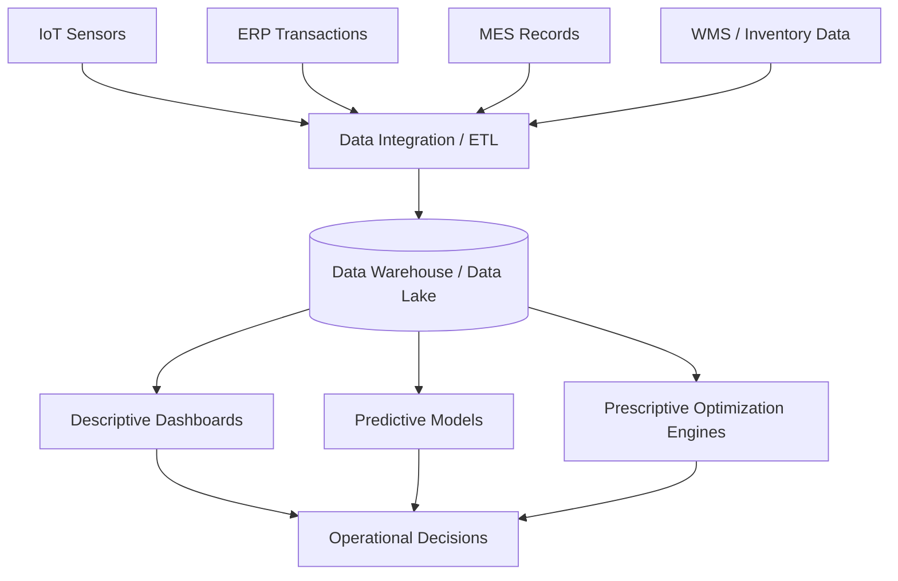

## Operations Analytics and Data-Driven Decision Making

### Definition and Core Concept

Operations analytics refers to the systematic application of statistical analysis, quantitative modeling, and data-driven methods to operational decisions across the value chain — including production planning, inventory management, quality control, supply chain design, scheduling, and capacity management. It represents the convergence of traditional operations management (OM) techniques with modern data science, business intelligence, and computational capabilities, enabling decisions to be grounded in empirical evidence rather than solely on intuition, experience, or static historical rules of thumb.

Data-driven decision making (DDDM) is the broader organizational philosophy underlying operations analytics: the practice of basing operational and strategic decisions on data analysis and interpretation rather than on observation or intuition alone.

### The Analytics Maturity Hierarchy

Operations analytics is typically organized into four progressively sophisticated categories, often referred to as the analytics value escalator:

| Type | Question Answered | Techniques | Example in Operations |
| --- | --- | --- | --- |
| Descriptive analytics | "What happened?" | Dashboards, reporting, summary statistics | Weekly production yield reports, historical defect rate tracking |
| Diagnostic analytics | "Why did it happen?" | Root cause analysis, drill-down, correlation analysis | Identifying which machine or shift caused a quality defect spike |
| Predictive analytics | "What will happen?" | Regression, time-series forecasting, machine learning classification | Forecasting demand, predicting equipment failure (predictive maintenance) |
| Prescriptive analytics | "What should we do?" | Optimization models, simulation, decision analysis | Optimal production scheduling, inventory reorder policy optimization |

**Key Points**

- Each successive level provides greater decision value but requires greater analytical sophistication and higher-quality underlying data.
- Most organizations implement these capabilities incrementally, often starting with descriptive dashboards before progressing to predictive and prescriptive capability.
- Prescriptive analytics is generally considered the most operationally impactful but also the most technically and organizationally demanding to implement [Inference — this ordering is a widely cited industry framework rather than a universally measured ranking].

### Core Analytical Techniques in Operations

- **Statistical process control (SPC)**: Control charts (X-bar, R-chart, p-chart) used to monitor process variation and detect out-of-control conditions in real time.
- **Regression analysis**: Used for demand forecasting, cost estimation, and identifying relationships between operational variables (e.g., machine utilization vs. defect rate).
- **Time-series forecasting**: Techniques including moving averages, exponential smoothing, and ARIMA models applied to demand planning and capacity forecasting.
- **Simulation modeling**: Discrete-event simulation and Monte Carlo simulation used to model variability and uncertainty in production systems, queuing networks, and supply chains without disrupting live operations.
- **Optimization models**: Linear programming, mixed-integer programming, and network flow optimization applied to production scheduling, facility location, and transportation/logistics problems.
- **Machine learning**: Classification and regression algorithms (e.g., random forests, gradient boosting, neural networks) applied to predictive maintenance, quality prediction, and demand sensing.
- **Data envelopment analysis (DEA)**: A non-parametric method for measuring relative operational efficiency across comparable units (e.g., plants, stores, service branches).

### Predictive Maintenance as an Applied Example

**Example**

A manufacturing plant implements predictive maintenance analytics as follows:

1. Sensors on critical equipment (vibration, temperature, acoustic emission) continuously stream condition data to a historian database.
2. Historical failure data is used to train a machine learning model correlating sensor patterns with impending equipment failure.
3. The model outputs a real-time failure probability score for each monitored asset.
4. When the probability exceeds a defined threshold, the system automatically generates a maintenance work order before failure occurs.
5. This shifts maintenance strategy from time-based preventive maintenance (fixed intervals) or reactive maintenance (repair after failure) toward condition-based, data-driven intervention timed to actual equipment health.

This illustrates the general benefit case for predictive analytics: reducing unplanned downtime and avoiding unnecessary maintenance on equipment that does not yet require it. [Inference: the magnitude of downtime reduction is highly context- and implementation-dependent, and specific quantitative benchmarks vary considerably across industry sources.]

### Key Performance Indicators (KPIs) Supporting Operations Analytics

| Category | Representative Metrics |
| --- | --- |
| Quality | Defect rate, first-pass yield, Cost of Poor Quality (COPQ) |
| Delivery/Service | On-time delivery rate, order cycle time, fill rate |
| Efficiency | Overall Equipment Effectiveness (OEE), labor productivity, capacity utilization |
| Inventory | Inventory turnover, days of supply, stockout rate |
| Cost | Cost per unit, total landed cost, variance to standard cost |

Overall Equipment Effectiveness (OEE) is a commonly used composite metric:

$$OEE = \text{Availability} \times \text{Performance} \times \text{Quality}$$

where each component is expressed as a ratio (0 to 1), and the resulting product represents the proportion of fully productive manufacturing time relative to planned production time.

### Data Infrastructure Requirements

Operations analytics depends on a supporting data architecture:

- **Data collection layer**: IoT sensors, ERP transaction logs, MES (Manufacturing Execution System) records, barcode/RFID scans, and point-of-sale systems generating raw operational data.
- **Data integration and storage**: ETL/ELT pipelines feeding data warehouses or data lakes, often integrating data from ERP, MES, WMS (Warehouse Management System), and CRM systems.
- **Data quality management**: Processes to ensure completeness, accuracy, and consistency of operational data before analysis; poor data quality is a frequently cited barrier to effective operations analytics [Unverified — cited widely in industry surveys, though methodologies and figures vary by source].
- **Analytics and visualization layer**: Business intelligence tools (e.g., Power BI, Tableau) and statistical/ML platforms (Python, R, specialized OM software) used to generate insight from the integrated data.
- **Decision support and action layer**: Dashboards, alerts, and automated triggers that translate analytical output into operational action (e.g., automatic reorder triggers, maintenance work orders).

### Organizational Capabilities for Data-Driven Decision Making

**Key Points**

- **Data literacy**: Operations managers and frontline supervisors need sufficient statistical and analytical literacy to interpret dashboards and model outputs correctly, not merely view them.
- **Cross-functional data governance**: Since operational data spans multiple systems (ERP, MES, WMS), clear data ownership and governance policies are needed to maintain data quality and consistent definitions across departments.
- **Analytics-informed culture**: Effective data-driven decision making requires organizational willingness to act on data insights even when they conflict with established practice or managerial intuition — a cultural rather than purely technical requirement.
- **Balancing analytics with domain expertise**: Analytical outputs are most effective when interpreted alongside operational and domain expertise, since models can reflect historical patterns that may not generalize to novel operating conditions.

### Common Barriers and Risks

- **Data silos**: Operational data trapped in disconnected systems (separate ERP, MES, and quality systems) impedes integrated analysis.
- **Poor data quality**: Inconsistent, incomplete, or inaccurate operational data undermines the validity of any downstream analysis.
- **Overreliance on historical data**: Predictive models trained on historical patterns may perform poorly during unprecedented disruptions (e.g., novel supply chain shocks) where historical relationships no longer hold. [Inference: model degradation under regime change is a well-recognized limitation in predictive analytics generally, though its severity depends on the specific model and disruption.]
- **Analysis-decision gap**: Generating analytical insight does not automatically translate into operational action; organizations without clear decision-rights processes may fail to act on analytics outputs.
- **Talent and skill gaps**: Effective operations analytics requires personnel with combined domain knowledge (operations) and technical skill (statistics, data science), a combination that can be difficult to source or develop internally [Unverified — frequently cited as a challenge in industry literature, though difficult to quantify precisely].
- **Change management resistance**: Shifting from experience-based to data-driven decision processes can face resistance from staff accustomed to established heuristics.

### Emerging Trends

- **Digital twins**: Virtual replicas of physical production systems or supply chains that integrate real-time data with simulation models, enabling scenario testing and predictive analysis without disrupting live operations.
- **Prescriptive analytics and autonomous decisioning**: Increasing integration of optimization and machine learning to move beyond recommending actions toward automatically executing certain low-risk operational decisions (e.g., automated replenishment).
- **Edge analytics**: Processing sensor and operational data closer to its source (on factory-floor edge devices) to enable lower-latency decisions, particularly relevant for real-time quality control and equipment monitoring.
- **Integration of generative AI**: Emerging use of large language models to support natural-language querying of operational dashboards, automated report generation, and decision-support narrative summaries. [Speculation: the specific operational impact and adoption maturity of generative AI in operations analytics is an actively evolving area, and claims about its effectiveness should be treated as provisional given the pace of change in this space.]
- **Supply chain control towers**: Centralized, analytics-driven visibility platforms that integrate data across multi-tier supply chains to support real-time exception management and scenario planning.

### Relationship to Other Operations Management Concepts

- **Statistical Process Control (SPC) and Total Quality Management (TQM)**: Operations analytics extends and modernizes classical SPC techniques with broader data integration and predictive capability.
- **Enterprise Resource Planning (ERP) systems**: ERP transactional data serves as a primary data source feeding operations analytics platforms.
- **Forecasting and demand planning**: Predictive analytics techniques directly extend traditional time-series forecasting methods used in aggregate planning and MRP demand inputs.
- **Lean and Six Sigma**: Data-driven root cause analysis (diagnostic analytics) supports the DMAIC (Define-Measure-Analyze-Improve-Control) methodology central to Six Sigma.
- **Supply chain management**: Prescriptive analytics techniques (network optimization, inventory optimization) are widely applied to supply chain design and inventory policy decisions.
- **Capacity planning and scheduling**: Optimization-based prescriptive analytics directly supports production scheduling and resource allocation decisions.

### Related Topics

- Statistical Process Control (SPC) and control charts
- Predictive maintenance and condition-based monitoring
- Digital twins in operations and supply chain management
- Overall Equipment Effectiveness (OEE) and productivity metrics
- Data governance and data quality management in operations
- Prescriptive analytics and optimization modeling (linear/mixed-integer programming)
- Supply chain control towers and real-time visibility platforms
- Six Sigma DMAIC methodology and data-driven root cause analysis
- Machine learning applications in demand forecasting