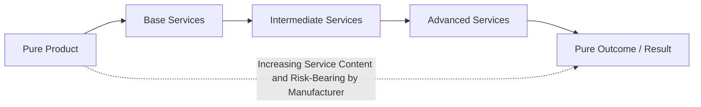
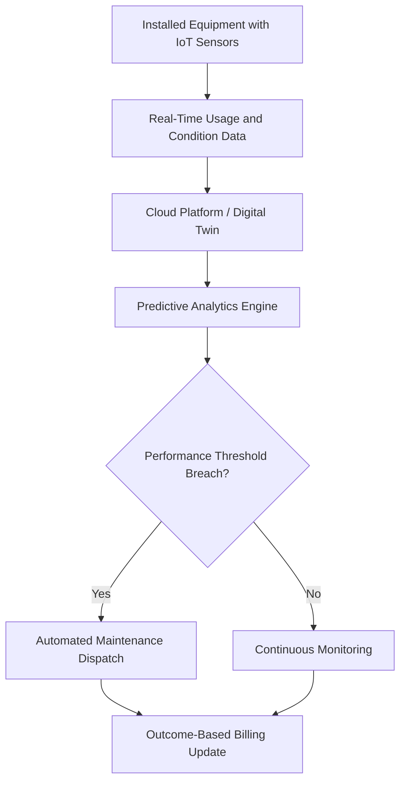

## Servitization

### Definition and Core Concept

Servitization is the strategic transformation process by which manufacturing firms shift their value proposition, capabilities, and revenue model from selling standalone physical products toward selling integrated combinations of products and services — and in advanced forms, toward selling outcomes or results rather than the underlying asset itself. The term was originally coined by Vandermerwe and Rada in a 1988 article describing the trend of manufacturers "servitizing" their offerings to differentiate themselves and capture additional value beyond the physical product sale.

Rather than treating service as an ancillary or after-sales support function, servitization repositions services as a core strategic driver of revenue, customer relationships, and competitive differentiation.

### The Servitization Continuum

Servitization is typically described as a spectrum rather than a binary state, ranging from pure product offerings to pure service/outcome offerings:

| Stage | Description | Example |
| --- | --- | --- |
| Pure product | Manufacturer sells only the physical good; no bundled service | Selling an industrial pump with no maintenance contract |
| Product-service (base services) | Product sale bundled with basic support services | Warranty, installation, spare parts sales |
| Intermediate services | Services that maintain and enhance product performance over its life | Preventive maintenance contracts, remote monitoring, training |
| Advanced services | Outcome- or performance-based offerings where the manufacturer retains responsibility for results | "Power by the Hour" jet engine leasing, equipment-as-a-service |
| Pure service / outcome | Customer pays only for the outcome achieved; manufacturer retains ownership and risk of the underlying asset | Paying per unit of compressed air delivered, rather than owning the compressor |

**Key Points**

- Movement along this continuum is often categorized into three broad tiers: **base services** (product-focused, e.g., spare parts, repair), **intermediate services** (use-oriented, e.g., leasing, rental, maintenance contracts), and **advanced services** (outcome-oriented, e.g., performance contracts, availability guarantees).
- The further along the continuum a firm moves, the greater the shift in risk-bearing from customer to manufacturer, since the manufacturer typically retains asset ownership and revenue becomes contingent on delivered performance rather than a one-time sale.

### Business Model Archetypes

- **Product-oriented business models**: Traditional model; ownership transfers to customer at point of sale, with services (repair, spare parts) sold separately and reactively.
- **Use-oriented business models**: The manufacturer retains ownership of the physical asset and sells the customer the right to use it (e.g., leasing, rental, pay-per-use), often bundled with maintenance responsibility.
- **Result-oriented business models**: The manufacturer sells a guaranteed outcome or performance level, with the customer paying based on the result achieved rather than asset usage; the manufacturer bears full responsibility for how that outcome is delivered.

### Illustrative Examples of Result-Oriented Servitization

**Example**

- **"Power by the Hour"**: A model historically associated with jet engine manufacturers, in which airlines pay based on the number of flight hours an engine operates, rather than purchasing the engine outright; the manufacturer retains ownership and responsibility for maintenance, availability, and performance.
- **Equipment-as-a-Service (EaaS)**: Industrial equipment manufacturers (e.g., in compressed air, machine tools, or elevators) offer customers access to output (compressed air delivered, uptime guaranteed) rather than selling the machine itself, billing based on usage or performance metrics.
- **Managed print services**: Office equipment providers charge customers per page printed rather than selling printers outright, bundling toner supply, maintenance, and equipment refresh into a single service contract.

[Inference: publicly available details on the exact commercial terms of specific named industry programs vary and change over time; the general mechanism described (usage/outcome-based billing with manufacturer-retained asset ownership) reflects the well-documented conceptual pattern in servitization literature rather than a specific verified current contract structure.]

### Enabling Technologies

Servitization, particularly advanced outcome-based models, depends heavily on enabling digital technologies:

- **Internet of Things (IoT) sensors**: Embedded sensors on physical assets provide continuous condition and usage data, enabling remote monitoring, usage-based billing, and predictive maintenance.
- **Predictive analytics and machine learning**: Used to anticipate equipment failures and proactively schedule maintenance, supporting availability guarantees central to advanced service contracts.
- **Digital twins**: Virtual models of physical assets, synchronized with real-time operational data, allow manufacturers to simulate performance and optimize maintenance scheduling without physical inspection.
- **Cloud-based platforms and connectivity**: Centralized platforms aggregate data across a manufacturer's installed base of equipment across multiple customers, enabling fleet-wide performance benchmarking and service optimization.
- **Digital twins and remote diagnostics**: Enable manufacturers to diagnose issues and, in some cases, resolve them remotely without a physical service visit.

This convergence of servitization with digital technology enablement is often referred to as **digital servitization** in more recent academic and industry literature.

### Drivers of Servitization Adoption

- **Revenue diversification and stability**: Service revenue streams (particularly recurring, contract-based revenue) tend to be more stable and predictable than cyclical capital equipment sales.
- **Margin improvement**: Services often carry higher margins than commoditized physical products, especially in mature product categories facing price competition.
- **Customer relationship depth**: Ongoing service contracts create sustained customer engagement, providing better visibility into customer needs and opportunities for cross-selling.
- **Differentiation in commoditized markets**: When physical products become difficult to differentiate on features alone, bundled services and outcome guarantees provide a competitive differentiator.
- **Sustainability alignment**: Use-oriented and result-oriented models (where the manufacturer retains asset ownership) can incentivize designing longer-lasting, more repairable, and more resource-efficient products, since the manufacturer bears the lifecycle cost — a pattern often linked conceptually to circular economy principles. [Inference: while this incentive alignment is widely discussed in academic servitization and circular economy literature, the extent to which it drives actual design changes varies by firm and industry.]

### Organizational and Operational Challenges

**Key Points**

- **Cultural transformation**: Manufacturing organizations are traditionally optimized around efficient production and product-centric metrics; servitization requires cultivating customer-outcome-oriented capabilities and metrics, which can represent a significant organizational culture shift.
- **Revenue recognition and financial complexity**: Shifting from one-time product sale revenue to subscription- or outcome-based recurring revenue changes financial planning, cash flow timing, and accounting treatment (e.g., recognizing revenue over a contract period rather than at point of sale).
- **Risk transfer to the manufacturer**: In advanced service models, the manufacturer assumes performance and reliability risk previously borne by the customer, requiring new risk management and insurance/warranty structures.
- **Capability gaps**: Manufacturing firms often lack in-house expertise in service design, ongoing customer relationship management, and outcome-based contract design, requiring significant capability building or acquisition.
- **Channel and dealer conflict**: Existing distribution/dealer networks built around product sales may resist or be poorly positioned to support recurring service-based revenue models.
- **The "service paradox"**: A phenomenon noted in servitization research where firms increase service investment and offerings but do not see a corresponding increase in financial performance, often due to underdeveloped service delivery capabilities or misaligned organizational structures. [Unverified — the service paradox is a recognized concept in academic servitization literature, though its prevalence and root causes are debated across studies.]

### Implementation Considerations

**Next Steps** (representative servitization transition considerations)

1. Assess current product portfolio and installed base to identify candidates suitable for service-based or outcome-based offerings.
2. Develop IoT and connectivity infrastructure needed to monitor equipment condition and usage remotely.
3. Build organizational service delivery capabilities (field service management, remote diagnostics, customer success functions) separate from traditional product engineering and manufacturing functions.
4. Redesign contracts and pricing structures to support usage-based or outcome-based billing, including appropriate risk allocation and service-level agreements (SLAs).
5. Adjust financial planning and reporting processes to accommodate recurring revenue recognition rather than point-of-sale revenue recognition.
6. Pilot advanced service offerings with a subset of customers or product lines before broader rollout, given the higher risk and capability requirements of outcome-based models.

### Relationship to Other Operations Management Concepts

- **Product-service systems (PSS)**: Servitization is often implemented through the design of specific product-service systems that bundle tangible products with intangible service elements as a single integrated offering.
- **Reverse logistics and circular economy**: Use-oriented and result-oriented servitization models often require robust reverse logistics capability (product take-back, refurbishment, remanufacturing) since the manufacturer retains asset ownership.
- **Total cost of ownership (TCO)**: Outcome-based servitization pricing implicitly shifts customer purchasing evaluation from upfront capital cost toward total cost of ownership and guaranteed performance.
- **Predictive maintenance and operations analytics**: Advanced servitization models depend heavily on predictive maintenance and real-time operations analytics capability to deliver guaranteed availability or performance outcomes.
- **Supply chain and field service logistics**: Advanced service models require robust field service supply chains (spare parts positioning, technician dispatch) to meet performance guarantees.

### Related Topics

- Product-Service Systems (PSS) design
- Digital servitization and IoT-enabled business models
- Circular economy and remanufacturing in operations
- Predictive maintenance and condition-based service delivery
- Outcome-based contracting and service-level agreements (SLAs)
- Reverse logistics and asset lifecycle management
- Revenue model transformation and subscription-based operations
- Field service management and technician dispatch optimization